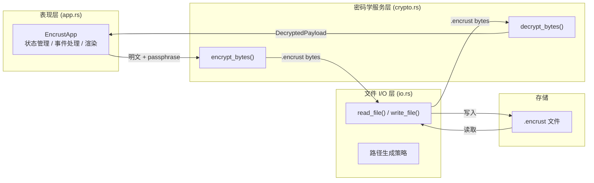

Encrust 是一个面向 Rust 初学者的跨平台桌面加密应用，以简洁的图形界面封装现代密码学原语，帮助学习者在真实场景中理解对称加密、密钥派生与二进制文件格式设计。本文档页将从设计动机、功能边界、技术选型与项目结构四个维度，为你建立对 Encrust 的整体认知，作为后续深入各模块实现细节的起点。
Sources: [README.md](README.md#L1-L5)

## 项目定位与设计目标

Encrust 的诞生动机明确聚焦于"教学"与"实用"的平衡。它不是一个生产级的企业加密套件，而是一个代码量可控（总计约 1300 行 Rust）、依赖精简、架构清晰的示例项目。其设计目标可以归纳为三点：一是让初学者能在端到端的桌面应用中看到 Rust 的类型安全、错误处理与所有权模型如何落地；二是演示现代密码学最佳实践，包括 Argon2id 密钥派生、AES-256-GCM 认证加密、随机盐值与 nonce 的每次重新生成；三是提供开箱即用的跨平台构建能力，覆盖 macOS、Linux 与 Windows 三大桌面系统。
Sources: [README.md](README.md#L1-L3), [Cargo.toml](Cargo.toml#L1-L14)

## 核心功能一览

应用围绕"加密"与"解密"两条工作流展开，同时支持文件与文本两种内容类型。用户既可以通过系统文件选择器操作，也可以直接将文件拖拽到窗口中完成输入。加密结果统一输出为 `.encrust` 自定义二进制文件，解密时则根据原始内容类型提供差异化后续操作——文本直接展示并支持一键复制，文件则引导用户选择保存路径。所有密码学操作均由独立的 `crypto` 模块承载，UI 层通过明确的 API 边界调用，完全不触碰具体实现细节。
Sources: [README.md](README.md#L7-L16), [src/app.rs](src/app.rs#L1-L824)

下表从能力维度对比了加密与解密两条工作流的主要差异：

| 能力维度 | 加密流程 | 解密流程 |
|---|---|---|
| 输入内容 | 任意文件 / 纯文本 | `.encrust` 加密文件 |
| 输入方式 | 系统文件选择器 / 拖拽 / 文本框输入 | 系统文件选择器 / 拖拽 |
| 输出形式 | `.encrust` 二进制文件 | 文本：直接展示并一键复制；文件：选择保存路径后保存 |
| 路径策略 | 原路径自动追加 `.encrust` | 默认使用 `decrypted-` 前缀避免覆盖原文件 |
| 密钥要求 | 密钥短语至少 8 个字符 | 密钥短语至少 8 个字符 |

Sources: [src/app.rs](src/app.rs#L86-L824), [src/io.rs](src/io.rs#L1-L48)

## 技术栈与依赖选型

Encrust 的技术栈遵循"最小可行"原则，整个项目仅依赖 7 个外部 crate，每个选型都有明确的教学与工程意义。GUI 层采用 egui/eframe，它基于即时模式（Immediate Mode）渲染，状态管理直观，适合小型工具；密码学层组合了 `aes-gcm`（认证加密）、`argon2`（密钥派生）与 `rand_core`（系统安全随机数）；辅助层面，`rfd` 提供原生文件对话框，`thiserror` 规范化错误枚举，`zeroize` 确保密钥在内存中被安全清零。
Sources: [Cargo.toml](Cargo.toml#L6-L13)

| 依赖 crate | 版本 | 核心职责 |
|---|---|---|
| `eframe` | 0.31 | 跨平台原生窗口与 egui 即时模式渲染上下文 |
| `rfd` | 0.15 | 系统原生文件打开 / 保存对话框 |
| `aes-gcm` | 0.10 | AES-256-GCM 认证加密实现 |
| `argon2` | 0.5 | Argon2id 密钥派生 |
| `rand_core` | 0.6 | 操作系统级安全随机数生成（salt、nonce） |
| `thiserror` | 2.0 | 错误枚举的 `#[derive(Error)]` 宏简化 |
| `zeroize` | 1.8 | 敏感内存（密钥）的安全清零 |

Sources: [Cargo.toml](Cargo.toml#L6-L13)

## 项目结构与架构概览

代码组织采用经典的按职责分文件策略，根目录下的 `src/` 仅包含四个模块，认知负担极低。`main.rs` 负责应用入口与跨平台 CJK 字体回退注册；`app.rs` 承载了全部 UI 状态、事件处理与视觉样式，是代码量最大的模块（约 820 行）；`crypto.rs` 独立封装加密、解密、头部编解码与错误定义，不依赖任何 GUI 类型；`io.rs` 则提供极薄的路径生成与文件读写抽象。此外，`scripts/` 目录下包含 macOS、Linux、Windows 的 release 构建脚本，方便不同平台的开发者直接生成分发包。
Sources: [src/main.rs](src/main.rs#L1-L61), [src/app.rs](src/app.rs#L1-L824), [src/crypto.rs](src/crypto.rs#L1-L416), [src/io.rs](src/io.rs#L1-L48), [scripts/build-macos.sh](scripts/build-macos.sh#L1-L5)

项目的物理目录结构如下，其中 `src/` 下的四个 Rust 模块与 `scripts/` 下的构建脚本共同构成了完整的交付单元：

```
encrust/
├── Cargo.toml          # 项目配置与依赖声明
├── Cargo.lock          # 依赖版本锁定
├── README.md           # 项目说明与使用指南
├── scripts/            # 跨平台构建脚本
│   ├── build-linux.sh
│   ├── build-macos.sh
│   └── build-windows.ps1
└── src/
    ├── main.rs         # 入口函数 + CJK 字体回退配置
    ├── app.rs          # GUI 状态、渲染、交互与主题
    ├── crypto.rs       # 密码学核心（加密 / 解密 / 头部格式）
    └── io.rs           # 文件读写与默认路径生成策略
```

Sources: [Cargo.toml](Cargo.toml#L1-L14)

Encrust 的运行时架构可以清晰地划分为三层：表现层、密码学服务层与文件 I/O 层。表现层由 `app.rs` 中的 `EncrustApp` 实现 `eframe::App` trait 构成，负责每帧渲染界面、捕获拖拽事件与管理用户状态；密码学服务层以 `crypto.rs` 中的无状态纯函数为核心，接收明文与密钥短语，返回 `.encrust` 字节流或解密后的结构化负载；文件 I/O 层则通过 `io.rs` 的薄封装屏蔽底层 `std::fs` 调用，并在路径命名策略中体现用户友好设计——例如加密时自动追加 `.encrust` 扩展名、解密时默认使用 `decrypted-` 前缀以避免覆盖原始文件。
Sources: [src/app.rs](src/app.rs#L86-L200), [src/crypto.rs](src/crypto.rs#L96-L170), [src/io.rs](src/io.rs#L1-L48)

下图展示了从用户输入到最终文件落地的端到端数据流，箭头方向代表数据传递，矩形按架构分层排列：



## 安全设计的高层认知

尽管具体的密码学实现会在后续章节展开，但从项目概述的角度值得先建立两个关键认知。第一，Encrust 使用用户提供的密钥短语而非直接管理原始密钥，并通过 Argon2id 将其转换为固定长度的 AES-256 密钥，这大幅提升了对抗暴力破解的成本。第二，自定义的 `.encrust` 文件头部会作为 AES-GCM 的 AAD（Additional Authenticated Data）参与认证，这意味着任何对魔数、版本号或内容类型等头部字段的篡改都会导致解密失败，从而在结构上保证文件完整性。
Sources: [src/crypto.rs](src/crypto.rs#L15-L35), [src/crypto.rs](src/crypto.rs#L96-L170), [README.md](README.md#L51-L65)

## 阅读路线建议

对于初次接触本项目的新手，建议按照以下顺序阅读文档：先从[快速上手：环境搭建、运行与构建](2-kuai-su-shang-shou-huan-jing-da-jian-yun-xing-yu-gou-jian)完成本地运行，建立直观体验；随后进入[整体架构：模块职责划分与数据流向](3-zheng-ti-jia-gou-mo-kuai-zhi-ze-hua-fen-yu-shu-ju-liu-xiang)理解模块间的协作关系。在对全局有把握后，可按兴趣选择深入密码学实现（从[加密文件格式设计：魔数、头部结构与 AAD 认证](4-jia-mi-wen-jian-ge-shi-she-ji-mo-shu-tou-bu-jie-gou-yu-aad-ren-zheng)开始）或 GUI 实现（从[eframe/egui 应用骨架：NativeOptions、App trait 与窗口配置](9-eframe-egui-ying-yong-gu-jia-nativeoptions-app-trait-yu-chuang-kou-pei-zhi)开始）。如果你希望先看到完整的端到端流程，也可以先浏览[加密工作流 UI：文件选择、文本输入、输出路径与操作触发](10-jia-mi-gong-zuo-liu-ui-wen-jian-xuan-ze-wen-ben-shu-ru-shu-chu-lu-jing-yu-cao-zuo-hong-fa)与[解密工作流 UI：加密文件输入、结果展示与文件保存](11-jie-mi-gong-zuo-liu-ui-jia-mi-wen-jian-shu-ru-jie-guo-zhan-shi-yu-wen-jian-bao-cun)。
Sources: [README.md](README.md#L1-L66)

## 小结

Encrust 以约 1300 行 Rust 代码、7 个外部依赖和 4 个核心源文件，搭建了一个具备现代密码学实践、跨平台图形界面与友好交互的加密工具，是学习 Rust 系统编程与密码学工程化的理想起点。