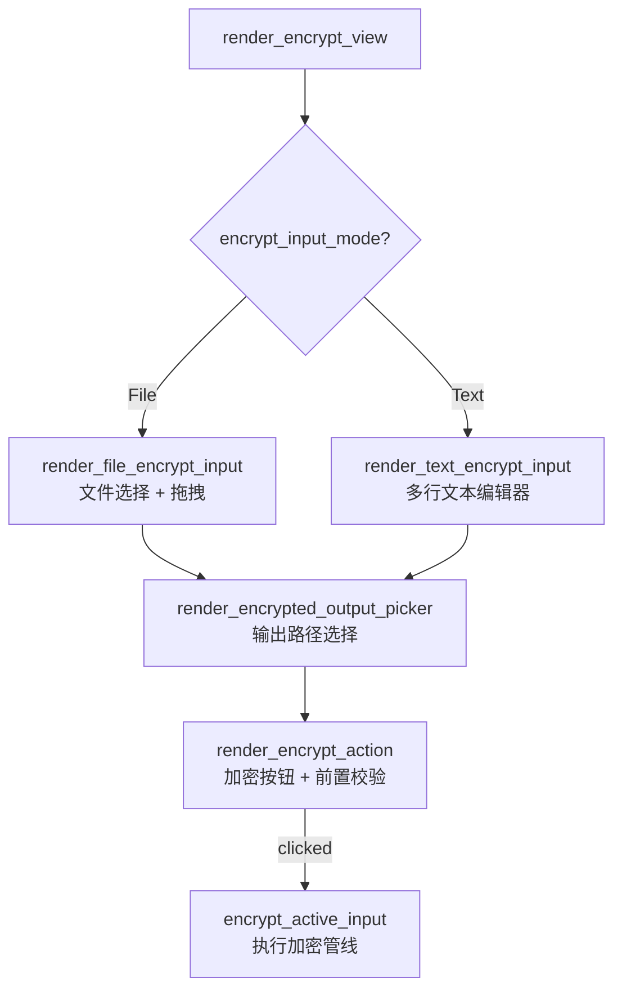
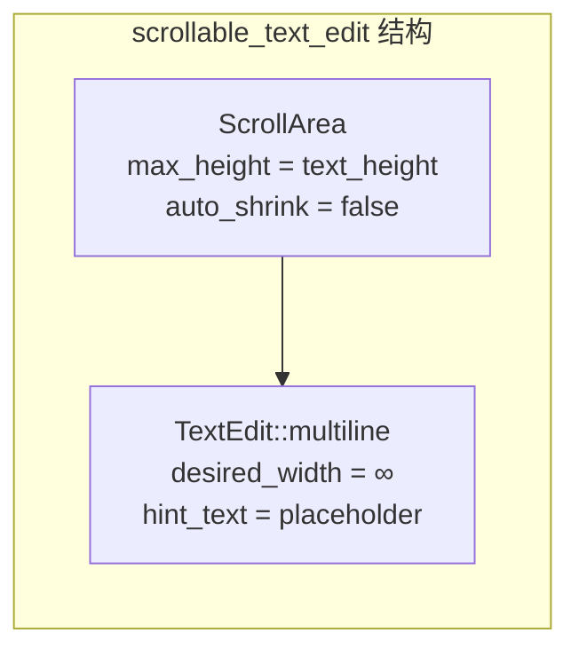
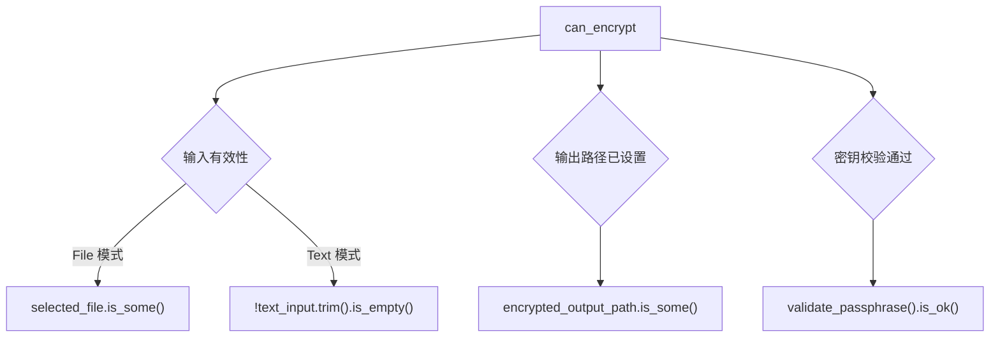
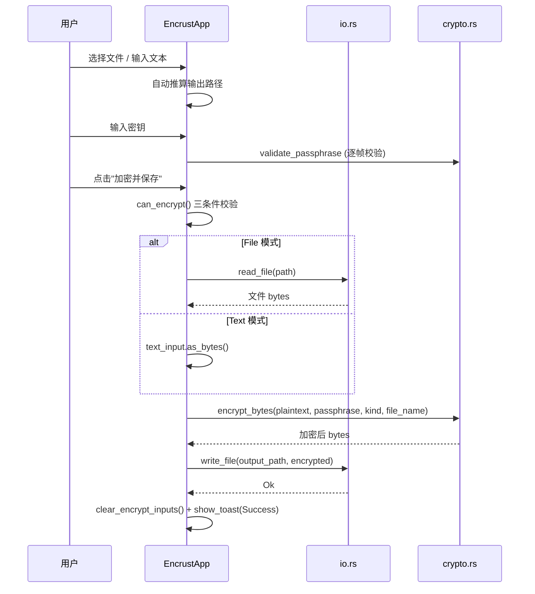

Encrust 的加密工作流是用户与密码学核心之间的唯一交互通道。从 UI 视角看，它需要解决三个核心问题：**明文来源的多样化**（文件或文本）、**密钥的安全输入与即时校验**、以及**操作触发的条件守卫**。本文将逐层拆解 `render_encrypt_view` 所编排的四个子组件，揭示从用户输入到 `crypto::encrypt_bytes` 调用之间的完整数据管线。

## 加密视图的整体编排

`render_encrypt_view` 是加密工作流的顶层入口，它根据 `EncryptInputMode` 分发到不同的输入渲染函数，随后统一输出路径选择与操作按钮。这种编排方式使得输入源可以灵活扩展——当前支持文件与文本两种模式，但增加新的输入类型（如剪贴板图片）只需新增一个 `EncryptInputMode` 枚举变体和对应的渲染方法，无需改动输出与触发逻辑。

视图的垂直布局按固定间距组织：输入区域占据主要空间，输出路径与操作按钮紧随其后，底部预留 60px 缓冲区避免内容贴底。文本输入框的高度通过 `(available_height - 300.0).clamp(180.0, 340.0)` 动态计算，确保在不同窗口尺寸下输入区域不会过小或过大。

Sources: [app.rs](src/app.rs#L210-L223)

## 输入模式切换：侧边栏的 File / Text 单选按钮

加密输入模式通过侧边栏 `render_sidebar` 中的 `render_encrypt_input_tabs` 渲染。这里使用 `ui.radio()` 而非 egui 提供的 `selectable_value` 宏，原因是模式切换时不仅需要修改 `encrypt_input_mode` 字段，还需要**同步更新默认输出路径**——一个副作用操作，`selectable_value` 的声明式风格无法直接表达。

| 模式切换行为 | 输出路径更新逻辑 |
|---|---|
| 切换到 `File` 模式 | 若已有 `selected_file`，则调用 `io::default_file_output_path` 生成 `原文件名.encrust` |
| 切换到 `Text` 模式 | 直接调用 `io::default_text_output_path`，生成 `encrypted-text.encrust` |

这种"模式切换触发路径重算"的设计确保输出路径始终与当前输入源语义一致。用户无需在切换模式后手动修正输出路径，降低了操作出错的可能性。值得注意的是，当从 Text 切回 File 时，如果尚未选择文件，输出路径不会被清空——它保留上一次的值，等待用户选择新文件后自动更新。

Sources: [app.rs](src/app.rs#L255-L271)

## 文件输入模式：系统文件选择器与路径展示

`render_file_encrypt_input` 提供了一个 `egui::group` 容器包裹的文件选择交互。点击"选择文件"按钮会唤起 `rfd::FileDialog`（Rust File Dialog 的跨平台原生对话框），用户选择文件后执行两步操作：将路径存入 `selected_file`，同时通过 `io::default_file_output_path` 自动推算输出路径并存入 `encrypted_output_path`。这两个赋值在同一帧内完成，保证界面状态的一致性。

路径展示使用 `path_display` 辅助函数，它以带边框的卡片样式呈现"已选择：/path/to/file"信息。这种设计将路径从普通 label 中区分出来，视觉上更明确地标识这是一个可交互产生的值而非静态文本。文件输入模式还隐式支持拖拽——`capture_dropped_files` 在检测到拖入文件时会自动将 `encrypt_input_mode` 切换为 `File` 并设置 `selected_file`（详见 [拖拽文件捕获机制](12-tuo-zhuai-wen-jian-bu-huo-ji-zhi-capture_dropped_files-yu-egui-shu-ru-shi-jian)）。

Sources: [app.rs](src/app.rs#L273-L298), [app.rs](src/app.rs#L685-L699)

## 文本输入模式：可滚动的多行编辑器

`render_text_encrypt_input` 渲染一个多行文本输入框，核心是 `scrollable_text_edit` 辅助函数。该函数将 `TextEdit::multiline` 包裹在 `ScrollArea::vertical` 中，解决了一个 egui 的常见布局问题：多行 TextEdit 会根据内容自动扩展高度，在长文本输入时可能撑爆整个表单布局。通过固定 `max_height` 和 `min_scrolled_height`，文本区域始终占据预设高度，内容超出时在内部滚动。

文本模式有一个惰性初始化逻辑：如果 `encrypted_output_path` 为 `None`，则自动调用 `io::default_text_output_path()` 填充默认值。这发生在渲染函数内而非事件回调中，是因为文本模式没有"选择文件"这样的离散触发点——用户可能直接在文本框中打字而不触发任何按钮，所以每次渲染时检查并补全输出路径是最可靠的策略。

Sources: [app.rs](src/app.rs#L300-L315), [app.rs](src/app.rs#L677-L683)

## 密钥输入与即时校验

密钥输入框在侧边栏中渲染，加密与解密模式共享同一个 `render_passphrase_input` 方法。它使用 `TextEdit::singleline(...).password(true)` 创建密码遮罩输入框，并设置 `hint_text` 为"至少 8 个字符"作为引导提示。

校验逻辑采用**逐帧反馈**模式：每当 `passphrase` 非空时，调用 `crypto::validate_passphrase` 进行轻量校验。该校验按 Unicode 字符计数（而非字节），对中文、emoji 等多字节字符更符合用户对"字符长度"的直觉。校验失败时，在输入框下方以红色标签显示错误信息；校验通过时不显示任何额外提示，避免信息冗余。这种"只在出错时干预"的设计哲学保持了界面的简洁性。

Sources: [app.rs](src/app.rs#L317-L328), [crypto.rs](src/crypto.rs#L72-L82)

## 输出路径选择器

`render_encrypted_output_picker` 渲染输出路径的展示与修改交互。路径以 `path_display` 卡片展示当前值，旁边提供"另存为..."按钮。点击按钮时，`FileDialog` 以 `encrypted.encrust` 作为预设文件名打开保存对话框，用户确认后将路径写入 `encrypted_output_path`。

输出路径的生命周期值得注意：它有三个赋值来源，按优先级排列如下：

| 触发源 | 赋值逻辑 | 代码位置 |
|---|---|---|
| 文件选择 / 拖拽 | `io::default_file_output_path(&path)` | `render_file_encrypt_input` / `capture_dropped_files` |
| 模式切换到 Text | `io::default_text_output_path()` | `render_encrypt_input_tabs` |
| 用户手动另存为 | `FileDialog` 返回的用户选择路径 | `render_encrypted_output_picker` |

手动另存为具有最高优先级——它直接覆盖自动推算的路径。这种"自动推算 + 手动覆盖"的混合策略在桌面应用中很常见，既降低了常见场景的操作步骤，又保留了完整控制权。

Sources: [app.rs](src/app.rs#L330-L351)

## 操作触发：前置校验与加密执行

`render_encrypt_action` 是加密工作流的最终触发点。它通过 `can_encrypt` 方法实现按钮的启用/禁用状态——`ui.add_enabled(can_encrypt, ...)` 在条件不满足时将按钮渲染为灰色不可点击状态，而非点击后弹出错误提示。这种**前置守卫**模式比事后报错更符合现代 UI 设计原则。

`can_encrypt` 的校验逻辑综合三个条件：

当按钮被点击时，`encrypt_active_input` 执行完整的加密管线：先通过 `load_active_plaintext` 读取明文（文件模式从磁盘读取并提取文件名，文本模式直接取 `text_input.as_bytes()`），然后调用 `crypto::encrypt_bytes` 执行加密，最后通过 `io::write_file` 写入输出路径。整个管线使用 `Result` 链式组合，任何步骤失败都会转为 `Notice::Error` toast 显示给用户；成功时则调用 `clear_encrypt_inputs` 清理所有敏感状态，并显示成功 toast。

Sources: [app.rs](src/app.rs#L353-L359), [app.rs](src/app.rs#L450-L457), [app.rs](src/app.rs#L463-L484)

## 明文加载：从 UI 状态到加密输入的桥梁

`load_active_plaintext` 是连接 UI 状态与密码学核心的关键转换层。它将 `EncrustApp` 的离散字段（`selected_file`、`text_input`）转换为 `crypto::encrypt_bytes` 所需的统一参数 `(Vec<u8>, ContentKind, Option<String>)`。

| 输入模式 | 明文来源 | ContentKind | file_name |
|---|---|---|---|
| File | `io::read_file(path)` 读取磁盘文件 | `ContentKind::File` | 提取路径末尾文件名 |
| Text | `self.text_input.as_bytes()` | `ContentKind::Text` | `None` |

文件名提取使用 `path.file_name().and_then(|name| name.to_str()).map(ToOwned::to_owned)`，这个链式调用处理了路径末尾可能为空或包含非 UTF-8 字符的边界情况。提取的文件名会被写入加密文件的 header 中，解密时可用于恢复原始文件名。文本模式下 `file_name` 为 `None`，对应 header 中文件名长度字段为 0。

Sources: [app.rs](src/app.rs#L520-L536)

## 加密完成后的状态清理

`clear_encrypt_inputs` 在加密成功后被调用，清除 `selected_file`、`text_input`、`passphrase` 和 `encrypted_output_path`。这个设计体现了安全敏感应用的状态管理原则：**操作完成后立即从内存中移除明文与密钥**，避免用户离开电脑后界面仍暴露输入内容。

值得注意的是，`passphrase.clear()` 调用的是 `String::clear()`，它会将字符串长度置零但不会覆盖底层内存。更严格的零化策略需要使用 `zeroize` crate 的 `Zeroize` trait——这在密码学核心层（`crypto.rs`）中已有应用，但 UI 层的 `String` 字段目前未采用该机制。关于更完整的敏感数据清理讨论，请参阅 [敏感数据清理策略](14-min-gan-shu-ju-qing-li-ce-lue-cao-zuo-wan-cheng-hou-de-zhuang-tai-zhong-zhi-yu-mi-yao-qing-chu)。

Sources: [app.rs](src/app.rs#L574-L583)

## 小结：加密工作流的数据流全景

加密工作流 UI 的核心设计思路可以概括为：**自动推算减少操作步骤、前置校验防止无效操作、管线式错误处理统一反馈、即时清理消除敏感残留**。这四个维度共同构建了一个既安全又高效的用户交互闭环。

Sources: [app.rs](src/app.rs#L210-L596), [io.rs](src/io.rs#L1-L45), [crypto.rs](src/crypto.rs#L41-L90)

---

**相关阅读**：加密工作流产生的 `.encrust` 文件需要通过解密工作流还原——下一步请参阅 [解密工作流 UI：加密文件输入、结果展示与文件保存](11-jie-mi-gong-zuo-liu-ui-jia-mi-wen-jian-shu-ru-jie-guo-zhan-shi-yu-wen-jian-bao-cun)。若对密钥校验的底层实现感兴趣，可参考 [密码学校验与错误处理策略](8-mi-ma-xue-xiao-yan-yu-cuo-wu-chu-li-ce-lue-cryptoerror-mei-ju-she-ji)。输出路径的自动推算逻辑详见 [文件读写封装与默认路径生成策略](18-wen-jian-du-xie-feng-zhuang-yu-mo-ren-lu-jing-sheng-cheng-ce-lue)。