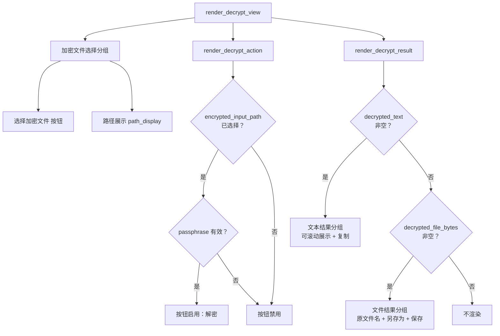
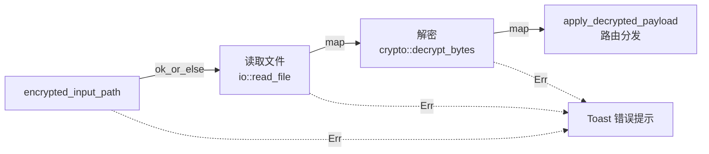
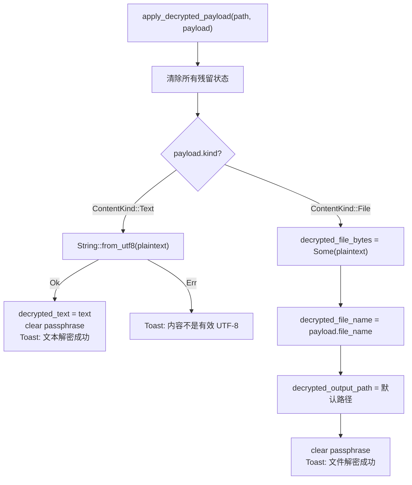
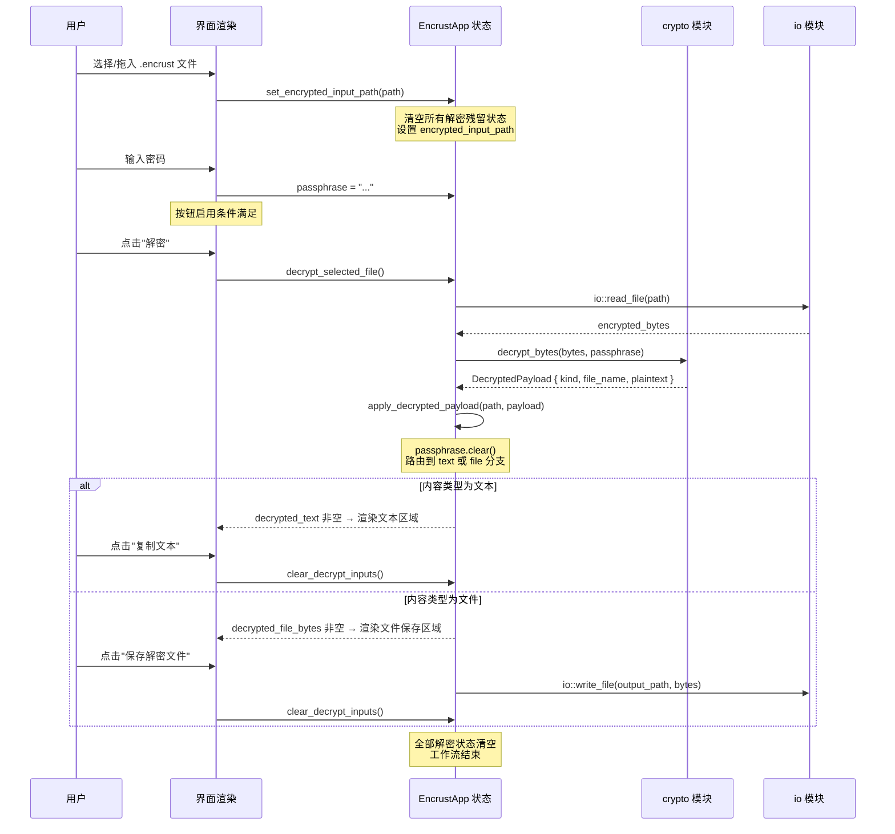

本文聚焦于 Encrust 应用中**解密模式**的完整用户界面实现。解密工作流涵盖三个核心阶段：加密文件的输入与选择、触发解密操作后的结果展示、以及根据内容类型（文本或文件）进行的差异化处理与保存。我们将从状态模型出发，逐步拆解 UI 渲染逻辑、事件处理链路，以及解密结果的路由分发策略。

Sources: [app.rs](src/app.rs#L225-L253), [crypto.rs](src/crypto.rs#L47-L52)

## 状态模型：解密工作流的五个字段

解密工作流依赖 `EncrustApp` 结构体中五个专用字段来驱动整个 UI。这些字段并非孤立存在，而是形成了一条从"输入"到"结果"再到"输出"的完整数据管线：

| 字段 | 类型 | 职责 |
|---|---|---|
| `encrypted_input_path` | `Option<PathBuf>` | 存储用户选择的 `.encrust` 加密文件路径，作为解密的输入源 |
| `decrypted_text` | `String` | 当解密结果为文本时，承载 UTF-8 明文内容供展示和复制 |
| `decrypted_file_bytes` | `Option<Vec<u8>>` | 当解密结果为文件时，暂存原始字节等待用户选择保存路径 |
| `decrypted_file_name` | `Option<String>` | 加密时记录的原文件名，用于默认输出路径生成和 UI 显示 |
| `decrypted_output_path` | `Option<PathBuf>` | 用户指定的文件保存路径，由 `另存为...` 对话框设定 |

这五个字段的设计遵循一个清晰的互斥原则：`decrypted_text` 和 `decrypted_file_bytes` 在任意时刻最多只有一个非空——解密结果要么是文本，要么是文件，不会同时存在。这一约束由 `apply_decrypted_payload` 方法在分发阶段严格执行。

Sources: [app.rs](src/app.rs#L43-L56)

## 整体渲染架构

`render_decrypt_view` 是解密视图的顶层入口方法，当用户点击顶部导航栏的"解密"标签时，`update` 方法中的模式匹配会将渲染委托给它：

```rust
match self.operation_mode {
    OperationMode::Encrypt => self.render_encrypt_view(ui, content_height),
    OperationMode::Decrypt => self.render_decrypt_view(ui, content_height),
}
```

该方法采用**线性纵向布局**，依次渲染三个逻辑区块，形成自上而下的操作流：

1. **加密文件选择区**（分组框）：文件选择按钮 + 已选路径展示
2. **解密操作按钮**：受密码和文件选择状态双重守卫的触发按钮
3. **解密结果展示区**（条件渲染）：根据 `ContentKind` 动态切换文本视图或文件保存视图



`available_height` 参数传递到了 `render_decrypt_result`，但在当前实现中并未直接使用（参数名以 `_` 前缀标注）。这是一个为未来扩展预留的接口——当解密结果区域需要动态适配窗口高度时，该参数可以控制可滚动文本区域的最大高度。

Sources: [app.rs](src/app.rs#L153-L156), [app.rs](src/app.rs#L225-L253)

## 加密文件输入：选择器与拖拽双通道

解密视图的加密文件输入采用**文件选择器 + 拖拽**双通道设计，统一写入同一个状态字段 `encrypted_input_path`。

### 文件选择器通道

在 `render_decrypt_view` 的分组框中，`rfd::FileDialog` 被配置为只显示 `.encrust` 扩展名文件：

```rust
if let Some(path) = FileDialog::new()
    .add_filter("Encrust 加密文件", &["encrust"])
    .pick_file()
{
    self.set_encrypted_input_path(path);
}
```

`add_filter` 限制了文件对话框只展示 `.encrust` 后缀的文件。这是**第一道防线**——在 UI 层面减少用户误选非加密文件的可能性。但需要注意的是，文件过滤仅作用于对话框的展示，并不能阻止用户在操作系统层面强制选择其他文件（例如通过命令行重命名）。真正的格式校验发生在密码学模块的 `parse_header` 阶段。

### 拖拽通道

拖拽通道由全局的 `capture_dropped_files` 方法统一处理。当用户在解密模式下拖入文件时，路由逻辑将路径交给 `set_encrypted_input_path`：

```rust
OperationMode::Decrypt => {
    self.set_encrypted_input_path(path);
}
```

值得注意的是，拖拽通道**不执行文件扩展名过滤**。无论用户拖入什么文件，都会被接受。这意味着拖拽通道的安全性完全依赖于后续的密码学校验——如果文件格式不合法，`decrypt_bytes` 会在 `parse_header` 阶段返回 `CryptoError::InvalidFormat`，最终以 Toast 错误提示反馈给用户。

Sources: [app.rs](src/app.rs#L230-L247), [app.rs](src/app.rs#L168-L184)

### 状态重置：set_encrypted_input_path 的防御性清理

当用户选择新的加密文件时，`set_encrypted_input_path` 不仅设置输入路径，还会**主动清除所有上一次解密残留的状态**：

```rust
fn set_encrypted_input_path(&mut self, path: PathBuf) {
    self.encrypted_input_path = Some(path);
    self.decrypted_text.clear();
    self.decrypted_file_bytes = None;
    self.decrypted_file_name = None;
    self.decrypted_output_path = None;
    self.toast = None;
}
```

这种"先清后设"的策略确保了不同加密文件之间的结果不会互相污染。如果用户在查看上次解密的文本结果时选择了新的加密文件，旧结果会立即从内存和 UI 中消失。同时清除 `toast` 避免了过时的成功/错误消息与新文件产生混淆。

Sources: [app.rs](src/app.rs#L538-L545)

## 解密操作触发与前置校验

`render_decrypt_action` 方法负责渲染解密按钮，并通过 `add_enabled` API 实现动态启用/禁用：

```rust
fn render_decrypt_action(&mut self, ui: &mut egui::Ui) {
    let can_decrypt = self.encrypted_input_path.is_some()
        && crypto::validate_passphrase(&self.passphrase).is_ok();

    if ui.add_enabled(can_decrypt, egui::Button::new("解密").min_size([96.0, 34.0].into()))
        .clicked()
    {
        self.decrypt_selected_file();
    }
}
```

启用按钮需要同时满足两个条件：

| 条件 | 检查方式 | 失败时的视觉反馈 |
|---|---|---|
| 已选择加密文件 | `self.encrypted_input_path.is_some()` | 按钮灰显不可点击 |
| 密码有效（≥8 字符） | `crypto::validate_passphrase(&self.passphrase).is_ok()` | 按钮灰显不可点击，侧栏额外展示红色错误提示 |

这种**双重守卫**模式与加密工作流的 `can_encrypt` 方法保持一致的设计语言。`add_enabled(false, ...)` 会让 egui 将按钮渲染为灰色非交互状态，用户无法点击；只有当两个条件同时满足时，按钮才会恢复为可交互的视觉状态。

`egui::Button::new("解密").min_size([96.0, 34.0].into())` 确保按钮具有最小尺寸 96×34 像素，为触摸屏操作保留了足够的点击热区。

Sources: [app.rs](src/app.rs#L361-L367), [app.rs](src/app.rs#L317-L328)

## 核心解密逻辑：decrypt_selected_file 的事件处理链

当用户点击解密按钮后，控制流进入 `decrypt_selected_file`。这个方法采用 Rust `Result` 链式调用的典型模式，将"读取→解密→分发"三个步骤串联为一个原子操作：



具体实现中，每一步的错误都会被 `.map_err()` 转换为用户可读的中文错误消息：

| 步骤 | 成功时产出 | 失败时错误消息 |
|---|---|---|
| 输入校验 | `(path, encrypted_bytes)` 元组 | "请选择要解密的 .encrust 文件" |
| 文件读取 | `(path, bytes)` 元组 | "读取加密文件失败：{IO 错误}" |
| 密码学解密 | `(path, DecryptedPayload)` 元组 | 密码错误 → "解密失败：密钥错误或文件被篡改" |
| 格式校验 | — | "不是有效的 Encrust 加密文件" |

最终结果通过模式匹配分为两条路径：成功时调用 `apply_decrypted_payload` 进行内容路由，失败时通过 `show_toast` 将错误消息以红色 Toast 展示在窗口顶部。这种 **"错误不向上冒泡，而是就地转换为 Toast"** 的模式是整个应用 UI 层的统一错误处理策略。

Sources: [app.rs](src/app.rs#L486-L500)

## 解密结果路由：apply_decrypted_payload 的双分支分发

`apply_decrypted_payload` 是解密工作流中最关键的路由节点。它接收 `DecryptedPayload`（包含内容类型 `kind`、可选原文件名 `file_name`、明文字节 `plaintext`），根据 `ContentKind` 将数据分发给不同的 UI 状态字段：



### 文本分支的 UTF-8 安全校验

文本分支并非简单地信任解密结果是合法 UTF-8。`String::from_utf8` 会严格校验字节序列的编码合法性：

```rust
ContentKind::Text => match String::from_utf8(payload.plaintext) {
    Ok(text) => {
        self.decrypted_text = text;
        self.passphrase.clear();
        self.show_toast(Notice::Success("文本解密成功".to_owned()));
    }
    Err(_) => {
        self.show_toast(Notice::Error(
            "解密成功，但内容不是有效的 UTF-8 文本".to_owned()
        ));
    }
}
```

如果加密时存入的是非 UTF-8 二进制数据但被标记为 `ContentKind::Text`（理论上不应发生，但属于防御性编程），解密虽成功却无法展示为文本，此时会以错误 Toast 提示用户。**注意这个分支不会清空密码**——因为解密没有真正完成（结果未展示），用户可能需要重新操作。

### 文件分支的默认路径生成

文件分支会自动调用 `io::default_decrypted_output_path` 生成默认保存路径。该函数的策略是：以加密文件所在目录为父路径，在原文件名前添加 `decrypted-` 前缀（如 `decrypted-report.pdf`），避免与原始文件同名覆盖：

```rust
pub fn default_decrypted_output_path(
    encrypted_path: &Path,
    original_file_name: Option<&str>,
) -> PathBuf {
    let parent = encrypted_path.parent().unwrap_or_else(|| Path::new("."));
    let file_name = original_file_name
        .filter(|name| !name.trim().is_empty())
        .map(|name| format!("decrypted-{name}"))
        .unwrap_or_else(|| "decrypted-output".to_owned());
    parent.join(file_name)
}
```

当原文件名缺失（`None`）或为空字符串时，回退到 `decrypted-output` 作为默认文件名。`parent` 回退到 `"."`（当前工作目录）则是为了应对极端情况——加密文件路径没有父目录。

### 密码清理时机

两个成功分支都包含 `self.passphrase.clear()`。这是**最小暴露时间原则**的体现：密码在 KDF 派生出密钥并完成解密后，立即从 UI 状态中清除。即使在解密结果展示期间用户离开电脑，界面上的密码字段已经是空的。

Sources: [app.rs](src/app.rs#L547-L572), [io.rs](src/io.rs#L36-L44), [crypto.rs](src/crypto.rs#L47-L52)

## 结果展示区：文本与文件的条件渲染

`render_decrypt_result` 方法通过两个独立的条件块分别处理文本结果和文件结果的渲染。这两个块不是 `if-else` 关系，而是**独立的 `if` 判断**——理论上两者可以同时为空（尚未解密），但绝不会同时非空（`apply_decrypted_payload` 的互斥分发保证了这一点）。

### 文本结果展示

当 `decrypted_text` 非空时，渲染一个包含可滚动文本编辑器的分组框：

```rust
if !self.decrypted_text.is_empty() {
    ui.add_space(12.0);
    ui.group(|ui| {
        ui.set_width(ui.available_width());
        ui.label(egui::RichText::new("解密后的文本").strong());
        ui.add_space(12.0);
        let text_height = ui.available_height().clamp(180.0, 400.0);
        scrollable_text_edit(ui, &mut self.decrypted_text, text_height, "");
    });
    ui.add_space(10.0);
    if ui.button("复制文本").clicked() {
        ui.ctx().copy_text(self.decrypted_text.clone());
        self.clear_decrypt_inputs();
        self.show_toast(Notice::Success("已复制解密后的文本".to_owned()));
    }
}
```

文本区域的高度动态取 `ui.available_height().clamp(180.0, 400.0)`，在 180px 到 400px 之间自适应。`scrollable_text_edit` 辅助函数将 `TextEdit::multiline` 包裹在 `ScrollArea` 中，确保长文本不会撑破布局。

**"复制文本"按钮的即时清理策略**值得注意：用户点击复制后，`clear_decrypt_inputs()` 会立即清除包括 `decrypted_text` 在内的所有解密状态。这意味着用户只有一次复制机会——复制完成后文本区域会从 UI 中消失。这是一种有意的安全设计：明文不应在界面上持续驻留。

### 文件结果展示

当 `decrypted_file_bytes` 非空时，渲染包含原文件名、输出路径选择器和保存按钮的分组框：

```rust
if self.decrypted_file_bytes.is_some() {
    // ... 分组框 ...
    if let Some(name) = &self.decrypted_file_name {
        path_display(ui, "原文件名", name);
    }

    ui.horizontal_wrapped(|ui| {
        let output_label = self.decrypted_output_path
            .as_ref().map(|p| p.display().to_string())
            .unwrap_or_else(|| "".to_owned());
        path_display(ui, "保存到", &output_label);

        if ui.button("另存为...").clicked() {
            let file_name = self.decrypted_file_name.clone()
                .unwrap_or_else(|| "decrypted-output".to_owned());
            if let Some(path) = FileDialog::new()
                .set_file_name(&file_name).save_file()
            {
                self.decrypted_output_path = Some(path);
                self.toast = None;
            }
        }
    });

    if ui.button("保存解密文件").clicked() {
        self.save_decrypted_file();
    }
}
```

`path_display` 是一个全局辅助函数，它用带有主题色边框和浅色背景的 `egui::Frame` 渲染"标签：值"格式的路径信息，在深色和浅色主题下自动适配配色。

"另存为..."对话框通过 `set_file_name` 预填充原文件名，减少用户的操作步骤。如果原文件名缺失，回退到 `"decrypted-output"`。

Sources: [app.rs](src/app.rs#L369-L418), [app.rs](src/app.rs#L685-L699)

## 文件保存：save_decrypted_file 的写入流程

`save_decrypted_file` 是解密工作流的最后一个环节，将 `decrypted_file_bytes` 中的明文字节写入用户指定的输出路径：

```rust
fn save_decrypted_file(&mut self) {
    let result = self.decrypted_file_bytes.as_ref()
        .ok_or_else(|| "没有可保存的解密文件".to_owned())
        .and_then(|bytes| {
            let output_path = self.decrypted_output_path.clone()
                .ok_or_else(|| "请选择解密文件保存路径".to_owned())?;
            io::write_file(&output_path, bytes)
                .map_err(|err| format!("保存解密文件失败：{err}"))?;
            Ok(output_path)
        });

    let notice = match result {
        Ok(path) => {
            let message = format!("已保存解密文件：{}", path.display());
            self.clear_decrypt_inputs();
            Notice::Success(message)
        }
        Err(err) => Notice::Error(err),
    };
    self.show_toast(notice);
}
```

与加密流程的 `encrypt_active_input` 一样，这个方法返回 `()`，所有结果都转换为 Toast 通知。保存成功后调用 `clear_decrypt_inputs()` 完成状态清理，将 `encrypted_input_path`、`decrypted_file_bytes`、`decrypted_file_name`、`decrypted_output_path` 和 `passphrase` 全部清除——从输入到输出，一条完整的解密工作流到此结束。

Sources: [app.rs](src/app.rs#L502-L518), [app.rs](src/app.rs#L588-L595)

## 状态生命周期总结

将解密工作流的全部状态转换汇总为一张时序图，可以清晰看到从文件选择到最终清理的完整生命周期：



解密工作流的 UI 设计体现了几个贯穿始终的原则：**条件式渲染**确保界面只在需要时展示相关元素；**互斥分发**保证文本和文件结果不会同时出现；**即时清理**在最短时间窗口内移除敏感明文和密码。这些模式与[加密工作流 UI：文件选择、文本输入、输出路径与操作触发](10-jia-mi-gong-zuo-liu-ui-wen-jian-xuan-ze-wen-ben-shu-ru-shu-chu-lu-jing-yu-cao-zuo-hong-fa)中的设计保持高度对称，形成了统一的交互范式。