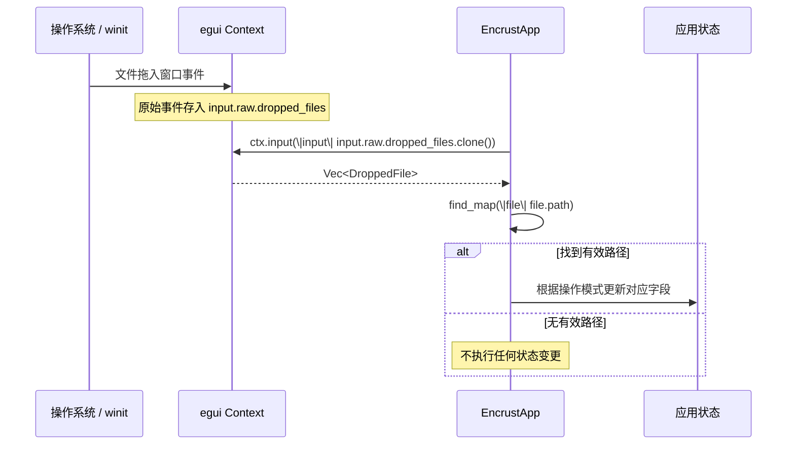
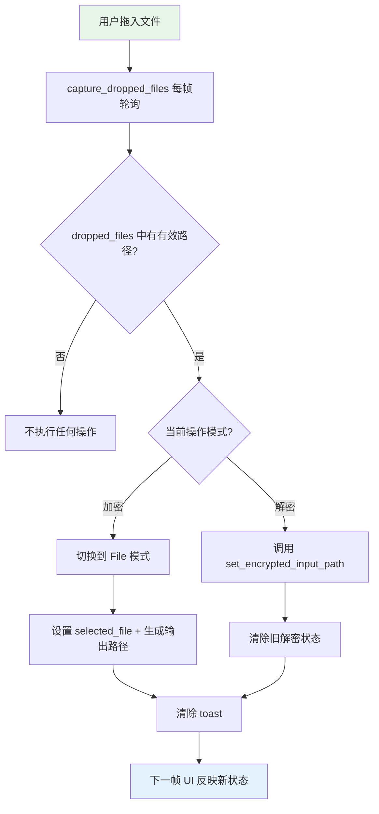

拖拽操作是桌面应用中最高效的文件输入方式之一——用户无需浏览对话框，直接将文件从系统文件管理器"甩"进窗口即可完成选择。Encrust 通过 `capture_dropped_files` 方法将 egui 框架底层的拖拽输入事件转化为应用层的状态变更，并依据当前操作模式（加密/解密）自动将文件路由到对应的工作流。本文将深入剖析这一机制的实现原理、egui 输入事件的获取方式，以及路由逻辑的设计考量。

## egui 输入事件体系中的 dropped_files

egui 采用**即时模式（Immediate Mode）** GUI 范式，每一帧都重新构建 UI 状态。在这个模型下，用户输入不是通过回调或事件队列传递，而是通过 `Context` 的输入缓冲区以只读快照的形式暴露给应用。拖拽文件被 egui 归类为 `raw` 输入事件——这类事件来自底层窗口系统（winit），不经 egui 自身的控件路由，直接以原始形态存放在 `input.raw.dropped_files` 中。

`DroppedFile` 是 egui 定义的结构体，每个实例代表一个被拖入窗口的文件。它的 `path` 字段是 `Option<PathBuf>` 类型——大多数平台下该值存在，但在某些特殊场景（例如从浏览器拖入的 blob）中可能为 `None`。Encrust 的捕获逻辑正是基于这一事实，使用 `find_map` 而非简单的 `first` 来提取第一个**拥有有效路径**的拖入文件。



Sources: [app.rs](src/app.rs#L168-L184)

## capture_dropped_files 的逐行实现分析

该方法的完整实现仅 16 行，但每一行都有明确的设计意图。先看源码：

```rust
fn capture_dropped_files(&mut self, ctx: &egui::Context) {
    let dropped_files = ctx.input(|input| input.raw.dropped_files.clone());

    if let Some(path) = dropped_files.into_iter().find_map(|file| file.path) {
        match self.operation_mode {
            OperationMode::Encrypt => {
                self.encrypt_input_mode = EncryptInputMode::File;
                self.selected_file = Some(path.clone());
                self.encrypted_output_path = Some(io::default_file_output_path(&path));
            }
            OperationMode::Decrypt => {
                self.set_encrypted_input_path(path);
            }
        }
        self.toast = None;
    }
}
```

**输入获取**（第 169 行）：`ctx.input(|input| ...)` 是 egui 提供的闭包式输入读取接口。闭包接收 `&InputState` 的引用，在闭包作用域内可以安全地访问输入数据。这里对 `dropped_files` 执行 `.clone()` 是必要的——因为 `InputState` 的生命周期仅限于闭包内部，而我们需要将文件路径带出闭包用于后续状态更新。虽然 `clone` 会有少量堆分配开销，但拖拽事件的发生频率极低（用户主动操作），性能影响可以忽略。

**路径提取**（第 171 行）：`dropped_files.into_iter().find_map(|file| file.path)` 同时完成两件事——将 `Vec<DroppedFile>` 转为迭代器，然后对每个元素的 `path`（`Option<PathBuf>`）执行 `find_map`，即找到第一个 `Some(path)` 并返回其中的 `PathBuf`。这意味着：如果用户同时拖入多个文件，只处理第一个有路径的文件，其余文件被静默忽略；如果拖入的文件没有路径（极端情况），则整段逻辑被 `if let None` 跳过，不产生任何副作用。

Sources: [app.rs](src/app.rs#L168-L184)

## 模式路由：加密与解密的不同响应策略

拖拽事件的响应逻辑与当前操作模式紧密耦合。同一个文件拖入窗口，在加密模式和解密模式下会触发截然不同的状态变更：

| 行为维度 | 加密模式 (`OperationMode::Encrypt`) | 解密模式 (`OperationMode::Decrypt`) |
|:---|:---|:---|
| **输入模式切换** | 强制切换到 `EncryptInputMode::File` | 无此步骤（解密模式无子模式） |
| **路径赋值** | `selected_file` ← 拖入路径 | `encrypted_input_path` ← 拖入路径 |
| **输出路径** | 自动生成 `原文件名.encrust` | 不生成（由解密结果动态决定） |
| **前状态清理** | 不清理解密相关字段 | 清除 `decrypted_text`、`decrypted_file_bytes`、`decrypted_file_name`、`decrypted_output_path` |
| **委派方法** | 内联处理 | 调用 `set_encrypted_input_path(path)` |

**加密模式**的三步操作构成一个原子性的状态设置组：切换输入模式 → 绑定源文件 → 生成默认输出路径。强制切换 `encrypt_input_mode` 为 `File` 是一个关键的 UX 决策——用户拖入文件的行为本身就是"我要加密这个文件"的明确意图，此时如果 UI 还停留在文本输入模式，会导致认知割裂。输出路径通过 `io::default_file_output_path` 自动生成（在原路径后追加 `.encrust` 后缀），用户可以通过"另存为…"按钮修改。

**解密模式**则将路径设置委派给 `set_encrypted_input_path` 方法。该方法除了赋值 `encrypted_input_path`，还会清理上一次解密的所有残留状态（文本、文件字节、文件名、输出路径），防止旧结果与新输入混淆。这种"先清理再赋值"的模式确保状态一致性——切换解密源文件时，UI 绝不会展示属于上一个文件的解密结果。

Sources: [app.rs](src/app.rs#L168-L184), [app.rs](src/app.rs#L538-L545), [io.rs](src/io.rs#L19-L25)

## 每帧轮询模型与 request_repaint 的隐含契约

`capture_dropped_files` 在 `update` 方法的**每帧**中被调用。这是即时模式 GUI 的核心特征——不存在"注册监听器"的概念，应用必须在每一帧主动查询输入状态。调用位置在 `apply_app_style` 之后、UI 面板构建之前：

```rust
fn update(&mut self, ctx: &egui::Context, _frame: &mut eframe::Frame) {
    apply_app_style(ctx);
    self.capture_dropped_files(ctx);  // ← 每帧执行
    // ... 后续 UI 构建 ...
}
```

这里有一个隐含的可靠性假设：当用户拖入文件时，操作系统会触发窗口事件，winit 将其转发给 egui，egui 随之标记需要重绘（`request_repaint`），从而保证下一帧的 `update` 调用能读取到 `dropped_files` 中的新数据。如果某个平台的 winit 后端未能正确触发 repaint，拖入文件就会"丢失"——因为 `update` 不会被动调用，`capture_dropped_files` 也就不会执行。在当前 eframe 0.31 版本的三大桌面平台（macOS / Linux / Windows）上，这一 repaint 机制是可靠的。

Sources: [app.rs](src/app.rs#L78-L81)

## Toast 清除：拖拽操作的状态重置语义

方法末尾的 `self.toast = None` 看似简单，实则体现了"新输入覆盖旧反馈"的设计原则。当用户拖入新文件时，上一轮操作产生的 toast 通知（无论是成功还是错误）已经失去了上下文意义——它描述的是与旧文件相关的事件，而用户的注意力已经转移到新文件上。保留过时的 toast 会造成信息干扰，甚至可能被误认为是当前操作的反馈。

值得注意的是，这个 `toast = None` 对加密和解密模式都生效，与路由逻辑中的 `match` 分支处于同一层级。这保证了无论文件被路由到哪个工作流，旧的 toast 都会被清除，维持视觉反馈与当前操作的一致性。

Sources: [app.rs](src/app.rs#L168-L184)

## 与手动文件选择的对比

Encrust 提供了两种文件输入方式：拖拽和系统文件对话框（通过 `rfd::FileDialog`）。两者的最终效果——将路径写入同一个状态字段——完全一致，但触发路径和附带行为有微妙差异：

| 对比维度 | 拖拽（`capture_dropped_files`） | 文件对话框（`rfd::FileDialog`） |
|:---|:---|:---|
| **触发方式** | 系统级拖拽事件，无 UI 控件依赖 | 用户点击按钮，弹出原生对话框 |
| **文件过滤** | 无过滤，接受任意文件 | 加密模式无过滤；解密模式过滤 `.encrust` 扩展名 |
| **输入模式切换** | 加密模式下自动切换到 File 模式 | 不切换（用户已主动选择 File 选项卡时才会看到按钮） |
| **Toast 清除** | 总是清除 | 仅在加密流程的文件选择中清除（`self.toast = None`） |
| **多文件处理** | 仅取第一个有效路径 | 对话框本身配置为单选模式 |
| **路径验证** | 无前端验证，依赖后续加密/解密流程的文件读取校验 | 同左 |

解密模式下的文件对话框有一个 `.encrust` 扩展名过滤器（`add_filter("Encrust 加密文件", &["encrust"])`），而拖拽没有这个约束。这是有意为之——用户可能拖入一个被重命名过的加密文件，强制扩展名过滤反而会造成可用性问题。解密流程本身的 `crypto::decrypt_bytes` 会在解析头部时校验文件格式，因此安全约束不会被绕过。

Sources: [app.rs](src/app.rs#L168-L184), [app.rs](src/app.rs#L273-L298), [app.rs](src/app.rs#L225-L253)

## 设计局限与潜在改进

当前实现有两个值得关注的局限。**第一**，多文件拖入时只处理第一个有效路径，其余文件被静默丢弃，且没有任何用户提示。如果用户拖入了三个文件期望批量加密，只会看到第一个文件被处理，其他两个"消失"了。一个改进方向是检测 `dropped_files.len() > 1` 时显示 toast 提示"仅处理第一个文件"。

**第二**，拖入文件的路径是在拖入瞬间获取的，但没有检查该文件在后续操作前是否仍存在。用户拖入文件后、点击"加密并保存"之前，文件可能已被其他程序删除或移动。当前的防御依赖于 `io::read_file` 的 `io::Error` 返回——这虽然不会导致崩溃，但错误信息对用户不够友好。



Sources: [app.rs](src/app.rs#L168-L184), [app.rs](src/app.rs#L538-L545)

## 延伸阅读

拖拽文件被路由到加密或解密流程后，具体的 UI 展示和操作触发分别由各自的视图渲染方法负责，可参阅 [加密工作流 UI：文件选择、文本输入、输出路径与操作触发](10-jia-mi-gong-zuo-liu-ui-wen-jian-xuan-ze-wen-ben-shu-ru-shu-chu-lu-jing-yu-cao-zuo-hong-fa) 和 [解密工作流 UI：加密文件输入、结果展示与文件保存](11-jie-mi-gong-zuo-liu-ui-jia-mi-wen-jian-shu-ru-jie-guo-zhan-shi-yu-wen-jian-bao-cun)。拖拽触发的 toast 清除机制与 [Toast 通知系统：成功/错误状态反馈与自动消失](13-toast-tong-zhi-xi-tong-cheng-gong-cuo-wu-zhuang-tai-fan-kui-yu-zi-dong-xiao-shi) 的设计紧密关联。解密模式下 `set_encrypted_input_path` 的状态清理逻辑，则与 [敏感数据清理策略：操作完成后的状态重置与密钥清除](14-min-gan-shu-ju-qing-li-ce-lue-cao-zuo-wan-cheng-hou-de-zhuang-tai-zhong-zhi-yu-mi-yao-qing-chu) 所述的清理原则一脉相承。