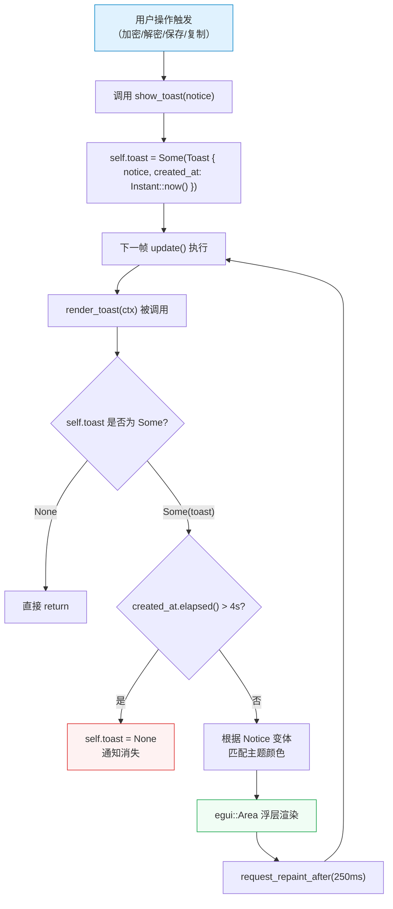

Encrust 的 Toast 通知系统是一个**轻量级的即时反馈机制**，用于在加密、解密、文件保存等核心操作完成后向用户展示操作结果。它不使用任何第三方 Toast 库，而是基于 egui 的 `Area` 浮层和 `Instant` 时间戳完全自建，实现了状态驱动的双色展示（成功/错误）和 4 秒自动消失。本文将深入解析该系统的数据模型、渲染管线、生命周期管理以及与明暗主题的集成方式。

Sources: [app.rs](src/app.rs#L31-L41)

## 数据模型：Notice 枚举与 Toast 结构体

Toast 系统的核心数据由两个类型构成。`Notice` 枚举定义了通知的两种语义状态——`Success(String)` 和 `Error(String)`，各自携带一条面向用户的消息文本。`Toast` 结构体则将 `Notice` 与一个 `Instant` 时间戳绑定，记录该通知被创建的精确时刻，为后续的自动消失逻辑提供时间基准。

```rust
#[derive(Debug, Clone)]
enum Notice {
    Success(String),
    Error(String),
}

#[derive(Debug, Clone)]
struct Toast {
    notice: Notice,
    created_at: Instant,
}
```

在 `EncrustApp` 应用状态中，Toast 以 `Option<Toast>` 的形式持有——`None` 表示当前无通知，`Some(Toast)` 表示有一条正在展示的通知。这种 **单实例设计** 意味着同一时刻最多只有一条 Toast 可见，新通知会直接覆盖旧通知（通过 `show_toast` 方法重新赋值），避免了多条通知堆叠造成的视觉混乱。

Sources: [app.rs](src/app.rs#L31-L41), [app.rs](src/app.rs#L43-L56)

## 完整生命周期

Toast 的生命周期可以用以下流程图描述——从用户触发操作、生成通知、每帧渲染检查、到超时自动清除，形成一个闭环：



关键的设计决策在于 **时间驱动而非帧驱动** 的消失机制。`Instant::now()` 在创建时捕获，每帧通过 `elapsed()` 计算经过的真实时间，而非依赖帧计数。这保证了无论用户的刷新率是 60Hz 还是 144Hz，Toast 都恰好在 4 秒后消失。

Sources: [app.rs](src/app.rs#L420-L448)

## 渲染管线与视觉布局

`render_toast` 是 Toast 系统的唯一渲染入口，在每帧的 `update()` 末尾被调用。它的渲染策略分为三个层次：

**第一层：存活检查。** 通过 `let Some(toast) = &self.toast` 进行模式匹配，若为 `None` 则立即返回，零开销跳过整个渲染逻辑。接着检查 `toast.created_at.elapsed() > Duration::from_secs(4)`，超时则将 `self.toast` 置为 `None` 并返回，通知自然消失。

**第二层：颜色解析。** 从 `theme_colors(ctx)` 获取当前主题（明/暗）的颜色方案，再根据 `Notice` 变体提取四元组 `(message, fill, stroke, text_color)`：

| Notice 变体 | fill（背景色） | stroke（边框色） | text_color（文字色） |
|---|---|---|---|
| `Success` | `success_bg` | `success` | `success` |
| `Error` | `error_bg` | `error` | `error` |

**第三层：浮层绘制。** 使用 `egui::Area` 创建一个脱离常规布局流的浮动层，通过 `.anchor(egui::Align2::CENTER_TOP, [0.0, 52.0])` 锚定在窗口顶部居中、向下偏移 52px 的位置（恰好避开顶部菜单栏）。`.interactable(false)` 确保 Toast 不拦截鼠标事件，不会干扰下层 UI 的正常交互。Toast 的最大宽度被限制为 360px，长文本会自动换行。

```rust
egui::Area::new("toast".into())
    .anchor(egui::Align2::CENTER_TOP, [0.0, 52.0])
    .interactable(false)
    .show(ctx, |ui| {
        notice_frame(fill, stroke).show(ui, |ui| {
            ui.set_max_width(360.0);
            ui.label(egui::RichText::new(message).color(text_color).strong());
        });
    });
```

`notice_frame` 是一个纯视觉辅助函数，它构建一个带有背景填充、1px 描边、4px 圆角和 14px 内边距的 `egui::Frame`，赋予 Toast 卡片式的视觉质感。

Sources: [app.rs](src/app.rs#L420-L444), [app.rs](src/app.rs#L673-L675)

## 重绘请求与定时刷新

egui 默认采用"按需重绘"策略——只有在用户交互（点击、输入等）时才会触发新的帧。但 Toast 的倒计时消失需要 **即使无用户操作也持续刷新**，否则通知可能在屏幕上滞留远超 4 秒。

解决方案是 `render_toast` 末尾的这行调用：

```rust
ctx.request_repaint_after(Duration::from_millis(250));
```

它告诉 egui："即使没有用户输入，也请在 250ms 后再触发一次重绘。"这保证了 Toast 展示期间，UI 以约 4fps 的最低频率持续刷新，既确保了超时检查的及时性，又不会造成不必要的性能开销。一旦 `self.toast` 变为 `None`，`render_toast` 在开头就返回，不再调用 `request_repaint_after`，重绘请求自然停止。

Sources: [app.rs](src/app.rs#L443)

## 明暗主题下的双色方案

Toast 的颜色与全局主题系统深度集成。应用在文件顶部定义了六组颜色常量，分别对应明暗两套主题下的成功和错误状态：

| 语义 | 常量名 | RGB 值 | 用途 |
|---|---|---|---|
| 亮色-成功边框/文字 | `SUCCESS` | `(22, 101, 52)` | 深绿，高对比度文字 |
| 亮色-成功背景 | `SUCCESS_BG` | `(240, 253, 244)` | 极浅绿，柔和背景 |
| 亮色-错误边框/文字 | `ERROR` | `(185, 28, 28)` | 深红，警示性文字 |
| 亮色-错误背景 | `ERROR_BG` | `(254, 242, 242)` | 极浅红，柔和背景 |
| 暗色-成功边框/文字 | `DARK_SUCCESS` | `(134, 239, 172)` | 亮绿，暗底可读 |
| 暗色-成功背景 | `DARK_SUCCESS_BG` | `(20, 83, 45)` | 深绿底，低对比度背景 |
| 暗色-错误边框/文字 | `DARK_ERROR` | `(252, 165, 165)` | 亮红，暗底可读 |
| 暗色-错误背景 | `DARK_ERROR_BG` | `(127, 29, 29)` | 深红底，低对比度背景 |

设计原则是 **背景低饱和、边框/文字高饱和**——背景负责区域划分，文字负责信息传递。在亮色主题中，文字深、背景浅；在暗色主题中则反转，文字亮、背景深，始终保证 WCAG 级别的可读性。

Sources: [app.rs](src/app.rs#L10-L17), [app.rs](src/app.rs#L639-L671)

## 触发点与清除点全景

Toast 在应用中有两种操作模式：**主动触发**（`show_toast`）和**主动清除**（`self.toast = None`）。下表列出了所有调用场景：

### show_toast 触发点

| 触发场景 | Notice 类型 | 消息内容 | 所在方法 |
|---|---|---|---|
| 加密完成 | `Success` | `"已保存加密文件：{path}"` | `encrypt_active_input` |
| 加密失败 | `Error` | 具体错误描述 | `encrypt_active_input` |
| 解密失败 | `Error` | 具体错误描述 | `decrypt_selected_file` |
| 文本解密成功 | `Success` | `"文本解密成功"` | `apply_decrypted_payload` |
| 文本解密 UTF-8 无效 | `Error` | `"解密成功，但内容不是有效的 UTF-8 文本"` | `apply_decrypted_payload` |
| 文件解密成功 | `Success` | `"文件解密成功，请选择保存位置"` | `apply_decrypted_payload` |
| 复制解密文本 | `Success` | `"已复制解密后的文本"` | `render_decrypt_result` |
| 保存解密文件成功 | `Success` | `"已保存解密文件：{path}"` | `save_decrypted_file` |
| 保存解密文件失败 | `Error` | 具体错误描述 | `save_decrypted_file` |

### toast = None 清除点

| 清除场景 | 所在方法 | 设计意图 |
|---|---|---|
| 用户拖入新文件 | `capture_dropped_files` | 新文件导入后，旧通知不再相关 |
| 切换操作模式（加密↔解密） | `set_operation_mode` | 模式切换后清空上下文 |
| 选择新文件进行加密 | `render_file_encrypt_input` | 输入变更，旧结果失效 |
| 另存为输出路径 | `render_encrypted_output_picker` | 路径变更，旧状态失效 |
| 另存为解密输出路径 | `render_decrypt_result` | 路径变更，旧状态失效 |
| 设置新的加密输入文件 | `set_encrypted_input_path` | 输入变更，清空旧结果 |
| Toast 超时 4 秒 | `render_toast` | 自动消失逻辑 |

清除操作的设计哲学是 **上下文切换时立即归零**——任何可能使用户困惑的"旧通知在新上下文中被误解"的情况，都通过主动清除来规避。例如，用户在加密模式看到一条错误通知后切换到解密模式，如果不清除，用户可能误以为解密出了问题。

Sources: [app.rs](src/app.rs#L463-L484), [app.rs](src/app.rs#L486-L500), [app.rs](src/app.rs#L502-L518), [app.rs](src/app.rs#L547-L571), [app.rs](src/app.rs#L182), [app.rs](src/app.rs#L206), [app.rs](src/app.rs#L287), [app.rs](src/app.rs#L346), [app.rs](src/app.rs#L407), [app.rs](src/app.rs#L544)

## show_toast 封装与错误处理哲学

`show_toast` 方法是整个 Toast 系统的唯一写入入口，封装了 `Toast` 结构体的构造：

```rust
fn show_toast(&mut self, notice: Notice) {
    self.toast = Some(Toast { notice, created_at: Instant::now() });
}
```

值得注意的是 `encrypt_active_input` 方法中的注释所揭示的设计哲学——**UI 事件处理函数不直接向上抛错，而是把结果转换为用户可见的状态**。该方法故意返回 `()`，将 `Result` 的 `Ok` 和 `Err` 分支分别映射为 `Notice::Success` 和 `Notice::Error`，最终统一通过 `show_toast` 输出。这种模式将错误处理从"程序员层面的异常传播"转变为"用户层面的状态反馈"，是 GUI 应用中常见的错误展示策略。

Sources: [app.rs](src/app.rs#L446-L448), [app.rs](src/app.rs#L459-L484)

## 扩展方向

当前的单实例 Toast 设计对于 Encrust 的操作流程已经足够，但如果未来需要支持多条通知堆叠，可以考虑以下扩展方向：将 `Option<Toast>` 替换为 `Vec<Toast>` 并引入最大容量限制；为不同级别的通知设置不同的持续时间（如错误通知停留更久）；添加淡入淡出动画以提升视觉流畅度。这些扩展可以在不改变 `Notice` 枚举和 `Toast` 结构体的前提下，仅通过修改 `render_toast` 的渲染逻辑和存储方式来实现。

了解 Toast 如何在操作完成后传达结果后，下一步可以关注操作完成后的状态清理机制——参见 [敏感数据清理策略：操作完成后的状态重置与密钥清除](14-min-gan-shu-ju-qing-li-ce-lue-cao-zuo-wan-cheng-hou-de-zhuang-tai-zhong-zhi-yu-mi-yao-qing-chu)。若想回顾 Toast 所使用的主题颜色是如何定义的，参见 [明暗双主题配色方案（ThemeColors 结构体与 theme_colors 函数）](15-ming-an-shuang-zhu-ti-pei-se-fang-an-themecolors-jie-gou-ti-yu-theme_colors-han-shu)。