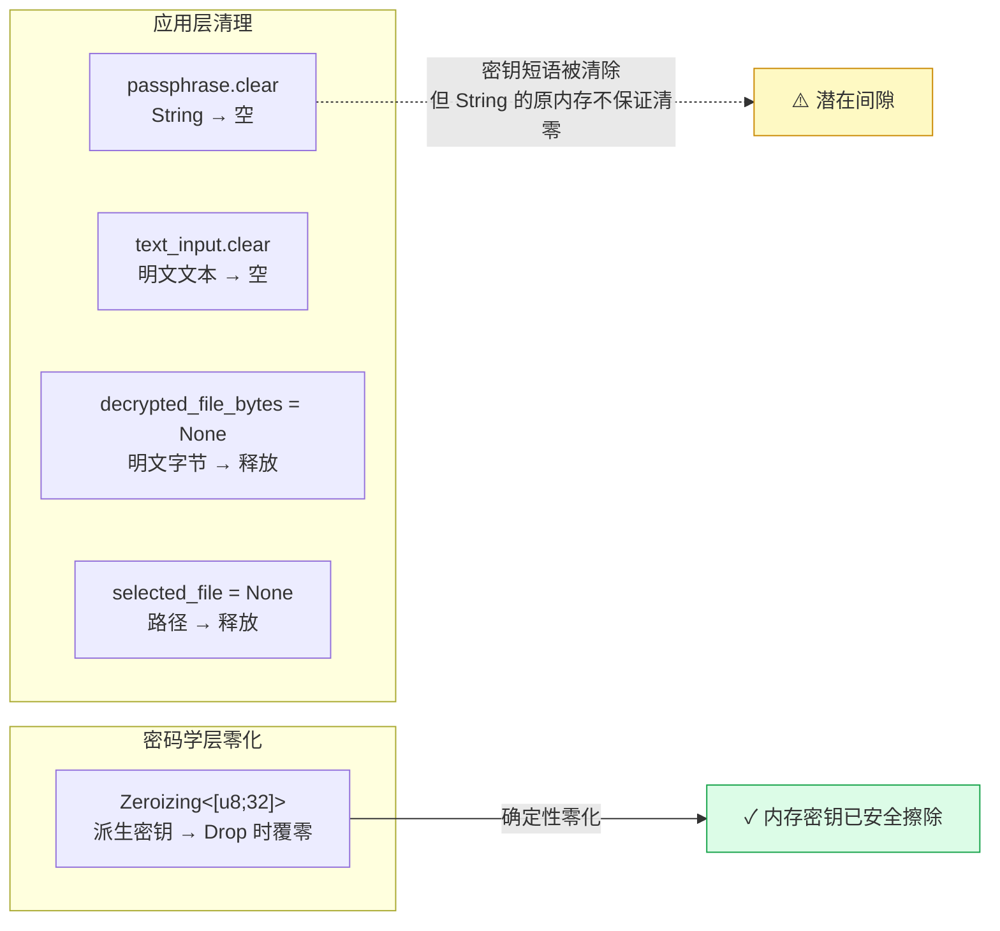

加密应用的安全性不只有密码学算法的强度——当操作完成后，界面中残留的明文、密钥短语和文件路径同样构成攻击面。本文聚焦 Encrust 应用层如何围绕**操作完成的时机**进行状态重置与敏感数据清除，涵盖 `clear_encrypt_inputs`、`clear_decrypt_inputs` 的逐字段清理逻辑、`passphrase.clear()` 在解密成功时的即时调用，以及 `crypto` 模块中 `Zeroizing` 对派生密钥的零化保障。两层协作形成从 UI 状态到内存密钥的完整清理链路。

Sources: [app.rs](src/app.rs#L574-L595), [crypto.rs](src/crypto.rs#L229-L239)

## 清理时机的识别：操作完成即触发

Encrust 的敏感数据清理遵循一个简单但关键的原则：**操作一旦成功完成，立即清除与该操作关联的所有敏感状态**。这不是延迟清理、不是定时回收，而是与业务成功信号同步执行的即时动作。应用中存在三个明确的清理触发点：

1. **加密保存成功后** — `encrypt_active_input` 检测到 `Ok(path)` 时调用 `clear_encrypt_inputs`
2. **解密文本复制后** — 用户点击"复制文本"按钮后调用 `clear_decrypt_inputs`
3. **解密文件保存后** — `save_decrypted_file` 检测到 `Ok(path)` 时调用 `clear_decrypt_inputs`

此外还有一个非对称的清理时机：**解密成功时**，`apply_decrypted_payload` 在将明文载入 UI 状态的同时，立即调用 `self.passphrase.clear()`。这意味着密钥短语的生命周期被严格限定在"用户输入 → 派生密钥 → 解密完成"这一段，不会因为解密结果尚在展示而继续驻留。

Sources: [app.rs](src/app.rs#L475-L483), [app.rs](src/app.rs#L380-L384), [app.rs](src/app.rs#L509-L514), [app.rs](src/app.rs#L557-L558), [app.rs](src/app.rs#L568)

## 清理链路总览

```mermaid
flowchart TD
    subgraph 加密流程
        E_START[用户点击"加密并保存"] --> E_EXEC[encrypt_active_input]
        E_EXEC -->|成功| E_CLEAR[clear_encrypt_inputs]
        E_CLEAR --> E_TOAST[Success Toast]
        E_EXEC -->|失败| E_ERR[Error Toast<br/>不触发清理]
    end

    subgraph 解密流程
        D_START[用户点击"解密"] --> D_EXEC[decrypt_selected_file]
        D_EXEC -->|成功| D_APPLY[apply_decrypted_payload]
        D_APPLY --> D_PASS[passphrase.clear<br/>即时清除密钥]
        D_PASS --> D_TEXT{内容类型?}
        D_TEXT -->|Text| D_SHOW_TEXT[展示解密文本]
        D_TEXT -->|File| D_SHOW_FILE[展示保存选项]
        D_SHOW_TEXT --> D_COPY[用户点击"复制文本"]
        D_COPY --> D_CLEAR[clear_decrypt_inputs]
        D_SHOW_FILE --> D_SAVE[用户点击"保存解密文件"]
        D_SAVE --> D_CLEAR
        D_EXEC -->|失败| D_ERR[Error Toast<br/>不触发清理]
    end

    style E_CLEAR fill:#dcfce7,stroke:#16a34a
    style D_PASS fill:#dcfce7,stroke:#16a34a
    style D_CLEAR fill:#dcfce7,stroke:#16a34a
```

上图展示了两条清理链路的关键差异：加密流程在保存成功后**一次性全部清理**；解密流程则分两步——先清除密钥短语，等用户完成对明文的后续操作（复制或保存）后再清除明文和其余状态。这种两步策略平衡了安全性与可用性：密钥越早消失越好，但明文必须保留到用户真正消费完毕。

Sources: [app.rs](src/app.rs#L463-L595)

## 逐字段清理详解

### clear_encrypt_inputs：加密后的全面重置

```rust
fn clear_encrypt_inputs(&mut self) {
    self.selected_file = None;
    self.text_input.clear();
    self.passphrase.clear();
    self.encrypted_output_path = None;
}
```

此函数在加密文件成功写入磁盘后被调用，它清除四个字段：

| 字段 | 清理方式 | 敏感等级 | 清理原因 |
|---|---|---|---|
| `selected_file` | `= None` | 中 | 路径可能暴露用户目录结构和文件名 |
| `text_input` | `.clear()` | **高** | 用户输入的明文文本，加密后不应驻留 |
| `passphrase` | `.clear()` | **极高** | 密钥短语是派生密钥的源头，驻留时间应最小化 |
| `encrypted_output_path` | `= None` | 中 | 输出路径可能包含隐私目录或文件名 |

Sources: [app.rs](src/app.rs#L574-L583)

### clear_decrypt_inputs：解密后的全面重置

```rust
fn clear_decrypt_inputs(&mut self) {
    self.encrypted_input_path = None;
    self.decrypted_text.clear();
    self.decrypted_file_bytes = None;
    self.decrypted_file_name = None;
    self.decrypted_output_path = None;
    self.passphrase.clear();
}
```

此函数在用户完成对解密结果的消费后（复制文本或保存文件）被调用，清除六个字段：

| 字段 | 清理方式 | 敏感等级 | 清理原因 |
|---|---|---|---|
| `encrypted_input_path` | `= None` | 低 | 加密文件路径，清理以恢复界面初始状态 |
| `decrypted_text` | `.clear()` | **极高** | 解密后的明文，是加密保护的直接目标 |
| `decrypted_file_bytes` | `= None` | **极高** | 解密后的文件明文字节，同上 |
| `decrypted_file_name` | `= None` | 中 | 原始文件名可能含隐私信息 |
| `decrypted_output_path` | `= None` | 中 | 保存路径可能暴露目录结构 |
| `passphrase` | `.clear()` | **极高** | 冗余保险——在 `apply_decrypted_payload` 中已清除一次 |

注意 `passphrase.clear()` 在此处的再次调用：这是一种**防御性冗余**（defense-in-depth）。尽管密钥短语在解密成功时已被清除一次，但用户可能在解密后修改了密钥输入框，所以最终清理时再清一次以确保无遗漏。

Sources: [app.rs](src/app.rs#L585-L595)

## 密钥短语的即时清除：解密成功时零等待

在 `apply_decrypted_payload` 中，有一个值得单独审视的设计决策：

```rust
ContentKind::Text => match String::from_utf8(payload.plaintext) {
    Ok(text) => {
        self.decrypted_text = text;
        self.passphrase.clear();    // ← 此处立即清除
        self.show_toast(Notice::Success("文本解密成功".to_owned()));
    }
    // ...
},
ContentKind::File => {
    // ...
    self.decrypted_file_bytes = Some(payload.plaintext);
    self.passphrase.clear();        // ← 此处立即清除
    self.show_toast(Notice::Success("文件解密成功，请选择保存位置".to_owned()));
}
```

**密钥短语在解密成功的那一刻就被清除，而不是等到用户完成对明文的后续操作**。这与加密流程中 `passphrase` 在 `clear_encrypt_inputs` 中才被清除的策略形成对比。差异的根源在于两个流程对密钥的需求不同：

- **加密流程**：密钥短语在整个加密过程中被传递给 `crypto::encrypt_bytes`，函数返回后密钥已无用处，但因为加密是一步完成的（加密+保存），所以清理也一步到位
- **解密流程**：密钥短语在 `decrypt_bytes` 返回后同样已无用处，但解密结果需要用户交互（复制或保存），在此期间密钥短语继续驻留是不必要的风险

这种"密钥最先清除，明文最后清除"的时序策略，本质上是将**密钥与明文在内存中的共存时间窗口缩到最短**。即使攻击者在此窗口内获取了内存快照，也很难同时拿到密钥和明文——而同时拿到两者才是最危险的。

Sources: [app.rs](src/app.rs#L547-L571)

## set_encrypted_input_path：切换输入时的中间状态清理

除了操作完成后的清理，还有一个容易被忽视的中间态清理点——当用户在解密模式中更换加密文件输入时：

```rust
fn set_encrypted_input_path(&mut self, path: PathBuf) {
    self.encrypted_input_path = Some(path);
    self.decrypted_text.clear();
    self.decrypted_file_bytes = None;
    self.decrypted_file_name = None;
    self.decrypted_output_path = None;
    self.toast = None;
}
```

此函数在两个场景中被调用：拖拽文件进入窗口时（`capture_dropped_files` 中 `OperationMode::Decrypt` 分支）和用户通过文件选择器选择加密文件时。新文件意味着之前的解密结果已失效，残留的明文和路径必须立即清除。这遵循了**不保留过期敏感状态**的原则——如果用户选择解密一个新文件，上一个文件的明文不应继续驻留在 UI 状态中。

Sources: [app.rs](src/app.rs#L538-L545), [app.rs](src/app.rs#L172-L183)

## crypto 模块的 Zeroizing：派生密钥的内存零化

应用层的 `.clear()` 和 `= None` 清理的是 UI 状态字段，但真正的密码学密钥（Argon2id 派生出的 32 字节 AES 密钥）在 `crypto` 模块中通过 `Zeroizing` 包装来保护：

```rust
fn derive_key(passphrase: &str, salt: &[u8; SALT_LEN]) -> Result<Zeroizing<[u8; KEY_LEN]>, CryptoError> {
    let params = Params::new(19 * 1024, 2, 1, Some(KEY_LEN)).map_err(|_| CryptoError::KeyDerivation)?;
    let argon2 = Argon2::new(Algorithm::Argon2id, Version::V0x13, params);

    let mut key = Zeroizing::new([0_u8; KEY_LEN]);
    argon2.hash_password_into(passphrase.as_bytes(), salt, key.as_mut()).map_err(|_| CryptoError::KeyDerivation)?;

    Ok(key)
}
```

`Zeroizing<[u8; 32]>` 是 `zeroize` crate 提供的智能指针包装器，其核心保证是：**当值被 Drop 时，内存中的字节会被确定性覆写为零**。这与 Rust 默认的 Drop 行为有本质区别——Rust 的 `Drop` 不保证清零内存，它只释放所有权；而编译器的优化甚至可能将"先写零再释放"的代码优化掉（因为"没人会读这段零值，写它没有可观测效果"）。`zeroize` crate 通过使用 `VolatileWrite` 和编译器屏障（compiler fence）来对抗这种优化，确保零化操作不会被跳过。

Sources: [crypto.rs](src/crypto.rs#L229-L239), [Cargo.toml](Cargo.toml#L13)

## 两层清理的协作模型

将应用层和密码学层的清理机制组合来看，Encrust 实际上构建了一个两层防御体系：



**关键认知**：应用层的 `String::clear()` 并不等同于密码学意义上的安全擦除。`clear()` 将长度设为零，但原先存储字符的堆内存**不保证被覆写**——那些字节可能继续驻留在堆上，直到该内存区域被分配器重用。`Zeroizing` 则通过 volatile write 保证了覆零。这意味着 Encrust 的防御体系中存在一个**潜在间隙**：密钥短语以普通 `String` 形式存储在 `EncrustApp` 结构体中，`.clear()` 后堆上可能仍有残留。

这是一个有意的设计取舍。对桌面 GUI 应用而言，`String` 是 egui `TextEdit` 的自然搭档，而将其替换为 `Zeroizing<String>` 需要自定义文本控件或引入额外的 unsafe 抽象。当前项目作为学习型应用，选择了实用性与可审计性的平衡——**密码学层的核心密钥（派生后的 AES key）获得了 Zeroizing 保护，而 UI 层的密钥短语通过 `.clear()` 实现了语义级别的清除**。在生产级应用中，密钥短语的内存零化同样值得处理。

Sources: [app.rs](src/app.rs#L48), [crypto.rs](src/crypto.rs#L229-L239)

## 清理触发策略的对比

| 策略维度 | 加密流程 | 解密流程 |
|---|---|---|
| **清理时机** | 保存成功后一次性清理 | 解密成功时清密钥 + 消费完成后清明文 |
| **清理步骤** | 1 步（`clear_encrypt_inputs`） | 2 步（`passphrase.clear()` + `clear_decrypt_inputs`） |
| **密钥短语清除** | 在 `clear_encrypt_inputs` 中 | 在 `apply_decrypted_payload` 中立即，`clear_decrypt_inputs` 中冗余 |
| **明文驻留时间** | 极短（加密完即清除） | 较长（需等待用户复制或保存） |
| **失败时清理** | 不触发 | 不触发 |
| **防御性冗余** | 无 | `passphrase.clear()` 调用两次 |

失败时不触发清理是一个值得注意的设计：如果加密或解密失败，用户可能需要修改输入重试，此时清除状态会强迫用户重新输入一切，损害可用性。安全与可用性的平衡在这里体现为——**只对成功的操作执行不可逆的状态重置**。

Sources: [app.rs](src/app.rs#L463-L595)

## 延伸思考

Encrust 当前的清理策略覆盖了正常操作路径上的敏感数据生命周期，但仍存在可探索的改进方向。**进程终止时的清理**是当前未覆盖的场景——如果应用被操作系统强制终止（SIGKILL）或崩溃，`Zeroizing` 的 Drop 和 `String::clear()` 都不会被执行，内存中的密钥和明文将持续存在直到物理内存被覆盖。对此，生产级应用可考虑 `mlock` 系统调用来防止敏感内存被换页到磁盘，或在启动时主动覆零上次可能残留的内存区域。这些方向将在 [扩展方向：GitHub Actions 多平台 CI 与流式加密展望](21-kuo-zhan-fang-xiang-github-actions-duo-ping-tai-ci-yu-liu-shi-jia-mi-zhan-wang) 中进一步讨论。而密码学层密钥派生的完整细节，可参阅 [密钥派生流程：Argon2id 参数选择与 Zeroize 零化实践](5-mi-yao-pai-sheng-liu-cheng-argon2id-can-shu-xuan-ze-yu-zeroize-ling-hua-shi-jian)；解密后明文的 UI 展示逻辑，则参见 [解密工作流 UI：加密文件输入、结果展示与文件保存](11-jie-mi-gong-zuo-liu-ui-jia-mi-wen-jian-shu-ru-jie-guo-zhan-shi-yu-wen-jian-bao-cun)。