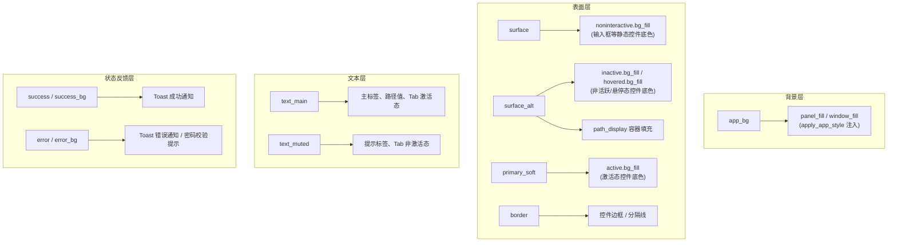

Encrust 的图形界面基于 egui 构建，而 egui 并不提供 CSS 那样的声明式样式表——每一帧都需要由代码主动查询当前主题模式、选取对应色值、再赋给控件或画笔。`ThemeColors` 结构体与 `theme_colors` 函数正是这一机制的集中表达：前者将整个界面所需的 11 种语义色收敛为一个值类型，后者根据 `ctx.style().visuals.dark_mode` 的布尔值在两套预设间切换，返回一个 `Copy` 语义的配色快照。这种设计让所有 UI 绘制点只需调用一次函数即可获得完整调色板，而无需在各处散落 `if dark_mode { ... } else { ... }` 分支，既减少了遗漏，也使未来替换配色方案成为只需修改一处函数的局部重构。

Sources: [app.rs](src/app.rs#L624-L671)

## 设计动机：从散乱常量到集中抽象

在 `ThemeColors` 出现之前，明暗两套状态反馈色（成功/错误的前景色与背景色）已经以模块级常量的形式存在于文件顶部——`SUCCESS`、`SUCCESS_BG`、`ERROR`、`ERROR_BG` 对应亮色模式，`DARK_SUCCESS`、`DARK_SUCCESS_BG`、`DARK_ERROR`、`DARK_ERROR_BG` 对应暗色模式。这 8 个常量本身并不携带主题归属信息，使用方必须自行判断当前模式再选择正确的常量名，认知负担与出错概率随调用点数量线性增长。`ThemeColors` 的引入将这些散落的命名约束收拢为结构体字段：`success` / `success_bg` / `error` / `error_bg`，调用方不再需要关心「当前是哪个模式」，只需读取字段即可。

| 常量名 | RGB 值 | 对应 `ThemeColors` 字段 |
|---|---|---|
| `SUCCESS` | `(22, 101, 52)` | `colors.success`（亮色） |
| `SUCCESS_BG` | `(240, 253, 244)` | `colors.success_bg`（亮色） |
| `ERROR` | `(185, 28, 28)` | `colors.error`（亮色） |
| `ERROR_BG` | `(254, 242, 242)` | `colors.error_bg`（亮色） |
| `DARK_SUCCESS` | `(134, 239, 172)` | `colors.success`（暗色） |
| `DARK_SUCCESS_BG` | `(20, 83, 45)` | `colors.success_bg`（暗色） |
| `DARK_ERROR` | `(252, 165, 165)` | `colors.error`（暗色） |
| `DARK_ERROR_BG` | `(127, 29, 29)` | `colors.error_bg`（暗色） |

Sources: [app.rs](src/app.rs#L10-L17)

## ThemeColors 结构体：语义色字段定义

`ThemeColors` 拥有 11 个字段，每个字段以视觉语义而非具体用途命名——例如 `surface_alt` 表示"次级表面填充色"，而非"侧边栏背景色"。这种命名方式使得同一字段可在不同上下文中复用，避免字段数随 UI 区域数膨胀。

```rust
#[derive(Clone, Copy)]
struct ThemeColors {
    app_bg: egui::Color32,       // 应用最底层背景
    surface: egui::Color32,      // 主表面（卡片、输入框底色）
    surface_alt: egui::Color32,  // 次级表面（路径显示区、悬停态底色）
    border: egui::Color32,       // 边框/分隔线
    primary_soft: egui::Color32, // 主强调色柔化版（激活态按钮底色）
    text_main: egui::Color32,    // 主要文本
    text_muted: egui::Color32,   // 次要/提示文本
    success: egui::Color32,      // 成功状态前景色
    success_bg: egui::Color32,   // 成功状态背景色
    error: egui::Color32,        // 错误状态前景色
    error_bg: egui::Color32,     // 错误状态背景色
}
```

结构体只派生了 `Clone` 和 `Copy`，没有 `Debug`——这是一个纯粹的值容器，不需要格式化输出，也不需要比较语义。`Copy` trait 使得 `theme_colors` 返回值可以直接按值传递而无需引用生命周期标注，简化了所有调用点的签名。

Sources: [app.rs](src/app.rs#L624-L637)

## theme_colors 函数：基于 dark_mode 的双分支派发

`theme_colors` 的实现极为简洁：克隆当前 `Visuals`，读取其 `dark_mode` 布尔值，然后进入两个平行的结构体构造分支。函数签名接收 `&egui::Context`，这是因为 egui 的主题状态存储在 Context 内部，需要通过 `ctx.style()` 访问。

```rust
fn theme_colors(ctx: &egui::Context) -> ThemeColors {
    let visuals = ctx.style().visuals.clone();

    if visuals.dark_mode {
        ThemeColors { /* 暗色分支 */ }
    } else {
        ThemeColors { /* 亮色分支 */ }
    }
}
```

值得注意的是 `ctx.style()` 返回的是 `Arc<Style>`，对其 `visuals` 字段的直接引用会持有 `Arc`，可能在跨越 `show` 闭包边界时引发借用冲突。因此函数选择 `.clone()` 整个 `Visuals`——这是栈上的值类型，克隆代价微乎其微，却换取了完全无借用的返回值，可以在任何闭包中自由使用。

Sources: [app.rs](src/app.rs#L639-L671)

## 两套配色的完整色值与对比

下表列出明暗两套主题的所有字段 RGB 值，便于直观对比色彩映射关系。两套方案遵循一致的视觉层级逻辑：`app_bg` 最暗（亮色模式）或最暗（暗色模式），`surface` 比 `app_bg` 更亮，`surface_alt` 介于两者之间，`border` 则是对比度适中的中间灰。

| 字段 | 亮色模式 RGB | 暗色模式 RGB | 视觉语义 |
|---|---|---|---|
| `app_bg` | `(246, 247, 249)` | `(24, 24, 27)` | 应用底层背景，亮色偏冷灰白，暗色偏深黑 |
| `surface` | `(255, 255, 255)` | `(32, 33, 36)` | 主表面——纯白/深灰，卡片与输入框底色 |
| `surface_alt` | `(242, 244, 247)` | `(39, 39, 42)` | 次级表面，比主表面略暗（亮）/略亮（暗） |
| `border` | `(214, 219, 227)` | `(63, 63, 70)` | 边框与分隔线 |
| `primary_soft` | `(239, 246, 255)` | `(38, 46, 61)` | 柔化主强调色——亮色极淡蓝，暗色深蓝 |
| `text_main` | `(17, 24, 39)` | `(244, 244, 245)` | 主要文本，近黑/近白 |
| `text_muted` | `(100, 116, 139)` | `(161, 161, 170)` | 次要文本，中等灰度 |
| `success` | `(22, 101, 52)` | `(134, 239, 172)` | 成功前景：亮色深绿，暗色浅绿 |
| `success_bg` | `(240, 253, 244)` | `(20, 83, 45)` | 成功背景：亮色极淡绿，暗色深绿 |
| `error` | `(185, 28, 28)` | `(252, 165, 165)` | 错误前景：亮色深红，暗色浅红 |
| `error_bg` | `(254, 242, 242)` | `(127, 29, 29)` | 错误背景：亮色极淡红，暗色深红 |

配色策略的核心原则是**前景色与背景色的明度反转**：亮色模式下前景色深、背景色浅；暗色模式下前景色浅、背景色深。这确保了两种模式下文本与底色之间都维持足够的对比度。以 `success` 字段为例，亮色模式的 `(22, 101, 52)` 是浓郁的深绿，在浅背景上醒目；暗色模式切换为 `(134, 239, 172)` 薄荷绿，在深色底上同样高可读性。

Sources: [app.rs](src/app.rs#L639-L671)

## 调色策略的层级映射

将 `ThemeColors` 字段映射到 egui 的视觉层级，可以理解为什么需要这 11 个字段而非更多或更少。egui 的界面本质上由三种元素组成：**背景层**（面板填充）、**表面层**（控件与卡片）、**文本层**（内容与标签）。三层之间的对比度递进构成了视觉可读性的基础。



`apply_app_style` 函数在每帧开始时将 `ThemeColors` 的字段映射到 egui 的 `Style.visuals` 各属性上——`panel_fill` 和 `window_fill` 被设为 `app_bg`，`extreme_bg_color` 被设为 `surface_alt`，控件状态的 `bg_fill` 分别映射到 `surface`、`surface_alt`、`primary_soft`。这种集中注入意味着 `ThemeColors` 不仅服务于手动绘制的自定义控件，也通过 `Style` 机制间接控制了所有 egui 内置控件的配色。

Sources: [app.rs](src/app.rs#L602-L621)

## 调用点全景：theme_colors 在界面中的分布

`theme_colors` 在代码中共有 5 个调用点，覆盖了界面中所有需要显式指定颜色的场景。egui 的默认 `Style` 机制已经通过 `apply_app_style` 处理了大部分通用控件的配色，但以下场景需要绕过 Style 直接使用颜色值：

| 调用位置 | 使用的字段 | 用途 |
|---|---|---|
| `update` → 顶部菜单栏 Tab 绘制 | `text_main`, `text_muted` | 激活/非激活 Tab 的文本颜色与下划线颜色 |
| `render_passphrase_input` → 密码校验错误 | `error` | 密码不满足要求时的红色提示文本 |
| `render_toast` → Toast 通知绘制 | `success`, `success_bg`, `error`, `error_bg` | 通知的前景色（文本+边框）与背景色 |
| `path_display` → 路径展示组件 | `surface_alt`, `border`, `text_muted`, `text_main` | 路径容器的填充、边框、标签与值文本 |
| `apply_app_style` → 全局样式注入 | `app_bg`, `surface`, `surface_alt`, `border`, `primary_soft`, `text_main` | 面板填充、控件底色、边框、文本色等全局属性 |

这种"全局 Style 注入 + 局部手动取色"的双轨模式是 egui 应用的常见范式：`Style` 覆盖了 80% 的通用控件配色需求，剩余 20% 的自定义绘制点（自定义 Frame、手动 painter 调用、RichText 着色等）则需要直接从 `ThemeColors` 取值。将所有颜色值统一从 `theme_colors()` 获取，保证了双轨之间的一致性——无论控件颜色来自 Style 还是来自手动取色，底层都是同一组配色值。

Sources: [app.rs](src/app.rs#L100-L130) [app.rs](src/app.rs#L320-L327) [app.rs](src/app.rs#L430-L444) [app.rs](src/app.rs#L685-L698) [app.rs](src/app.rs#L607-L621)

## 从常量到抽象的演进轨迹

文件顶部的 8 个模块级常量（`SUCCESS`、`DARK_SUCCESS` 等）是较早时期的产物，它们定义在 `ThemeColors` 之外，却被 `theme_colors` 函数内部直接引用。这种结构暗示了一个可能的演进方向：如果未来将这 8 个常量的 RGB 值直接内联到 `theme_colors` 函数的两个分支中，常量便可以完全移除，`ThemeColors` 将成为配色的唯一入口。当前保留常量的原因可能是便于快速调整色值——在开发初期，直接修改常量比在结构体构造分支中寻找对应字段更直观。

如果项目后续需要支持用户自定义主题，`ThemeColors` 的结构天然适配"配置文件反序列化"模式：只需为 `ThemeColors` 添加 `Deserialize` trait，然后将 `theme_colors` 函数改为从配置源读取即可，函数签名与调用方无需任何变更。

Sources: [app.rs](src/app.rs#L10-L17) [app.rs](src/app.rs#L639-L671)

## 延伸阅读

`ThemeColors` 解决了"取什么色"的问题，而"如何将色值注入到 egui 的全局视觉参数中"则由 `apply_app_style` 函数负责——包括面板填充、控件圆角、间距等属性的设置。两者的协作关系在[全局样式配置：间距、圆角、控件状态的视觉一致性（apply_app_style）](16-quan-ju-yang-shi-pei-zhi-jian-ju-yuan-jiao-kong-jian-zhuang-tai-de-shi-jue-zhi-xing-apply_app_style)中详细展开。对于 `ThemeColors` 中 `success`/`error` 系列字段在 Toast 通知中的具体应用，可参考[Toast 通知系统：成功/错误状态反馈与自动消失](13-toast-tong-zhi-xi-tong-cheng-gong-cuo-wu-zhuang-tai-fan-kui-yu-zi-dong-xiao-shi)。