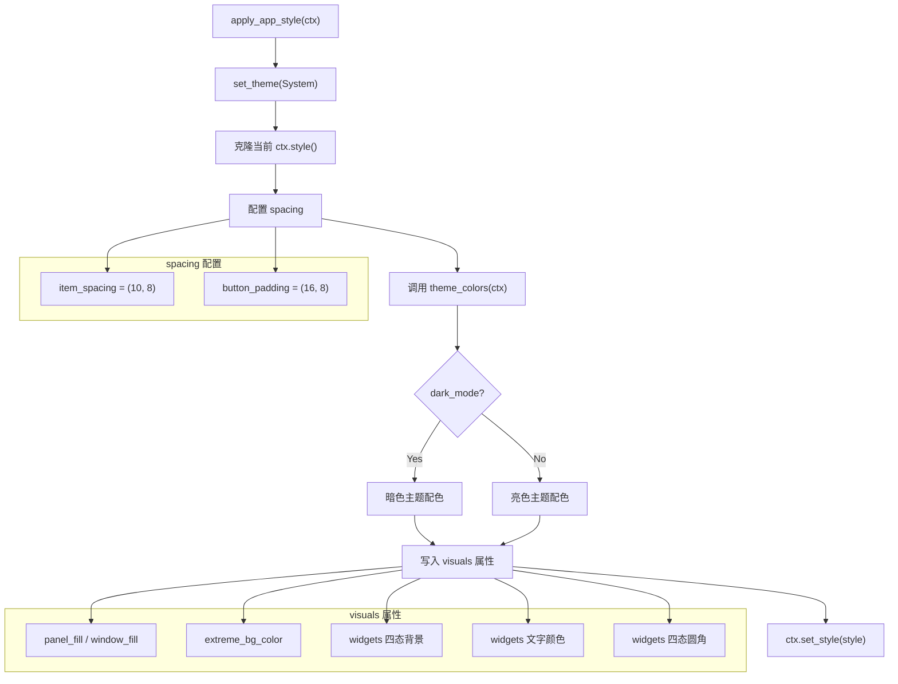

`apply_app_style` 是 Encrust 整个 UI 层的**视觉基座**。它以一个独立函数的形式存在，在每一帧渲染的最开始被调用，负责将 egui 的默认样式替换为一套经过精心调配的全局配置——涵盖间距（spacing）、控件各状态的背景色（widget state fills）、圆角（corner radius）和面板底色。这种"每帧覆盖"的策略确保了无论用户切换明暗主题、拖拽窗口还是触发任何交互，视觉规则始终保持一致，不会因为某个组件遗漏了样式而出现视觉断裂。

Sources: [app.rs](src/app.rs#L602-L622)

## 调用时机：帧渲染的第一步

在 `eframe::App` trait 的 `update` 方法中，`apply_app_style` 是第一行有效代码（紧跟在函数签名之后）。这意味着在后续的 `TopBottomPanel`、`SidePanel`、`CentralPanel` 以及所有子组件渲染之前，`egui::Context` 中的样式已经被完整替换。这个位置选择并非随意——egui 的 `Style` 是 context 级别的共享状态，先于一切 `ui.*` 调用设定好，才能让后续所有控件自动继承，无需逐个手动指定。

```rust
fn update(&mut self, ctx: &egui::Context, _frame: &mut eframe::Frame) {
    apply_app_style(ctx);        // ← 第一帧操作
    self.capture_dropped_files(ctx);
    // ...后续所有面板与控件渲染...
}
```

Sources: [app.rs](src/app.rs#L78-L162)

## 函数结构拆解

`apply_app_style` 的内部逻辑可以划分为三个关注层：主题检测、间距配置、视觉属性配置。下面的流程图展示了函数的执行路径：



Sources: [app.rs](src/app.rs#L602-L622)

## 主题检测：跟随系统的明暗切换

函数的第一行 `ctx.set_theme(egui::ThemePreference::System)` 将主题选择权交给操作系统。egui 内部会根据 macOS 的 Appearance 设置、Windows 的深浅色切换或 Linux 桌面环境的主题偏好，自动决定当前使用亮色还是暗色视觉。这行代码本身不改变任何颜色值，但它影响了后续 `theme_colors` 读取 `ctx.style().visuals.dark_mode` 时的返回结果。

Sources: [app.rs](src/app.rs#L603)

## 间距配置：全局元素间距与按钮内边距

间距配置通过修改 `style.spacing` 上的两个字段实现，它们控制的是 egui 布局引擎中所有控件的默认间距行为：

| 字段 | 值 | 含义 |
|---|---|---|
| `item_spacing` | `(10.0, 8.0)` | 相邻控件之间的水平和垂直间距（像素） |
| `button_padding` | `(16.0, 8.0)` | 按钮文本到按钮边框的内边距（水平 16px，垂直 8px） |

`item_spacing` 影响所有通过 egui 布局系统排列的控件之间的间隔——包括 label、button、text edit 等。水平 10px、垂直 8px 的设定为控件之间留出了清晰的呼吸空间，同时不会让表单显得稀疏。`button_padding` 的水平方向设为 16px，使按钮的文字两侧有充足的留白，视觉上比 egui 默认的紧凑按钮更加舒适。

Sources: [app.rs](src/app.rs#L604-L606)

## 视觉属性配置：背景色与控件四态

egui 的控件系统将交互状态分为四个层级：**noninteractive**（不可交互）、**inactive**（静止/默认）、**hovered**（悬停）、**active**（按下/激活）。`apply_app_style` 为每个状态分别配置了背景色、前景色和圆角。下面这张表展示了各状态的配置映射关系：

| Widget 状态 | `bg_fill` | `fg_stroke.color` | `corner_radius` |
|---|---|---|---|
| noninteractive | `colors.surface` | `colors.text_main` | 4 |
| inactive | `colors.surface_alt` | `colors.text_main` | 4 |
| hovered | `colors.surface_alt` | — | 4 |
| active | `colors.primary_soft` | — | 4 |

**背景色的渐变语义**值得特别注意。从 `surface` → `surface_alt` → `surface_alt` → `primary_soft`，这个序列设计了一个微妙的视觉叙事：不可交互元素使用最纯净的表面色（亮色模式下是纯白），默认状态切换到略带灰调的 `surface_alt`，悬停时保持不变（避免闪烁），而激活状态则跳转到带蓝色调的 `primary_soft`（亮色模式下为 `#EFF6FF`），给予用户一个明确的"已触发"反馈。

圆角统一设为 4px。这个值贯穿了整个应用——不仅出现在此处设置的 `style.visuals.widgets` 中，还在 `notice_frame`（[app.rs](src/app.rs#L673-L675)）和 `path_display`（[app.rs](src/app.rs#L685-L698)）等辅助函数中以硬编码方式复现，保证了从按钮、通知卡片到路径显示框的视觉一致性。

Sources: [app.rs](src/app.rs#L607-L621)

## 面板与窗口底色的统一

除了控件级别的样式，`apply_app_style` 还覆盖了两个关键的容器级颜色：

- **`panel_fill`** 和 **`window_fill`** 统一设为 `colors.app_bg`，确保顶栏（`TopBottomPanel`）、侧边栏（`SidePanel`）、中央面板（`CentralPanel`）以及弹出窗口共享同一个底色。在亮色模式下这是 `#F6F7F9`（极浅的冷灰），暗色模式下是 `#18181B`（接近纯黑的深灰）。
- **`extreme_bg_color`** 设为 `colors.surface_alt`。这个颜色在 egui 内部被用作 `TextEdit` 等需要强对比度控件的极深/极浅背景，将其与 `surface_alt` 对齐意味着文本编辑框的底色与控件默认状态背景一致，不会出现突兀的色块。

Sources: [app.rs](src/app.rs#L608-L610)

## 与 ThemeColors 的协作关系

`apply_app_style` 本身不硬编码任何颜色值——它将配色决策完全委托给 `theme_colors` 函数。`theme_colors` 根据 `ctx.style().visuals.dark_mode` 返回一个 `ThemeColors` 结构体，其中包含 11 个语义化颜色字段（`app_bg`、`surface`、`surface_alt`、`border`、`primary_soft`、`text_main`、`text_muted`、`success`、`success_bg`、`error`、`error_bg`）。这种分层设计使得配色方案的修改只需触及 `theme_colors` 函数，而全局样式的结构化配置（间距、圆角、状态映射）则留在 `apply_app_style` 中，职责清晰。

更详细的配色方案分析请参阅 [明暗双主题配色方案（ThemeColors 结构体与 theme_colors 函数）](15-ming-an-shuang-zhu-ti-pei-se-fang-an-themecolors-jie-gou-ti-yu-theme_colors-han-shu)。

Sources: [app.rs](src/app.rs#L624-L671)

## "每帧覆盖"模式的设计取舍

`apply_app_style` 选择了一种看似"粗暴"但实际精巧的策略：**在每一帧都完整重建 `Style` 对象**。具体做法是先 `clone` 当前 style，修改后再 `set_style` 写回。这种模式有以下优势：

- **零遗漏**：不存在"某个控件忘记继承样式"的问题，因为全局 style 在帧开始时已确定。
- **主题切换即时生效**：当操作系统从亮色切换到暗色时，下一帧的 `theme_colors` 自动返回暗色配色，无需额外的主题切换事件监听。
- **无状态管理负担**：不需要在 `EncrustApp` 中维护一个独立的"当前主题"状态字段。

唯一的代价是每帧执行一次 clone + 赋值操作，但对于 `egui::Style` 这样的小型结构体，这个开销可以忽略不计。这符合 egui 的 **immediate mode** 设计哲学——每一帧都是一次完整的 UI 声明，样式也不例外。

Sources: [app.rs](src/app.rs#L604-L621)

## 全局样式的影响范围

`apply_app_style` 设定的样式不仅影响标准控件（`Button`、`TextEdit`、`Label`），还通过 `ThemeColors` 间接影响以下渲染函数的行为：

| 渲染函数 | 使用的 ThemeColors 字段 | 用途 |
|---|---|---|
| `render_toast` | `success_bg`、`success`、`error_bg`、`error` | Toast 通知的填充色和边框色 |
| `render_passphrase_input` | `error` | 密码校验失败时的错误提示文字颜色 |
| `path_display` | `surface_alt`、`border`、`text_muted`、`text_main` | 文件路径展示框的背景、边框和文字颜色 |
| `notice_frame` | 通过参数传入 `fill` 和 `stroke` | Toast 通知的 Frame 容器 |
| 菜单栏 tab 指示器 | `text_main`、`text_muted` | 加密/解密标签的颜色和底部指示条 |

这些函数通过各自调用 `theme_colors(ctx)` 获取配色，而非直接引用 `apply_app_style` 设置的全局 style——这是一种有意的设计分离。`apply_app_style` 负责**egui 控件系统**的视觉默认值，而手动绘制的自定义元素（如 Toast、路径框）则通过 `theme_colors` 获取语义化颜色，两者共享同一套配色方案但走不同的消费路径。

Sources: [app.rs](src/app.rs#L420-L444), [app.rs](src/app.rs#L317-L328), [app.rs](src/app.rs#L685-L698)

## 圆角一致性的全局验证

4px 圆角不仅是控件默认值，还被以下位置显式使用，形成了全应用的圆角规范：

- **控件默认圆角**：通过 `style.visuals.widgets.*.corner_radius = 4` 设定，覆盖 Button、TextEdit 等所有标准控件。([app.rs](src/app.rs#L617-L620))
- **Toast 通知框**：`notice_frame` 中 `corner_radius(4)`。([app.rs](src/app.rs#L674))
- **路径展示框**：`path_display` 中 `corner_radius(4)`。([app.rs](src/app.rs#L691))

三处圆角值完全一致，意味着无论用户看到的是按钮、通知还是文件路径卡片，圆角的视觉感受是统一的。如果未来需要调整圆角，建议将 `4` 提取为一个命名常量（如 `WIDGET_RADIUS`），集中管理。

Sources: [app.rs](src/app.rs#L617-L620), [app.rs](src/app.rs#L674), [app.rs](src/app.rs#L691)

## 延伸阅读

- 配色方案的具体色值和明暗切换逻辑详见 [明暗双主题配色方案（ThemeColors 结构体与 theme_colors 函数）](15-ming-an-shuang-zhu-ti-pei-se-fang-an-themecolors-jie-gou-ti-yu-theme_colors-han-shu)。
- 全局样式应用后的具体 UI 布局参见 [加密工作流 UI](10-jia-mi-gong-zuo-liu-ui-wen-jian-xuan-ze-wen-ben-shu-ru-shu-chu-lu-jing-yu-cao-zuo-hong-fa) 和 [解密工作流 UI](11-jie-mi-gong-zuo-liu-ui-jia-mi-wen-jian-shu-ru-jie-guo-zhan-shi-yu-wen-jian-bao-cun)。
- 样式中圆角和边距参数在 Toast 系统中的消费方式参见 [Toast 通知系统](13-toast-tong-zhi-xi-tong-cheng-gong-cuo-wu-zhuang-tai-fan-kui-yu-zi-dong-xiao-shi)。