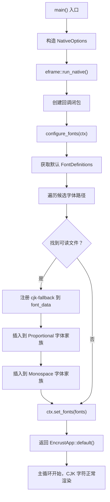
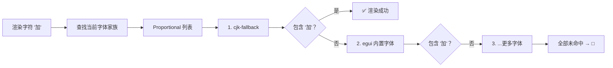

Encrust 的图形界面使用 egui 构建，而 egui 内置字体仅覆盖拉丁字符集——遇到中文、日文、韩文等 CJK 字符时会显示为方块或空白。为了确保应用在中文环境下正确呈现"加密""解密"等菜单文字与用户提示，项目在启动阶段实现了一套简洁而实用的 **字体回退（font fallback）机制**：按优先级遍历一组已知的中文字体文件路径，找到第一个可读的文件后注入 egui 的字体系统。本文将逐行拆解这段不到 30 行的代码，帮助你理解其设计思路与实现细节。

Sources: [main.rs](src/main.rs#L1-L55)

## 问题背景：为什么需要手动注册 CJK 字体？

egui 默认使用嵌入式的 **`eframe` 内置字体**（基于 `emath`/`epaint` 中的字体数据），这些字体仅包含 ASCII 和部分西欧字符。当 UI 文本中出现中文字符时，egui 会在已注册的字体家族（`FontFamily::Proportional`、`FontFamily::Monospace`）中逐个查找字形，若所有字体都不包含目标字形，则会渲染为 □（豆腐块）。这是一个 **确定性问题**——只要没有 CJK 字体，中文必定无法显示，且 egui 本身不提供自动的系统字体发现能力，因此需要应用层手动干预。

在 Encrust 中，顶部菜单栏的"加密""解密"标签、侧边栏的"选项""输入类型"等都是硬编码的中文字符串，这使得 CJK 字体支持成为一个 **功能性需求** 而非锦上添花。

Sources: [app.rs](src/app.rs#L105-L106), [app.rs](src/app.rs#L187-L196)

## 整体流程：从启动到字体生效

下面的流程图展示了字体配置在应用启动生命周期中的位置：



关键点在于 `configure_fonts` 被放在 **应用创建闭包** 中调用，它先于任何 UI 渲染执行，确保第一帧就能正确显示中文。

Sources: [main.rs](src/main.rs#L19-L27)

## 候选字体路径：跨平台策略

`configure_fonts` 函数定义了一个有序的候选字体路径数组 `font_candidates`，覆盖了 macOS 和 Linux 两大平台常见的中文字体：

| 序号 | 路径 | 平台 | 字体名称 | 说明 |
|:---:|------|:---:|---------|------|
| 1 | `/System/Library/Fonts/Hiragino Sans GB.ttc` | macOS | 冬青黑体 | macOS 内置，简体中文首选 |
| 2 | `/System/Library/Fonts/Supplemental/Arial Unicode.ttf` | macOS | Arial Unicode MS | 超大字符集，几乎覆盖所有 Unicode |
| 3 | `/System/Library/Fonts/STHeiti Medium.ttc` | macOS | 华文黑体（中黑） | macOS 旧版内置 |
| 4 | `/System/Library/Fonts/STHeiti Light.ttc` | macOS | 华文黑体（细黑） | macOS 旧版内置 |
| 5 | `/System/Library/Fonts/Supplemental/Songti.ttc` | macOS | 宋体 | 经典衬线中文字体 |
| 6 | `/usr/share/fonts/opentype/noto/NotoSansCJK-Regular.ttc` | Linux | Noto Sans CJK | Google 开源字体，常见于 Ubuntu 等 |
| 7 | `/usr/share/fonts/truetype/noto/NotoSansCJK-Regular.ttc` | Linux | Noto Sans CJK | 另一种发行版的安装路径 |
| 8 | `/usr/share/fonts/truetype/wqy/wqy-microhei.ttc` | Linux | 文泉驿微米黑 | 经典 Linux 中文开源字体 |

Sources: [main.rs](src/main.rs#L32-L41)

### 顺序为何重要？

数组的排列顺序就是 **优先级**——`find_map` 会从第一个元素开始尝试，一旦 `std::fs::read(path).ok()` 成功就立即返回。这意味着在 macOS 上，优先使用 **冬青黑体**（Hiragino Sans GB），它字形清晰、显示效果好，适合 UI 界面；Linux 上则优先选用 **Noto Sans CJK**。这种设计用最少的代码实现了一个简单的"质量优先"策略。

Sources: [main.rs](src/main.rs#L43)

### Windows 平台的缺位

当前候选列表中 **没有 Windows 路径**。Windows 系统的中文字体通常位于 `C:\Windows\Fonts\` 目录下（如 `msyh.ttc` 微软雅黑）。这意味着在 Windows 上，`font_candidates` 中的所有路径都会读取失败，CJK 字体不会被注册。这是一个已知的局限性——如果需要支持 Windows，只需在数组中追加 Windows 常见中文字体路径即可。

Sources: [main.rs](src/main.rs#L32-L41)

## 字体发现与注册的实现细节

### 第一步：获取默认字体定义

```rust
let mut fonts = FontDefinitions::default();
```

`FontDefinitions` 是 egui 字体系统的核心数据结构，包含两个字段：
- **`font_data`**：一个 `HashMap<String, Arc<FontData>>`，存储所有已注册字体的原始二进制数据（键是字体名称）。
- **`families`**：一个 `HashMap<FontFamily, Vec<String>>`，定义每种字体家族使用哪些已注册字体（键是家族名称，值是字体名称的有序列表）。

`default()` 返回的是 egui 内置的默认配置，我们在此基础上追加 CJK 字体，而非替换。

Sources: [main.rs](src/main.rs#L30)

### 第二步：线性探测——找到第一个可读的字体文件

```rust
if let Some(font_bytes) = font_candidates.iter().find_map(|path| std::fs::read(path).ok()) {
```

这行代码是整个回退机制的核心，它做了以下几件事：

1. **`font_candidates.iter()`**：创建候选路径的迭代器
2. **`std::fs::read(path)`**：尝试将文件完整读入内存，返回 `Result<Vec<u8>, io::Error>`
3. **`.ok()`**：将 `Result` 转为 `Option`，失败时变为 `None`
4. **`.find_map()`**：对每个元素执行闭包，返回第一个 `Some` 值——即第一个成功读取的字体文件的字节内容
5. **`if let Some(font_bytes)`**：如果至少找到一个可用字体，进入注册分支

这种模式的优点是 **零依赖**：不需要字体发现库、不需要平台检测，纯粹依靠文件系统的存在性检查。代价是灵活性较低——如果用户的系统上恰好没有安装列表中的任何字体，CJK 支持将静默失败（不会报错，只是回退到方块字）。

Sources: [main.rs](src/main.rs#L43)

### 第三步：注册字体数据

```rust
fonts.font_data.insert("cjk-fallback".to_owned(), Arc::new(FontData::from_owned(font_bytes)));
```

- **`"cjk-fallback"`**：自定义字体名称，在 egui 字体系统中唯一标识这个字体
- **`FontData::from_owned(font_bytes)`**：将读入的字节数据包装为 egui 可识别的字体数据对象（`from_owned` 表示 egui 拥有这份数据的所有权）
- **`Arc::new(...)`**：用原子引用计数包装，因为 egui 内部会在多个上下文中共享字体数据
- **`font_data.insert(...)`**：将字体注册到全局字体数据表中

Sources: [main.rs](src/main.rs#L44)

### 第四步：将字体绑定到字体家族

```rust
if let Some(family) = fonts.families.get_mut(&FontFamily::Proportional) {
    family.insert(0, "cjk-fallback".to_owned());
}
if let Some(family) = fonts.families.get_mut(&FontFamily::Monospace) {
    family.insert(0, "cjk-fallback".to_owned());
}
```

这两段代码分别将 `"cjk-fallback"` 注册到 **比例字体家族**（用于普通 UI 文本）和 **等宽字体家族**（用于代码显示等场景）。

关键细节在于 **`insert(0, ...)`**——将字体插入到列表的 **最前面**。egui 的字形查找机制会按列表顺序依次查找：当遇到一个 CJK 字符时，egui 先在默认字体（如内置的拉丁字体）中查找，找不到后继续在后续字体中查找，最终在 `"cjk-fallback"` 中命中。将 CJK 字体放在较前的位置可以确保中文渲染时不会意外使用其他字体的替代字形。

> **注意**：`insert(0, ...)` 将 CJK 字体放在了最高优先级位置，这意味着如果 CJK 字体也包含拉丁字符（如 Noto Sans CJK），这些拉丁字符也会优先使用 CJK 字体渲染。在实际使用中，由于 Noto Sans CJK 的拉丁部分设计良好，这通常不会造成视觉问题；但 Hiragino Sans GB 的拉丁字形可能与 egui 内置字体风格略有差异。

Sources: [main.rs](src/main.rs#L46-L51)

### 第五步：应用配置

```rust
ctx.set_fonts(fonts);
```

将修改后的 `FontDefinitions` 提交给 egui 上下文。此后所有 UI 渲染都将使用新的字体配置。如果没有任何候选字体可用，`set_fonts` 仍然会被调用——此时 `fonts` 保持默认状态，等于无变化地设置回去，不会产生错误。

Sources: [main.rs](src/main.rs#L54)

## 字体回退链的查找机制

理解上述代码后，我们来完整梳理 egui 在运行时如何处理一个中文字符（如"加"）：



由于 `"cjk-fallback"` 被插入到了 `Proportional` 列表的第一个位置，它实际上会 **优先于 egui 内置字体** 被查找。对于纯 CJK 字符来说，命中 `cjk-fallback` 是确定性的；对于拉丁字符，`cjk-fallback` 中的字形会优先被使用。

Sources: [main.rs](src/main.rs#L44-L51)

## 设计权衡分析

| 维度 | 当前设计 | 替代方案 |
|------|---------|---------|
| **实现复杂度** | 极低（~25 行，无外部依赖） | 使用 `sys-locale` + `font-loader` 等库可自动发现系统字体，但增加依赖 |
| **平台覆盖** | macOS ✅ Linux ✅ Windows ❌ | 全平台自动发现可覆盖所有系统 |
| **字体质量** | 手动挑选高质量字体优先 | 自动发现可能选中低质量字体 |
| **容错能力** | 静默失败（无 CJK 字体时不报错） | 可在 UI 中提示用户安装字体 |
| **字体文件大小** | 系统字体，不增加二进制体积 | 内嵌 CJK 字体会增加 10-20 MB |
| **维护成本** | 新系统发布时可能需要更新路径 | 自动发现方案维护成本更低 |

Sources: [main.rs](src/main.rs#L29-L55)

## 与应用启动流程的集成

在 `main()` 函数中，`configure_fonts` 作为 **应用创建回调** 的一部分被调用：

```rust
eframe::run_native(
    "Encrust",
    options,
    Box::new(|creation_context| {
        configure_fonts(&creation_context.egui_ctx);  // ← 在这里配置字体
        Ok(Box::new(app::EncrustApp::default()))
    }),
)
```

`eframe::run_native` 的第三个参数是一个闭包，在 egui 上下文创建完毕后、主循环开始前执行。这里的 `creation_context.egui_ctx` 就是后续所有 UI 渲染所共享的上下文对象。在此时配置字体，可以确保第一帧渲染时所有中文字符就已经能正确显示。

`configure_fonts` 和 `EncrustApp` 的构造是 **顺序执行** 的——先字体后状态——字体配置不会依赖任何应用状态，保持了关注点分离。

Sources: [main.rs](src/main.rs#L19-L27)

## 小结

Encrust 的 CJK 字体回退机制用极少的代码解决了一个关键的用户体验问题。它的核心思想是 **有序候选路径 + 线性探测 + 优先级注册**：

1. **有序候选路径**：手动列举各平台高质量中文字体的已知安装路径
2. **线性探测**：用 `find_map` + `fs::read` 找到第一个可用的字体文件
3. **优先级注册**：将找到的字体以最高优先级插入 egui 的字体家族列表

这套机制虽然不如系统字体发现库那样灵活，但对于 Encrust 这样的小型工具应用而言，它在 **代码量、依赖数量、字体质量** 三者之间取得了良好的平衡。如果你的项目也需要在 egui 中支持中文显示，可以直接复用这段代码，只需根据目标平台调整候选路径即可。

Sources: [main.rs](src/main.rs#L29-L55)

---

**上一页**：[全局样式配置：间距、圆角、控件状态的视觉一致性（apply_app_style）](16-quan-ju-yang-shi-pei-zhi-jian-ju-yuan-jiao-kong-jian-zhuang-tai-de-shi-jue-zhi-xing-apply_app_style)

**下一页**：[文件读写封装与默认路径生成策略](18-wen-jian-du-xie-feng-zhuang-yu-mo-ren-lu-jing-sheng-cheng-ce-lue)