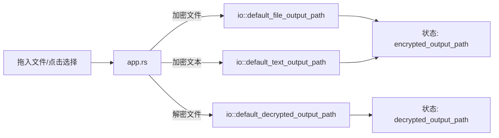

在 Encrust 的代码结构中，`io.rs` 是连接图形界面与密码学核心的桥梁。它不负责加密算法本身，也不渲染任何控件，而是把「文件从哪里来、到哪里去」这一职责单独收敛到一个不到 50 行的模块里。对于初学者来说，这种**按职责切分模块**的做法是一个很好的参考：当需求变更时，比如从「一次性读入内存」升级为「流式分块处理」，只需改动这一处即可，无需在 UI 代码中翻找散落的 `fs::read` 或 `fs::write` 调用。

Sources: [io.rs](src/io.rs#L1-L48)

## 文件读写的极简封装

`io.rs` 对外只暴露两个 I/O 原语：`read_file` 与 `write_file`。它们分别是对标准库 `std::fs::read` 和 `std::fs::write` 的薄包装，签名如下：

- `read_file(path: &Path) -> io::Result<Vec<u8>>`
- `write_file(path: &Path, data: &[u8]) -> io::Result<()>`

之所以不直接使用标准库函数，是为了在架构上预留**替换点**。当前版本为了教学简洁，选择一次性把文件读入内存；注释中明确说明，大文件场景下更理想的做法是流式读取和加密，但 AES-GCM 的认证标签处理会让示例复杂度陡增，因此 v1 保持简单。初学者可以从中理解一个工程原则：**先让代码跑通，再把复杂度隔离到可替换的边界上**。

Sources: [io.rs](src/io.rs#L5-L16)

## 默认输出路径的三类策略

Encrust 的加密与解密流程都支持「用户手动指定保存位置」和「使用默认路径」两种模式。当用户没有显式选择输出位置时，`io.rs` 中的三个路径生成函数会自动给出合理建议。它们覆盖了三种典型输入场景，核心设计目标是**不覆盖用户已有文件、保留原始文件信息、降低操作步骤**。

| 函数 | 适用场景 | 命名策略 | 存放位置 |
|---|---|---|---|
| `default_file_output_path` | 加密本地文件 | 原文件名 + `.encrust` | 与原文件同级目录 |
| `default_text_output_path` | 加密手动输入的文本 | 固定名 `encrypted-text.encrust` | 当前工作目录 |
| `default_decrypted_output_path` | 解密 `.encrust` 文件 | `decrypted-` + 原文件名（或兜底名） | 与加密文件同级目录 |

`default_file_output_path` 的实现直接把 `.encrust` 追加到 `OsString` 尾部，例如 `/tmp/report.pdf` 会变成 `/tmp/report.pdf.encrust`。这种做法既保留了原始扩展名信息，又通过新扩展名明确标识了文件格式。`default_text_output_path` 没有源文件可以参考，因此退而求其次，使用固定文件名并放在当前工作目录。`default_decrypted_output_path` 则更为谨慎：它从加密文件头部解析出的原文件名中读取信息，并在前面加上 `decrypted-` 前缀，防止直接覆盖用户电脑上可能仍然存在的原始文件；如果头部没有记录原文件名，则回退到 `decrypted-output`。

Sources: [io.rs](src/io.rs#L18-L47)

### 路径生成在应用中的调用链路

当用户在界面上切换输入模式、选择文件或拖入文件时，应用状态会同步更新默认输出路径。以下 Mermaid 图展示了这些调用关系：

具体来说，当用户通过系统文件选择器选中一个文件后，`render_file_encrypt_input` 会立即把 `selected_file` 和 `encrypted_output_path` 同时写入状态。同理，在拖拽捕获逻辑 `capture_dropped_files` 中，一旦检测到拖入的是文件且当前处于加密模式，也会调用 `default_file_output_path` 预设保存位置。这种「**输入确认即预填输出**」的交互设计，减少了用户的点击次数。

Sources: [app.rs](src/app.rs#L185-L203), [app.rs](src/app.rs#L311-L316)

## 与密码学模块的协同

在真正的加密/解密操作触发后，`io.rs` 的两个读写原语才登场。以加密流程为例，`save_encrypted_file` 先调用 `load_active_plaintext` 读取原始文件内容（或把文本转成 bytes），再交给 `crypto::encrypt_bytes` 生成密文，最后由 `io::write_file` 落盘。解密流程则是 `io::read_file` 读取 `.encrust` 文件，交给 `crypto::decrypt_bytes` 解析头部并解密，再根据结果类型决定是展示文本还是准备保存文件。

这里可以看到清晰的分层：UI 层负责收集用户输入和密码、`crypto` 层负责加解密和头部格式、`io` 层负责字节与磁盘之间的搬运。初学者在阅读代码时，可以顺着这个**输入 → 处理 → 输出**的线性链条快速定位问题。

Sources: [app.rs](src/app.rs#L535-L567), [app.rs](src/app.rs#L607-L629)

## 设计取舍与扩展方向

当前 `io.rs` 的设计体现了「教学优先」的取舍。所有数据都通过 `Vec<u8>` 在内存中传递，这意味着加密一个 1 GB 的视频文件时，程序会同时持有原文和密文两份全量内存。对于个人日常小文件加密工具而言，这通常够用；但如果要处理大文件，就需要引入流式读写和分块 AES-GCM 加密。

此外，路径处理全部采用标准库的 `Path` 与 `PathBuf`，没有引入任何第三方路径库。`default_decrypted_output_path` 中对 `parent()` 使用了 `unwrap_or_else(|| Path::new("."))`，确保即使路径没有父目录也能安全回退到当前目录。这类**防御式的小细节**虽然增加了几行代码，却避免了在边缘场景下出现 panic。

Sources: [io.rs](src/io.rs#L40-L46)

## 小结

`io.rs` 是整个项目中最小的模块之一，但它承担的职责非常明确：为上层提供与文件系统交互的统一入口，并封装「不覆盖、不丢失信息」的默认路径策略。初学者可以从中学习到两点：第一，**把 I/O 操作收敛到独立模块**，便于后续替换为异步或流式实现；第二，**默认路径的命名要体现语义**，通过扩展名或前缀让用户一眼看出文件的来源与状态。如果你希望深入了解这些 I/O 函数在完整加解密流程中的位置，可以继续阅读 [加密工作流 UI：文件选择、文本输入、输出路径与操作触发](10-jia-mi-gong-zuo-liu-ui-wen-jian-xuan-ze-wen-ben-shu-ru-shu-chu-lu-jing-yu-cao-zuo-hong-fa) 和 [解密工作流 UI：加密文件输入、结果展示与文件保存](11-jie-mi-gong-zuo-liu-ui-jia-mi-wen-jian-shu-ru-jie-guo-zhan-shi-yu-wen-jian-bao-cun)。