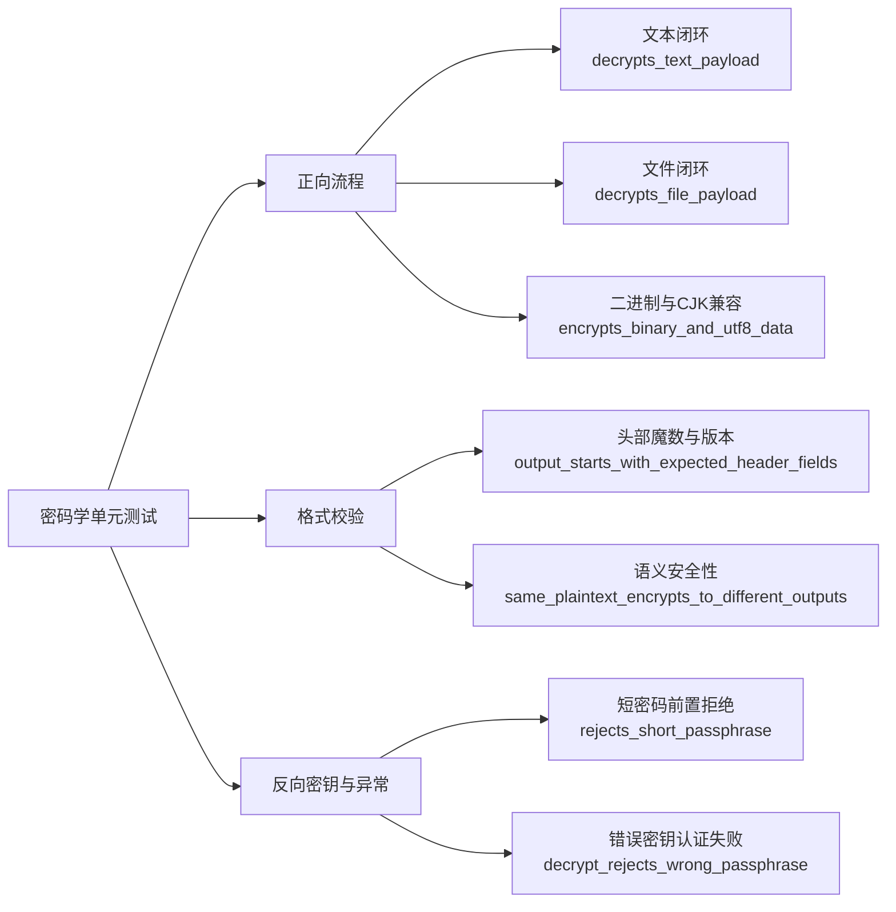

密码学模块的测试不能仅停留在"能跑通"的层面。由于加密结果具有非确定性（salt 与 nonce 随机生成），且错误密钥不会产生可识别的异常明文而是直接触发认证失败，测试设计必须覆盖三个维度：正向的加密-解密闭环、反向的错误密钥与短密码防御、以及自定义二进制格式的字段级校验。Encrust 在 `crypto.rs` 底部通过 `#[cfg(test)]` 内联模块组织了 7 个单元测试，全部基于 Rust 标准测试框架，无需额外 dev-dependencies，即可在编译期与运行期为密码学核心提供回归保护。
Sources: [crypto.rs](src/crypto.rs#L293-L415)

以下概念图展示了 Encrust 密码学单元测试的三大分类及其覆盖目标。每个分类下包含具体的测试函数，子节点描述了该测试验证的核心断言。

三个维度共覆盖 7 个测试函数，与核心函数的映射关系如下表所示。

| 测试函数 | 所属维度 | 核心断言 | 被测函数 |
|---------|---------|---------|---------|
| `rejects_short_passphrase` | 反向/异常 | `matches!(err, PassphraseTooShort)` | `validate_passphrase` |
| `output_starts_with_expected_header_fields` | 格式校验 | 逐字节头部字段相等 + 长度大于最小头部长度 | `encrypt_bytes` / `build_header` |
| `same_plaintext_encrypts_to_different_outputs` | 格式校验/密码学正确性 | `assert_ne!(first, second)` | `encrypt_bytes`（依赖 `OsRng`） |
| `encrypts_binary_and_utf8_data` | 正向流程 | `assert!(...is_ok())` | `encrypt_bytes` |
| `decrypts_text_payload` | 正向流程 | `kind == Text` 且 `plaintext` 字节一致 | `encrypt_bytes` + `decrypt_bytes` |
| `decrypts_file_payload_with_original_name` | 正向流程 | `kind == File` 且文件名与明文恢复正确 | `encrypt_bytes` + `decrypt_bytes` |
| `decrypt_rejects_wrong_passphrase` | 反向/异常 | `matches!(err, Decryption)` | `decrypt_bytes` |

Sources: [crypto.rs](src/crypto.rs#L297-L414), [crypto.rs](src/crypto.rs#L76-L82), [crypto.rs](src/crypto.rs#L88-L124), [crypto.rs](src/crypto.rs#L131-L157)

## 正向流程：加密-解密闭环验证

正向流程测试验证加密与解密函数在合法输入下能否构成无损闭环。`decrypts_text_payload` 将字符串 `"hello rust"` 以 `ContentKind::Text` 加密后立即解密，断言返回的 `kind` 为 `Text` 且 `plaintext` 字节序列与原输入完全一致。`decrypts_file_payload_with_original_name` 则进一步验证 `ContentKind::File` 分支：除了比对明文 `"file bytes"`，还检查 `file_name` 字段是否正确恢复为 `"report.pdf"`，这同时验证了 `build_header` 对文件名长度的编码与 `parse_header` 的解码对称性。`encrypts_binary_and_utf8_data` 不执行解密，而是验证加密函数的输入耐受性：包含非法 UTF-8 序列的二进制数组 `[0_u8, 159, 146, 150, 255, 10]` 与包含 CJK 字符的 `"你好，Rust encryption!"` 均能被 `encrypt_bytes` 正常接受，说明加密层对输入仅做字节级处理，不依赖文本编码假设。
Sources: [crypto.rs](src/crypto.rs#L368-L382), [crypto.rs](src/crypto.rs#L384-L399), [crypto.rs](src/crypto.rs#L343-L366), [crypto.rs](src/crypto.rs#L88-L124), [crypto.rs](src/crypto.rs#L131-L157), [crypto.rs](src/crypto.rs#L159-L185), [crypto.rs](src/crypto.rs#L195-L240)

## 格式校验：头部结构与密码学不变量

格式校验测试确保 Encrust 自定义二进制格式的结构稳定性与密码学安全性不变量。`output_starts_with_expected_header_fields` 对 `encrypt_bytes` 的输出进行逐字节切片断言：前 7 字节等于 `MAGIC`（`b"ENCRUST"`），随后依次为 `VERSION`（1）、`KDF_ARGON2ID`（1）、`CIPHER_AES_256_GCM`（1）、`CONTENT_TEXT`（2），并验证总长度严格大于 `MIN_HEADER_LEN`。这组断言将文件格式规范（参见 [加密文件格式设计：魔数、头部结构与 AAD 认证](4-jia-mi-wen-jian-ge-shi-she-ji-mo-shu-tou-bu-jie-gou-yu-aad-ren-zheng)）转化为可自动回归的代码约束。`same_plaintext_encrypts_to_different_outputs` 则从密码学角度验证输出的不可预测性：使用相同明文、相同密码短语连续加密两次，两次完整输出通过 `assert_ne!` 判定为不相等，因为 `OsRng` 每次都会重新填充 16 字节 salt 与 12 字节 nonce；若此测试失败，意味着随机源失效或 salt/nonce 被错误复用，将直接破坏 AES-256-GCM 的语义安全性。
Sources: [crypto.rs](src/crypto.rs#L304-L320), [crypto.rs](src/crypto.rs#L322-L341), [crypto.rs](src/crypto.rs#L12-L21), [crypto.rs](src/crypto.rs#L39)

## 反向密钥与异常：错误输入的防御边界

反向测试验证模块在面对非法输入时能否正确进入错误分支，而非返回乱码或 panic。`rejects_short_passphrase` 传入 5 字符的 `"short"`，触发 `validate_passphrase` 的前置校验，通过 `expect_err` 与 `matches!` 双重断言确认错误类型为 `CryptoError::PassphraseTooShort`，其中 `MIN_PASSPHRASE_CHARS` 固定为 8 个 Unicode 字符。`decrypt_rejects_wrong_passphrase` 则模拟更危险的场景：攻击者持有加密文件但使用错误密码 `"wrong horse battery staple"` 尝试解密。由于 AES-GCM 的认证标签与密钥强绑定，错误派生出的密钥会使认证解密失败，`aes-gcm` crate 内部返回错误后被映射为 `CryptoError::Decryption`，测试通过 `matches!` 验证该映射准确无误。这一测试的关键价值在于证明 Encrust 不会向调用者返回任何部分解密的"乱码"数据，而是干净地返回结构化错误，UI 层可据此向用户提示"密钥错误或文件被篡改"（参见 [密码学校验与错误处理策略（CryptoError 枚举设计）](8-mi-ma-xue-xiao-yan-yu-cuo-wu-chu-li-ce-lue-cryptoerror-mei-ju-she-ji)）。
Sources: [crypto.rs](src/crypto.rs#L297-L302), [crypto.rs](src/crypto.rs#L401-L414), [crypto.rs](src/crypto.rs#L54-L70), [crypto.rs](src/crypto.rs#L76-L82)

## 测试工程实践与扩展方向

Encrust 的测试模块采用内联（inline）风格组织于 `#[cfg(test)]` 代码块中，这是 Rust 项目的惯用做法：测试代码与实现同文件共存，修改密码学逻辑时无需切换上下文即可同步更新测试。值得注意的是，`Cargo.toml` 未声明任何 dev-dependencies，全部 7 个测试仅依赖 Rust 标准测试框架与项目自身的生产依赖，以最小依赖保持编译速度与供应链简洁。断言风格上，成功路径使用 `unwrap()` 快速解包（失败时 panic 信息可直接定位问题），错误路径则组合 `expect_err` / `unwrap_err` 与 `assert!(matches!(...))` 实现精确的错误变体验证。当前测试已覆盖核心流程，但仍有可扩展空间：例如对 `parse_header` 直接注入篡改后的魔数、不支持的版本号或截断数据，以验证 `InvalidFormat` 与 `UnsupportedVersion` 分支；或通过 `std::fs` 读写临时文件覆盖 `io.rs` 与密码学模块的集成边界。
Sources: [crypto.rs](src/crypto.rs#L293-L415), [Cargo.toml](Cargo.toml#L1-L14)

如需了解项目如何在不同操作系统上打包这些经过测试的制品，可继续阅读 [跨平台构建脚本（macOS / Linux / Windows）与 release 构建](20-kua-ping-tai-gou-jian-jiao-ben-macos-linux-windows-yu-release-gou-jian)；若关注如何将这些测试纳入持续集成流水线，请参考 [扩展方向：GitHub Actions 多平台 CI 与流式加密展望](21-kuo-zhan-fang-xiang-github-actions-duo-ping-tai-ci-yu-liu-shi-jia-mi-zhan-wang)。