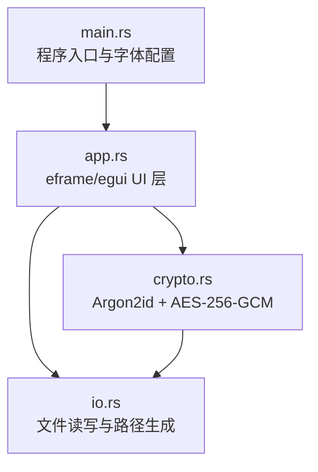
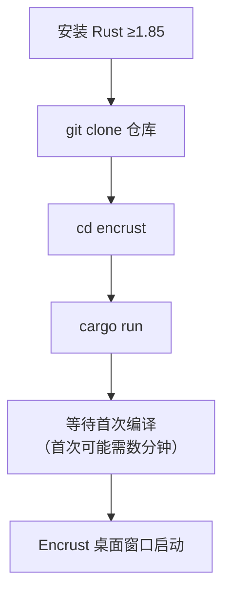

Encrust 是一款基于 Rust 与 eframe/egui 构建的跨平台桌面加密应用，面向需要安全加密文件或文本的个人用户。本文档面向初次接触本项目的开发者，系统讲解如何从源码开始完成环境搭建、开发调试运行以及发布构建。你无需预先掌握密码学或 GUI 编程知识，只需具备基础的命令行操作能力即可跟随本文完成全部流程。

Sources: [Cargo.toml](Cargo.toml#L1-L14), [README.md](README.md#L1-L4)

## 前置条件

Encrust 采用 Rust 2024 Edition 编写，要求本地 Rust 编译器版本不低于 **1.85.0**。若你的系统中尚未安装 Rust，请通过官方 rustup 工具完成安装。安装结束后，执行 `rustc --version` 与 `cargo --version` 确认工具链已就绪。由于项目依赖的 eframe 和 rfd 等库需要调用操作系统原生 API，不同平台存在差异化的前置要求：macOS 用户通常只需确保已安装 Xcode Command Line Tools；Windows 用户需要 Visual Studio 的 MSVC 构建工具；Linux 用户则可能需要根据发行版安装显示服务器相关的开发头文件，以便顺利完成 eframe 的链接。

Sources: [Cargo.toml](Cargo.toml#L3-L11), [src/main.rs](src/main.rs#L1-L8)

下表汇总了各平台的准备工作：

| 平台 | 必要工具 | 额外备注 |
|------|---------|---------|
| macOS | Rust + Xcode Command Line Tools | 大多数系统库已预装，通常可直接编译 |
| Linux | Rust + 发行版开发库 | 视桌面环境可能需要 wayland 或 x11 相关开发包 |
| Windows | Rust + MSVC Build Tools | 安装 Visual Studio 时勾选 "使用 C++ 的桌面开发" |

## 获取项目源码

通过 Git 将仓库克隆到本地，随后进入项目根目录即可开始操作。项目遵循标准 Rust 二进制项目布局，源码与配置的组织方式简洁明了。

Sources: [Cargo.toml](Cargo.toml#L1-L14)

## 项目结构速览

在开始编译前，先了解代码仓库的组织方式有助于在编译出错时快速定位问题。`Cargo.toml` 声明包元数据与外部依赖；`src/main.rs` 作为唯一程序入口，初始化 eframe 运行环境并配置 CJK 字体回退；`src/app.rs` 承载全部图形界面状态与交互逻辑；`src/crypto.rs` 实现 Argon2id 密钥派生与 AES-256-GCM 加解密协议；`src/io.rs` 提供文件读写的薄封装及默认路径策略。整体依赖关系为 UI 层调用密码学核心，二者共同依赖 I/O 工具层。

Sources: [src/main.rs](src/main.rs#L1-L12), [src/app.rs](src/app.rs#L1-L10), [src/crypto.rs](src/crypto.rs#L1-L10), [src/io.rs](src/io.rs#L1-L10)

## 运行开发版本

运行开发版本只需一条命令。在项目根目录执行 `cargo run`，Cargo 会自动解析 `Cargo.toml` 中的依赖声明，下载并编译 aes-gcm、argon2、eframe、rfd 等 crate。由于 eframe 及其底层依赖（如 winit、accesskit）包含大量平台相关代码，首次完整编译可能需要数分钟；后续修改源码后的增量编译则会显著提速。编译完成后，一个尺寸固定为 900×680 像素且不可调整大小的 Encrust 窗口将会弹出，你可以立即体验拖拽加密或文本加密功能。

Sources: [README.md](README.md#L17-L22), [src/main.rs](src/main.rs#L6-L18)

## 运行测试

在继续探索功能之前，建议先运行项目自带的单元测试以验证密码学模块的正确性。执行 `cargo test` 将编译并运行 `src/crypto.rs` 中 `#[cfg(test)]` 模块下的全部测试用例，覆盖正向加解密流程、错误密钥拒绝以及文件格式校验等场景。测试全部通过意味着本地编译环境完整且密码学逻辑符合预期，可作为继续开发的信心基线。

Sources: [README.md](README.md#L23-L28), [src/crypto.rs](src/crypto.rs#L293-L415)

## 构建发布版本

当开发调试完成，需要分发或长期使用时，应使用 `--release` 模式进行构建。Release 构建会启用 LLVM 优化，生成的可执行文件体积更小、运行速度更快。项目根目录的 `scripts/` 文件夹内提供了三个平台的快捷脚本，它们本质上都是在对应操作系统本机执行 `cargo build --release`，但封装为独立脚本有助于后续扩展签名、打包等流程。

Sources: [scripts/build-macos.sh](scripts/build-macos.sh#L1-L5), [scripts/build-linux.sh](scripts/build-linux.sh#L1-L5), [scripts/build-windows.ps1](scripts/build-windows.ps1#L1-L4), [README.md](README.md#L29-L50)

| 脚本 | 适用平台 | 核心命令 | 执行方式 |
|------|---------|---------|---------|
| `scripts/build-macos.sh` | macOS | `cargo build --release` | `chmod +x` 后执行 `./scripts/build-macos.sh` |
| `scripts/build-linux.sh` | Linux | `cargo build --release` | `chmod +x` 后执行 `./scripts/build-linux.sh` |
| `scripts/build-windows.ps1` | Windows | `cargo build --release` | PowerShell 中执行 `.\scripts\build-windows.ps1` |

在 macOS 和 Linux 上，若首次执行脚本时遇到 "Permission denied" 错误，请先通过 `chmod +x scripts/build-*.sh` 赋予可执行权限。无论使用哪个脚本，最终优化后的可执行文件都会输出到 Cargo 标准发布目录 `target/release/encrust`（Windows 下为 `target/release/encrust.exe`）。你也可以跳过脚本，直接在任何支持的平台上运行 `cargo build --release` 获得相同结果。

Sources: [scripts/build-macos.sh](scripts/build-macos.sh#L1-L5), [scripts/build-linux.sh](scripts/build-linux.sh#L1-L5), [README.md](README.md#L29-L50)

## 常见问题排查

| 现象 | 可能原因 | 解决思路 |
|------|---------|---------|
| 编译报错 "edition 2024 is unstable" 或类似信息 | Rust 版本低于 1.85 | 执行 `rustup update` 升级工具链 |
| Linux 上 eframe 编译失败，提示链接错误 | 缺少显示服务器开发库 | 根据发行版安装 wayland 或 x11 相关开发包 |
| 执行 shell 脚本时提示 Permission denied | 脚本未设置可执行位 | 运行 `chmod +x scripts/build-*.sh` |
| 运行 `cargo run` 后无窗口弹出 | 可能处于无图形界面的远程终端 | 确保在具备显示服务器的桌面会话中执行 |

## 下一步

按照本文流程，你应该已经成功在本地运行并构建 Encrust。接下来，可以深入阅读项目内部的实现细节。建议的浏览顺序为：先通过 [整体架构：模块职责划分与数据流向](3-zheng-ti-jia-gou-mo-kuai-zhi-ze-hua-fen-yu-shu-ju-liu-xiang) 建立宏观视角；若对图形界面感兴趣，可继续阅读 [eframe/egui 应用骨架：NativeOptions、App trait 与窗口配置](9-eframe-egui-ying-yong-gu-jia-nativeoptions-app-trait-yu-chuang-kou-pei-zhi)；若希望理解加密协议，则推荐从 [加密文件格式设计：魔数、头部结构与 AAD 认证](4-jia-mi-wen-jian-ge-shi-she-ji-mo-shu-tou-bu-jie-gou-yu-aad-ren-zheng) 开始，逐步深入密码学模块的各篇文档。