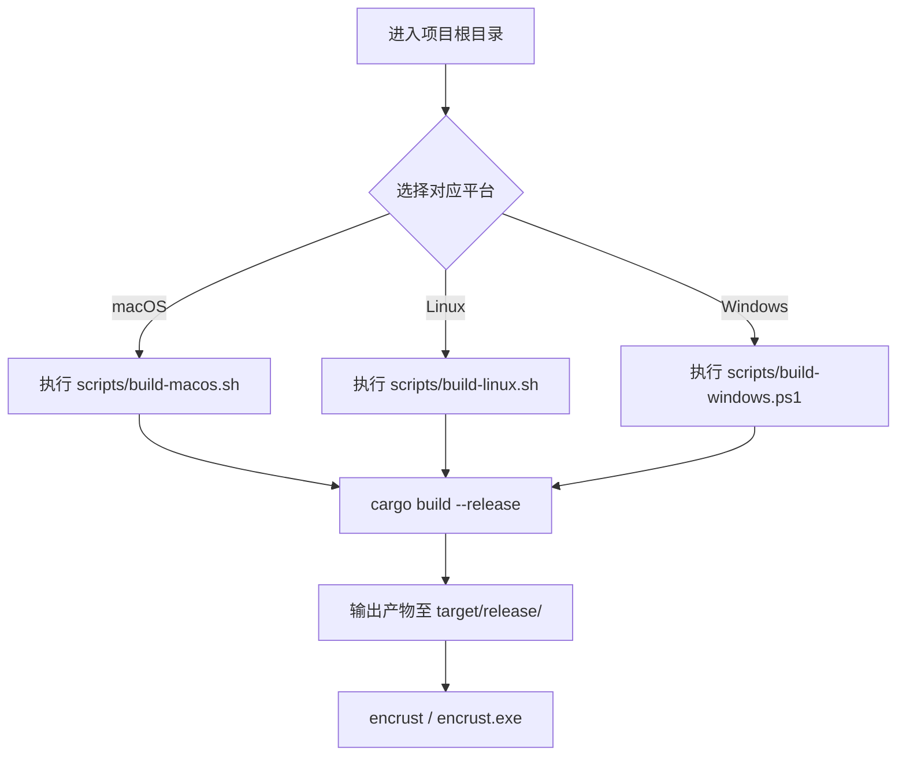

当你使用 `cargo run` 完成日常开发后，最终交付给用户的是经过优化的 release 二进制文件。Encrust 为三个主流桌面操作系统提供了开箱即用的构建脚本，让初学者不必记忆冗长的命令差异，即可在本机产出可独立运行的应用。本文将介绍这些脚本的使用方法、内部的错误保护机制，以及 release 构建与日常调试构建的本质区别。

## Debug 构建与 Release 构建的区别

在 Rust 项目中，`cargo run` 默认触发的是 debug 模式。这种模式牺牲运行性能以换取更快的编译速度，生成的二进制文件包含大量调试符号且未经 LLVM 深度优化，体积较大、执行效率较低。相反，`cargo build --release` 会启用编译器的最高优化级别（`opt-level = 3`）、移除调试符号、并进行更激进的内联与代码清理，最终产出的程序启动更快、体积更小、运行时行为更接近最终交付形态。对于 Encrust 这类带有图形界面的桌面应用，release 构建能显著改善窗口响应与加密操作的执行速度。

Sources: [Cargo.toml](Cargo.toml#L1-L14)

## 脚本总览与跨平台设计

Encrust 在 `scripts/` 目录下维护了三份平台专属脚本。它们的核心逻辑完全一致——都是调用 `cargo build --release`——但脚本语言和错误处理机制严格遵循了各平台的工程惯例，方便后续扩展平台特有的打包逻辑（如 macOS 的 `.app` 目录、Windows 的签名流程或 Linux 的 `.deb` 打包）。

| 平台 | 脚本路径 | 解释器 | 核心命令 | 错误处理机制 |
|---|---|---|---|---|
| macOS | `scripts/build-macos.sh` | Bash | `cargo build --release` | `set -euo pipefail` |
| Linux | `scripts/build-linux.sh` | Bash | `cargo build --release` | `set -euo pipefail` |
| Windows | `scripts/build-windows.ps1` | PowerShell | `cargo build --release` | `$ErrorActionPreference = "Stop"` |

Sources: [scripts/build-macos.sh](scripts/build-macos.sh#L1-L5), [scripts/build-linux.sh](scripts/build-linux.sh#L1-L5), [scripts/build-windows.ps1](scripts/build-windows.ps1#L1-L4)

这种"同名异构"的设计体现了跨平台工程中的一个常见模式：用平台原生的脚本外壳包裹统一的构建内核。初学者在熟悉基本流程后，可以直接在这些脚本中追加平台特有的后置步骤，而无需改动 Rust 源码或 Cargo 配置。

## 构建流程



## 各平台使用指南

### macOS

打开终端并进入项目根目录，直接运行脚本即可：

```bash
./scripts/build-macos.sh
```

若系统提示"Permission denied"，说明脚本缺少执行权限，可通过以下命令赋予：

```bash
chmod +x ./scripts/build-macos.sh
```

构建完成后，产物为 `target/release/encrust`，这是一个原生的 Mach-O 可执行文件。你可以直接在终端运行，或在 Finder 中双击启动。由于 macOS 的 Gatekeeper 安全机制，首次运行未签名的本地二进制文件时，可能需要前往"系统设置 > 隐私与安全性"中手动允许。

Sources: [scripts/build-macos.sh](scripts/build-macos.sh#L1-L5), [README.md](README.md#L29-L40)

### Linux

在终端中执行：

```bash
./scripts/build-linux.sh
```

同样，如遇权限问题，先运行 `chmod +x ./scripts/build-linux.sh`。构建产物为 `target/release/encrust` ELF 可执行文件。需要注意的是，Encrust 依赖 `eframe` 提供的原生图形界面，因此运行环境必须已安装相应的 Wayland 或 X11 显示库以及 GTK 相关依赖，否则程序启动时会因无法初始化窗口系统而报错。

Sources: [scripts/build-linux.sh](scripts/build-linux.sh#L1-L5)

### Windows

在 PowerShell 中进入项目根目录并执行：

```powershell
.\scripts\build-windows.ps1
```

构建产物为 `target/release/encrust.exe`。Windows 的 PowerShell 默认执行策略（Execution Policy）可能会阻止运行本地脚本。如果遇到权限错误，可在当前 PowerShell 会话中临时放宽策略（该设置仅对当前窗口生效，不会影响系统安全）：

```powershell
Set-ExecutionPolicy -ExecutionPolicy RemoteSigned -Scope Process
```

Sources: [scripts/build-windows.ps1](scripts/build-windows.ps1#L1-L4)

## 脚本中的错误处理机制

初学者在手动执行多步命令时，常会遇到"某一步失败，但后续步骤继续执行"或"错误被管道吞掉"的困惑。Encrust 的三份脚本通过各自平台的标准机制，在开头就建立了严格的"遇错即停"契约，防止半成品或误导性输出继续传播。

在 macOS 和 Linux 的 Bash 脚本中，`set -euo pipefail` 是一个经典的防御性编程组合。`set -e` 确保任何命令返回非零退出码时立即终止整个脚本；`set -u` 使得引用未定义的变量时直接报错，避免拼写错误导致的静默逻辑错误；`set -o pipefail` 则保证管道链中任何一个环节失败都会让整个管道返回失败状态，而非仅保留最后一个命令的返回值。在 Windows 的 PowerShell 脚本中，`$ErrorActionPreference = "Stop"` 达到了完全一致的效果：一旦任何 cmdlet 或外部命令执行失败，脚本会立即抛出异常并停止，而不是默默继续。

Sources: [scripts/build-macos.sh](scripts/build-macos.sh#L2-L3), [scripts/build-linux.sh](scripts/build-linux.sh#L2-L3), [scripts/build-windows.ps1](scripts/build-windows.ps1#L1-L2)

## 构建产物与分发说明

无论在哪一个平台执行构建脚本，Rust 编译系统都会将最终产物统一输出到项目根目录下的 `target/release/` 目录中。不同平台的产物名称与格式如下：

| 平台 | 产物路径 | 文件格式 |
|---|---|---|
| macOS | `target/release/encrust` | Mach-O 64-bit 可执行文件 |
| Linux | `target/release/encrust` | ELF 64-bit 可执行文件 |
| Windows | `target/release/encrust.exe` | PE32+ 可执行文件 |

这些产物已经与 debug 模式下的 `target/debug/` 文件彻底分离，彼此不会互相覆盖。需要提醒的是，虽然 release 二进制已经过高度优化，但它仍然动态链接了平台底层的图形与系统库（例如 Linux 上的 GTK/Wayland、Windows 上的 WebView2 运行时、macOS 上的 Cocoa 框架）。如果需要生成真正"零依赖"的可执行文件，则需要引入静态链接或容器化分发等更高级的构建策略。

Sources: [Cargo.toml](Cargo.toml#L1-L2), [README.md](README.md#L29-L40)

## 自定义 Release Profile（进阶）

当前项目的 `Cargo.toml` 并未声明自定义的 `[profile.release]`，完全依赖 Rust 工具链的保守默认值。对于希望进一步压缩体积或榨取性能的开发者，可以在 `Cargo.toml` 中添加 release profile 配置。以下是几个对初学者友好且效果明显的选项：

| 配置项 | 作用 | 适用场景 |
|---|---|---|
| `lto = true` | 开启链接时优化，跨 crate 边界内联代码，显著减小体积 | 需要分发小型独立二进制文件 |
| `codegen-units = 1` | 强制单代码生成单元，牺牲编译时间以换取更优运行时性能 | 对冷启动速度有极致要求 |
| `strip = true` | 自动剥离调试符号表与冗余元数据 | 正式发布且无需后续调试 |

例如，若想在 `Cargo.toml` 中追求极致的体积优化，可追加如下配置：

```toml
[profile.release]
opt-level = "z"
lto = true
strip = true
```

不过，在学习和日常开发阶段，建议保持默认的 release profile 不变，因为更激进的优化会显著增加编译等待时间，且可能使调试堆栈信息变得难以理解。

Sources: [Cargo.toml](Cargo.toml#L1-L14)

## 小结与延伸阅读

Encrust 的跨平台构建脚本采用了"统一内核、平台外壳"的简洁设计：三份脚本最终都汇聚到 `cargo build --release` 这一核心命令，但通过原生脚本语言和严格的错误处理机制，为后续扩展平台专属打包流程预留了清晰的入口。理解 debug 与 release 的本质差异，是每一位 Rust 开发者从"编写代码"走向"交付软件"的关键一步。

如果你已经掌握了本机构建流程，并希望在云端实现自动化的多平台并行构建与产物发布，可以继续阅读 [扩展方向：GitHub Actions 多平台 CI 与流式加密展望](21-kuo-zhan-fang-xiang-github-actions-duo-ping-tai-ci-yu-liu-shi-jia-mi-zhan-wang)。如果你想回顾项目的模块划分与数据流向，也可以返回 [整体架构：模块职责划分与数据流向](3-zheng-ti-jia-gou-mo-kuai-zhi-ze-hua-fen-yu-shu-ju-liu-xiang) 加深理解。