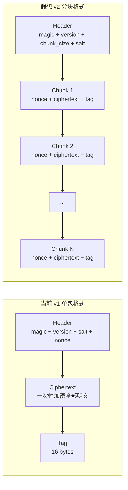

Encrust 作为学习导向的桌面加密应用，当前在构建交付和密码学工程两个维度均保留了明确的扩展接口。构建侧的三套脚本仅封装了最基础的 `cargo build --release` 调用，README 中已明确指出后续建议通过 GitHub Actions 实现分平台构建；密码学侧则采用全内存模型，`encrypt_bytes` 与 `decrypt_bytes` 均以 `&[u8]` 与 `Vec<u8>` 为接口，对小文件和文本场景足够简洁，但对大文件处理存在天然的内存天花板。本文从这两个维度出发，剖析当前架构的边界，并给出可落地的扩展路径。

Sources: [README.md](README.md#L49), [crypto.rs](src/crypto.rs#L88-L157), [io.rs](src/io.rs#L1-L11)

## 当前基础设施的边界

在构建交付层面，项目目前依赖 `scripts/` 目录下的三个脚本完成 release 构建：`build-macos.sh`、`build-linux.sh` 与 `build-windows.ps1`。三者的实现完全一致，都是调用 `cargo build --release`，没有涉及目标三元组配置、交叉编译工具链、产物签名或打包格式。这意味着开发者需要在对应操作系统的物理机或虚拟机上手动执行构建，无法通过单一入口自动化产出多平台二进制文件。在密码学实现层面，`io::read_file` 直接调用 `fs::read` 将完整文件内容读入堆内存，`app.rs` 中的解密结果也以 `Option<Vec<u8>>` 形式驻留内存，直到用户点击保存。这种设计在示例项目中非常直观，但当面对数百兆乃至数吉字节的文件时，单次 `Vec` 分配可能导致内存耗尽或触发系统 OOM。

Sources: [build-macos.sh](scripts/build-macos.sh#L1-L5), [build-linux.sh](scripts/build-linux.sh#L1-L5), [build-windows.ps1](scripts/build-windows.ps1#L1-L4), [io.rs](src/io.rs#L6-L11), [app.rs](src/app.rs#L52)

## GitHub Actions 多平台 CI 架构设计

引入 GitHub Actions 的核心目标不是简单替代本地脚本，而是建立一条覆盖编译、测试、产物归档与版本分发的完整交付管线。由于 Encrust 依赖 `eframe` 和系统原生字体，不同平台的链接器和系统库差异较大，因此矩阵构建（matrix build）是最合理的起点。

### 矩阵构建策略

工作流可定义一个包含 `ubuntu-latest`、`macos-latest` 和 `windows-latest` 的构建矩阵。每个 job 的职责边界如下：Linux 环境负责生成面向 x86_64 的 ELF 可执行文件；macOS 环境除了 x86_64 外，还应通过 `cargo build --target aarch64-apple-darwin` 产出 Apple Silicon 版本，并最终利用 `lipo` 合并为通用二进制（universal binary）；Windows 环境则生成 x86_64 PE 可执行文件。对于测试阶段，三套平台均执行 `cargo test`，确保 `crypto` 模块的单元测试和跨平台文件路径逻辑在不同文件系统语义下行为一致。

| 平台 | 目标架构 | 关键动作 | 产物 |
|------|---------|---------|------|
| Ubuntu | x86_64-unknown-linux-gnu | 安装系统依赖、编译、测试 | `encrust-linux-x86_64` |
| macOS | x86_64 + aarch64 | 双目标编译、`lipo` 合并 | `encrust-macos-universal` |
| Windows | x86_64-pc-windows-msvc | MSVC 工具链、编译、测试 | `encrust-windows-x86_64.exe` |

### 缓存与产物分发

Rust 编译的中间产物体积庞大，应在工作流中引入 `Swatinem/rust-cache@v2`  action 对 `target/` 和 Cargo 注册表进行增量缓存，避免每次 CI 都从零构建依赖。构建成功后，使用 `actions/upload-artifact` 将各平台二进制文件上传为工作流产物；若事件类型为 tag push，则额外触发 Release Job，通过 `actions/download-artifact` 汇聚所有产物，调用 `softprops/action-gh-release` 创建带签名的 GitHub Release。这套流程可以将目前需要三台物理机或复杂交叉编译环境才能完成的操作，压缩为一次 `git push --tags` 触发的全自动流水线。

Sources: [build-macos.sh](scripts/build-macos.sh#L1-L5), [build-linux.sh](scripts/build-linux.sh#L1-L5), [build-windows.ps1](scripts/build-windows.ps1#L1-L4)

## 流式加密的架构挑战与展望

全内存模型的根本约束在于 `encrypt_bytes` 和 `decrypt_bytes` 的函数签名：输入是连续的 `&[u8]`，输出是连续的 `Vec<u8>`，这意味着调用方必须在加密前将完整明文加载到内存，解密后也要一次性持有全部明文。`io.rs` 中的注释也坦然承认了这一点——"大文件加密时更理想的做法是流式读取和加密，但 AES-GCM 的认证标签和错误处理会让示例复杂很多，所以 v1 保持简单"。要突破这一边界，需要同时解决密码学协议层和 UI 状态层的双重重构。

Sources: [crypto.rs](src/crypto.rs#L88-L124), [io.rs](src/io.rs#L6-L11)

### 格式层：从单包到分块

当前 `.encrust` 格式在 `MIN_HEADER_LEN` 之后紧跟完整的 AES-GCM ciphertext 和 16 字节认证标签（tag），这意味着整个密文必须作为一个整体进行 AEAD 解密，无法逐段消费。流式扩展需要在文件格式中引入**分块（chunked）**语义：在 header 之后记录 `chunk_size` 和 `total_chunks`，随后每个 chunk 独立携带自己的密文和认证标签，或使用一种支持在线 AEAD 的构造（例如基于 AES-GCM 的 STREAM 模式或分片 Poly1305）。这种设计的优势是解密器可以每次只从磁盘读取一个 chunk，解密后立即写入输出文件，维持恒定的内存占用；代价是文件体积会略微增加（每个 chunk 额外携带认证开销），且 `parse_header` 需要向后兼容地识别新版本格式。

以下概念图展示了当前单包格式与假想分块格式的结构差异：

### 实现层：I/O 与状态的重塑

如果底层格式支持分块，则 `io.rs` 中需要新增一对流式原语，例如 `EncryptingWriter` 和 `DecryptingReader`，它们内部持有一个固定大小的缓冲区，将 `std::io::Read` 或 `std::io::Write` 的调用转换为 chunk 级别的密码学操作。在 `app.rs` 中，`decrypted_file_bytes: Option<Vec<u8>>` 的状态字段将变得不再必要——解密流程可以直接将结果流式写入用户选定的目标路径，UI 只需要展示进度和解密完成状态，而无需把数吉字节的中间数据驻留在进程地址空间。这种改动会显著改变现有的错误处理模型：当前 `decrypt_bytes` 的失败是原子的，要么完全成功返回 `DecryptedPayload`，要么返回 `CryptoError`；而流式模式下，错误可能在任意 chunk 的 I/O 或认证阶段发生，需要设计一种可恢复或至少可准确报告进度的错误传播策略。

Sources: [crypto.rs](src/crypto.rs#L39-L40), [app.rs](src/app.rs#L52), [crypto.rs](src/crypto.rs#L131-L157)

### 密钥派生与内存安全不变量

值得注意的是，无论格式如何扩展，密钥派生流程和敏感数据清理策略应当保持不变。Argon2id 的内存困难特性本身就要求派生过程中分配一定量的内存，但这与明文数据的内存占用无关；`Zeroizing<[u8; KEY_LEN]>` 包裹的密钥在每次 chunk 处理完毕后仍需立即清理。因此，[密钥派生流程](5-mi-yao-pai-sheng-liu-cheng-argon2id-can-shu-xuan-ze-yu-zeroize-ling-hua-shi-jian) 和 [敏感数据清理策略](14-min-gan-shu-ju-qing-li-ce-lue-cao-zuo-wan-cheng-hou-de-zhuang-tai-zhong-zhi-yu-mi-yao-qing-chu) 中建立的实践可以作为流式重构的安全基线，无需推翻重来。

Sources: [crypto.rs](src/crypto.rs#L271-L291)

## 两个扩展方向的协同效应

GitHub Actions CI 与流式加密并非孤立的技术债，二者在工程化路径上存在显著的协同价值。流式重构涉及 `crypto`、`io`、`app` 三个模块的联动修改，且不同平台的文件系统缓冲行为和 I/O 性能差异较大；如果没有自动化 CI，开发者很难在本地验证分块加密在 macOS APFS、Linux ext4 和 Windows NTFS 上的表现是否一致。反之，CI 管线中如果仅构建空壳二进制而不扩展测试覆盖，则矩阵构建的价值也会被浪费。理想的演进顺序是：先建立 GitHub Actions 的基础矩阵和产物归档能力，为后续大文件重构提供跨平台回归测试基座；再在受控的分支上迭代 v2 分块格式，利用 CI 在不同平台上对数十兆乃至数百兆的测试文件进行压力验证。

Sources: [README.md](README.md#L49)

## 下一步阅读建议

若你希望深入理解当前密码学实现的完整细节，为流式扩展做知识储备，建议按以下顺序阅读：

- [加密文件格式设计：魔数、头部结构与 AAD 认证](4-jia-mi-wen-jian-ge-shi-she-ji-mo-shu-tou-bu-jie-gou-yu-aad-ren-zheng) — 理解 header 与 AAD 的绑定关系，这是分块格式向后兼容设计的起点。
- [AES-256-GCM 对称加密与解密的实现细节](6-aes-256-gcm-dui-cheng-jia-mi-yu-jie-mi-de-shi-xian-xi-jie) — 掌握当前 `encrypt_bytes` / `decrypt_bytes` 的完整逻辑。
- [跨平台构建脚本（macOS / Linux / Windows）与 release 构建](20-kua-ping-tai-gou-jian-jiao-ben-macos-linux-windows-yu-release-gou-jian) — 了解现有构建脚本的局限性，作为 CI 设计的对照基准。
- [文件读写封装与默认路径生成策略](18-wen-jian-du-xie-feng-zhuang-yu-mo-ren-lu-jing-sheng-cheng-ce-lue) — 理解当前 `io.rs` 的 API 边界，这是流式接口重构的直接上下文。