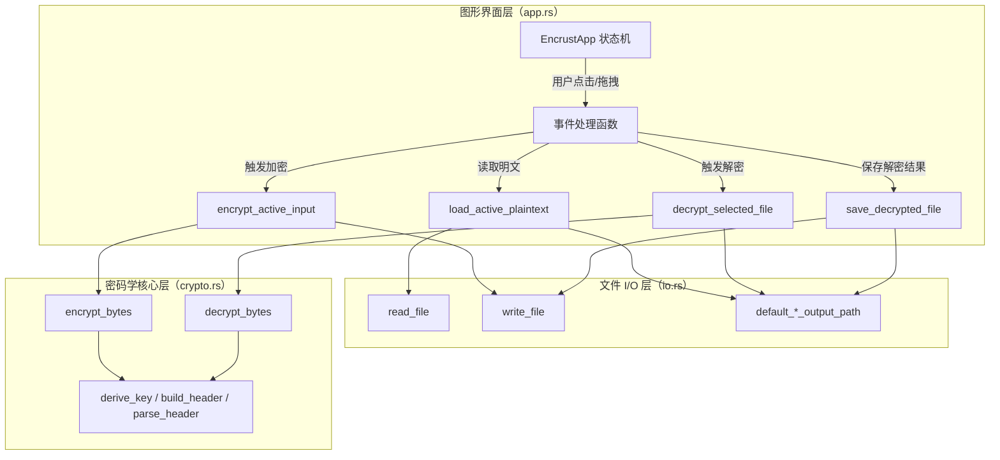
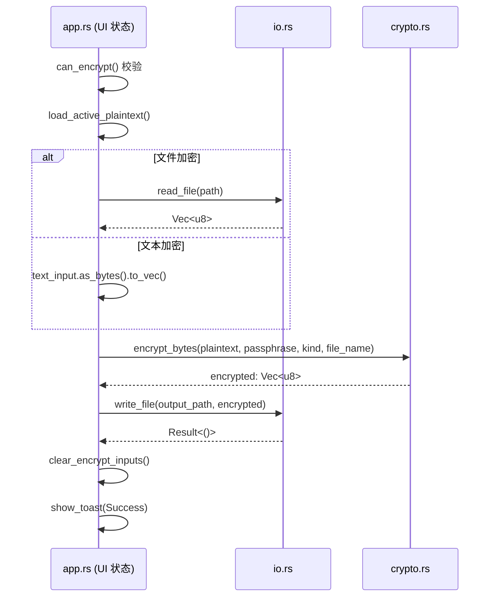
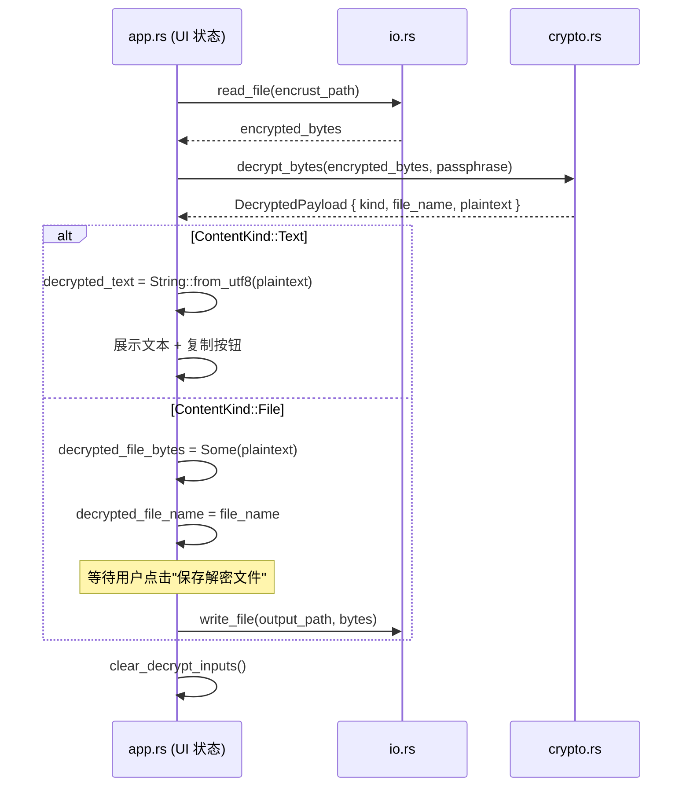

Encrust 是一个基于 Rust 与 egui 构建的桌面加密工具，整体采用**三层分离架构**：入口层负责应用初始化与字体配置，图形界面层负责状态管理与用户交互编排，密码学层负责纯粹的加解密运算，而 I/O 层则提供最小化的文件读写抽象。这种设计使得任何一层都可以被独立理解、测试或替换。本文将从模块边界、依赖关系与核心数据流三个维度展开说明，帮助你快速建立对代码库的全局认知。

## 模块职责与依赖关系

整个项目由四个源码模块构成，外加跨平台构建脚本。模块之间不存在循环依赖，依赖箭头始终从表现层指向能力层。

| 模块 | 源码文件 | 核心职责 | 对外依赖 |
|------|---------|---------|---------|
| 入口层 | `main.rs` | 声明子模块、配置 eframe 窗口参数、注册 CJK 字体回退、启动 `EncrustApp` | `app` |
| 图形界面层 | `app.rs` | 维护全部 UI 状态（`EncrustApp`）、渲染控件、捕获拖拽/点击事件、编排加密/解密工作流 | `crypto`、`io` |
| 密码学核心 | `crypto.rs` | 提供 `encrypt_bytes` / `decrypt_bytes`、Argon2id 密钥派生、自定义二进制头部（魔数/AAD）、格式校验与错误枚举 | 无内部模块依赖 |
| 文件 I/O | `io.rs` | 封装 `fs::read` / `fs::write`、生成默认输出路径（追加 `.encrust` 或 `decrypted-` 前缀） | 无内部模块依赖 |

从依赖方向可以看出，密码学核心与文件 I/O 是两个**无状态的能力模块**，不感知 egui 或任何平台 GUI 细节；图形界面层则像**编排器**，把用户事件翻译成对下层的顺序调用。这种单向依赖关系保证了核心逻辑可以在单元测试中直接覆盖，而无需模拟整个 GUI 运行时。

Sources: [main.rs](src/main.rs#L1-L62), [app.rs](src/app.rs#L1-L9), [Cargo.toml](Cargo.toml#L1-L14)

## 架构全景与分层模型

下图展示了 Encrust 从用户操作到磁盘写入的完整调用链。箭头表示数据或控制的传递方向，虚线表示依赖引入关系。

入口层 `main.rs` 位于所有层的上方，仅负责一次性初始化：它调用 `configure_fonts` 向 egui 注册中文字体候选列表，然后传入 `NativeOptions` 创建一个不可调整大小的 900×680 窗口，并将 `EncrustApp::default()` 挂载到 eframe 主循环中。自此之后，所有帧更新都由 `EncrustApp::update` 驱动。

Sources: [main.rs](src/main.rs#L9-L27), [app.rs](src/app.rs#L77-L181)

## 加密工作流的数据流向

当用户在加密面板完成输入并点击「加密并保存」后，数据会经历**读取 → 派生密钥 → 构建头部 → 加密 → 写入**五个阶段。理解这条链路的边界，有助于在后续章节中定位具体实现。

1. **界面状态聚合**：`app.rs` 中的 `can_encrypt` 先校验输入文件/文本、输出路径、密钥长度是否齐全。只有三者齐备，按钮才会进入可点击状态。
2. **明文加载**：`load_active_plaintext` 根据当前是「文件加密」还是「文本加密」决定数据来源——前者调用 `io::read_file` 读取完整文件到内存，后者直接把 `String` 转 `Vec<u8>`。
3. **密码学运算**：`crypto::encrypt_bytes` 内部依次完成：校验密钥长度、生成随机 salt/nonce、Argon2id 密钥派生、构建含魔数与 AAD 的头部、AES-256-GCM 加密。
4. **落盘**：加密后的 `Vec<u8>`（头部 + 密文）通过 `io::write_file` 写入用户指定的 `.encrust` 路径。
5. **状态清理与反馈**：写入成功后，`clear_encrypt_inputs` 会清空密钥、输入文件、文本和输出路径，防止用户离开后界面残留敏感信息；同时通过 `show_toast` 弹出成功通知。

Sources: [app.rs](src/app.rs#L516-L557), [app.rs](src/app.rs#L607-L629), [crypto.rs](src/crypto.rs#L88-L124), [io.rs](src/io.rs#L1-L16)

## 解密工作流的数据流向

解密流程与加密呈镜像关系，但多了一个**内容类型路由**步骤，因为 `.encrust` 文件内部通过头部标记了原始内容是文本还是文件。

1. **读取密文**：`decrypt_selected_file` 调用 `io::read_file` 把 `.encrust` 文件完整读入内存。
2. **解密与校验**：`crypto::decrypt_bytes` 先解析头部（魔数、版本、KDF/Cipher 标识、内容类型、原文件名、salt、nonce），再用派生密钥执行 AES-256-GCM 解密。头部本身作为 AAD 参与认证，任何篡改都会导致解密失败。
3. **结果分发**：`apply_decrypted_payload` 根据 `ContentKind` 分支处理——`Text` 直接展示在只读文本框并提供「复制」按钮；`File` 则将解密后的 bytes 暂存在状态中，等待用户选择保存路径后调用 `io::write_file` 落盘。
4. **敏感数据清理**：无论文本复制还是文件保存完成，`clear_decrypt_inputs` 都会一次性清空密钥、解密文本、解密文件 bytes 和文件名，避免明文长期驻留在内存的 UI 状态里。

Sources: [app.rs](src/app.rs#L559-L579), [app.rs](src/app.rs#L640-L693), [crypto.rs](src/crypto.rs#L131-L157)

## 错误处理的分层策略

Encrust 在错误处理上采用了**分层转换**策略：密码学层使用强类型枚举 `CryptoError`，通过 `thiserror` 派生显示文本；图形界面层则把 `CryptoError` 与 `io::Error` 统一转换为人类可读的 `String`，最终包装成 `Notice::Error` 触发 Toast 提示。这样做的原因是 UI 事件处理函数（如 `encrypt_active_input`）通常不向上抛错，而是就地转换为用户可见的状态。

以加密失败为例：
- 密钥过短 → `crypto::validate_passphrase` 返回 `CryptoError::PassphraseTooShort` → UI 层 `map_err(|err| err.to_string())` → Toast 显示「密钥长度不能少于 8 个字符」。
- 派生失败 → `CryptoError::KeyDerivation` → Toast 显示「密钥派生失败」。
- 文件写入失败 → `io::Error` → `format!("保存失败：{err}")` → Toast 显示具体 OS 错误信息。

Sources: [crypto.rs](src/crypto.rs#L54-L70), [app.rs](src/app.rs#L531-L556)

## 模块边界的设计意图

观察代码结构可以发现三个刻意保持的边界：

**密码学层不触碰文件系统**：`crypto.rs` 只接收 `&[u8]` 和 `&str`，返回 `Vec<u8>` 或 `DecryptedPayload`。它既不知道 egui 的存在，也不关心数据来自拖拽、按钮还是单元测试。这让 `crypto.rs` 的测试可以纯粹地用内存 bytes 完成，无需临时文件或 GUI 事件循环。

**I/O 层不触碰密码学**：`io.rs` 只是 `std::fs` 的薄封装，负责把「业务意图」翻译成路径操作（如默认文件名生成）。它甚至不引入 `crypto` 模块，保持最小表面积。

**UI 层是唯一的「有状态编排者」**：所有用户输入、中间结果、界面反馈都集中在 `EncrustApp` 一个结构体中。加密或解密不是由后台线程发起，而是由每一帧的 `update` 方法根据事件条件触发。对于学习项目而言，这种单线程、即时响应的模型最简单直观；未来若需流式加密或后台任务，也只需要替换 `app.rs` 中的调用方式，而不必改动 `crypto.rs` 的接口。

Sources: [app.rs](src/app.rs#L43-L56), [crypto.rs](src/crypto.rs#L1-L7), [io.rs](src/io.rs#L1-L4)

## 阅读路径建议

理解了整体架构后，你可以根据兴趣深入各层的实现细节。建议按以下顺序阅读：

- 若关注自定义加密格式与头部设计，继续阅读 [加密文件格式设计：魔数、头部结构与 AAD 认证](4-jia-mi-wen-jian-ge-shi-she-ji-mo-shu-tou-bu-jie-gou-yu-aad-ren-zheng)。
- 若关注密钥安全与内存零化，继续阅读 [密钥派生流程：Argon2id 参数选择与 Zeroize 零化实践](5-mi-yao-pai-sheng-liu-cheng-argon2id-can-shu-xuan-ze-yu-zeroize-ling-hua-shi-jian)。
- 若关注 UI 状态机与 egui 框架集成，继续阅读 [eframe/egui 应用骨架：NativeOptions、App trait 与窗口配置](9-eframe-egui-ying-yong-gu-jia-nativeoptions-app-trait-yu-chuang-kou-pei-zhi)。
- 若关注文件路径策略与薄封装设计，继续阅读 [文件读写封装与默认路径生成策略](18-wen-jian-du-xie-feng-zhuang-yu-mo-ren-lu-jing-sheng-cheng-ce-lue)。