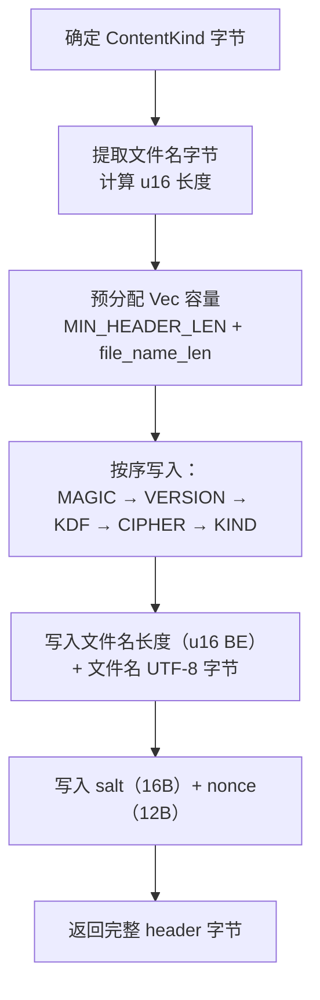
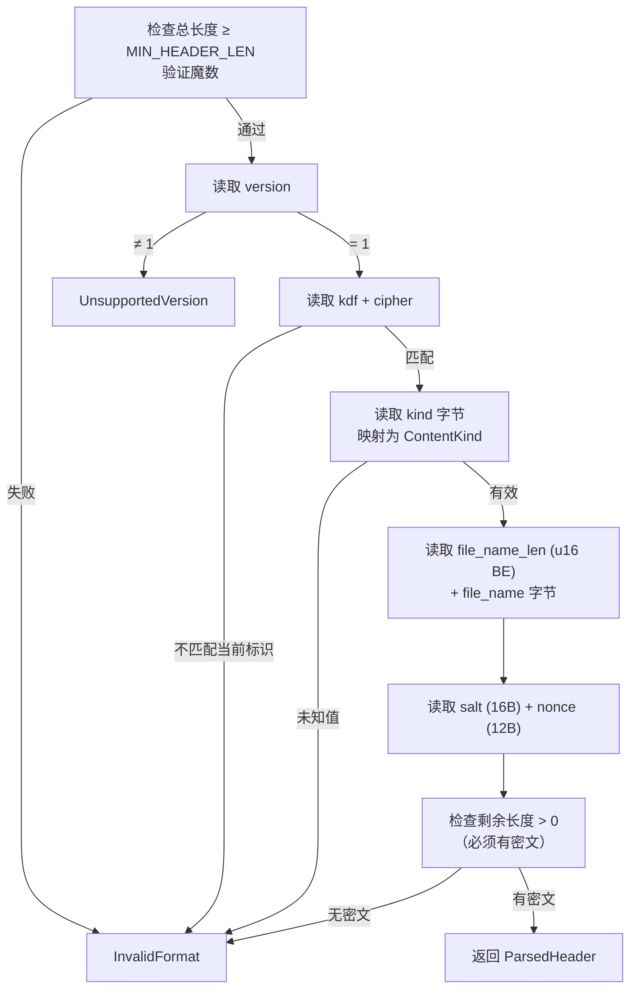

Encrust 采用自定义二进制格式（`.encrust`）封装加密数据。该格式的设计围绕三个安全目标展开：**快速格式识别**（魔数）、**元数据自描述**（版本化头部结构）和**头部完整性保护**（AAD 认证）。本文将逐层拆解这一格式的设计动机与实现细节，帮助你理解为什么文件格式本身也是密码学安全链中不可忽视的一环。

Sources: [crypto.rs](src/crypto.rs#L8-L39)

## 为什么需要自定义文件格式？

许多加密工具直接输出原始密文——salt、nonce 和密文拼接在一起，缺少自描述能力。这种做法在内部协议中尚可接受，但在面向文件的场景下会带来实际问题：解密程序无法判断一个文件是否由本工具生成、使用了什么算法、内容是文本还是二进制文件。Encrust 的自定义格式通过一个结构化的头部解决了这些问题，使得解密流程可以在执行任何密码学操作之前就完成格式校验，避免对无关数据进行无意义的密钥派生（Argon2id 本身就是计算密集型操作）。

Sources: [crypto.rs](src/crypto.rs#L8-L21)

## 魔数（Magic Number）：文件身份的快速校验

```rust
const MAGIC: &[u8; 7] = b"ENCRUST";
```

魔数（Magic Number）是文件开头的一段固定字节序列，充当文件格式的"签名"。Encrust 选择了 ASCII 字符串 `ENCRUST`（7 字节）作为魔数，这一设计决策基于以下考量：

| 设计因素 | 选择 | 理由 |
|---------|------|------|
| 可读性 | ASCII 文本 | 在十六进制编辑器中肉眼可辨，调试友好 |
| 长度 | 7 字节 | 足够避免与常见格式（PNG 的 `\x89PNG`、ZIP 的 `PK` 等）冲突，同时保持头部紧凑 |
| 匹配方式 | 字节精确比较 | 不依赖文件扩展名，直接在字节层面验证 |

在解密入口 `parse_header` 中，魔数是第一个被检查的字段：

```rust
if input.len() < MIN_HEADER_LEN || &input[..MAGIC.len()] != MAGIC {
    return Err(CryptoError::InvalidFormat);
}
```

这一检查确保了：如果用户误将一个非 `.encrust` 文件拖入解密流程，程序会立即返回 `InvalidFormat` 错误，而不是浪费 CPU 周期去执行 Argon2id 密钥派生。

Sources: [crypto.rs](src/crypto.rs#L8-L12), [crypto.rs](src/crypto.rs#L162-L165)

## 头部结构：版本化的自描述元数据

头部是整个文件格式中最关键的部分——它不仅描述了加密参数，还参与了 AES-GCM 的认证计算。Encrust 当前的头部布局如下：

```
┌──────────┬─────────┬─────────┬──────────┬──────────┬──────────────────┬──────────────┬──────────┬──────────┬─────────────────────┐
│  magic   │ version │   kdf   │  cipher  │   kind   │ file_name_len    │  file_name   │   salt   │  nonce   │     ciphertext      │
│  7 bytes │ 1 byte  │ 1 byte  │  1 byte  │  1 byte  │    2 bytes       │   N bytes    │ 16 bytes │ 12 bytes │     variable        │
│ "ENCRUST"│   0x01  │  0x01   │   0x01   │ 0x01/0x02│  big-endian u16  │   UTF-8      │  random  │  random  │  AES-256-GCM output │
└──────────┴─────────┴─────────┴──────────┴──────────┴──────────────────┴──────────────┴──────────┴──────────┴─────────────────────┘
│←────────────────────────── 固定头部（最小 41 字节）─────────────────────────→│←── 动态长度 ──→│←───────────── 密文区域 ──────────────→│
```

各字段的具体含义如下：

| 偏移 | 字段 | 长度 | 当前值 | 说明 |
|------|------|------|--------|------|
| 0 | `magic` | 7 B | `ENCRUST` | 文件签名，快速识别格式 |
| 7 | `version` | 1 B | `1` | 格式版本号，为未来升级预留 |
| 8 | `kdf` | 1 B | `1` (Argon2id) | 密钥派生算法标识 |
| 9 | `cipher` | 1 B | `1` (AES-256-GCM) | 对称加密算法标识 |
| 10 | `kind` | 1 B | `1`=File / `2`=Text | 内容类型，UI 据此决定解密后的展示方式 |
| 11 | `file_name_len` | 2 B | u16 big-endian | 原文件名的字节长度，文本加密时为 0 |
| 13 | `file_name` | 变长 | UTF-8 | 原文件名，文本加密时此字段为空 |
| 13+N | `salt` | 16 B | 随机生成 | Argon2id 的盐值 |
| 29+N | `nonce` | 12 B | 随机生成 | AES-256-GCM 的 nonce |
| 41+N | `ciphertext` | 变长 | — | 包含 16 字节认证标签的密文 |

**最小头部长度**（不含文件名）为 **41 字节**，由常量 `MIN_HEADER_LEN` 定义：

```rust
pub const MIN_HEADER_LEN: usize = MAGIC.len() + 1 + 1 + 1 + 1 + 2 + SALT_LEN + NONCE_LEN;
//                              =    7         + 1 + 1 + 1 + 1 + 2 +   16   +   12    = 41
```

Sources: [crypto.rs](src/crypto.rs#L23-L39)

### 版本号的前瞻性设计

`VERSION` 常量当前固定为 `1`。这不是一个简单的占位符——它是格式演进的锚点。当未来需要更换加密算法、调整头部布局或修改 KDF 参数时，新版本只需递增此值，而旧版本的解密逻辑仍然可以通过版本号准确识别并拒绝不兼容的文件。`parse_header` 中的版本检查体现了这一策略：

```rust
let version = read_u8(input, &mut cursor)?;
if version != VERSION {
    return Err(CryptoError::UnsupportedVersion);
}
```

Sources: [crypto.rs](src/crypto.rs#L13-L15), [crypto.rs](src/crypto.rs#L168-L171)

### 算法标识符的扩展空间

`KDF_ARGON2ID` 和 `CIPHER_AES_256_GCM` 各占 1 字节，用数值 `1` 标识当前算法。解密时程序会校验这两个标识符：

```rust
let kdf = read_u8(input, &mut cursor)?;
let cipher = read_u8(input, &mut cursor)?;
if kdf != KDF_ARGON2ID || cipher != CIPHER_AES_256_GCM {
    return Err(CryptoError::InvalidFormat);
}
```

这种设计留出了扩展窗口：如果未来加入 ChaCha20-Poly1305 或 Scrypt 支持，只需定义新的标识值（如 `CIPHER_CHACHA20 = 2`），解析逻辑按值分支即可，无需破坏现有格式。

Sources: [crypto.rs](src/crypto.rs#L14-L15), [crypto.rs](src/crypto.rs#L173-L177)

### 内容类型与文件名：加密数据的语义标注

`ContentKind` 枚举将加密数据分为两类：

- **`File`（0x01）**：用户加密了一个文件，头部携带原始文件名，解密后 UI 提供保存到磁盘的选项。
- **`Text`（0x02）**：用户加密了文本输入，头部中文件名长度为 0，解密后 UI 直接展示文本内容。

文件名以 UTF-8 编码存储，长度用 big-endian `u16` 表示（最大 65535 字节）。这一长度限制由 `build_header` 中的 `u16::try_from` 转换强制执行——如果文件名的字节长度超过 `u16::MAX`，将返回 `FileNameTooLong` 错误。

Sources: [crypto.rs](src/crypto.rs#L41-L52), [crypto.rs](src/crypto.rs#L132-L152)

## AAD 认证：头部完整性的密码学保障

**这是整个文件格式设计中最关键的安全机制。**

AES-256-GCM 是一种 AEAD（Authenticated Encryption with Associated Data）算法。除了加密明文外，它还支持对"关联数据"（AAD）进行认证——AAD **不被加密**（因为它需要被读取），但会被纳入认证标签的计算。任何人篡改 AAD 的任何一个字节，都会导致认证标签校验失败，解密操作返回错误。

在 Encrust 中，**整个头部被作为 AAD 传入**：

```rust
// 加密时：header 作为 AAD
let ciphertext = cipher.encrypt(nonce, Payload { msg: plaintext, aad: &header })
    .map_err(|_| CryptoError::Encryption)?;

// 解密时：原始头部字节（从加密文件中读取）作为 AAD
let plaintext = cipher.decrypt(nonce, Payload { msg: ciphertext, aad: &encrypted_file[..parsed.header_len] })
    .map_err(|_| CryptoError::Decryption)?;
```

这一机制保护了以下攻击场景：

| 攻击场景 | AAD 的防御效果 |
|---------|--------------|
| 篡改内容类型（将 File 改为 Text） | 头部字节变化 → 认证标签不匹配 → 解密失败 |
| 修改原文件名（指向恶意路径） | 同上 |
| 替换 salt 或 nonce（试图影响密钥派生） | 同上 |
| 替换整个头部（从另一个合法文件复制） | salt/nonce 与密文不匹配 → 解密失败 |

值得注意的是，AAD 保护的是**头部与密文之间的绑定关系**。它确保了：只有与密文在同一时刻生成的头部才能通过认证。这是一个微妙但重要的性质——即使攻击者用另一个合法 `.encrust` 文件的头部替换当前头部，由于 salt/nonce 的变化会导致派生密钥不同，密文将无法被正确解密。

Sources: [crypto.rs](src/crypto.rs#L101-L102), [crypto.rs](src/crypto.rs#L126-L127)

## 头部的构建与解析流程

### 构建流程（`build_header`）

`build_header` 函数按照头部布局的固定顺序将各字段序列化为字节序列：



预分配容量是一个好的实践——虽然对短文件性能影响微乎其微，但它避免了 `Vec` 在多次 `push`/`extend` 操作中反复扩容和内存拷贝。

Sources: [crypto.rs](src/crypto.rs#L132-L152)

### 解析流程（`parse_header`）

`parse_header` 采用**游标式解析**——维护一个 `cursor` 索引，按序推进，逐步提取各字段。每个 `read_*` 辅助函数都负责边界检查，确保不会越界读取：



解析的每一步都执行**严格的边界校验**：`read_u8` 通过 `input.get(*cursor)` 安全访问单个字节，`read_slice` 通过 `checked_add` 防止整数溢出后再用 `input.get(*cursor..end)` 安全获取切片。这种防御式编程确保了即使输入是恶意构造的畸形数据，也不会触发 panic。

Sources: [crypto.rs](src/crypto.rs#L162-L198), [crypto.rs](src/crypto.rs#L200-L223)

## 完整的加密文件生成过程

`encrypt_bytes` 函数将上述所有组件串联为完整的加密流程：

```mermaid
sequenceDiagram
    participant Caller as 调用方
    participant EB as encrypt_bytes
    participant Rng as OsRng
    participant KDF as derive_key (Argon2id)
    participant BH as build_header
    participant AES as AES-256-GCM

    Caller->>EB: plaintext, passphrase, kind, file_name
    EB->>EB: validate_passphrase (≥8 字符)
    EB->>Rng: fill_bytes(salt[16])
    EB->>Rng: fill_bytes(nonce[12])
    EB->>KDF: passphrase + salt → 32B key
    KDF-->>EB: Zeroizing<[u8; 32]>
    EB->>BH: kind + file_name + salt + nonce
    BH-->>EB: header (Vec&lt;u8&gt;)
    EB->>AES: encrypt(plaintext, AAD=header)
    AES-->>EB: ciphertext (含 16B auth tag)
    EB->>EB: header + ciphertext → output
    EB-->>Caller: Vec&lt;u8&gt; (完整 .encrust 文件)
```

最终输出的二进制文件结构为 `[header][ciphertext]`，其中 header 参与了 AAD 认证，ciphertext 包含 AES-GCM 自动追加的 16 字节认证标签。

Sources: [crypto.rs](src/crypto.rs#L88-L111)

## 继续阅读

本文聚焦于文件格式的静态结构设计。要完整理解加密流程的每一个环节，建议按以下顺序继续阅读：

- [密钥派生流程：Argon2id 参数选择与 Zeroize 零化实践](5-mi-yao-pai-sheng-liu-cheng-argon2id-can-shu-xuan-ze-yu-zeroize-ling-hua-shi-jian) — 了解 `derive_key` 如何将用户口令转化为安全的 32 字节密钥
- [AES-256-GCM 对称加密与解密的实现细节](6-aes-256-gcm-dui-cheng-jia-mi-yu-jie-mi-de-shi-xian-xi-jie) — 深入 AEAD 加密/解密的 API 使用与安全注意事项
- [自定义二进制格式的游标式解析（parse_header 与 read_* 辅助函数）](7-zi-ding-yi-er-jin-zhi-ge-shi-de-you-biao-shi-jie-xi-parse_header-yu-read_-fu-zhu-han-shu) — 逐函数拆解头部解析的防御式编程技巧