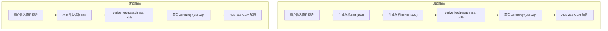

本文深入剖析 Encrust 的密钥派生函数 `derive_key`——从"为什么用户密码不能直接当密钥"的出发点，到 Argon2id 算法的参数决策逻辑，再到 `Zeroizing` 包装器如何确保派生密钥在离开作用域后被安全擦除。这些内容构成了 [加密文件格式设计：魔数、头部结构与 AAD 认证](4-jia-mi-wen-jian-ge-shi-she-ji-mo-shu-tou-bu-jie-gou-yu-aad-ren-zheng) 中 header 所携带的 salt 的消费端，也是 [AES-256-GCM 对称加密与解密的实现细节](6-aes-256-gcm-dui-cheng-jia-mi-yu-jie-mi-de-shi-xian-xi-jie) 所需 32 字节密钥的生产端。

Sources: [crypto.rs](src/crypto.rs#L225-L239)

## 为什么需要密钥派生函数（KDF）

用户输入的密码短语（passphrase）存在两个根本性问题，使其无法直接用作 AES-256 的密钥：**长度不可控**——用户可能输入 4 个字符，也可能输入 40 个字符，而 AES-256 要求精确的 32 字节输入；**熵分布不均**——人类倾向于使用字典词汇、重复模式和可预测的字符组合，导致实际密码空间远小于 256 位密钥应有的 2²⁵⁶ 种可能性。密钥派生函数（Key Derivation Function）的职责正是将任意长度的用户输入与一个随机 salt 组合，输出固定长度、计算成本可控的密钥材料，同时通过 salt 确保即使相同密码每次也会派生出不同的密钥。

Sources: [crypto.rs](src/crypto.rs#L225-L238)

## derive_key 函数的全貌

`derive_key` 是 Encrust 中唯一直接与 Argon2 交互的函数。它在加密和解密两条路径中都被调用，输入是用户密码短语和一个 16 字节的随机 salt，输出是一个被 `Zeroizing` 包装的 32 字节数组。整个函数的设计遵循"参数固定、输出受控"的原则——所有 Argon2id 参数硬编码在函数体内，通过文件格式版本号 `VERSION` 来锁定，而非让调用方动态传入。

```rust
fn derive_key(passphrase: &str, salt: &[u8; SALT_LEN]) -> Result<Zeroizing<[u8; KEY_LEN]>, CryptoError> {
    let params = Params::new(19 * 1024, 2, 1, Some(KEY_LEN)).map_err(|_| CryptoError::KeyDerivation)?;
    let argon2 = Argon2::new(Algorithm::Argon2id, Version::V0x13, params);

    let mut key = Zeroizing::new([0_u8; KEY_LEN]);
    argon2.hash_password_into(passphrase.as_bytes(), salt, key.as_mut()).map_err(|_| CryptoError::KeyDerivation)?;

    Ok(key)
}
```

Sources: [crypto.rs](src/crypto.rs#L225-L239)

## Argon2id 参数选择的三维决策

Argon2 的 `Params::new` 接受四个参数，分别控制计算过程的内存消耗、迭代次数、并行度和输出长度。Encrust 的选择如下表所示：

| 参数 | Encrust 值 | 含义 | 设计考量 |
|------|-----------|------|---------|
| `m_cost` | `19 * 1024`（19 MiB） | 内存消耗，单位为 KiB | `argon2` crate 的默认推荐值，在桌面设备上约需几十毫秒完成派生，同时为 GPU 攻击者制造足够的内存带宽瓶颈 |
| `t_cost` | `2` | 迭代（遍历）次数 | 默认值。两次遍历在保证安全基线的同时，不会让桌面用户感到明显的加密延迟 |
| `p_cost` | `1` | 并行线程数 | 桌面 GUI 应用的合理选择。单线程意味着攻击者即使部署多核也无法降低单次猜测的成本 |
| `output_len` | `Some(KEY_LEN)` = `Some(32)` | 输出密钥长度（字节） | 精确匹配 AES-256-GCM 所需的 256 位密钥长度 |

值得注意的是，`m_cost = 19 * 1024` 恰好是 `argon2` crate 中 `Params::DEFAULT_M_COST` 的定义值，`t_cost = 2` 对应 `DEFAULT_T_COST`，`p_cost = 1` 对应 `DEFAULT_P_COST`。换言之，Encrust 采用了该库的推荐默认参数集，这对于一个桌面端加密工具而言是合理的起点。代码注释中也明确指出，未来若需调整参数，应同步升级文件格式版本号 `VERSION`，以确保已生成的加密文件仍能被正确解密。

Sources: [crypto.rs](src/crypto.rs#L230-L233), [params.rs](/Users/johnny/.cargo/registry/src/index.crates.io-1949cf8c6b5b557f/argon2-0.5.3/src/params.rs#L35-L51)

### 为什么选择 Argon2id 而非 Argon2i 或 Argon2d

Argon2 家族有三个变体，各自在抗侧信道攻击和抗 GPU/ASIC 破解之间做了不同的权衡。**Argon2i** 采用数据独立的内存访问模式，对侧信道攻击有天然免疫力，但在相同参数下抗 GPU 暴力破解能力较弱；**Argon2d** 采用数据依赖的内存访问，抗 GPU 能力最强，但可能受到基于缓存时间的侧信道攻击；**Argon2id** 是 RFC 9106 推荐的混合方案——第一遍使用 Argon2i 模式（数据独立），后续遍使用 Argon2d 模式（数据依赖）——在两种威胁模型之间取得了工程上的平衡点。对于 Encrust 这种用户密码短语通常在本地输入、不太涉及服务器端远程攻击场景的桌面应用，Argon2id 的选择既遵守了 RFC 推荐的"默认优先"原则，也没有在安全性上做出实质性妥协。

Sources: [crypto.rs](src/crypto.rs#L233)

### Version::V0x13 的含义

`Version::V0x13` 对应 Argon2 算法的 1.3 版本，这是 IETF RFC 9106 所标准化的版本。它与早期 1.0 版本在填充方式和某些内部常量上存在差异。选择此版本确保了与 RFC 标准的一致性，也意味着 `hash_password_into` 的行为是可预测且经过广泛审计的。

Sources: [crypto.rs](src/crypto.rs#L233)

## 密钥派生的调用上下文：加密与解密路径

密钥派生是加密和解密流程共享的中间环节。下图展示了 `derive_key` 在两条路径中的位置关系：



在加密路径中，`encrypt_bytes` 先通过 `OsRng` 生成全新的随机 salt，再调用 `derive_key` 派生密钥；在解密路径中，`decrypt_bytes` 从已解析的文件头部取出之前存储的 salt，用相同的参数派生出同一个密钥。两条路径使用相同的 `Algorithm::Argon2id`、`Version::V0x13` 和参数集，保证了对称性。salt 的 16 字节长度（`SALT_LEN`）在加密时被写入 header，解密时通过 `parse_header` 读出，构成了跨两次操作的确定性纽带。

Sources: [crypto.rs](src/crypto.rs#L88-L111), [crypto.rs](src/crypto.rs#L118-L130)

## Zeroize 零化：内存中的密钥生命周期管理

`Zeroizing<[u8; KEY_LEN]>` 是 `zeroize` crate 提供的泛型包装器，它在 `Drop` trait 的实现中自动调用内值的 `zeroize` 方法，将内存中的密钥字节覆写为零。这意味着密钥材料在离开作用域的那一刻——无论是函数正常返回后的局部变量销毁，还是因 `?` 操作符提前返回——都会被擦除，无需手动管理。

Sources: [crypto.rs](src/crypto.rs#L6), [crypto.rs](src/crypto.rs#L229)

### Zeroizing 的工作机制

从 `zeroize` crate 的源码可以看到，`Zeroizing<Z>` 实现了 `ops::Deref` 和 `ops::DerefMut`，使得它可以在大多数场景中像普通引用一样使用（例如 `key.as_slice()` 和 `key.as_mut()`）。同时它实现了 `ZeroizeOnDrop` 标记 trait 和 `Drop` trait——`drop` 方法直接调用 `self.0.zeroize()`。编译器保证在值被释放（moved out of scope）时 `drop` 一定执行，这是 Rust 所有权系统的天然保证，不依赖运行时的垃圾回收或显式调用。

在 `derive_key` 中，`key` 变量的生命周期从 `Zeroizing::new([0_u8; KEY_LEN])` 开始，到函数返回 `Ok(key)` 时通过 move 语义转移给调用方。如果 `hash_password_into` 失败并返回 `Err`，`key` 在函数作用域结束时被 drop，内存随即被零化。调用方收到的 `Zeroizing<[u8; KEY_LEN]>` 在其自身的作用域结束时同样会触发零化——整个密钥的内存驻留时间被精确地限定在"派生完成到加密/解密操作完成"这个最小窗口内。

Sources: [lib.rs](/Users/johnny/.cargo/registry/src/index.crates.io-1949cf8c6b5b557f/zeroize-1.8.2/src/lib.rs#L620-L724)

### 加密路径中的密钥生命周期

在 `encrypt_bytes` 中，`key` 的生命周期被严格限定：

```
let key = derive_key(passphrase, &salt)?;          // ① 密钥派生
let cipher = Aes256Gcm::new_from_slice(key.as_slice())...;  // ② 传递给 cipher 构造
let ciphertext = cipher.encrypt(nonce, Payload { ... })...;  // ③ 使用完毕
// ④ key 在函数末尾被 drop → 内存零化
```

`key` 在 `derive_key` 返回时被创建，在 `encrypt_bytes` 末尾被销毁。`Aes256Gcm::new_from_slice` 接收的是 `key.as_slice()` 的借用，不会转移所有权——这意味着密钥数组本身不会在 `aes_gcm` crate 内部被复制或长期持有。密钥字节在 AES-256-GCM 内部被用于扩展轮密钥（round key expansion），但 `key` 变量本身的 32 字节副本在 `encrypt_bytes` 返回时确定性地被零化。

Sources: [crypto.rs](src/crypto.rs#L98-L110)

### 解密路径中的对称处理

`decrypt_bytes` 中的处理逻辑完全对称：从 `parse_header` 获取 salt 后调用 `derive_key`，得到 `Zeroizing` 包装的密钥，解密完成后函数返回，密钥自动零化。唯一值得注意的是 `key.as_slice()` 同样只传递了借用，确保 `Zeroizing` 的所有权不发生转移。

Sources: [crypto.rs](src/crypto.rs#L122-L130)

## 密码短语的前置校验

在密钥派生之前，`validate_passphrase` 函数按 Unicode 字符数（`chars().count()`）检查密码短语是否至少有 8 个字符。这里刻意选择字符计数而非字节计数，使得中文、emoji 等多字节字符对用户而言更符合"字符长度"的直觉。该函数同时被加密和解密入口调用，作为 `derive_key` 的守门人——如果密码短语过短，直接返回 `CryptoError::PassphraseTooShort`，避免将低熵输入送入计算成本较高的 Argon2id 过程。

Sources: [crypto.rs](src/crypto.rs#L72-L82)

## UI 层的敏感数据清理策略

虽然本文聚焦于 `crypto.rs` 中的密钥零化，但值得一提的是，`app.rs` 中的 UI 层也有配套的清理逻辑。`clear_encrypt_inputs` 和 `clear_decrypt_inputs` 方法在操作完成后会调用 `self.passphrase.clear()`，将 UI 状态中持有的密码短语字符串清空。这与 `Zeroizing` 在密码学层的保护形成互补：**密码学层确保派生密钥被零化，UI 层确保原始密码短语被清除**——两者共同构成纵深防御。

Sources: [app.rs](src/app.rs#L574-L595)

## 小结：密钥派生流程的设计约束与工程权衡

Encrust 的密钥派生方案可以提炼为三个核心设计决策：**算法选型**采用 RFC 9106 推荐的 Argon2id，避免了在三个变体之间做出非标准选择；**参数选择**遵循 `argon2` crate 的默认推荐值（19 MiB / 2 次迭代 / 单线程），在桌面场景下兼顾了安全性与响应速度，并通过 `VERSION` 常量锁定参数，为将来的参数升级预留了版本协商机制；**内存安全**通过 `Zeroizing` 包装器利用 Rust 的所有权系统自动保证密钥材料在最小生命周期后被零化，消除了手动内存管理的遗漏风险。

下一页将深入 [AES-256-GCM 对称加密与解密的实现细节](6-aes-256-gcm-dui-cheng-jia-mi-yu-jie-mi-de-shi-xian-xi-jie)，探讨 `derive_key` 产出的 32 字节密钥如何被用于构建认证加密的完整流程。