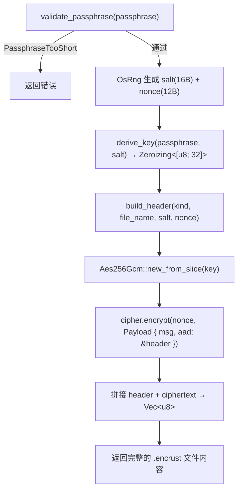
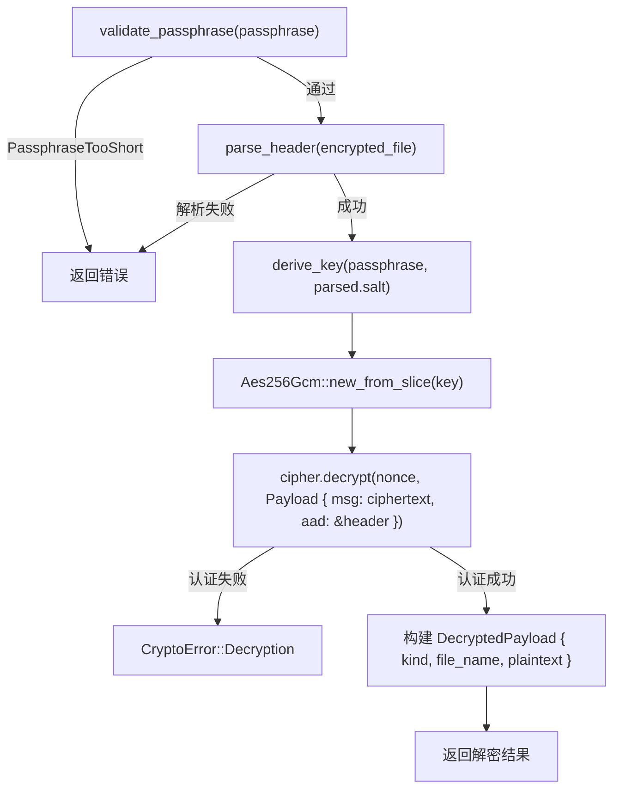

Encrust 的加密核心使用 **AES-256-GCM**（Galois/Counter Mode）作为唯一的对称加密算法。GCM 模式同时提供**机密性**（加密）和**完整性**（认证），一次操作即可产出密文与认证标签，避免了 ECB/CBC 等传统模式需要额外 HMAC 的复杂性。本文聚焦于 `encrypt_bytes` 与 `decrypt_bytes` 两个公共函数的内部流程，解析从随机数生成、密钥派生、Nonce 构造到 AAD 绑定的完整链路，并阐明 `aes-gcm` crate（v0.10.3）中 `Aead`、`KeyInit`、`Payload` 三个 trait 的协作方式。

Sources: [Cargo.toml](Cargo.toml#L7-L7), [crypto.rs](src/crypto.rs#L1-L6)

## 为什么选择 AES-256-GCM

AES-GCM 是 NIST SP 800-38D 标准定义的认证加密（AEAD）模式。与常见的 CBC + HMAC 方案相比，它有三个核心优势：

| 对比维度 | AES-CBC + HMAC-SHA256 | AES-256-GCM |
|---|---|---|
| 操作次数 | 需要加密和认证两步，各自独立 | 单次 `encrypt` 调用同时完成加密与认证 |
| 认证范围 | 仅密文被认证，头部需单独处理 | AAD 机制天然支持对非加密数据（头部）的绑定认证 |
| 性能特征 | HMAC 需额外哈希轮次 | GHASH 硬件加速（AES-NI + CLMUL）下接近内存带宽 |

Encrust 选择了 256 位密钥长度而非 128 位，这是出于**长期安全边际**的考量——NIST 将 AES-256 的安全强度评估为 256 位量子前安全 / 128 位量子后安全（Grover 算法可将对称密钥搜索开方），而 AES-128 在量子后仅剩 64 位安全边际。

Sources: [crypto.rs](src/crypto.rs#L14-L20)

## 加密流程：encrypt_bytes 逐行拆解



整个加密流程可以划分为四个阶段：**校验 → 随机数生成 → 密钥派生 → 认证加密**。

### 第一阶段：密码短语校验

`encrypt_bytes` 的第一步是调用 `validate_passphrase`，按 Unicode 字符数（而非字节数）检查密码短语是否达到 8 个字符。这一设计对中文、emoji 等多字节输入更为直觉友好。校验失败立即返回 `CryptoError::PassphraseTooShort`，不会进入后续耗时的 KDF 计算。

Sources: [crypto.rs](src/crypto.rs#L76-L89)

### 第二阶段：Salt 与 Nonce 的随机生成

```rust
let mut salt = [0_u8; SALT_LEN];        // 16 字节
let mut nonce_bytes = [0_u8; NONCE_LEN]; // 12 字节
OsRng.fill_bytes(&mut salt);
OsRng.fill_bytes(&mut nonce_bytes);
```

这段代码中的关键常量及其含义如下：

| 常量 | 值 | 含义 | 为什么是这个值 |
|---|---|---|---|
| `SALT_LEN` | 16 字节 | KDF 盐值 | Argon2id 推荐至少 16 字节，提供 128 位随机性 |
| `NONCE_LEN` | 12 字节 | GCM Nonce | NIST SP 800-38D 规定的标准长度（96 位），超过此长度需要额外哈希处理 |
| `KEY_LEN` | 32 字节 | AES-256 密钥 | AES-256 要求精确的 256 位密钥 |

**`OsRng`** 来自 `rand_core` crate，直接调用操作系统的 CSPRNG（`/dev/urandom` on macOS/Linux，`BCryptGenRandom` on Windows）。每次加密操作都**必须**重新生成 salt 和 nonce——同一明文、同一密码的两次加密，输出必定不同（这一属性由单元测试 `same_plaintext_encrypts_to_different_outputs` 显式验证）。

Sources: [crypto.rs](src/crypto.rs#L18-L20), [crypto.rs](src/crypto.rs#L91-L96)

### 第三阶段：密钥派生

```rust
let key = derive_key(passphrase, &salt)?;
```

密钥派生委托给 `derive_key` 函数，该函数使用 Argon2id 将不定长的密码短语转换为固定 32 字节的 AES 密钥。返回值类型是 `Zeroizing<[u8; KEY_LEN]>`——这是一个 RAII 守卫，当 `key` 变量离开作用域时，内存中的密钥数据会被自动覆写为零。关于 Argon2id 的参数选择细节，请参考 [密钥派生流程：Argon2id 参数选择与 Zeroize 零化实践](5-mi-yao-pai-sheng-liu-cheng-argon2id-can-shu-xuan-ze-yu-zeroize-ling-hua-shi-jian)。

Sources: [crypto.rs](src/crypto.rs#L98-L98), [crypto.rs](src/crypto.rs#L229-L238)

### 第四阶段：认证加密

```rust
let cipher = Aes256Gcm::new_from_slice(key.as_slice())
    .map_err(|_| CryptoError::Encryption)?;
let nonce = Nonce::from_slice(&nonce_bytes);
let header = build_header(kind, file_name, &salt, &nonce_bytes)?;
let ciphertext = cipher.encrypt(
    nonce,
    Payload { msg: plaintext, aad: &header }
).map_err(|_| CryptoError::Encryption)?;
```

这里涉及 `aes-gcm` crate 的三个核心 trait 和类型：

- **`KeyInit`**（来自 `aead` trait）：提供 `new_from_slice` 方法，将原始字节切片初始化为 `Aes256Gcm` cipher 实例。如果密钥长度不是恰好 32 字节则返回错误。
- **`Aead`**（来自 `aead` trait）：提供 `encrypt` 和 `decrypt` 方法。GCM 模式下，`encrypt` 在内部完成 AES-CTR 加密和 GHASH 认证标签计算，输出 = **密文 + 16 字节认证标签**。
- **`Payload`**：一个结构体，将待加密消息（`msg`）与附加认证数据（`aad`）打包传入。`aad` 字段是 GCM 的核心安全特性——它参与认证标签计算但**不被加密**。

**AAD 在 Encrust 中的角色**：`build_header` 构建的完整文件头部被作为 AAD 传入。这意味着头部中的魔数、版本号、KDF 标识、加密算法标识、内容类型、文件名、salt 和 nonce 全部参与认证标签计算。任何对头部的篡改——哪怕只改了一个字节——都会在解密时导致认证失败。这个设计在 [加密文件格式设计：魔数、头部结构与 AAD 认证](4-jia-mi-wen-jian-ge-shi-she-ji-mo-shu-tou-bu-jie-gou-yu-aad-ren-zheng) 中有更详细的分析。

加密完成后，函数预分配 `header.len() + ciphertext.len()` 的容量并将两者拼接，返回完整的 `.encrust` 文件字节序列。

Sources: [crypto.rs](src/crypto.rs#L99-L110)

## 解密流程：decrypt_bytes 逐行拆解



解密流程与加密对称，但多了**头部解析**和**认证验证**两个关键环节。

### 头部解析与校验

```rust
let parsed = parse_header(encrypted_file)?;
```

`parse_header` 从加密文件的前部逐字段解析出 salt、nonce、内容类型和原始文件名。解析过程中会对魔数、版本号、KDF 标识和加密算法标识进行严格校验——如果不匹配当前版本支持的值，立即返回 `InvalidFormat` 或 `UnsupportedVersion` 错误。解析的详细游标机制将在 [自定义二进制格式的游标式解析](7-zi-ding-yi-er-jin-zhi-ge-shi-de-you-biao-shi-jie-xi-parse_header-yu-read_-fu-zhu-han-shu) 中深入讨论。

Sources: [crypto.rs](src/crypto.rs#L118-L121), [crypto.rs](src/crypto.rs#L162-L198)

### 密钥重建与认证解密

```rust
let key = derive_key(passphrase, &parsed.salt)?;
let cipher = Aes256Gcm::new_from_slice(key.as_slice())
    .map_err(|_| CryptoError::Decryption)?;
let nonce = Nonce::from_slice(&parsed.nonce);
let ciphertext = &encrypted_file[parsed.header_len..];
let plaintext = cipher.decrypt(
    nonce,
    Payload {
        msg: ciphertext,
        aad: &encrypted_file[..parsed.header_len]
    }
).map_err(|_| CryptoError::Decryption)?;
```

解密时需要特别注意的是 **AAD 的来源**：它不是从 `parsed` 结构体的字段中重新构造的，而是直接截取原始加密文件的头部字节 `&encrypted_file[..parsed.header_len]`。这个选择至关重要——如果用重新构造的头部作为 AAD，那么攻击者可以篡改原始头部中的某些字段（如文件名），而重构造的头部仍然匹配，认证就会通过。直接使用原始字节作为 AAD 意味着**文件中的每一个字节都在认证覆盖范围之内**。

`cipher.decrypt` 在内部执行两项操作：首先用 GHASH 重新计算认证标签并与密文末尾的标签比对，如果一致则执行 AES-CTR 解密。**认证失败时不会返回任何明文**——这是 AEAD 模式的安全保证，防止选择密文攻击。

解密成功后，函数返回 `DecryptedPayload`，其中 `kind`（Text / File）和 `file_name` 由头部解析得到，`plaintext` 是解密后的原始字节。UI 层根据 `kind` 决定如何展示结果。

Sources: [crypto.rs](src/crypto.rs#L122-L130)

## 错误处理策略：加密与解密的差异化表达

`encrypt_bytes` 和 `decrypt_bytes` 在错误类型的使用上有意区分：

| 阶段 | 加密时错误 | 解密时错误 | 设计意图 |
|---|---|---|---|
| 密码短语过短 | `PassphraseTooShort` | `PassphraseTooShort` | 两侧一致，属于用户输入错误 |
| 密钥派生失败 | `KeyDerivation` | `KeyDerivation` | 两侧一致，属于内部计算错误 |
| AES 初始化失败 | `Encryption` | `Decryption` | 区分操作上下文 |
| 加密/解密操作失败 | `Encryption` | `Decryption` | **解密错误消息包含"密钥错误或文件被篡改"提示**，帮助用户判断原因 |

特别值得关注的是 `CryptoError::Decryption` 的错误消息 `"解密失败：密钥错误或文件被篡改"`——它不区分"密码错误"和"文件被篡改"两种情况。这不仅是实现上的简化，也是一种**安全实践**：避免向攻击者泄露具体是哪个环节失败的（类似登录时不区分"用户名不存在"和"密码错误"的原则）。完整的错误体系设计见 [密码学校验与错误处理策略](8-mi-ma-xue-xiao-yan-yu-cuo-wu-chu-li-ce-lue-cryptoerror-mei-ju-she-ji)。

Sources: [crypto.rs](src/crypto.rs#L54-L70), [crypto.rs](src/crypto.rs#L99-L99), [crypto.rs](src/crypto.rs#L123-L127)

## 安全属性总结

Encrust 的 AES-256-GCM 实现提供以下安全保证：

**机密性**：明文经 AES-256-CTR 模式加密，256 位密钥由 Argon2id 从密码短语派生，暴力破解成本极高。

**完整性**：GHASH 认证标签覆盖密文 + AAD（完整头部），任何篡改都会导致解密失败。GCM 的认证标签长度为 128 位，伪造成功的概率为 2⁻¹²⁸。

**不可重放性**：每次加密使用唯一的随机 Nonce（12 字节 / 96 位），同一明文 + 同一密码的多次加密产出完全不同的密文。这由测试用例 `same_plaintext_encrypts_to_different_outputs` 验证。

**密钥隔离**：不同密码短语通过不同 salt 派生出完全不同的密钥，即使 salt 被公开存储在文件头部中也不构成安全风险——这正是 KDF 设计的前提。

Sources: [crypto.rs](src/crypto.rs#L264-L269)

## 延伸阅读

本文聚焦于 AES-256-GCM 的加解密调用链路。以下页面提供了相邻上下文的深入解析：

- 加密文件头部各字段的布局设计与 AAD 认证机制：[加密文件格式设计：魔数、头部结构与 AAD 认证](4-jia-mi-wen-jian-ge-shi-she-ji-mo-shu-tou-bu-jie-gou-yu-aad-ren-zheng)
- 密钥从密码短语到 32 字节 AES 密钥的完整派生过程：[密钥派生流程：Argon2id 参数选择与 Zeroize 零化实践](5-mi-yao-pai-sheng-liu-cheng-argon2id-can-shu-xuan-ze-yu-zeroize-ling-hua-shi-jian)
- 头部解析的游标式二进制读取实现：[自定义二进制格式的游标式解析](7-zi-ding-yi-er-jin-zhi-ge-shi-de-you-biao-shi-jie-xi-parse_header-yu-read_-fu-zhu-han-shu)
- 完整的错误枚举设计与面向用户的错误消息策略：[密码学校验与错误处理策略](8-mi-ma-xue-xiao-yan-yu-cuo-wu-chu-li-ce-lue-cryptoerror-mei-ju-she-ji)