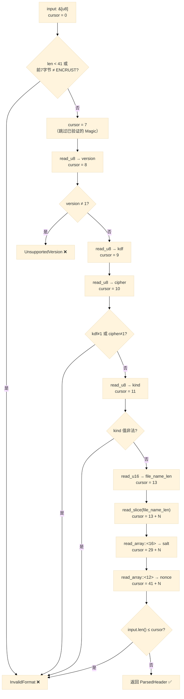

Encrust 的加密文件并没有使用 Protobuf、MessagePack 等通用序列化方案，而是采用了一种紧凑的**自定义二进制格式**——头部字段按固定顺序、固定或半固定长度依次排列，尾部追加密文。这种设计让文件格式完全可控、头部体积极小（最小仅 41 字节），代价则是需要手写解析逻辑。本文聚焦于 `parse_header` 函数及其四个 `read_*` 辅助函数，展示如何用**游标（cursor）模式**对二进制数据进行安全、高效的顺序解析。

Sources: [crypto.rs](src/crypto.rs#L8-L39)

## 二进制头部格式全景

在深入解析代码之前，有必要先对被解析的目标格式建立清晰的心智模型。Encrust 加密文件的头部由以下字段按顺序排列：

| 字段 | 字节数 | 类型 | 说明 |
|---|---|---|---|
| Magic | 7 | `[u8; 7]` | 固定字符串 `"ENCRUST"`，文件签名 |
| Version | 1 | `u8` | 格式版本号，当前为 `1` |
| KDF 标识 | 1 | `u8` | 密钥派生算法标识，`1` = Argon2id |
| Cipher 标识 | 1 | `u8` | 对称加密算法标识，`1` = AES-256-GCM |
| 内容类型 | 1 | `u8` | `1` = 文件，`2` = 文本 |
| 文件名长度 | 2 | `u16`（big-endian） | 原始文件名的字节长度；文本加密时为 `0` |
| 文件名 | N（可变） | UTF-8 bytes | 原始文件名；文本加密时 N=0，即不存在 |
| Salt | 16 | `[u8; 16]` | Argon2id 的随机盐值 |
| Nonce | 12 | `[u8; 12]` | AES-256-GCM 的随机 nonce |
| **密文** | 剩余全部 | bytes | AES-256-GCM 加密后的密文 |

其中前 7 个字段（Magic → Nonce）构成**头部（header）**，也是解析函数 `parse_header` 的职责边界。`MIN_HEADER_LEN` 常量计算了**文件名长度为零时**头部的最小值：`7 + 1 + 1 + 1 + 1 + 2 + 16 + 12 = 41` 字节。头部之后的全部字节才是密文，不归解析函数处理。

Sources: [crypto.rs](src/crypto.rs#L23-L39)

## 游标模式的核心思想

所谓**游标模式**，就是用一个 `usize` 变量记录"当前读取到了哪个位置"，每次读操作完成后将游标向前推进，直到头部所有字段被读完。在 Encrust 中，这个游标被命名为 `cursor`，以 `&mut usize` 的形式在各个 `read_*` 函数之间传递。

这种模式有三个关键特征：

- **零拷贝读取**：`read_slice` 返回的是原始 `input` 切片的引用 `&'a [u8]`，而非拷贝出新的 `Vec<u8>`。仅在需要所有权转换时（如 `file_name` 转为 `String`）才进行一次分配。
- **边界安全**：所有读取操作都通过 `slice.get(range)` 或 `slice.get(index)` 进行安全的索引访问，越界时返回 `CryptoError::InvalidFormat`，绝不会触发 Rust 的运行时 panic。
- **单向前进**：游标只增不减，配合函数式的 `?` 操作符实现"任何一步失败立即退出"的短路语义。

下面的 Mermaid 图展示了 `parse_header` 内部游标的前进轨迹：



Sources: [crypto.rs](src/crypto.rs#L162-L198)

## read_* 辅助函数的分层设计

四个辅助函数构成了一个**自底向上的调用层次**：最底层的 `read_slice` 只负责"安全地取一段字节"，上层的 `read_array`、`read_u16`、`read_u8` 在此基础上增加了类型转换和语义约束。

### read_slice —— 基石函数

```rust
fn read_slice<'a>(input: &'a [u8], cursor: &mut usize, len: usize) -> Result<&'a [u8], CryptoError> {
    let end = cursor.checked_add(len).ok_or(CryptoError::InvalidFormat)?;
    let slice = input.get(*cursor..end).ok_or(CryptoError::InvalidFormat)?;
    *cursor = end;
    Ok(slice)
}
```

[read_slice](src/crypto.rs#L218-L223)

这是整个解析体系的地基。它做了三件事：

1. **溢出检查**：`cursor.checked_add(len)` 防止恶意构造的 `len`（例如 `u16::MAX`）导致地址算术溢出。如果加法溢出，直接返回错误。
2. **范围安全**：`input.get(*cursor..end)` 使用 Rust 的安全切片访问。如果 `end` 超出 `input` 的长度，`get` 返回 `None`，被 `ok_or` 转为 `InvalidFormat` 错误。
3. **游标推进**：`*cursor = end` 将游标前进到已读取区域的末尾。

返回值的生命周期 `'a` 与输入 `input` 绑定，保证返回的切片不会比原始数据活得更久——这是 Rust 借用检查器为二进制解析提供的天然安全保障。

### read_array —— 固定长度数组读取

```rust
fn read_array<const N: usize>(input: &[u8], cursor: &mut usize) -> Result<[u8; N], CryptoError> {
    let slice = read_slice(input, cursor, N)?;
    let mut array = [0_u8; N];
    array.copy_from_slice(slice);
    Ok(array)
}
```

[read_array](src/crypto.rs#L211-L216)

`read_array` 利用 Rust 的 **const generics**（`const N: usize`）将编译期已知的长度参数化。它委托 `read_slice` 完成边界检查和游标推进，然后将切片内容拷贝到栈上的固定大小数组中。这个函数被用于读取 `salt`（16 字节）和 `nonce`（12 字节）——这两个字段的长度在编译期就已确定，用 `[u8; N]` 比 `Vec<u8>` 更高效（零堆分配）且类型更精确。

### read_u16 —— 大端序整数读取

```rust
fn read_u16(input: &[u8], cursor: &mut usize) -> Result<u16, CryptoError> {
    let bytes = read_array::<2>(input, cursor)?;
    Ok(u16::from_be_bytes(bytes))
}
```

[read_u16](src/crypto.rs#L206-L209)

这层在 `read_array` 的基础上增加了字节序转换。文件名长度字段被设计为 **big-endian**（网络字节序），`u16::from_be_bytes` 将 2 字节的 `[u8; 2]` 转为 `u16`。选择 big-endian 而非 native-endian 的原因是跨平台一致性：无论程序运行在 x86（little-endian）还是 ARM（可能 big-endian），文件格式的解读都相同。

### read_u8 —— 单字节读取

```rust
fn read_u8(input: &[u8], cursor: &mut usize) -> Result<u8, CryptoError> {
    let value = *input.get(*cursor).ok_or(CryptoError::InvalidFormat)?;
    *cursor += 1;
    Ok(value)
}
```

[read_u8](src/crypto.rs#L200-L204)

最简单的辅助函数。它没有调用 `read_slice`，而是直接用 `input.get(*cursor)` 取单个字节。这是因为单字节读取不需要 `checked_add` 溢出保护（游标最多到 `usize::MAX`，加 1 的溢出风险在实际场景中可忽略——一个有效的加密文件不可能达到 `usize::MAX` 字节）。

### 调用层次总览

| 函数 | 职责 | 依赖 | 返回类型 |
|---|---|---|---|
| `read_slice` | 安全切片 + 游标推进 + 溢出保护 | 无 | `&'a [u8]` |
| `read_array::<N>` | 固定长度数组读取 | `read_slice` | `[u8; N]` |
| `read_u16` | 2 字节大端整数 | `read_array::<2>` | `u16` |
| `read_u8` | 单字节读取 | 无（直接 `.get()`） | `u8` |

Sources: [crypto.rs](src/crypto.rs#L200-L223)

## parse_header 的逐段解析

有了辅助函数的分层理解，现在可以完整审视 `parse_header` 的解析流程。

### 阶段一：格式签名验证

```rust
if input.len() < MIN_HEADER_LEN || &input[..MAGIC.len()] != MAGIC {
    return Err(CryptoError::InvalidFormat);
}
let mut cursor = MAGIC.len();
```

[parse_header 开头](src/crypto.rs#L163-L167)

函数入口先做两道门槛检查：**长度门槛**（`input.len() < MIN_HEADER_LEN`）确保数据至少能容纳最小头部；**魔数比对**（`&input[..MAGIC.len()] != MAGIC`）确认这是 Encrust 格式的文件。通过后，游标直接初始化为 `MAGIC.len()`（即 7），跳过已经验证过的魔数字节。

### 阶段二：版本与算法标识

```rust
let version = read_u8(input, &mut cursor)?;
if version != VERSION { return Err(CryptoError::UnsupportedVersion); }

let kdf = read_u8(input, &mut cursor)?;
let cipher = read_u8(input, &mut cursor)?;
if kdf != KDF_ARGON2ID || cipher != CIPHER_AES_256_GCM {
    return Err(CryptoError::InvalidFormat);
}
```

[版本与算法校验](src/crypto.rs#L168-L177)

这里体现了**版本化设计**的思路：版本号独立检查并返回专门的 `UnsupportedVersion` 错误，为将来的格式升级预留了分支空间；KDF 和 Cipher 标识则做白名单校验，当前版本只接受唯一的组合（Argon2id + AES-256-GCM）。如果未来添加新的 KDF 或加密算法，只需在此处扩展 `match` 分支。

### 阶段三：内容类型与可变长度字段

```rust
let kind = match read_u8(input, &mut cursor)? {
    CONTENT_FILE => ContentKind::File,
    CONTENT_TEXT => ContentKind::Text,
    _ => return Err(CryptoError::InvalidFormat),
};

let file_name_len = read_u16(input, &mut cursor)? as usize;
let file_name_bytes = read_slice(input, &mut cursor, file_name_len)?;
let file_name = if file_name_bytes.is_empty() {
    None
} else {
    Some(String::from_utf8(file_name_bytes.to_vec()).map_err(|_| CryptoError::InvalidFormat)?)
};
```

[内容类型与文件名解析](src/crypto.rs#L179-L188)

内容类型使用 `match` 进行枚举映射，未知值直接报错。接下来是整个头部中**唯一的可变长度字段**——原始文件名。`read_u16` 先读取长度，然后 `read_slice` 据此截取对应字节。文件名为空（文本加密场景）时，`file_name_len` 为 0，`read_slice` 返回空切片，最终 `file_name` 被设为 `None`。

值得注意的是 `String::from_utf8` 的 UTF-8 合法性检查：这不仅是为了正确显示文件名，也是一种**输入消毒**——如果攻击者篡改了头部中的文件名字段使其包含非法 UTF-8 序列，解密流程会在此处提前终止。

### 阶段四：密码学参数与尾部校验

```rust
let salt = read_array::<SALT_LEN>(input, &mut cursor)?;
let nonce = read_array::<NONCE_LEN>(input, &mut cursor)?;

if input.len() <= cursor {
    return Err(CryptoError::InvalidFormat);
}

Ok(ParsedHeader { kind, file_name, salt, nonce, header_len: cursor })
```

[Salt/Nonce 读取与尾部校验](src/crypto.rs#L190-L198)

最后读取固定长度的 `salt`（16 字节）和 `nonce`（12 字节），然后做最终的**尾部校验**：`input.len() <= cursor` 确保密文部分非空。如果整个输入恰好在头部结束时截断（没有密文），说明文件不完整。校验通过后，将所有解析结果打包进 `ParsedHeader` 结构体返回。

### ParsedHeader：解析结果的结构化载体

```rust
struct ParsedHeader {
    kind: ContentKind,
    file_name: Option<String>,
    salt: [u8; SALT_LEN],
    nonce: [u8; NONCE_LEN],
    header_len: usize,
}
```

[ParsedHeader 定义](src/crypto.rs#L154-L160)

`ParsedHeader` 是模块私有结构体（无 `pub`），仅在 `crypto` 模块内部使用。它的五个字段分别对应解析提取的全部信息，其中 `header_len` 尤为关键——调用方 `decrypt_bytes` 需要用它来定位密文的起始偏移量：

```rust
let ciphertext = &encrypted_file[parsed.header_len..];
```

这种"解析函数返回头部长度，由调用方自行分割"的设计，保持了 `parse_header` 的纯解析职责，不做任何密码学操作。

Sources: [crypto.rs](src/crypto.rs#L154-L198)

## 设计决策总结

| 决策点 | 选择 | 理由 |
|---|---|---|
| 手写解析 vs 通用序列化 | 手写 | 头部仅 41+ 字节，引入序列化框架的依赖成本远大于收益 |
| 游标 vs 迭代器 | `&mut usize` 游标 | 可变长度字段（文件名）使迭代器模式难以表达偏移语义 |
| `get()` vs `[]` 索引 | `get()` | 恶意文件不应导致 panic，安全索引访问配合 `?` 更符合 Rust 惯例 |
| `checked_add` | 仅 `read_slice` 使用 | 文件名长度理论上限为 `u16::MAX`（65535），`cursor + 65535` 在 64 位平台不可能溢出，但防御性编程是好的实践 |
| 返回引用 vs 返回拷贝 | `read_slice` 返回引用，仅在需要所有权时拷贝 | 减少不必要的堆分配；文件名需要 `String` 所有权所以拷贝一次 |
| 模块私有 vs 公开 | `ParsedHeader` 和 `read_*` 均私有 | 解析是内部实现细节，公开 API 只暴露 `encrypt_bytes` / `decrypt_bytes` |

Sources: [crypto.rs](src/crypto.rs#L154-L223)

## 延伸阅读

本文聚焦于二进制格式的**解析端**。如果你还没阅读头部的**构建端**（`build_header` 函数），建议回到 [加密文件格式设计：魔数、头部结构与 AAD 认证](4-jia-mi-wen-jian-ge-shi-she-ji-mo-shu-tou-bu-jie-gou-yu-aad-ren-zheng) 了解格式设计的全貌。解析中每个字段的校验逻辑（如版本号、KDF/Cipher 白名单）产生的错误，都在 [密码学校验与错误处理策略（CryptoError 枚举设计）](8-mi-ma-xue-xiao-yan-yu-cuo-wu-chu-li-ce-lue-cryptoerror-mei-ju-she-ji) 中有系统性的讨论。若想看完整的加解密正向/反向测试如何覆盖这些解析路径，可参阅 [密码学模块的单元测试设计：正向流程、反向密钥与格式校验](19-mi-ma-xue-mo-kuai-de-dan-yuan-ce-shi-she-ji-zheng-xiang-liu-cheng-fan-xiang-mi-yao-yu-ge-shi-xiao-yan)。