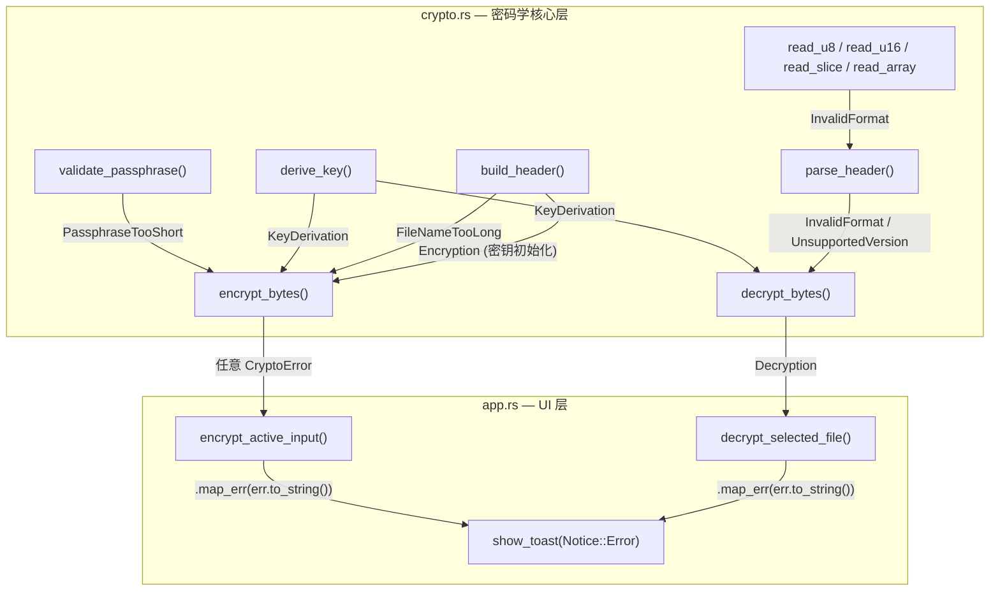

在密码学软件中，错误处理不是"锦上添花"——它是安全模型的一部分。错误的密码、被篡改的文件头部、不兼容的格式版本，这些场景都需要精确、无歧义的反馈。Encrust 采用 `thiserror` 派生一个 **统一的 `CryptoError` 枚举**，将密码学核心层中所有可预见的失败场景归类为 7 个语义明确的变体，再通过 `Result<T, CryptoError>` 在模块边界传播，最终由 UI 层转化为用户可读的 Toast 通知。本文将逐一剖析每个变体的设计意图、触发位置，以及从 `crypto.rs` 到 `app.rs` 的错误传递全链路。

Sources: [crypto.rs](src/crypto.rs#L54-L70), [app.rs](src/app.rs#L463-L484)

## CryptoError 枚举定义：七个失败场景的语义建模

`CryptoError` 使用 `thiserror` 的 `#[derive(Error)]` 宏自动实现 `std::error::Error` trait，每个变体通过 `#[error("...")]` 属性声明其面向用户的错误消息。这种做法的核心优势在于：**错误消息的定义紧邻错误类型的声明**，而不是散落在各个调用点。当开发者看到枚举定义时，就能一眼读完所有可能的失败路径及其对应的用户提示。

```rust
#[derive(Debug, Error)]
pub enum CryptoError {
    #[error("密钥长度不能少于 {MIN_PASSPHRASE_CHARS} 个字符")]
    PassphraseTooShort,
    #[error("密钥派生失败")]
    KeyDerivation,
    #[error("加密失败")]
    Encryption,
    #[error("解密失败：密钥错误或文件被篡改")]
    Decryption,
    #[error("不是有效的 Encrust 加密文件")]
    InvalidFormat,
    #[error("不支持的 Encrust 文件版本")]
    UnsupportedVersion,
    #[error("原文件名太长，无法写入当前文件格式")]
    FileNameTooLong,
}
```

这 7 个变体覆盖了从**用户输入校验**到**格式解析**再到**底层密码学操作**的完整失败谱系。值得注意的是，`Decryption` 的错误消息刻意模糊了"密钥错误"和"文件被篡改"的区别——这是密码学实践中的**安全设计原则**：不向攻击者泄露具体失败原因（即不暴露是密钥不匹配还是密文被改动），而是统一报告为解密失败。

Sources: [crypto.rs](src/crypto.rs#L54-L70)

## 错误变体触发点全景

下表按错误变体分类，精确标注每个变体在代码中的触发位置与触发条件：

| 变体 | 触发函数 | 触发条件 |
|---|---|---|
| **PassphraseTooShort** | `validate_passphrase` | 密码短于 8 个 Unicode 字符 |
| **KeyDerivation** | `derive_key` | Argon2id 参数构造失败或哈希计算失败 |
| **Encryption** | `encrypt_bytes` | AES-256-GCM 密钥初始化或加密操作失败 |
| **Decryption** | `decrypt_bytes` | AES-256-GCM 密钥初始化或解密操作失败（含密钥错误/密文篡改/AAD 不匹配） |
| **InvalidFormat** | `parse_header` / `read_*` 系列 | 魔数不匹配、KDF/Cipher 标识非法、内容类型未知、数据长度不足、UTF-8 文件名解码失败 |
| **UnsupportedVersion** | `parse_header` | 文件版本号不等于当前 `VERSION`（值为 1） |
| **FileNameTooLong** | `build_header` | 原始文件名字节数超过 `u16::MAX`（65535） |

Sources: [crypto.rs](src/crypto.rs#L76-L82), [crypto.rs](src/crypto.rs#L88-L111), [crypto.rs](src/crypto.rs#L118-L130), [crypto.rs](src/crypto.rs#L132-L152), [crypto.rs](src/crypto.rs#L162-L198), [crypto.rs](src/crypto.rs#L229-L239)

## 错误传播路径：从加密核心到用户界面

理解错误的传播方式，需要看清 `CryptoError` 如何从 `crypto.rs` 的内部函数逐层向上冒泡，最终被 `app.rs` 捕获并转化为用户可见的 Toast 通知。下面的流程图展示了这一全链路：



关键设计细节在于**两层错误转换**。在 `app.rs` 中，`CryptoError` 通过 `.map_err(|err| err.to_string())` 被转换为 `String` 类型，汇入一个以 `Result<_, String>` 为载体的 `and_then` 链中。这意味着 UI 层的 `encrypt_active_input` 和 `decrypt_selected_file` 方法将**密码学错误、I/O 错误、UI 校验错误**统一拉平为字符串，最终以 `Notice::Error(String)` 的形式传递给 `show_toast`。

Sources: [crypto.rs](src/crypto.rs#L88-L130), [app.rs](src/app.rs#L463-L499)

## 前置校验：validate_passphrase 的防御性设计

`validate_passphrase` 是 `CryptoError` 体系中**最早被调用**的校验函数。无论是加密还是解密，流程的第一步都是调用它。这个函数的设计体现了几个值得关注的决策：

```rust
pub fn validate_passphrase(passphrase: &str) -> Result<(), CryptoError> {
    if passphrase.chars().count() < MIN_PASSPHRASE_CHARS {
        return Err(CryptoError::PassphraseTooShort);
    }
    Ok(())
}
```

**第一**，使用 `chars().count()` 而非 `len()` 做长度检查。`str::len()` 返回字节数，而 `chars().count()` 返回 Unicode 标量值数量。对于中文、emoji 等多字节字符，用户直觉上的"8 个字符"与字节计数相差甚远——一个 emoji 可能占 4 个字节。选择字符计数使得"至少 8 个字符"的约束对任何语言的用户都一致。

**第二**，这个函数被 `pub` 标记为公开接口，使得 `app.rs` 可以独立调用它来做 UI 层的**实时校验**——在用户输入密码时即时显示错误提示，而无需等到点击"加密"按钮。

Sources: [crypto.rs](src/crypto.rs#L72-L82), [app.rs](src/app.rs#L317-L328)

## 解密路径的多层校验链

解密函数 `decrypt_bytes` 是 `CryptoError` 变体触发最密集的位置。它在执行过程中依次经过四个校验关卡，每一关都可能产生不同类型的错误：

**关卡 1 — 密码长度校验**：`validate_passphrase` 检查密码是否满足最低长度要求，触发 `PassphraseTooShort`。

**关卡 2 — 头部格式解析**：`parse_header` 检查魔数 `ENCRUST`、版本号、KDF/Cipher 标识、内容类型、文件名编码等，可能触发 `InvalidFormat` 或 `UnsupportedVersion`。头部解析中的 `read_*` 辅助函数族（`read_u8`、`read_u16`、`read_slice`、`read_array`）也统一返回 `InvalidFormat`，使得所有"数据不够读"的场景都被归类为格式错误。

**关卡 3 — 密钥派生**：`derive_key` 使用 Argon2id 从密码和 salt 生成 32 字节密钥，可能触发 `KeyDerivation`。

**关卡 4 — AES-GCM 认证解密**：这是最后也是最关键的关卡。AES-256-GCM 是**认证加密**模式——它同时提供机密性和完整性保证。如果密钥错误、密文被篡改、或头部（AAD）被改动，`decrypt` 调用都会失败，统一触发 `Decryption`。这种"将头部作为 AAD"的机制确保了：即使攻击者修改了文件中的明文头部字段（比如把版本号从 1 改成 2），解密也会因为认证标签不匹配而失败。

Sources: [crypto.rs](src/crypto.rs#L118-L130), [crypto.rs](src/crypto.rs#L162-L198), [crypto.rs](src/crypto.rs#L200-L223), [crypto.rs](src/crypto.rs#L229-L239)

## UI 层的双重校验策略

Encrust 的 UI 层对密码校验采用了**双重策略**，这是 `CryptoError` 设计中最值得借鉴的模式之一：

**实时校验（输入时）**：在侧边栏的密码输入框中，`render_passphrase_input` 每帧都会调用 `crypto::validate_passphrase`，当密码不为空且不满足长度要求时，立即在输入框下方显示红色错误提示。这利用了 `CryptoError` 的 `std::fmt::Display` 实现（由 `thiserror` 自动生成），通过 `err.to_string()` 获取面向用户的中文错误消息。

**按钮状态控制（操作前）**：`can_encrypt` 方法和 `render_decrypt_action` 中的 `can_decrypt` 变量都调用 `validate_passphrase` 来决定"加密"或"解密"按钮是否可点击。通过 `ui.add_enabled(can_encrypt, ...)` 的方式，当校验不通过时按钮变灰，从源头上阻止用户发起注定失败的加密/解密请求。

这种"输入时提示 + 操作前拦截"的双重策略，意味着 `PassphraseTooShort` 错误在正常操作流程中几乎不会到达核心加密函数——它在前端就被拦截了。核心函数中的 `validate_passphrase` 调用是**深度防御**的体现，确保即使 UI 逻辑被绕过（比如被其他代码直接调用），密码长度约束依然有效。

Sources: [app.rs](src/app.rs#L317-L328), [app.rs](src/app.rs#L450-L457), [app.rs](src/app.rs#L361-L367)

## 错误映射的抽象层级选择

`app.rs` 中的错误处理采用 `Result<_, String>` 作为统一的错误载体，而非直接传播 `CryptoError`。这是一个刻意的架构决策：

```rust
// encrypt_active_input 中的错误链
let result = self
    .load_active_plaintext()                          // Result<_, String>
    .and_then(|(plaintext, kind, file_name)| {
        crypto::encrypt_bytes(...)                     // Result<_, CryptoError>
            .map_err(|err| err.to_string())            // → Result<_, String>
    })
    .and_then(|encrypted| {
        io::write_file(...)                            // Result<_, io::Error>
            .map_err(|err| format!("保存失败：{err}"))  // → Result<_, String>
        ...
    });
```

`load_active_plaintext` 返回 UI 校验错误（如"请选择要加密的文件"），`encrypt_bytes` 返回密码学错误（`CryptoError`），`io::write_file` 返回 I/O 错误——三种不同来源的错误通过各自的 `.map_err` 统一转换为 `String`，汇入同一条 `and_then` 链。这种方式的权衡是：**牺牲了错误的类型化匹配能力，换取了跨层错误汇聚的简洁性**。对于 Encrust 这样一个中小型应用，所有错误最终都只需要展示为用户可读的文本，因此使用 `String` 作为"最终共同类型"是合理且务实的。

Sources: [app.rs](src/app.rs#L463-L484), [app.rs](src/app.rs#L486-L500)

## thiserror 的角色：连接 Display 与 Error trait

`thiserror` 在此项目中承担的核心职责是将 `#[error("...")]` 属性中的字符串自动转化为 `std::fmt::Display` 实现。当 `app.rs` 调用 `err.to_string()` 时，实际调用的就是 `thiserror` 生成的 `Display::fmt` 方法，将编译期定义的中文错误消息原样输出。

`PassphraseTooShort` 变体的属性 `#[error("密钥长度不能少于 {MIN_PASSPHRASE_CHARS} 个字符")]` 展示了 `thiserror` 的常量插值能力——`{MIN_PASSPHRASE_CHARS}` 在编译时被替换为常量 `8`，而非运行时字符串拼接。这确保了错误消息与实际校验逻辑的**单一事实来源**：修改 `MIN_PASSPHRASE_CHARS` 常量时，错误消息自动同步更新。

Sources: [crypto.rs](src/crypto.rs#L54-L70), [Cargo.toml](Cargo.toml#L12)

## 错误与测试：验证失败路径的正确性

项目中的单元测试覆盖了 `CryptoError` 的关键失败路径，通过 `expect_err` + `matches!` 宏的模式确保每个变体在预期条件下被正确触发：

| 测试函数 | 验证的变体 | 测试策略 |
|---|---|---|
| `rejects_short_passphrase` | `PassphraseTooShort` | 用 5 字符密码调用 `encrypt_bytes`，断言返回 `PassphraseTooShort` |
| `decrypt_rejects_wrong_passphrase` | `Decryption` | 用正确密码加密、错误密码解密，断言返回 `Decryption` |

`matches!` 宏的使用值得注意——它只检查错误的**变体类型**而不检查错误消息内容。这与密码学错误的"模糊化"理念一致：我们只关心"解密失败了"，而不需要在测试中断言具体的错误文案。而 `PassphraseTooShort` 的消息内容通过 `thiserror` 的常量插值机制已经在编译时得到了保证，不需要在测试中重复校验。

Sources: [crypto.rs](src/crypto.rs#L241-L309)

## 小结：设计原则总结

| 原则 | 体现 |
|---|---|
| **安全模糊化** | `Decryption` 不区分"密码错误"与"文件被篡改" |
| **单一事实来源** | `thiserror` 属性中的常量插值确保消息与逻辑同步 |
| **深度防御** | `validate_passphrase` 在 UI 层和核心层双重调用 |
| **关注点分离** | `crypto.rs` 返回类型化错误，`app.rs` 转换为用户可读字符串 |
| **语义精确性** | 7 个变体精确映射到 7 种不可混淆的失败场景 |

这种"核心层枚举化 + UI 层字符串化"的错误处理模式，在 Rust 桌面应用中是一种兼顾类型安全和开发效率的常见实践。`CryptoError` 作为 `crypto.rs` 模块的唯一错误出口，使得调用者无需理解底层密码学库的错误类型，也不需要处理来自 `aes_gcm`、`argon2` 等外部 crate 的异构错误——它们都已被 `map_err` 统一收口。

Sources: [crypto.rs](src/crypto.rs#L54-L70)

---

**延伸阅读**：`CryptoError` 的变体在加密和解密流程中的具体触发方式，可参考 [AES-256-GCM 对称加密与解密的实现细节](6-aes-256-gcm-dui-cheng-jia-mi-yu-jie-mi-de-shi-xian-xi-jie) 和 [自定义二进制格式的游标式解析](7-zi-ding-yi-er-jin-zhi-ge-shi-de-you-biao-shi-jie-xi-parse_header-yu-read_-fu-zhu-han-shu)；UI 层如何将错误转化为 Toast 通知，可参考 [Toast 通知系统：成功/错误状态反馈与自动消失](13-toast-tong-zhi-xi-tong-cheng-gong-cuo-wu-zhuang-tai-fan-kui-yu-zi-dong-xiao-shi)；相关单元测试的设计思路可参考 [密码学模块的单元测试设计](19-mi-ma-xue-mo-kuai-de-dan-yuan-ce-shi-she-ji-zheng-xiang-liu-cheng-fan-xiang-mi-yao-yu-ge-shi-xiao-yan)。