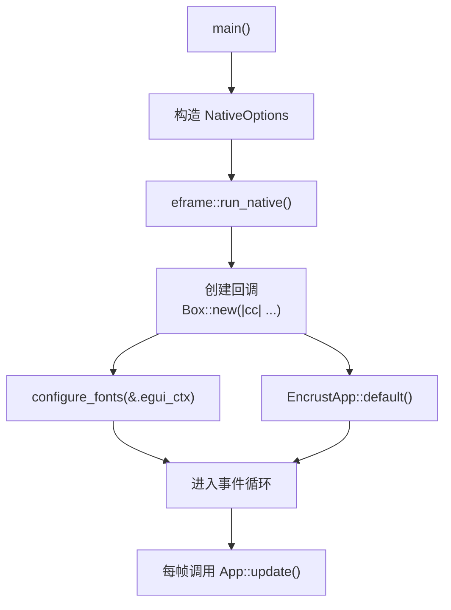
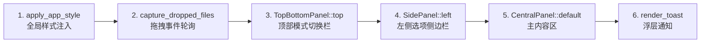
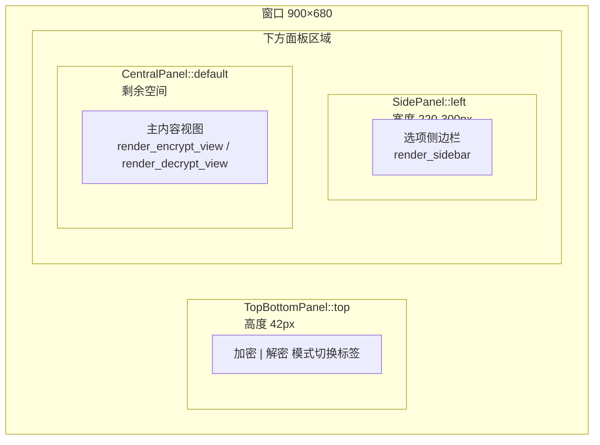

本文聚焦于 Encrust 应用的 GUI 层骨架设计——从程序入口 `main.rs` 中 `NativeOptions` 的窗口级配置，到 `app.rs` 中 `EncrustApp` 结构体的状态建模与 `eframe::App` trait 的实现。理解这一层骨架是阅读后续 UI 工作流页面（加密、解密、拖拽、Toast 等）的前提：所有用户交互都建立在本文描述的 **每帧渲染循环** 与 **面板布局结构** 之上。

Sources: [main.rs](src/main.rs#L1-L27), [app.rs](src/app.rs#L1-L163)

## 从 `main` 到 `run_native`：应用启动链路

Encrust 的 GUI 启动过程遵循 eframe 的标准三步模式：**构造配置 → 注册创建回调 → 进入事件循环**。整个调用链仅有三行核心代码，但每一行都承担了明确的职责：



`eframe::run_native` 接受三个参数：窗口标题字符串 `"Encrust"`、`NativeOptions` 配置对象、以及一个工厂闭包。该闭包的签名是 `Box<dyn FnOnce(&CreationContext) -> Result<Box<dyn App>>>`，eframe 在窗口创建完毕、首次渲染之前调用它，返回的 `App` 实例将被持有并在后续每一帧驱动 `update` 方法。闭包内做了两件事：先通过 `configure_fonts` 向 egui 上下文注入 CJK 回退字体，再构造并返回 `EncrustApp::default()` 实例。这种"在工厂闭包中做一次性初始化"的模式是 eframe 推荐的做法——它能确保 `egui_ctx` 已经就绪后再执行字体注册等副作用操作。

Sources: [main.rs](src/main.rs#L9-L27)

## `NativeOptions` 与窗口固定尺寸策略

Encrust 是一个功能边界明确的工具型应用：左侧为固定宽度的选项侧边栏，右侧为主内容区。这种布局对窗口尺寸有严格的下界要求（侧边栏 + 最小内容宽度），因此项目选择了 **完全固定窗口尺寸** 的策略：

| 配置项 | 值 | 设计意图 |
|--------|-----|----------|
| `with_inner_size` | `[900.0, 680.0]` | 初始窗口尺寸，900×680 像素 |
| `with_min_inner_size` | `[900.0, 680.0]` | 最小尺寸与初始尺寸一致 |
| `with_max_inner_size` | `[900.0, 680.0]` | 最大尺寸与初始尺寸一致 |
| `with_resizable` | `false` | 禁止用户拖拽调整窗口大小 |

三者设为同一数值并配合 `with_resizable(false)`，意味着窗口在运行期间始终为 900×680，不会因用户拖拽或系统 DPI 缩放而改变布局比例。这是一个刻意的设计权衡：**牺牲灵活性换取布局可预测性**。在 Encrust 的场景下，侧边栏宽度根据总窗口宽度分档计算（见下文），固定总宽消除了动态分档可能带来的布局抖动。

`NativeOptions` 的其余字段通过 `..Default::default()` 交给 eframe 的默认值处理，包括渲染后端选择、多线程策略、是否跟随系统主题等。值得注意的是，Encrust 并未在 `NativeOptions` 层面硬编码主题偏好，而是在 `apply_app_style` 中通过 `ctx.set_theme(egui::ThemePreference::System)` 每帧设置，这保证了主题可以在运行时跟随系统切换。

Sources: [main.rs](src/main.rs#L10-L17), [app.rs](src/app.rs#L602-L603)

## `EncrustApp` 结构体：UI 状态的单一聚合点

`EncrustApp` 是整个 GUI 层的核心数据结构，它持有所有需要在帧间持久化的 UI 状态。eframe 采用 **即时模式**（immediate mode）GUI 范式——控件不是持久对象，而是在每帧的 `update` 调用中重新声明。这意味着"应用状态"必须由开发者自己维护，而 `EncrustApp` 就是这个职责的承载者：

```rust
pub struct EncrustApp {
    operation_mode: OperationMode,       // 当前模式：加密/解密
    encrypt_input_mode: EncryptInputMode, // 加密源：文件/文本
    selected_file: Option<PathBuf>,       // 加密模式 - 已选文件路径
    text_input: String,                   // 加密模式 - 文本输入内容
    passphrase: String,                   // 密钥输入（加密/解密共用）
    encrypted_output_path: Option<PathBuf>, // 加密输出路径
    encrypted_input_path: Option<PathBuf>,  // 解密输入路径
    decrypted_text: String,                // 解密结果 - 文本
    decrypted_file_bytes: Option<Vec<u8>>,  // 解密结果 - 文件字节
    decrypted_file_name: Option<String>,    // 解密结果 - 原始文件名
    decrypted_output_path: Option<PathBuf>,  // 解密输出路径
    toast: Option<Toast>,                   // 通知状态
}
```

字段可按职责分为四组：

| 分组 | 字段 | 作用 |
|------|------|------|
| **模式控制** | `operation_mode`, `encrypt_input_mode` | 决定当前渲染哪套 UI 视图 |
| **加密流程状态** | `selected_file`, `text_input`, `encrypted_output_path` | 加密工作流所需的输入与输出路径 |
| **解密流程状态** | `encrypted_input_path`, `decrypted_text`, `decrypted_file_bytes`, `decrypted_file_name`, `decrypted_output_path` | 解密工作流的输入、中间结果与输出路径 |
| **跨流程共享** | `passphrase`, `toast` | 密钥输入（加密解密共用）与操作结果通知 |

`OperationMode` 和 `EncryptInputMode` 两个枚举均派生了 `Debug, Clone, Copy, PartialEq, Eq`。`Copy` 语义使得模式比较（`self.operation_mode == mode`）无需获取引用，代码更简洁；`PartialEq` 则用于条件渲染与状态切换守卫。`Notice` 枚举（`Success` / `Error`）和 `Toast` 结构体配合实现通知系统——`Toast` 在 `Notice` 基础上记录了 `created_at: Instant`，用于 4 秒自动消失计时。

Sources: [app.rs](src/app.rs#L19-L56)

## `Default` 实现：初始状态的明确声明

`EncrustApp` 通过手动实现 `Default` trait 而非使用 `#[derive(Default)]`，原因是部分字段（如 `Option<PathBuf>`）虽有自然默认值 `None`，但手动实现能将意图显式化——每一个 `None` 和每一个 `String::new()` 都在声明"应用启动时此字段为空"这一业务约束。默认模式下 `operation_mode` 为 `Encrypt`、`encrypt_input_mode` 为 `File`，这意味着用户首次看到的是 **加密视图的文件输入模式**。

Sources: [app.rs](src/app.rs#L58-L75)

## `App` trait 与 `update` 方法：每帧渲染的主干

`eframe::App` trait 是应用与框架之间的契约。在 Encrust 中，`EncrustApp` 只实现了 `update` 这一个必要方法：

```rust
fn update(&mut self, ctx: &egui::Context, _frame: &mut eframe::Frame)
```

eframe 在事件循环中以大约 60fps 的频率调用此方法。每一帧的执行流程遵循固定的 **五阶段管线**：



**阶段一：全局样式注入**。`apply_app_style(ctx)` 每帧重置 egui 的 `Style` 对象，包括控件间距、内边距、圆角、背景色等。在即时模式 GUI 中，样式不是"设置一次永久生效"的——`Context` 是可变的共享状态，任何面板或控件都可能修改它，因此每帧开头强制覆盖是保证视觉一致性的标准做法。

**阶段二：拖拽文件捕获**。`capture_dropped_files(ctx)` 从 egui 的输入事件中提取 `raw.dropped_files`，根据当前 `operation_mode` 分配给加密或解密流程。虽然拖拽事件发生频率极低，但每帧轮询是即时模式 GUI 处理输入的惯用方式——egui 不提供事件回调机制，所有输入必须在 `update` 中主动拉取。

**阶段三至五：三区域面板布局**。这是整个 UI 的骨架结构：



顶部栏使用 `TopBottomPanel::top("menu_bar")`，固定高度 42px，内边距归零、描边清除，形成一条干净的模式切换条。侧边栏使用 `SidePanel::left("settings")`，其宽度根据总窗口宽度分档：

| 窗口宽度 | 侧边栏宽度 | 适配目标 |
|----------|------------|----------|
| < 820px | 220px | 紧凑布局 |
| 820–1040px | 260px | 中等宽度 |
| ≥ 1040px | 300px | 宽裕布局 |

由于窗口尺寸固定为 900px，实际上 `side_width` 始终为 260px。这段分档代码的存在暗示了项目曾考虑或未来可能支持可调整窗口尺寸，当前分档逻辑作为防御性编程保留。

**阶段六：Toast 浮层**。`render_toast(ctx)` 在所有面板之后执行，使用 `egui::Area`（不受面板约束的浮动层）在窗口顶部居中渲染通知。`Area` 的 `interactable(false)` 确保通知不会拦截下方控件的鼠标事件。

Sources: [app.rs](src/app.rs#L77-L163)

## 创建回调中的字体配置

`main.rs` 中的 `configure_fonts` 函数在 `run_native` 的工厂闭包中被调用，时机是窗口已创建、首帧尚未渲染的瞬间。它的完整职责和跨平台策略将在 [CJK 字体回退机制：跨平台中文字体检测与注册](17-cjk-zi-ti-hui-tui-ji-zhi-kua-ping-tai-zhong-wen-zi-ti-jian-ce-yu-zhu-ce) 中详述，这里仅说明它在骨架中的位置：它是 `run_native` 调用链里唯一的应用级初始化逻辑，位于 `EncrustApp` 实例化之前，确保字体在后者的首帧渲染中已经可用。

Sources: [main.rs](src/main.rs#L22-L26), [main.rs](src/main.rs#L29-L55)

## 依赖版本与框架选型

Encrust 使用的 eframe 版本为 `0.31`，对应 egui `0.31`。这个版本引入了 `ViewportBuilder` API（取代了旧版 `NativeOptions` 中直接设置窗口属性的方式），提供了更灵活的视口配置能力。同时使用了 `rfd 0.15` 作为原生文件对话框的后端——它不依赖 egui 的控件系统，而是在用户点击按钮时弹出操作系统级的文件选择窗口。

Sources: [Cargo.toml](Cargo.toml#L1-L14)

## 小结：骨架设计的关键决策

回顾整个应用骨架，可以提炼出三个核心设计决策：

1. **固定窗口尺寸** —— 通过 `ViewportBuilder` 三重锁定 900×680，以布局确定性换取功能灵活性。这是工具型应用的常见选择，避免了响应式布局的复杂度。

2. **状态聚合于单结构体** —— `EncrustApp` 持有全部 UI 状态，没有分散的全局变量或额外的状态管理器。这在即时模式 GUI 中是自然的：因为控件本身不持有状态，状态必须外置到一个可变引用能触及的地方，而 `update(&mut self, ...)` 中的 `self` 就是这个位置。

3. **每帧全量重建** —— `update` 方法每帧重建整个 UI 树，包括样式设置、面板声明、控件布局。这是即时模式 GUI 的本质特征——与 retained mode（如 Qt/WinUI）不同，不存在"创建一次、后续更新"的控件对象，每帧都是一次完整的声明式构建。

理解这三点后，后续页面中讨论的加密工作流 UI、解密工作流 UI、拖拽捕获、Toast 通知等具体交互，都是在 `update` 方法的面板框架内填充的内容——它们共享同一个渲染管线，区别仅在于填充哪些控件和绑定哪些状态字段。

**阅读建议**：理解骨架后，建议按顺序阅读 [加密工作流 UI：文件选择、文本输入、输出路径与操作触发](10-jia-mi-gong-zuo-liu-ui-wen-jian-xuan-ze-wen-ben-shu-ru-shu-chu-lu-jing-yu-cao-zuo-hong-fa) 和 [解密工作流 UI：加密文件输入、结果展示与文件保存](11-jie-mi-gong-zuo-liu-ui-jia-mi-wen-jian-shu-ru-jie-guo-zhan-shi-yu-wen-jian-bao-cun)，它们分别详细说明了 `render_encrypt_view` 和 `render_decrypt_view` 的实现。