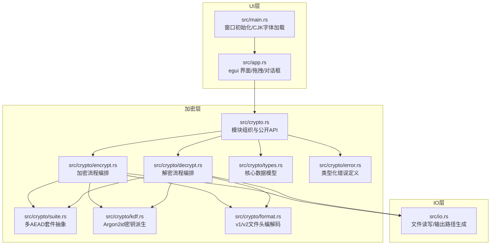

Encrust 是一个用 Rust 编写的跨平台桌面加密工具，它将现代密码学中的 AEAD  authenticated encryption、Argon2id 密钥派生和自描述文件格式整合进一个单文件可执行程序中。对于初学者而言，本项目不仅是一个可用的文件与文本加密应用，更是一份可运行的 Rust 工程化参考：它展示了如何在桌面端以类型安全的方式组织加密流程、处理跨平台 UI 字体回退、以及通过版本化文件格式保障长期向后兼容。

Sources: [Cargo.toml](Cargo.toml#L1-L28), [README.md](README.md#L1-L10)

## 为什么需要 Encrust

在日常开发或协作中，我们时常需要快速加密单个文件或一段敏感文本，但又不想引入复杂的密钥管理体系。Encrust 的设计目标正是在"简单可用"与"密码学正确"之间取得平衡：用户只需输入一个密钥短语，即可生成自包含所有解密所需元数据的 `.encrust` 文件；解密时同样只需拖入文件并输入短语，无需记忆当初使用了哪种加密算法。对于初学者来说，阅读这个项目的代码可以帮助你理解一套完整的加密数据流是如何从 UI 层贯穿到密码学原语层的。

Sources: [README.md](README.md#L11-L20), [src/crypto/decrypt.rs](src/crypto/decrypt.rs#L1-L20)

## 核心功能一览

Encrust 在功能层面围绕"加密"和"解密"两条主线展开，支持文件与文本两种内容形态，并在交互上同时兼容拖拽和系统对话框。

| 功能维度 | 具体能力 | 初学者可关注的代码位置 |
|---|---|---|
| **内容输入** | 文件拖拽、系统文件选择器、直接文本输入 | [src/app.rs](src/app.rs#L211-L250) |
| **加密套件** | AES-256-GCM（默认）、XChaCha20-Poly1305、SM4-GCM（国密） | [src/crypto/suite.rs](src/crypto/suite.rs#L15-L40) |
| **密钥派生** | Argon2id，每个文件独立随机 salt | [src/crypto/kdf.rs](src/crypto/kdf.rs#L53-L82) |
| **输出格式** | 自描述 v2 格式，内嵌算法标识与 KDF 参数快照 | [src/crypto/format.rs](src/crypto/format.rs#L45-L75) |
| **向后兼容** | 保留 v1 旧格式读取能力，自动识别版本 | [src/crypto/format.rs](src/crypto/format.rs#L105-L115) |
| **交互体验** | 暗色/浅色主题、CJK 字体回退、Toast 状态反馈 | [src/main.rs](src/main.rs#L55-L92), [src/app.rs](src/app.rs#L1-L50) |
| **跨平台分发** | macOS Universal Binary + DMG、Linux AppImage、Windows EXE | [scripts/build-macos.sh](scripts/build-macos.sh#L1-L30) |

Sources: [README.md](README.md#L11-L30), [src/crypto.rs](src/crypto.rs#L1-L37)

## 架构全景

Encrust 的源代码在逻辑上可以分为三层：**UI 层**负责窗口管理与用户交互，**加密层**负责所有密码学操作，**IO 层**负责与文件系统的最终交互。这种分层使得初学者可以独立阅读任意一层，而不必一次性理解全部细节。



初学者可以从这个架构图中获得一个关键印象：**加密层内部没有直接操作文件的代码**。所有明文和密文都以 `Vec<u8>` 的形式进出加密层，这意味着该层是完全可测试的——单元测试无需触碰磁盘即可验证加解密流程的正确性。IO 层的职责被压缩到最小，仅在 UI 调用时执行实际的读写操作。

Sources: [src/main.rs](src/main.rs#L1-L30), [src/crypto.rs](src/crypto.rs#L1-L37), [src/io.rs](src/io.rs#L1-L34)

## 加密数据流

当你点击"加密"按钮时，数据会沿着一条固定的管道流动。理解这条管道是掌握本项目设计意图的关键。首先，UI 层把用户输入的明文、内容类型（文件或文本）以及可选的原文件名传递给加密入口；随后，加密层生成独立的随机 salt 和 nonce，使用 Argon2id 将密钥短语派生为固定长度密钥；接着，构建包含所有元数据的 v2 自描述文件头，并把文件头本身作为 AAD（附加认证数据）传入 AEAD 算法；最终，密文与文件头拼接为完整的 `.encrust` 文件，由 IO 层写入用户指定的路径。解密时则反向执行：先解析文件头提取历史 salt、nonce、KDF 参数和算法标识，再重新派生密钥并验证 AEAD 标签，任何对文件头或密文的篡改都会导致解密失败。

Sources: [src/crypto/encrypt.rs](src/crypto/encrypt.rs#L1-L53), [src/crypto/decrypt.rs](src/crypto/decrypt.rs#L1-L48)

## 安全设计原则

Encrust 在工程层面贯彻了几条对初学者极具参考价值的安全原则。第一，**解密失败时不区分"密码错误"和"文件被篡改"**，统一返回"解密失败"的模糊提示，避免给攻击者提供侧信道信息。第二，**敏感数据在内存中使用 `Zeroizing` 包装**，密钥和 salt 等数据在释放时会被清零，降低在内存 dump 中残留的风险。第三，**文件头参与 AEAD 认证**，这意味着攻击者无法在不触发认证失败的情况下修改文件头中的算法标识、文件名或 KDF 参数。第四，**每个文件使用独立的随机 salt**，即使两个文件使用相同的密钥短语，它们的加密密钥也完全不同。

Sources: [src/crypto/error.rs](src/crypto/error.rs#L1-L28), [src/crypto/kdf.rs](src/crypto/kdf.rs#L53-L82), [src/crypto/suite.rs](src/crypto/suite.rs#L75-L95)

## 项目目录速览

如果你在编辑器中打开这个项目，以下目录布局可以帮助你快速定位关注点：

```
encrust/
├── Cargo.toml          # 项目元数据与依赖声明
├── src/
│   ├── main.rs         # 应用入口：窗口尺寸、图标加载、CJK 字体回退
│   ├── app.rs          # egui UI：加密/解密界面、文件拖拽、系统对话框
│   ├── crypto.rs       # 加密模块公开入口与 API 导出
│   ├── crypto/
│   │   ├── encrypt.rs  # 加密流程编排
│   │   ├── decrypt.rs  # 解密流程编排
│   │   ├── suite.rs    # 多 AEAD 套件抽象实现
│   │   ├── kdf.rs      # Argon2id 参数快照与密钥派生
│   │   ├── format.rs   # .encrust 文件头 v1/v2 编解码
│   │   ├── types.rs    # ContentKind、DecryptedPayload 等核心类型
│   │   ├── error.rs    # CryptoError 类型化错误枚举
│   │   └── tests.rs    # 单元测试
│   └── io.rs           # 文件读写与默认输出路径生成
├── scripts/
│   ├── build-macos.sh    # macOS Universal Binary + DMG 打包
│   ├── build-linux.sh    # Linux AppImage 打包
│   └── build-windows.ps1 # Windows 可执行文件构建
└── assets/
    └── appicon.png       # 应用图标资源
```

Sources: [Cargo.toml](Cargo.toml#L1-L28), [README.md](README.md#L40-L55)

## 下一步阅读建议

作为初学者，建议你按照以下顺序深入阅读，每个主题都对应导航目录中的一个独立页面：

1. **先动手运行**：[快速启动与运行](2-kuai-su-qi-dong-yu-yun-xing) 会指导你在本地编译并启动应用，验证你的开发环境。
2. **熟悉交互**：[功能导览与使用场景](3-gong-neng-dao-lan-yu-shi-yong-chang-jing) 从用户视角介绍每个按钮和输入框的行为。
3. **了解构建流程**：[构建与测试命令参考](4-gou-jian-yu-ce-shi-ming-ling-can-kao) 汇总了常用的 cargo 命令和跨平台打包脚本的使用方法。
4. **深入桌面架构**：从 [窗口生命周期与入口配置](5-chuang-kou-sheng-ming-zhou-qi-yu-ru-kou-pei-zhi) 开始，逐步理解 egui 的状态管理、主题系统和文件拖拽实现。
5. **深入加密系统**：从 [加密模块架构与公开 API 设计](10-jia-mi-mo-kuai-jia-gou-yu-gong-kai-api-she-ji) 开始，逐层剖析类型定义、文件格式、AEAD 套件和密钥派生机制。