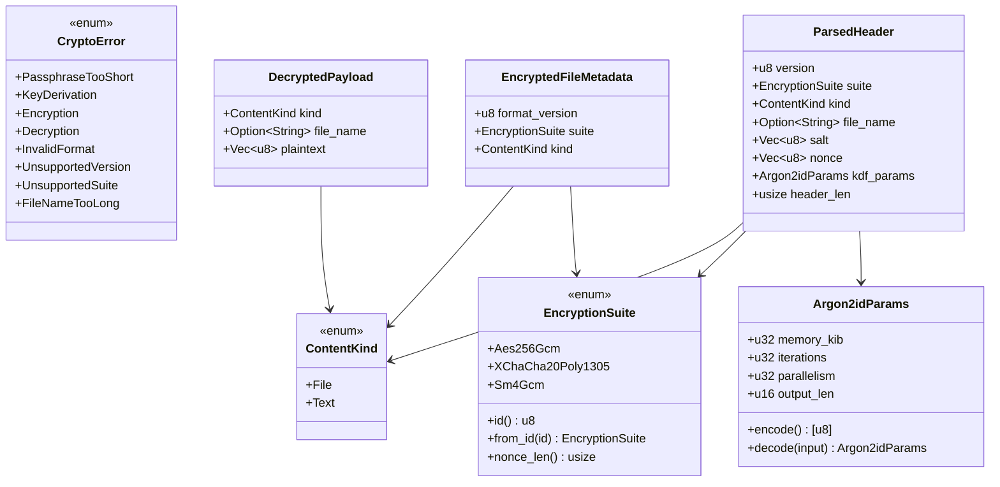

Encrust 的加密模块并非一堆函数的随意堆砌，而是建立在严格类型系统之上的分层架构。对于刚接触代码库的开发者而言，理解这些核心数据模型是掌握整个加密系统的最佳切入点——它们不仅描述了「加密前后的数据长什么样」，更承载了版本兼容、算法扩展和安全设计的关键决策。本文将逐一拆解这些类型的设计意图与协作方式，帮助你建立从类型定义到业务行为的完整认知链路。

## 为什么要为加密数据设计独立类型

在日常应用开发中，`String` 和 `Vec<u8>` 常被当作万能容器使用，但在加密场景里，这种「无差别字节流」会带来严重的语义隐患：你无法在编译期区分一段字节是用户输入的明文、随机生成的 salt、还是已经加密后的密文。Encrust 通过为不同语义赋予独立类型来解决这个问题。`ContentKind` 明确标记数据来源是文件还是文本，`EncryptionSuite` 封装算法选择，`CryptoError` 把失败场景枚举化。更关键的是，这些类型还承载了长期兼容的职责——旧文件使用什么算法、什么 KDF 参数，都作为类型实例的一部分被持久化到文件头中，而非硬编码在解密逻辑里，这确保了历史加密文件仍能被当前代码正确读取。

Sources: [types.rs](src/crypto/types.rs#L7-L10), [suite.rs](src/crypto/suite.rs#L24-L28), [error.rs](src/crypto/error.rs#L9-L26)

## 类型全景图

下图展示了 Encrust 加密模块中所有核心类型的关系。左侧五个类型是公开 API（`pub`），业务层和 UI 层可以直接使用；右侧两个类型是内部实现（`pub(super)`），它们虽不对外暴露，却是文件格式兼容性的根基。

## 公开类型：UI 与业务层的桥梁

公开类型集中在 `types.rs`、`suite.rs` 和 `error.rs` 中，并通过 `crypto.rs` 统一重新导出。它们构成了 UI 层与加密内核之间的契约边界。

### ContentKind：区分文件与文本

`ContentKind` 是一个极简的枚举，只有两个变体：`File` 与 `Text`。它的核心职责是在加密时把「这份数据 originally 是什么」这一信息写入文件头，解密后再告诉 UI 层应当如何呈现结果：如果是 `Text`，就把 `Vec<u8>` 按 UTF-8 转换为字符串展示；如果是 `File`，则提示用户保存到磁盘，并尽可能恢复原始文件名。这个设计避免了靠文件扩展名或内容嗅探来推断类型的不可靠做法，让类型本身成为可信的上下文来源。

Sources: [types.rs](src/crypto/types.rs#L5-L10)

### EncryptedFileMetadata：无需密码即可查看的信息

当你把一个 `.encrust` 文件拖入应用窗口，界面需要在用户输入密码前就展示一些基本信息，比如文件格式版本和加密算法。`EncryptedFileMetadata` 正是为了这个场景设计的。它只包含三个公开字段——`format_version`、`suite` 和 `kind`——并且刻意排除了 salt、nonce 等任何与密钥相关的材料。这种「去敏感化」的设计使得元数据可以安全地用于日志记录和界面预览，而不会泄露有助于暴力破解的信息。

Sources: [types.rs](src/crypto/types.rs#L12-L20)

### DecryptedPayload：解密后的完整结果

解密成功后的返回值不是裸字节，而是一个结构化的 `DecryptedPayload`。它包含 `kind`、`file_name` 和 `plaintext` 三个字段，其中 `plaintext` 对文件和文本统一使用 `Vec<u8>` 表示，具体的解释方式由 `kind` 决定。这种设计让数据的「含义」与数据本身一起流动：调用方不需要额外维护状态来记住「这是从哪个文件解密出来的」，因为文件名和类型信息都随着解密结果一并返回。对于需要恢复原始文件名的场景，即使经过多次函数传递，`file_name` 也不会丢失。

Sources: [types.rs](src/crypto/types.rs#L22-L30)

### EncryptionSuite：多算法支持的基石

`EncryptionSuite` 是 Encrust 支持多算法的核心抽象，它把底层不同密码库的实现差异封装成一个统一的枚举。对外它提供三层接口：首先是 `available_for_encryption()`，为 UI 下拉框提供可选列表，其中 AES-256-GCM 被固定放在第一位作为默认推荐；其次是 `display_name()`，把内部的技术名称转换为面向用户的中文标签；最重要的是 `id()` 与 `from_id()` 这对方法，它们负责枚举变体与文件头中稳定编号的双向映射。这里的设计原则是：枚举在内存中的排列顺序与文件格式完全解耦，真正持久化的是 `id()` 的返回值。因此，即使未来调整 UI 展示顺序、新增算法或重命名变体，已经发布的旧文件依然能被正确识别和解密。

Sources: [suite.rs](src/crypto/suite.rs#L24-L68)

### CryptoError：类型化错误与安全模糊策略

错误处理在加密系统中不仅是用户体验问题，更是安全工程问题。`CryptoError` 使用 `thiserror` 派生，把所有失败场景都变成显式的枚举变体，从密钥短语太短到文件格式不合法，每一种情况都有独立的变体和中文错误文案。特别值得注意的是安全层面的刻意模糊：它不会区分「密码错误」和「密文被篡改」，两者都统一映射为 `Decryption` 变体。这是因为详细的错误信息可能帮助攻击者缩小猜测范围，而统一的错误文案则消除了这种侧信道风险。UI 层可以直接把这些错误字符串展示给用户，无需再做二次翻译。

Sources: [error.rs](src/crypto/error.rs#L8-L26)

## 内部类型：兼容性与安全的关键

公开类型解决了「如何与加密模块交互」的问题，而内部类型则解决了「如何保证五年后仍能解密今天创建的文件」的问题。以下两个类型虽然不会出现在 UI 或业务层的代码中，但它们是 Encrust 长期兼容能力的基石。

### Argon2idParams：参数快照实现向前兼容

Argon2id 是 Encrust 使用的密钥派生函数，其成本参数——内存消耗、迭代次数、并行度和输出长度——决定了暴力破解的难度。`Argon2idParams` 把这四个数字打包成一个可复制、可编码的结构体，并提供 `encode` 和 `decode` 方法与 v2 文件头进行双向转换。这个类型的存在意义在于「参数快照」：安全标准会随时间推移而提高，也许未来默认迭代次数会从 2 次提升到 4 次，但每个文件在创建时就已经把自己的参数固化在头部。解密时，系统读取文件自带的 `Argon2idParams` 实例，而不是使用当前版本的默认值，这确保了无论默认配置如何演进，旧文件总能按「出生时的参数」被正确还原。

Sources: [kdf.rs](src/crypto/kdf.rs#L12-L51)

### ParsedHeader：文件头的结构化内存表示

如果把 `.encrust` 文件头比作加密文件的「身份证」，那么 `ParsedHeader` 就是这张身份证在内存中的结构化副本。它汇集了版本号、算法、内容类型、原始文件名、salt、nonce、KDF 参数和头部长度等所有元数据。加密流程根据输入参数构建它，再将其序列化为二进制头部；解密流程则先从二进制中还原它，再基于其中的 `suite` 和 `kdf_params` 继续派生密钥、执行解密。`ParsedHeader` 的所有字段都来自文件本身而非代码硬编码，这是版本兼容策略的第二个支柱——解密流程只信任文件自述的信息，不信任当前软件的默认配置。

Sources: [format.rs](src/crypto/format.rs#L37-L46)

## 类型系统如何保障长期兼容

Encrust 的长期兼容策略可以概括为「文件即真相」。当 `decrypt_bytes` 被调用时，它首先通过 `parse_header` 把文件头解析为 `ParsedHeader`，此时 `EncryptionSuite::from_id()` 根据文件头里的稳定编号还原算法，`Argon2idParams::decode()` 还原 KDF 成本参数，`ContentKind` 还原内容类型。后续所有操作——密钥派生、AEAD 解密、结果组装——都严格基于这些从文件中读取的类型实例，而非当前代码中的任何默认值。这套机制使得 v1 格式的旧文件在 v2 代码库中依然能够被自动识别并正确解密，而未来若引入 v3 格式，也只需扩展解析分支和对应的类型字段，无需重写核心解密逻辑。

Sources: [format.rs](src/crypto/format.rs#L84-L92), [decrypt.rs](src/crypto/decrypt.rs#L12-L26)

## 核心类型快速参考

| 类型 | 可见性 | 核心职责 | 所在文件 |
|---|---|---|---|
| `ContentKind` | `pub` | 标记明文是文件还是文本 | `types.rs` |
| `EncryptedFileMetadata` | `pub` | 无需密码即可读取的元数据 | `types.rs` |
| `DecryptedPayload` | `pub` | 解密后的完整结果，含类型与文件名 | `types.rs` |
| `EncryptionSuite` | `pub` | 封装三种 AEAD 算法的选择与转换 | `suite.rs` |
| `CryptoError` | `pub` | 类型化错误，统一解密失败表述以消除侧信道 | `error.rs` |
| `Argon2idParams` | `pub(super)` | KDF 参数快照，保证向前兼容 | `kdf.rs` |
| `ParsedHeader` | `pub(super)` | 文件头的结构化内存表示，驱动加解密流程 | `format.rs` |

## 继续深入

掌握了这些核心类型后，你可以沿着加密系统的内部链路继续深入：阅读 [自描述文件格式与版本兼容策略](12-zi-miao-shu-wen-jian-ge-shi-yu-ban-ben-jian-rong-ce-lue) 了解 `ParsedHeader` 如何被序列化为二进制文件头，以及 v1 与 v2 格式的差异；接着在 [多 AEAD 套件抽象与实现](13-duo-aead-tao-jian-chou-xiang-yu-shi-xian) 中探究 `EncryptionSuite` 如何调用底层密码库完成真正的加密运算；随后查看 [Argon2id 密钥派生与参数快照](14-argon2id-mi-yao-pai-sheng-yu-can-shu-kuai-zhao) 理解 `Argon2idParams` 与 `derive_key` 的协作细节。如果你更关注这些类型在业务层如何被调用和组合，可以直接跳到 [加密与解密流程编排](15-jia-mi-yu-jie-mi-liu-cheng-bian-pai)。