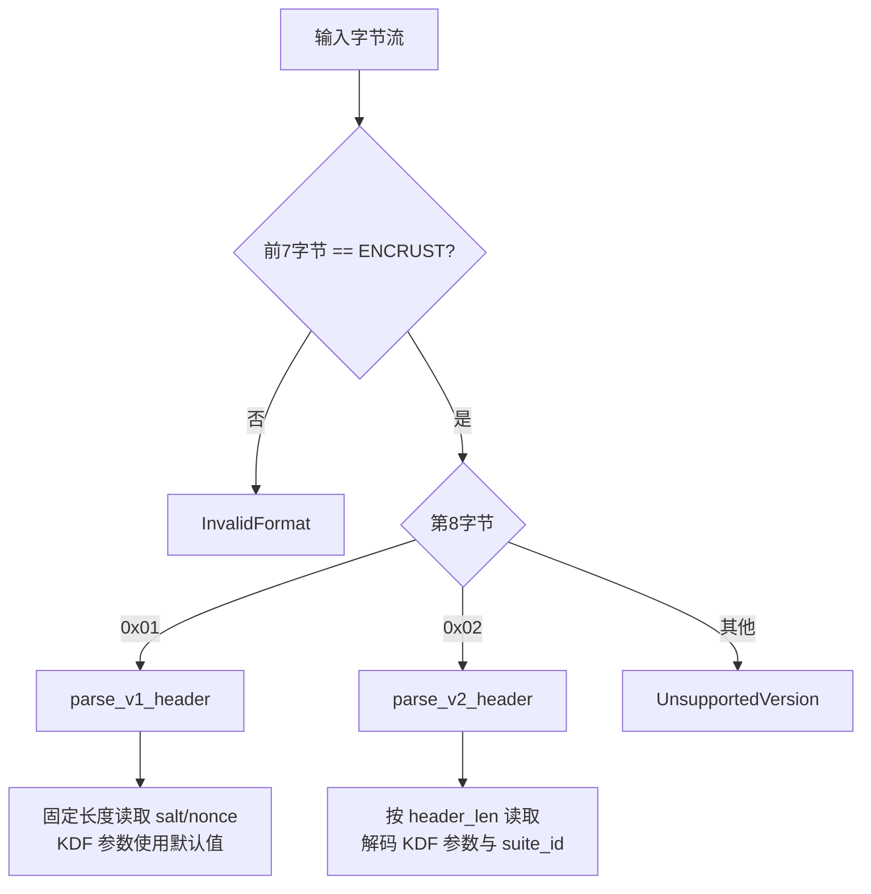

Encrust 的 `.encrust` 文件并非简单的"密文 + 元数据"拼接，而是一套**带版本分发的自描述二进制格式**。它的核心设计目标是：即使未来默认加密算法、KDF 成本参数或 nonce 长度发生变化，曾经加密的旧文件也必须能在新版本中自动识别并按当年的参数解密，无需用户手动选择算法或维护兼容性配置。本文将从格式演进、字节布局、版本分发逻辑与工程价值四个维度，深入解析这套机制。

## 从 v1 到 v2：固定格式走向自描述

Encrust 的文件格式经历过一次关键迭代。**v1 是早期固定格式**，它在文件头中按固定顺序写入版本号、KDF 标识、算法标识、内容类型、文件名长度、文件名、salt 和 nonce。由于 salt 和 nonce 长度被硬编码为 16 字节与 12 字节，且算法被锁定为 Argon2id + AES-256-GCM，v1 天然无法支持未来引入的其他 AEAD 套件（如 XChaCha20-Poly1305 或 SM4-GCM），也无法在文件头中记录 KDF 的成本参数。这意味着一旦默认参数提升，旧文件的解密就只能依赖代码中的硬编码默认值，形成隐式契约。

**v2 自描述格式**解决了这个问题。它在文件头中显式写入加密套件 ID、KDF 参数快照、salt 长度、nonce 长度以及一个总头部长度字段。每一个旧文件都携带了"当年加密时的完整上下文"，解密器不再依赖任何全局默认假设。

下表对比了两种格式的关键差异：

| 维度 | v1（Legacy） | v2（Current） |
|---|---|---|
| 版本常量 | `LEGACY_VERSION_V1 = 1` | `CURRENT_VERSION = 2` |
| 算法选择 | 固定 AES-256-GCM | 通过 `suite.id()` 自描述 |
| KDF 参数 | 隐式默认值（不写入文件） | `Argon2idParams.encode()` 14 字节快照 |
| salt/nonce 长度 | 硬编码 16 / 12 | 变长写入，解析时按声明长度读取 |
| 头部边界 | 无 `header_len`，靠固定字段顺序推算 | 显式 `header_len`（2 字节 BE u16） |
| 兼容性 | 生产代码已停止写入 | 所有新文件默认写入，同时保留 v1 读取能力 |

Sources: [format.rs](src/crypto/format.rs#L7-L27)

## v2 文件头的字节级布局

v2 文件头采用大端序（Big-Endian）编码，所有长度字段都经过 `u16` 或 `u8` 转换并在越界时返回 `CryptoError::InvalidFormat`，确保恶意构造的输入不会触发 panic。其结构可分为**固定前缀**与**自描述元数据**两部分。

固定前缀占 10 字节：`MAGIC`（7 字节 `"ENCRUST"`）+ `version`（1 字节）+ `header_len`（2 字节）。`header_len` 是 v2 最重要的设计改进之一：它精确标记了文件头结束位置，使解析器能够明确区分"已认证的头部"与"密文起始点"，也为 `cursor != header_len` 的严格校验提供了依据。

自描述元数据按顺序包含：加密套件 ID（1 字节）、内容类型（1 字节）、KDF 标识（1 字节）、文件名长度（2 字节）、文件名内容（变长）、KDF 参数标识（1 字节）、KDF 参数长度（2 字节，当前固定 14）、KDF 参数体（memory/iterations/parallelism/output_len 各 4/4/4/2 字节）、salt 长度（1 字节）、salt 内容（变长）、nonce 长度（1 字节）、nonce 内容（变长）。

下图展示了 v2 文件头的完整字节流向与 AEAD 认证覆盖范围：

`build_v2_header` 在编码时会先计算 `metadata_len`，再推导 `header_len`，最后按顺序写入。任何字段的越界（如文件名超过 `u16::MAX`）都会在编码阶段提前失败，避免写入半截文件。Sources: [format.rs](src/crypto/format.rs#L48-L95)

## 版本分发与兼容解析

兼容性的关键入口是 `parse_header`。它不做任何算法假设，仅读取前 7 字节的 `MAGIC` 和第 8 字节的版本号，随后通过 `match` 将字节流分发给对应的解析器。v1 走 `parse_v1_header`，v2 走 `parse_v2_header`，未知版本返回 `CryptoError::UnsupportedVersion`。

v1 解析器没有 `header_len` 字段，因此只能按固定顺序和固定长度读取。读取完成后，它用 `Argon2idParams::default()` 补齐缺失的参数。这是一个**显式的向后兼容决策**：旧文件虽然没有记录参数，但 v1 时代使用的正是当时的默认值，因此用当前代码中的默认结构体实例还原历史参数是安全的。v2 解析器则严格得多：它先读取 `header_len`，然后要求游标 `cursor` 在消费完所有字段后必须精确等于 `header_len`，否则返回 `InvalidFormat`。这种"精确消费"策略防止了截断攻击和多余字节注入。

Sources: [format.rs](src/crypto/format.rs#L97-L144), [format.rs](src/crypto/format.rs#L146-L202)

## 自描述设计的工程价值

v2 格式的真正价值不在于当前支持多少算法，而在于它为未来的算法演进提供了**无需配置文件的长期兼容通道**。

**加密套件演进**：`EncryptionSuite` 的枚举顺序不影响文件格式，真正持久化的是稳定的 `id()`。当未来新增套件时，只需分配新的 id 并在 `from_id` 中注册映射；旧文件依然携带自己的历史 id，解密时会自动路由到正确的算法实现。UI 层的 `available_for_encryption()` 只决定用户"现在能选什么"，绝不参与解密路径。Sources: [suite.rs](src/crypto/suite.rs#L15-L60)

**KDF 参数快照**：Argon2id 的 memory、iterations、parallelism 和 output_len 被编码为 14 字节写入文件头。这意味着即使未来出于安全考虑提高了默认成本参数，旧文件仍能用当年的低成本参数完成密钥派生。`Argon2idParams::decode` 严格校验输入长度必须等于 `V2_KDF_PARAMS_LEN`，防止同一版本号下悄悄改变结构。Sources: [kdf.rs](src/crypto/kdf.rs#L11-L62)

**salt/nonce 长度解耦**：不同 AEAD 套件对 nonce 长度有不同要求（AES-256-GCM 需要 12 字节，XChaCha20-Poly1305 需要 24 字节）。v2 在文件头中记录 `nonce_len`，并在解析时校验 `nonce_len == suite.nonce_len()`，使多套件共存成为可能。SM4-GCM 虽然与 AES-256-GCM 使用相同的 12 字节 nonce，但通过不同的 `suite_id` 区分，且其 128-bit 密钥需求通过在派生后的 32 字节材料中取前 16 字节满足，这一规则也由 suite id 与文件格式共同固定。Sources: [suite.rs](src/crypto/suite.rs#L62-L69), [suite.rs](src/crypto/suite.rs#L111-L128)

## 解析器的防御性设计

文件格式解析是二进制安全的第一道防线。Encrust 在 `format.rs` 中建立了多层防御：

所有读取操作都通过 `read_slice` 完成，它使用 `cursor.checked_add(len)` 进行无溢出边界检查，任何越界都返回 `InvalidFormat` 而非 panic。`read_u8`、`read_u16`、`read_array` 均建立在此之上。v2 解析结束时执行 `cursor != header_len` 的严格校验，确保攻击者无法通过插入或删除字节改变头部语义而不被发现。此外，整个文件头（从 `MAGIC` 到 `nonce` 的最后一个字节）都被作为 AEAD 的附加认证数据（AAD）传入加密/解密函数，意味着任何对头部的篡改——无论是修改版本号、替换 suite id 还是调整 salt——都会导致 AEAD 校验失败。Sources: [format.rs](src/crypto/format.rs#L234-L267), [suite.rs](src/crypto/suite.rs#L73-L95)

## 向后兼容的测试保障

兼容性承诺不能仅靠代码审查维持，必须有自动化测试兜底。`tests.rs` 中保留了完整的 `encrypt_bytes_v1_for_test` 与 `build_v1_header_for_test`，它们用与 v1 时代完全相同的固定字段顺序生成测试数据。`decrypts_legacy_v1_payloads` 测试用例确保每次 CI 运行都会验证：v2 时代的解密器仍然能够解开 v1 格式的密文。这种"在生产代码中只写最新版本，但在测试中保留旧版本写入器"的策略，既避免了格式分叉，又提供了长期的回归保护。

Sources: [tests.rs](src/crypto/tests.rs#L175-L189), [tests.rs](src/crypto/tests.rs#L206-L258)

## 小结

Encrust 的自描述文件格式通过**显式元数据 + 版本分发 + 严格解析边界**三者的结合，实现了加密领域的"时光机"特性：旧文件自带解密所需的全部历史上下文，新代码无需维护兼容性配置表即可正确读取。对于开发者而言，理解 `parse_header` 的分发逻辑、`build_v2_header` 的字节布局以及 `Argon2idParams` 的快照机制，是掌握 Encrust 加密管线数据流的基础。若希望进一步了解多套件抽象的接口设计，可继续阅读 [多 AEAD 套件抽象与实现](13-duo-aead-tao-jian-chou-xiang-yu-shi-xian)；若对密钥派生的参数细节感兴趣，可参阅 [Argon2id 密钥派生与参数快照](14-argon2id-mi-yao-pai-sheng-yu-can-shu-kuai-zhao)。