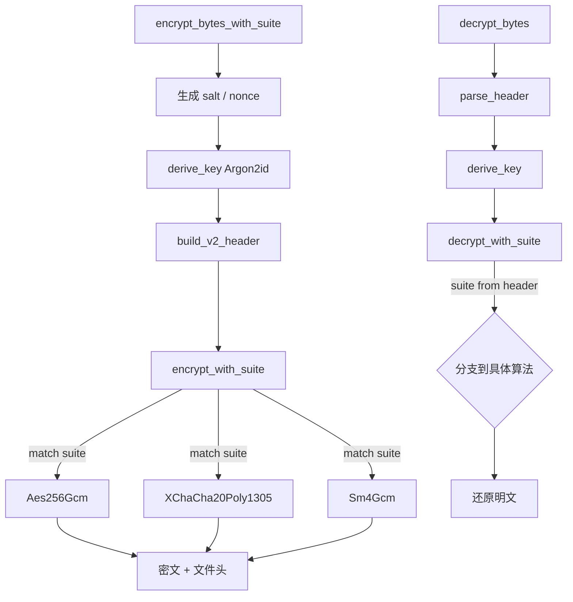

Encrust 的加密核心需要同时支持国际主流算法与国密标准，且必须保证未来新增算法时旧文件仍可解密。为此，项目在 `suite` 模块中建立了一层薄而稳定的 AEAD 抽象：以 `EncryptionSuite` 枚举作为唯一标识，通过稳定的数值 ID 与文件格式解耦，再借助统一的 `encrypt_with_suite` / `decrypt_with_suite` 入口将运行时请求分发给底层具体实现。这种设计让算法选择只影响加密时的单次调用，而不会把算法细节泄漏到文件格式解析、密钥派生或 UI 状态管理的其他环节。

## 设计目标与核心原则

AEAD 套件层的设计遵循三条原则：第一，**枚举顺序不可变语义**，UI 展示顺序的调整不能影响已发布文件的解密能力，因此真正持久化的是稳定的 `u8` ID 而非枚举的内存布局；第二，**加密走配置、解密走文件头**，加密时可以由用户或默认值选择套件，但解密时完全依据文件头内记录的 suite id 自动还原，杜绝因默认算法升级导致旧文件无法读取的风险；第三，**统一密钥材料长度、按需截断**，密钥派生统一输出 32 字节，各套件在入口函数内部按自身密钥长度截取，避免 KDF 层为不同算法维护多组参数。这三条原则共同保证了算法横向扩展时的向后兼容性。

Sources: [suite.rs](src/crypto/suite.rs#L15-L69), [decrypt.rs](src/crypto/decrypt.rs#L8-L27)

## EncryptionSuite 枚举与稳定标识符

`EncryptionSuite` 枚举当前包含三个变体：`Aes256Gcm`、`XChaCha20Poly1305` 与 `Sm4Gcm`。每个变体通过 `id()` 方法映射到一个永不复用的 `u8` 编号（分别为 1、2、3），该编号在 v2 文件头中占据一个字节。`from_id()` 负责在解密时从文件头还原枚举，若遇到未知编号则返回 `CryptoError::UnsupportedSuite`。这种显式编号策略确保了即使未来在 Rust 源码中调整枚举定义顺序，已写入磁盘的旧文件依然能被正确识别。此外，`available_for_encryption()` 提供供 UI 下拉框使用的静态列表，将 `Aes256Gcm` 置于首位作为默认推荐；`display_name()` 则提供面向用户的中文化展示文本，避免把内部 ID 暴露到界面层。

Sources: [suite.rs](src/crypto/suite.rs#L19-L60), [types.rs](src/crypto/types.rs#L15-L20)

## 统一加密/解密接口的分发模式

`suite` 模块对外只暴露两个函数：`encrypt_with_suite` 与 `decrypt_with_suite`。它们的签名完全一致，接受 `EncryptionSuite`、`key`、`nonce`、`plaintext/ciphertext` 以及 `aad`（附加认证数据）。函数内部通过 `match suite` 将调用分发给对应的底层 crate：AES-256-GCM 使用 `aes_gcm::Aes256Gcm`，XChaCha20-Poly1305 使用 `chacha20poly1305::XChaCha20Poly1305`，SM4-GCM 则通过 `aes_gcm::AesGcm<Sm4, U12>` 构造。这种“统一入口 + 内部分发”的模式让调用方（`encrypt.rs` 与 `decrypt.rs`）无需关心具体算法的类型差异，只需准备正确的 `key` 与 `nonce` 即可。

Sources: [suite.rs](src/crypto/suite.rs#L72-L185)

## 各套件的技术差异与适配策略

尽管三个套件都遵循 AEAD 接口，但它们在密钥长度与 nonce 长度上存在差异，这是抽象层必须消化的核心复杂度。AES-256-GCM 与 XChaCha20-Poly1305 均使用 256-bit 密钥，但 nonce 长度分别为 12 字节与 24 字节；SM4-GCM 作为 128-bit 分组密码，其有效密钥长度仅为 16 字节。为了不对上游 KDF 层引入分支逻辑，`suite` 层约定：Argon2id 始终派生 32 字节主密钥材料，SM4-GCM 在加密/解密入口中固定取前 16 字节使用。这一规则由 suite id 与 v2 文件头共同锁定，未来不得静默变更，否则已加密的 SM4 文件将全部失效。

Sources: [suite.rs](src/crypto/suite.rs#L10-L13), [suite.rs](src/crypto/suite.rs#L111-L128)

## nonce 长度校验与文件头协作

v2 文件头在写入时会将 `nonce_len` 作为单字节元数据嵌入，解析时通过 `suite.nonce_len()` 进行交叉校验：若文件头声明的 nonce 长度与当前 suite 期望的长度不符，则立即返回 `CryptoError::InvalidFormat`。这一校验在 `format.rs` 的 `parse_v2_header` 中完成，防止了因文件头损坏或恶意篡改导致的缓冲区溢出或错误解密。与此同时，`encrypt.rs` 在生成 nonce 时依据 `suite.nonce_len()` 动态分配随机字节，使得新增支持不同 nonce 长度的算法时无需修改流程编排代码。

Sources: [format.rs](src/crypto/format.rs#L180-L186), [encrypt.rs](src/crypto/decrypt.rs#L38-L41)

## 套件特性对比

| 特性 | AES-256-GCM | XChaCha20-Poly1305 | SM4-GCM |
|:---|:---|:---|:---|
| 底层 crate | `aes-gcm` | `chacha20poly1305` | `sm4` + `aes-gcm` |
| 密钥长度 | 32 字节 | 32 字节 | 16 字节（取 32 字节前段） |
| Nonce 长度 | 12 字节 | 24 字节 | 12 字节 |
| 稳定 ID | `1` | `2` | `3` |
| 显示名称 | AES-256-GCM（推荐） | XChaCha20-Poly1305 | SM4-GCM（国密） |
| 硬件加速 | AES-NI | 无特定要求 | 视平台实现 |
| 适用场景 | 通用默认、高性能 | 移动端/无 AES-NI | 国密合规场景 |

Sources: [Cargo.toml](Cargo.toml#L17-L26), [suite.rs](src/crypto/suite.rs#L26-L68)

## 与加密流程的交互关系

AEAD 套件层处于整个加密管道的最末端：上游的 `encrypt.rs` 负责生成 salt/nonce、调用 KDF 派生密钥、构建文件头，随后将密钥与 nonce 连同已构建的文件头（作为 AAD）一并传入 `encrypt_with_suite`；下游的密文则直接与文件头拼接形成最终输出。解密流程对称：`decrypt.rs` 解析文件头后，依据头内还原出的 `EncryptionSuite` 调用 `decrypt_with_suite`，并将文件头整体作为 AAD 传入以验证其完整性。套件层自身不处理文件格式、不参与密钥派生、不接触 UI 状态，这种单一职责划分使得任何算法的增删都局限于 `suite.rs` 内部，而不会影响流程编排或格式兼容逻辑。

Sources: [encrypt.rs](src/crypto/encrypt.rs#L28-L52), [decrypt.rs](src/crypto/decrypt.rs#L12-L34)

## 向后兼容与扩展性考量

当前抽象为未来的算法扩展预留了明确路径：新增套件只需在 `EncryptionSuite` 中添加变体、分配新的未使用 ID、实现对应的 `id()` / `from_id()` / `nonce_len()` 分支，并在 `encrypt_with_suite` 与 `decrypt_with_suite` 中补充 match arm 即可。由于 v2 文件头已经记录了 suite id 与 nonce_len，旧客户端遇到新 ID 会自然返回 `UnsupportedSuite`，而不会产生未定义行为；新客户端则能在不破坏旧文件读取的前提下支持新算法。需要特别强调的是，**已发布的 suite id 永远不可复用**，即使某个算法被弃用，其编号也应永久保留，以防止旧文件被误解析为其他算法。

Sources: [suite.rs](src/crypto/suite.rs#L15-L18), [error.rs](src/crypto/error.rs#L22-L24)

如需深入了解密钥派生的具体参数设计与快照机制，可继续阅读 [Argon2id 密钥派生与参数快照](14-argon2id-mi-yao-pai-sheng-yu-can-shu-kuai-zhao)；若关注文件头如何将 suite id 与 AAD 结合以保护元数据完整性，请参阅 [AEAD 认证附加数据与文件头安全机制](16-aead-ren-zheng-fu-jia-shu-ju-yu-wen-jian-tou-an-quan-ji-zhi)。