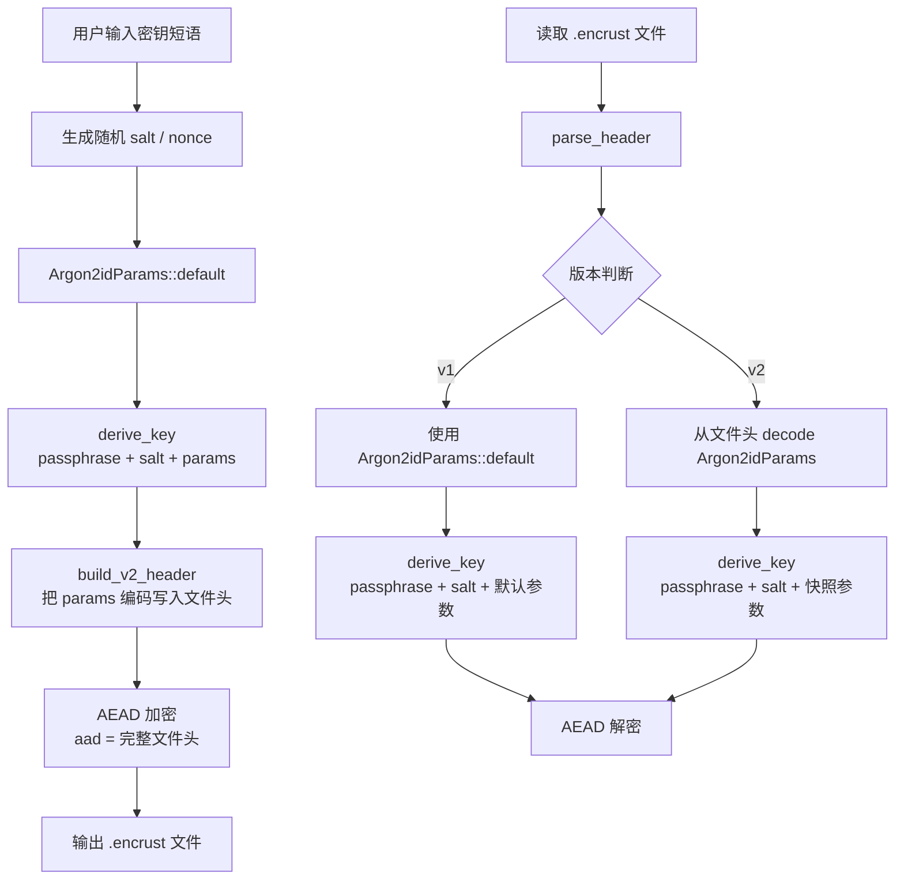

Encrust 将用户输入的可变长度密钥短语转换为固定长度、高熵的加密密钥，这一转换完全依赖 Argon2id 密钥派生函数（KDF）。与直接把密钥短语截断或填充成 AES key 的做法不同，Argon2id 通过可调控的内存困难性（memory-hardness）大幅抬高暴力破解成本；而「参数快照」机制则把每次加密时使用的 KDF 成本参数原样写入文件头，确保即使未来默认参数升级，旧文件仍能用当年的成本配置完成解密。本文将剖析参数快照的数据结构、编码布局，以及 KDF 在加解密流程中的精确调用位置。

## 为什么需要密钥派生

用户输入的密钥短语通常是短字符串，长度和熵都不可控，不能直接作为 AEAD 算法的密钥。KDF 的核心任务是把低质量的输入材料与文件独有的随机 salt 结合，通过计算密集型变换输出固定长度的高熵密钥。Argon2id 是密码哈希竞赛（Password Hashing Competition）的胜出算法，兼具对 GPU/ASIC 攻击的内存困难抵抗，以及通过数据独立访问路径实现的侧信道抵抗力。Encrust 选用 `argon2` crate 的 `Argon2id` 变体与 `Version::V0x13`，对应 Argon2 的最终推荐版本。

加密时，每个文件都会独立生成 16 字节随机 salt，`derive_key` 把 passphrase、salt 和参数快照一起送入 Argon2id，最终输出 32 字节主密钥材料。该主密钥随后由 AEAD 套件直接使用（如 AES-256-GCM）或截断使用（如 SM4-GCM 取前 16 字节）。这个设计把「用户记忆负担」与「密码学安全强度」解耦：用户可以记住较短的口令，而攻击者必须承担 Argon2id 设定的内存与计算成本才能尝试暴力破解。

Sources: [kdf.rs](src/crypto/kdf.rs#L64-L88), [encrypt.rs](src/crypto/encrypt.rs#L38-L46)

## 参数快照：向前兼容的基石

Argon2id 的成本参数——内存、迭代次数、并行度——会直接影响派生速度和安全性。如果把这些参数硬编码在代码里，未来一旦提高默认值，所有旧文件将无法还原出相同的密钥。Encrust 的解决策略是「参数快照」：每次加密时把实际使用的 Argon2id 参数写入 v2 文件头，解密时从文件头读出历史参数再执行派生。

参数快照由 `Argon2idParams` 结构体表示，包含四个字段：

| 字段 | 类型 | 默认值 | 含义 |
|------|------|--------|------|
| `memory_kib` | `u32` | `19_456` (19 MiB) | 内存使用量，单位为 KiB |
| `iterations` | `u32` | `2` | 时间成本（迭代轮数） |
| `parallelism` | `u32` | `1` | 并行线程数 |
| `output_len` | `u16` | `32` | 输出密钥长度（字节） |

当前默认值经过权衡：19 MiB 内存占用对桌面端无压力，却能显著抬升大规模硬件暴力破解的成本；迭代次数为 2 是在交互式场景下响应速度与安全性的折中；并行度设为 1 是因为桌面应用通常面对单文件加密，过高的线程数对用户体验收益有限。这些默认值在代码中以常量形式集中定义，便于后续统一调整。

Sources: [kdf.rs](src/crypto/kdf.rs#L7-L20)

## v2 文件头中的参数编码

`Argon2idParams` 实现了对称的 `encode` 与 `decode` 方法，把四个字段序列化为固定 14 字节的大端序二进制块，直接嵌入 v2 文件头的 `KDF_ARGON2ID` 参数段。编码布局如下：

```text
 0          3  4          7  8         11 12 13
+------------+------------+------------+------+
| memory_kib | iterations | parallelism| out  |
|  (4 bytes) |  (4 bytes) |  (4 bytes) | (2B) |
+------------+------------+------------+------+
```

v2 文件头在写入这 14 字节之前，会先写入 `KDF_ARGON2ID` 标识符（1 字节）和参数块长度 `V2_KDF_PARAMS_LEN`（2 字节），形成自描述的「类型-长度-值」（TLV）结构。解析时，`parse_v2_header` 先按长度读取参数块，再调用 `Argon2idParams::decode` 还原字段；同时校验 `output_len` 是否等于 `KEY_LEN`（32），防止格式异常导致密钥长度不匹配。

这里有一条重要的工程原则：v2 当前只接受固定长度参数块。如果未来需要扩展 Argon2id 参数或支持新的 KDF，应当引入新的文件格式版本号，而不是在同一版本内悄悄改变结构。这种「版本即契约」的策略避免了旧解析器对新文件的误读。

Sources: [kdf.rs](src/crypto/kdf.rs#L33-L62), [format.rs](src/crypto/format.rs#L24-L25), [format.rs](src/crypto/format.rs#L170-L178)

## 加密与解密中的 KDF 调用链路

参数快照机制使得加密和解密两条路径对 KDF 的调用形成清晰的非对称关系：加密方使用当前代码的默认参数，解密方则完全信任文件头中的历史参数。



在加密路径中，`encrypt_bytes_with_suite` 创建 `Argon2idParams::default()`，立即把它同时传给 `derive_key` 和 `build_v2_header`。这保证了「生成密钥所用的参数」与「写入文件的参数」绝对一致，不存在参数漂移。

在解密路径中，`decrypt_bytes` 调用 `parse_header` 得到 `ParsedHeader`，其中的 `kdf_params` 字段对 v1 文件回退为默认值，对 v2 文件则是从文件头解码出的历史值。随后 `derive_key` 使用这些参数与 salt 重新派生密钥。由于文件头整体作为 AEAD 的附加认证数据（AAD），任何对参数块的篡改都会在 AEAD 校验阶段暴露，确保参数快照的完整性。

Sources: [encrypt.rs](src/crypto/encrypt.rs#L29-L52), [decrypt.rs](src/crypto/decrypt.rs#L12-L34), [format.rs](src/crypto/format.rs#L33-L42)

## 内存安全与密钥生命周期

派生出的 32 字节主密钥是整链路中最敏感的材料。`derive_key` 的返回类型是 `Zeroizing<[u8; KEY_LEN]>`，它依赖 `zeroize` crate 在值离开作用域时自动将内存清零。这个设计贯穿整个加密套件：AES-256-GCM、XChaCha20-Poly1305 和 SM4-GCM 的密钥都来自同一个 `Zeroizing` 包装，避免密钥材料在堆栈或堆上残留。

此外，`derive_key` 在调用 `argon2` crate 的 `hash_password_into` 时，会把目标缓冲区以可变引用传入，Argon2id 的计算结果直接写入被 `Zeroizing` 保护的数组，中间不存在额外的密钥拷贝。尽管 Argon2id 内部实现可能产生临时工作内存，但 Encrust 至少在应用层确保了「密钥一旦离开 Rust 变量作用域即被显式覆写」的安全基线。

Sources: [kdf.rs](src/crypto/kdf.rs#L72-L88), [Cargo.toml](Cargo.toml#L26)

## v1 与 v2 的参数兼容策略

v1 文件格式诞生于早期固定结构阶段：文件头里没有预留 KDF 参数字段，salt 和 nonce 长度也是硬编码的。为了读取这些旧文件，Encrust 在 `parse_v1_header` 中统一回退到 `Argon2idParams::default()`。这意味着 v1 文件隐式绑定到创建时的默认参数；如果未来默认参数改变，v1 解密逻辑会保留旧默认值以确保兼容。

v2 格式则彻底摆脱了这种隐式依赖。每个文件自带完整的参数快照，形成「自描述」的加密档案。下表对比了两种格式在 KDF 参数处理上的差异：

| 特性 | v1 格式 | v2 格式 |
|------|---------|---------|
| 参数存储位置 | 无，隐式依赖代码默认值 | 文件头内嵌 14 字节快照 |
| 解密时参数来源 | `Argon2idParams::default()` | 从文件头 `decode` |
| 默认参数变更影响 | 需保留旧默认值用于 v1 解析 | 无影响，旧文件自带历史参数 |
| 格式扩展方式 | 不支持 | 通过新版本号引入 |

这种分层兼容策略在测试层也有体现：测试代码保留了 `encrypt_bytes_v1_for_test` 和 `build_v1_header_for_test`，专门用于持续验证「未来版本仍能解开旧文件」的承诺。

Sources: [format.rs](src/crypto/format.rs#L110-L144), [tests.rs](src/crypto/tests.rs#L206-L235)

## 设计原则回顾

Argon2id 密钥派生与参数快照的设计体现了 Encrust 加密系统的三条核心原则。第一，**参数显性化**：任何影响密钥派生的成本参数都不应隐式硬编码，而应写入文件并随文件一起被认证。第二，**版本契约化**：格式变更通过版本号显式区分，而不是在同版本内修改结构。第三，**密钥生命周期可控**：派生出的主密钥通过 `Zeroizing` 限定内存暴露窗口，降低冷启动攻击或内存转储带来的风险。

这些原则共同支撑了 Encrust 的长期向后兼容性承诺——即使默认加密套件或 KDF 成本在未来升级，用户今天加密的文件依然可以在未来版本中安全解密。

## 继续阅读

参数快照与文件头编码是加密格式的基础，接下来可以深入了解 AEAD 套件如何消费派生出的密钥，以及文件头如何作为认证附加数据保护自身完整性：

- [多 AEAD 套件抽象与实现](13-duo-aead-tao-jian-chou-xiang-yu-shi-xian)
- [加密与解密流程编排](15-jia-mi-yu-jie-mi-liu-cheng-bian-pai)
- [AEAD 认证附加数据与文件头安全机制](16-aead-ren-zheng-fu-jia-shu-ju-yu-wen-jian-tou-an-quan-ji-zhi)