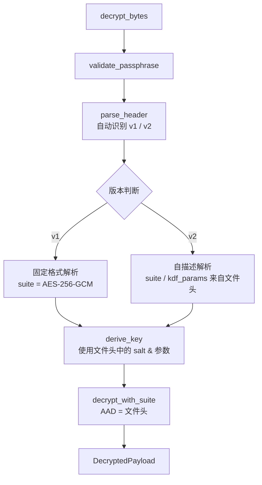

Encrust 的加密与解密并非简单的"调用算法库"，而是一套以**自描述文件头**为核心、**流程与算法解耦**的编排机制。加密流程负责把用户输入的明文、密钥短语和元数据组织成标准的 `.encrust` 文件；解密流程则反过来，从文件头中读取历史参数，自动选择正确的算法与成本配置还原明文。本文聚焦这两个主流程的实现路径、调用契约和安全设计。

---

## 加密流程：从明文到 `.encrust` 文件

Encrust 的加密入口提供两个层级：`encrypt_bytes` 使用默认的 `AES-256-GCM` 套件，适用于 UI 的常规操作；`encrypt_bytes_with_suite` 则允许调用方显式指定算法，用于高级用户的自主选择。无论走哪条路径，完整的加密流程都遵循相同的六步编排：验证密钥短语 → 生成随机盐值与 nonce → 派生加密密钥 → 构建自描述文件头 → AEAD 加密 → 拼接输出。

```mermaid
flowchart TD
    A[encrypt_bytes / encrypt_bytes_with_suite] --> B[validate_passphrase]
    B --> C[OsRng 生成 salt & nonce]
    C --> D[derive_key<br/>Argon2id + salt]
    D --> E[build_v2_header<br/>套件/类型/KDF参数/salt/nonce]
    E --> F[encrypt_with_suite<br/>AAD = 文件头]
    F --> G[header || ciphertext]
```

**第一步：输入校验。** 流程首先调用 `validate_passphrase` 按 Unicode 字符数检查密钥短语长度，确保不低于 8 个字符。这一步在加密和解密两端对称执行，避免字节长度导致的中文或 emoji 误判。随后，函数通过 `OsRng` 为每个文件独立生成 16 字节的 salt 和对应套件长度的 nonce。salt 和 nonce 的随机性保证了"同一明文、同一密钥短语"每次加密都会产生不同的密文输出，从根本上杜绝了重放攻击和模式分析。

**第二步：密钥派生。** 使用默认的 `Argon2idParams` 参数快照，结合用户密钥短语和随机 salt，通过 `derive_key` 派生 32 字节固定长度的主密钥。这里的关键在于：派生参数不依赖代码里的当前默认值，而是被显式捕获并传入后续的文件头构建步骤，为未来提升默认成本预留了兼容空间。

**第三步：文件头构建与 AEAD 加密。** `build_v2_header` 将内容类型（文件或文本）、原始文件名、加密套件标识、KDF 参数、salt 和 nonce 全部编码进 v2 自描述头。紧接着，`encrypt_with_suite` 以整个文件头作为 **Additional Authenticated Data（AAD）** 对明文进行 AEAD 加密。这意味着任何对文件头的篡改——无论是改动算法标识、salt 还是内容类型——都会导致认证标签校验失败，解密时会直接返回 `Decryption` 错误而非输出脏数据。

**第四步：输出组装。** 最终输出是一个连续的 `Vec<u8>`：前段是完整的文件头，后段是 AEAD 密文（包含认证标签）。这种"头身一体"的结构让 `.encrust` 文件无需外部数据库即可自解释，也为 v1/v2 的自动兼容识别提供了物理基础。

Sources: [encrypt.rs](src/crypto/encrypt.rs#L11-L53), [crypto.rs](src/crypto.rs#L26-L32), [kdf.rs](src/crypto/kdf.rs#L70-L89)

---

## 解密流程：从 `.encrust` 文件到明文

解密流程的设计哲学是**只信任文件本身，不信任外部假设**。UI 当前选择的算法、用户记忆的成本参数，甚至是应用程序的版本，都不参与解密决策。解密入口 `decrypt_bytes` 和元数据探查入口 `inspect_encrypted_file` 共享同一套文件头解析器，确保"看到的信息"与"实际使用的参数"始终一致。



**第一步：文件头解析与版本分发。** `parse_header` 先检查 7 字节的 `MAGIC` 签名，再根据版本字节分派到 `parse_v1_header` 或 `parse_v2_header`。v1 是早期固定格式，算法被硬编码为 `AES-256-GCM`；v2 则按需读取变长的 suite id、KDF 参数块、salt 和 nonce。解析器对每一项都执行严格的边界检查：如果声明的 header_len 与实际消费的字节数不符，或者 nonce 长度与 suite 不匹配，都会返回 `InvalidFormat`，拒绝继续处理。

**第二步：密钥重派生。** 解析完成后，解密流程使用文件头中记录的 salt 和 `Argon2idParams` 重新执行 `derive_key`。这一步与加密流程的派生完全对称，但使用的是**历史参数**而非当前代码默认值。因此，即使未来 Encrust 提升了默认 Argon2id 成本，旧文件仍然能按当年的配置正确派生密钥并解密。

**第三步：AEAD 解密与认证。** `decrypt_with_suite` 根据文件头解析出的 `EncryptionSuite`，选择对应的 AEAD 实现（AES-256-GCM、XChaCha20-Poly1305 或 SM4-GCM）。解密时，文件头再次作为 AAD 传入。如果密钥短语错误，或者密文/文件头被篡改，底层 AEAD 解密会失败，流程统一返回 `CryptoError::Decryption`，不暴露具体是密钥错误还是完整性校验失败，避免给攻击者提供区分信息。

**第四步：结构化输出。** 成功解密后，流程将明文、内容类型和原始文件名封装为 `DecryptedPayload`。UI 层据此决定是直接将字节数组保存为文件，还是按 UTF-8 解码后展示为文本。

Sources: [decrypt.rs](src/crypto/decrypt.rs#L10-L48), [format.rs](src/crypto/format.rs#L97-L200), [error.rs](src/crypto/error.rs#L12-L16)

---

## 流程对称性与关键安全约束

加密与解密的编排并非简单的函数互逆，而是在**数据流、参数来源和信任模型**上存在刻意设计的对称与不对称。

| 维度 | 加密流程 | 解密流程 | 设计意图 |
|------|----------|----------|----------|
| **算法选择** | 由调用方传入 `EncryptionSuite`，默认 AES-256-GCM | 完全从文件头读取 suite id，拒绝 UI 传入 | 防止用户误选，保障旧文件兼容 |
| **KDF 参数** | 使用当前默认 `Argon2idParams` | 使用文件头中记录的历史参数 | 成本可升级，旧文件不解体 |
| **salt / nonce** | 每次随机生成 | 从文件头还原 | 一密一盐，杜绝重放 |
| **AAD 来源** | 刚构建的 v2 文件头 | 原始文件头字节 | 绑定文件头完整性，防篡改 |
| **错误提示** | `Encryption` / `KeyDerivation` | 统一返回 `Decryption` | 避免泄露密钥错误与篡改的区别 |

**为什么解密不接受 UI 指定的算法？** 在 [多 AEAD 套件抽象与实现](13-duo-aead-tao-jian-chou-xiang-yu-shi-xian) 中，`EncryptionSuite` 的枚举顺序仅影响 UI 展示，真正写入文件的是稳定的 `suite.id()`。解密时如果允许 UI 覆盖，用户可能选错算法，导致旧文件无法打开。因此 `decrypt_with_suite` 的 `suite` 参数只能来自 `parse_header` 的解析结果，这是流程编排层面的一道安全护栏。

Sources: [suite.rs](src/crypto/suite.rs#L40-L55), [suite.rs](src/crypto/suite.rs#L142-L186)

---

## 流程边界与模块协作

`encrypt.rs` 与 `decrypt.rs` 的定位是**流程编排层**，它们不直接实现密码学原语，而是协调下层模块完成端到端操作。各模块的职责边界如下：

- **`format`**：负责 `.encrust` 文件头的编解码与版本兼容，提供 `build_v2_header` 和 `parse_header`。
- **`kdf`**：负责 Argon2id 密钥派生，参数快照的序列化与反序列化。
- **`suite`**：负责具体 AEAD 算法的封装，对外隐藏底层库（`aes-gcm`、`chacha20poly1305`、`sm4`）的差异。
- **`types`**：定义 `ContentKind`、`DecryptedPayload` 等跨流程共享的数据结构。
- **`error`**：统一错误类型，避免泄露敏感区分信息。

这种分层让流程编排层保持简洁：`encrypt_bytes_with_suite` 和 `decrypt_bytes` 各自不足 40 行，却完成了从输入校验、随机数生成、密钥派生、文件头处理到 AEAD 运算的完整闭环。如需进一步了解各下层模块的实现细节，可继续阅读 [自描述文件格式与版本兼容策略](12-zi-miao-shu-wen-jian-ge-shi-yu-ban-ben-jian-rong-ce-lue)、[Argon2id 密钥派生与参数快照](14-argon2id-mi-yao-pai-sheng-yu-can-shu-kuai-zhao) 和 [多 AEAD 套件抽象与实现](13-duo-aead-tao-jian-chou-xiang-yu-shi-xian)。

Sources: [crypto.rs](src/crypto.rs#L1-L37), [types.rs](src/crypto/types.rs#L1-L31)

---

## 下一步阅读建议

如果你已经理解了加密与解密的流程编排，接下来可以按以下路径深入：

- 想了解文件头里每一字节的精确布局，阅读 [自描述文件格式与版本兼容策略](12-zi-miao-shu-wen-jian-ge-shi-yu-ban-ben-jian-rong-ce-lue)。
- 想知道 Argon2id 参数如何被序列化进文件头，以及 SM4-GCM 的密钥截断规则，阅读 [Argon2id 密钥派生与参数快照](14-argon2id-mi-yao-pai-sheng-yu-can-shu-kuai-zhao) 和 [多 AEAD 套件抽象与实现](13-duo-aead-tao-jian-chou-xiang-yu-shi-xian)。
- 想了解错误类型如何统一封装、以及 AAD 机制在安全模型中的角色，阅读 [类型化错误处理与安全设计原则](17-lei-xing-hua-cuo-wu-chu-li-yu-an-quan-she-ji-yuan-ze) 和 [AEAD 认证附加数据与文件头安全机制](16-aead-ren-zheng-fu-jia-shu-ju-yu-wen-jian-tou-an-quan-ji-zhi)。