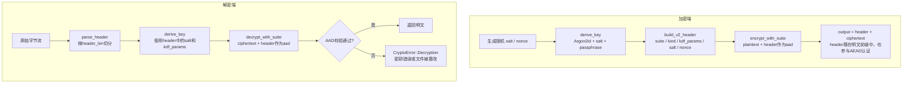

Encrust 的加密文件格式并非简单地把密文包裹在元数据里，而是将整个文件头作为 AEAD（Authenticated Encryption with Associated Data）的 **AAD（Associated Data，认证附加数据）** 参与认证标签计算。这意味着攻击者即使不触碰密文本体，只要篡改了文件头中的算法标识、KDF 参数、salt 或 nonce，解密时的 AEAD 校验就会失败。本页深入解析这一设计的安全动机、v2 文件头的自描述结构，以及 AAD 在加密/解密流程中的精确绑定方式。

## AEAD AAD 的核心概念

传统对称加密只保证数据的机密性，而 AEAD 模式在机密性之外同时提供完整性与真实性。AAD 是 AEAD 特有的概念：它是一段**不需要加密、但必须认证**的附属数据。加密时，AAD 与明文一起输入算法，影响最终生成的认证标签；解密时，必须提供完全一致的 AAD，否则认证标签无法通过验证。典型的应用场景包括网络协议中的包头信息——包头需要明文传输以便路由，但又不能被中间人篡改。

在 Encrust 的语境下，`.encrust` 文件的文件头就是这段 AAD。文件头包含版本号、算法套件、内容类型、KDF 参数、salt、nonce 和可选文件名。这些字段都不需要保密（salt 和 nonce 本身就是公开随机值），但它们的完整性至关重要。例如，若攻击者把文件头中的算法标识从 AES-256-GCM 改成 SM4-GCM，而密文仍按原算法生成，解密端就会在 AAD 校验阶段发现不一致，直接拒绝解密。

Sources: [suite.rs](src/crypto/suite.rs#L72-L128)

## 文件头作为 AAD 的设计决策

Encrust 在 `encrypt_bytes_with_suite` 中完成密钥派生后，先构建完整的 v2 文件头，再将其作为 `aad` 参数传入 `encrypt_with_suite`。解密时，`decrypt_bytes` 从原始字节流中切分出文件头，并原封不动地传给 `decrypt_with_suite`。这一设计带来三个关键安全属性：

**第一，算法不可被降级。** 文件头中明确记录了 `suite.id()`（如 AES-256-GCM 为 1，XChaCha20-Poly1305 为 2）。由于该 id 位于 AAD 内，攻击者无法把密文从一个强算法“降级”到弱算法，因为解密端会按文件头中的 suite id 调用对应算法，而 AAD 校验会检测到任何对 suite id 的篡改。

**第二，KDF 参数不可被篡改。** v2 格式将 Argon2id 的 memory、iterations、parallelism 和 output_len 完整写入文件头。这些参数直接影响密钥派生结果，若被修改，派生出的密钥将错误，进而导致 AEAD 解密失败——但即使攻击者试图通过修改参数来触发特定密钥，AAD 绑定机制也会阻断这条路径。

**第三，salt/nonce 的绑定性。** salt 和 nonce 以明文形式存在于文件头中，这是正常加密流程所需。但它们的完整性由 AAD 保护，攻击者无法用另一个 salt 或 nonce 替换原文值来构造选择性明文攻击或重放攻击，因为任何变动都会破坏认证标签。

Sources: [encrypt.rs](src/crypto/encrypt.rs#L44-L46), [decrypt.rs](src/crypto/decrypt.rs#L20-L27), [suite.rs](src/crypto/suite.rs#L76-L82)

## v2 文件头结构与 AAD 覆盖范围

v2 文件头采用自描述设计，所有字段都按固定顺序以大端序编码。构建函数 `build_v2_header` 先计算总长度，再依次写入各字段。以下是文件头的完整字节布局与每个字段的安全含义：

| 字段 | 长度 | 说明 | AAD 安全作用 |
|------|------|------|-------------|
| `MAGIC` | 7 bytes | `"ENCRUST"` 固定签名 | 防止误将非 Encrust 文件当作密文处理；若被篡改，文件甚至无法进入解密流程 |
| `version` | 1 byte | `2` | 版本号决定解析逻辑，受 AAD 保护防止版本回退攻击 |
| `header_len` | 2 bytes | 整个文件头的总长度 | 确保解析器能精确切分“头”与“密文”；篡改会导致长度校验失败 |
| `suite_id` | 1 byte | AEAD 算法编号 | 防止算法降级或替换攻击 |
| `kind` | 1 byte | `CONTENT_FILE` 或 `CONTENT_TEXT` | 保护内容类型声明的完整性 |
| `kdf_id` | 1 byte | `KDF_ARGON2ID = 1` | 固定标识 KDF 算法 |
| `file_name_len` | 2 bytes | 原文件名长度 | 长度字段本身受保护，防止缓冲区越界误解析 |
| `file_name` | 变长 | UTF-8 原文件名 | 保护文件名信息不被篡改 |
| `kdf_params_id` | 1 byte | 再次确认 `KDF_ARGON2ID` | 冗余校验，防止参数段被替换为其他结构 |
| `kdf_params_len` | 2 bytes | 当前固定为 14 | 参数块长度 |
| `kdf_params` | 14 bytes | memory/iterations/parallelism/output_len | 保护密钥派生成本参数 |
| `salt_len` | 1 byte | salt 长度 | 当前固定为 16，支持未来扩展 |
| `salt` | 变长 | 随机 salt | 绑定到特定密钥派生实例 |
| `nonce_len` | 1 byte | nonce 长度 | 与 suite 要求的 `nonce_len()` 交叉校验 |
| `nonce` | 变长 | 随机 nonce/IV | 绑定到特定加密实例，防止 nonce 重用攻击 |

`build_v2_header` 在写入时会精确计算 `metadata_len`，并用 `u16` 容量检查防止溢出。解析端 `parse_v2_header` 则严格校验 `cursor != header_len`，确保所有声明的字段都被恰好消费，不多也不少。这种“精确消费”策略本身就是对 AAD 边界的物理保护——如果文件头长度字段被篡改，解析器会在边界处发现不一致。

Sources: [format.rs](src/crypto/format.rs#L48-L95), [format.rs](src/crypto/format.rs#L146-L202)

## 加密与解密中的 AAD 绑定流程

下图展示了 AAD 在完整加密/解密生命周期中的流动方式。核心原则是：**构建出的文件头字节流，既是文件的前缀，也是 AEAD 的 AAD 输入**。

值得强调的是，解密端并不信任任何外部传入的元数据。`decrypt_bytes` 接收的是完整的 `.encrust` 文件字节流，它会重新解析文件头，并用原始字节切片 `&encrypted_file[..parsed.header_len]` 作为 AAD。这一设计确保即使 `inspect_encrypted_file` 和 `decrypt_bytes` 被分别调用，二者各自独立解析，不会因元数据被拆分传递而产生不一致。

Sources: [encrypt.rs](src/crypto/encrypt.rs#L36-L52), [decrypt.rs](src/crypto/decrypt.rs#L12-L34)

## 安全威胁模型与防护能力

将文件头整体作为 AAD 后，Encrust 能够抵御以下几类针对元数据的攻击：

| 攻击类型 | 攻击描述 | 防护机制 |
|---------|---------|---------|
| **算法降级攻击** | 攻击者将文件头中的强算法标识替换为弱算法，诱使解密端使用较弱的安全参数 | `suite_id` 位于 AAD 内，任何改动都会导致 AEAD tag 校验失败 |
| **KDF 参数篡改** | 降低 memory 或 iterations 以减少暴力破解成本 | Argon2id 参数完整写入 AAD，篡改会被检测 |
| **salt / nonce 替换** | 用攻击者控制的 salt/nonce 替换原文值，试图诱导密钥碰撞或重用 | salt 和 nonce 明文位于 AAD 中，替换即破坏认证 |
| **内容类型欺骗** | 将 `ContentKind::File` 改为 `Text`，导致 UI 错误展示二进制数据 | `kind` 字段受 AAD 保护 |
| **文件名注入** | 修改文件名以诱导用户保存到危险路径 | `file_name` 及其长度字段均在 AAD 覆盖范围内 |
| **截断攻击** | 截断文件头或密文末尾的认证标签 | v2 的 `header_len` 使解析器能精确定位边界；AEAD 自带 tag 校验拒绝截断 |
| **版本回退** | 将 v2 文件头改为 v1 以利用旧格式的解析漏洞 | `version` 字段受 AAD 保护，且解析器严格按版本分发 |

此外，所有解密失败（无论是密码错误还是文件被篡改）都统一映射到 `CryptoError::Decryption`，错误信息为“解密失败：密钥错误或文件被篡改”。这种不区分具体失败原因的做法，避免了向攻击者泄露“是密码错了”还是“哪个字段被改了”这类侧信道信息。

Sources: [error.rs](src/crypto/error.rs#L17-L18), [suite.rs](src/crypto/suite.rs#L73-L75)

## v1 兼容性与 AAD 一致性

Encrust 保留了对 v1 旧文件的读取能力。v1 使用固定长度头部（没有 `header_len` 字段），但其构建方式与 v2 一致：先按固定顺序拼接 MAGIC、版本、KDF 标识、算法标识、内容类型、文件名、salt 和 nonce，再将这段头部作为 AAD 传入 `encrypt_with_suite`。因此，v1 和 v2 在“文件头即 AAD”的安全模型上完全统一，只是元数据的编码方式从固定格式演进为自描述格式。

`parse_header` 是版本分发的入口：它先检查 MAGIC，再根据 `input[MAGIC.len()]` 的值路由到 `parse_v1_header` 或 `parse_v2_header`。无论走哪条路径，返回的 `ParsedHeader` 都包含 `header_len`，供 `decrypt_bytes` 精确切分出原始头部字节并作为 AAD 使用。这种一致性确保了向后兼容不会牺牲安全承诺。

Sources: [format.rs](src/crypto/format.rs#L97-L108), [tests.rs](src/crypto/tests.rs#L206-L235)

## 实现细节与防御性解析

文件头解析器遵循严格的防御性编程原则。所有读取操作都通过 `read_slice` 和 `read_u8`/`read_u16` 完成，它们使用 `cursor.checked_add(len)` 进行溢出检查，并在越界时返回 `CryptoError::InvalidFormat`，绝不 panic。这意味着即使面对恶意构造的文件头，解析器也能安全地拒绝输入，而不会暴露内存或触发异常行为。

在 v2 解析中，`nonce_len` 还会与 `suite.nonce_len()` 进行交叉校验。例如，若文件头声明使用 XChaCha20-Poly1305（要求 24 字节 nonce），但 `nonce_len` 字段值为 12，解析器会立即返回 `InvalidFormat`。这种校验发生在 AAD 被使用之前，是防止格式不一致引发更深层次错误的早期防线。

Sources: [format.rs](src/crypto/format.rs#L180-L190), [format.rs](src/crypto/format.rs#L256-L267)

---

理解 AEAD AAD 与文件头的绑定机制后，你可以继续阅读 [加密与解密流程编排](15-jia-mi-yu-jie-mi-liu-cheng-bian-pai) 来了解完整的端到端流程，或深入 [多 AEAD 套件抽象与实现](13-duo-aead-tao-jian-chou-xiang-yu-shi-xian) 查看各算法套件的具体封装方式。