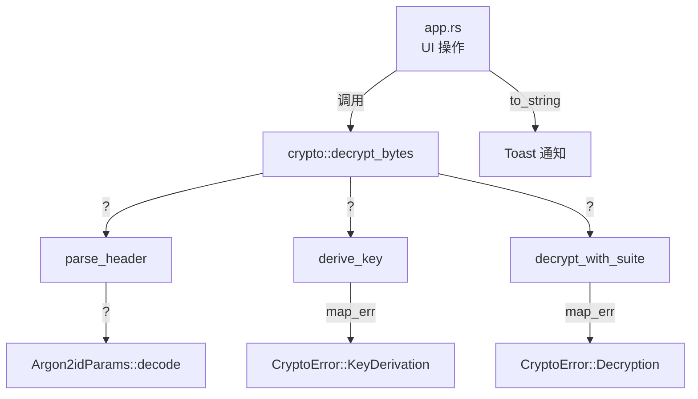

Encrust 在加密模块内部采用单一枚举 `CryptoError` 作为所有密码学错误的类型化出口，同时在 UI 层将其转换为人类可读文案。这种分层策略的核心目标有两个：一是让 Rust 编译器在错误传播路径上提供穷尽检查，二是**避免向潜在攻击者泄露可用于构造 oracle 的细粒度错误信息**。本文从错误类型的架构设计出发，逐层解析安全原则如何在代码中落地。

## CryptoError：密码学域的单一错误契约

整个加密子系统只向外暴露一个错误类型 `CryptoError`，它由 `thiserror` 派生实现 `Display` 和 `Error` trait。这种“单枚举”设计强制所有失败场景都必须被归类到预定义的语义桶中，避免在公开 API 里暴露底层库（如 `argon2`、`aes_gcm`）的原生错误。

```rust
#[derive(Debug, Error)]
pub enum CryptoError {
    #[error("密钥长度不能少于 {MIN_PASSPHRASE_CHARS} 个字符")]
    PassphraseTooShort,
    #[error("密钥派生失败")]
    KeyDerivation,
    #[error("加密失败")]
    Encryption,
    #[error("解密失败：密钥错误或文件被篡改")]
    Decryption,
    #[error("不是有效的 Encrust 加密文件")]
    InvalidFormat,
    #[error("不支持的 Encrust 文件版本")]
    UnsupportedVersion,
    #[error("不支持的加密方式")]
    UnsupportedSuite,
    #[error("原文件名太长，无法写入当前文件格式")]
    FileNameTooLong,
}
```

特别值得注意的是 `Decryption` 变体的文案：**“密钥错误或文件被篡改”**。设计者有意识地把“密码输错”和“密文被篡改”这两种完全不同的失败原因合并为同一条消息，从而阻止攻击者通过错误反馈区分“认证标签校验失败”与“解密后数据异常”。这是对抗 padding oracle 和 timing oracle 的第一道防线。

Sources: [error.rs](src/crypto/error.rs#L9-L27)

## 错误传播路径与分层映射

加密模块内部使用 `?` 运算符进行链式传播，但每一层都会把外部 crate 的原始错误映射到 `CryptoError` 的粗粒度变体上。以解密流程为例，从文件头解析、KDF 到 AEAD 解密的完整调用栈如下：



在 `derive_key` 中，`argon2` 返回的 `Error` 被 `map_err(|_| CryptoError::KeyDerivation)?` 直接抹掉细节；在 `decrypt_with_suite` 中，`aes_gcm` 或 `chacha20poly1305` 的 `aead::Error` 同样被映射为 `CryptoError::Encryption` 或 `CryptoError::Decryption`。这种“吞掉原始错误”的做法在普通应用里可能被视为反模式，但在加密场景下是**安全必需**——任何关于“哪一步失败”的提示都可能成为侧信道。

Sources: [decrypt.rs](src/crypto/decrypt.rs#L12-L34), [kdf.rs](src/crypto/kdf.rs#L68-L88), [suite.rs](src/crypto/suite.rs#L135-L185)

## 文件头解析的防崩溃边界检查

`parse_header` 及其辅助函数处理的是来自不可信来源的外部输入，因此所有读取操作都通过 `read_slice` 进行显式边界检查，并在越界时返回 `CryptoError::InvalidFormat`，**绝不触发 panic**。

```rust
fn read_slice<'a>(input: &'a [u8], cursor: &mut usize, len: usize) -> Result<&'a [u8], CryptoError> {
    let end = cursor.checked_add(len).ok_or(CryptoError::InvalidFormat)?;
    let slice = input.get(*cursor..end).ok_or(CryptoError::InvalidFormat)?;
    *cursor = end;
    Ok(slice)
}
```

这里同时使用了 `checked_add` 防止 `cursor + len` 溢出，以及 `slice::get` 防止越界索引。即便攻击者构造一个长度为 `usize::MAX` 的恶意文件名长度字段，代码也会优雅返回 `InvalidFormat`，而不是 panic 或触发未定义行为。此外，`build_v2_header` 在编码阶段同样使用 `u16::try_from` 和 `u8::try_from` 检查长度转换，确保正向路径也不会溢出。

Sources: [format.rs](src/crypto/format.rs#L256-L267), [format.rs](src/crypto/format.rs#L48-L95)

## 安全设计原则详解

### 1. 模糊化反馈（Ambiguous Error Reporting）

在 AEAD 解密场景中，认证失败的原因可能是密钥错误，也可能是附加数据（AAD）或密文被篡改。Encrust 故意不区分这两者，统一返回 `CryptoError::Decryption`。测试用例 `decrypt_rejects_wrong_passphrase` 明确断言了这一点：即便只是因为密码输错，返回的仍然是同一个模糊变体。

Sources: [tests.rs](src/crypto/tests.rs#L121-L133), [suite.rs](src/crypto/suite.rs#L135-L185)

### 2. 密钥材料的自动清零

派生出的密钥通过 `zeroize::Zeroizing` 包装。`derive_key` 返回 `Zeroizing<[u8; KEY_LEN]>`，当该值离开作用域时，`Zeroizing` 的 `Drop` 实现会将内存覆写为零，降低密钥残留在栈或寄存器中的风险。

Sources: [kdf.rs](src/crypto/kdf.rs#L82-L87)

### 3. 语义化的输入校验

`validate_passphrase` 按 Unicode 字符数量检查，而非 UTF-8 字节长度。这意味着中文、emoji 等多字节字符不会因为编码长度而被误判为超长密码，提升了多语言用户的体验，同时保持安全底线不变。

Sources: [crypto.rs](src/crypto.rs#L27-L33)

### 4. 算法选择不由 UI 决定

解密时，`decrypt_bytes` 只信任文件头中记录的 `suite` 和 `kdf_params`，而非 UI 层当前选中的算法。这避免了“用户选错算法”这一类人为错误，也保证了未来默认算法升级后，旧文件仍能按历史元数据正确解密。`inspect_encrypted_file` 虽可提前读取元数据供 UI 展示，但真正解密时仍会重新解析文件头，防止元数据与密文被分开传递时产生不一致。

Sources: [decrypt.rs](src/crypto/decrypt.rs#L12-L47)

## UI 层的错误消费与隔离

在 `app.rs` 中，所有密码学错误最终通过 `.to_string()` 转换为字符串，再包装进 `Notice::Error`，以 Toast 形式展示给用户。UI 层不直接 `match` `CryptoError` 的各个变体，而是依赖其 `Display` 实现，这带来了两个好处：

1. **解耦**：修改 `CryptoError` 的文案不需要同步改动 UI 代码。
2. **一致性**：无论底层发生何种错误，用户看到的始终是同一套措辞。

```rust
let notice = match result {
    Ok(path) => Notice::Success(format!("已保存加密文件：{}", path.display())),
    Err(err) => Notice::Error(err),
};
self.show_toast(notice);
```

此外，UI 在启用“加密/解密”按钮前会进行前置校验（如 `can_encrypt` 检查路径、密码长度），把大量预期内的错误拦截在操作触发之前，减少用户看到错误提示的频率。

Sources: [app.rs](src/app.rs#L934-L971), [app.rs](src/app.rs#L858-L921), [app.rs](src/app.rs#L923-L933)

## 错误处理模式对比

| 场景 | 采用策略 | 安全/工程意义 |
|---|---|---|
| 底层 crate 错误（argon2、AEAD） | `map_err(|_| CryptoError::Xxx)?` | 防止侧信道信息泄露 |
| 文件头越界/格式错误 | 返回 `InvalidFormat`，绝不 panic | 拒绝服务防护与内存安全 |
| 解密失败原因 | 合并为单一文案 | 抗 oracle 攻击 |
| 密钥生命周期 | `Zeroizing<T>` 包装 | 降低内存残留风险 |
| UI 展示 | 依赖 `Display` trait，不做变体匹配 | 降低层间耦合 |

Sources: [suite.rs](src/crypto/suite.rs#L72-L129), [format.rs](src/crypto/format.rs#L256-L267), [kdf.rs](src/crypto/kdf.rs#L82-L87), [app.rs](src/app.rs#L916-L921)

## 小结

Encrust 的错误处理体系体现了“安全优先于便利”的设计哲学：类型化枚举保证了编译期穷尽检查，而刻意的信息模糊化则构成了运行时的防御纵深。从 `CryptoError` 的文案设计，到 `read_slice` 的溢出防护，再到 `Zeroizing` 的内存清理，每一层都在用工程手段落实密码学的最小泄露原则。理解这套机制后，你可以继续阅读 [加密与解密流程编排](15-jia-mi-yu-jie-mi-liu-cheng-bian-pai) 查看这些错误类型在完整业务流中的触发时机，或前往 [文件 IO 抽象与输出路径策略](18-wen-jian-io-chou-xiang-yu-shu-chu-lu-jing-ce-lue) 了解 IO 错误如何与密码学错误协同工作。