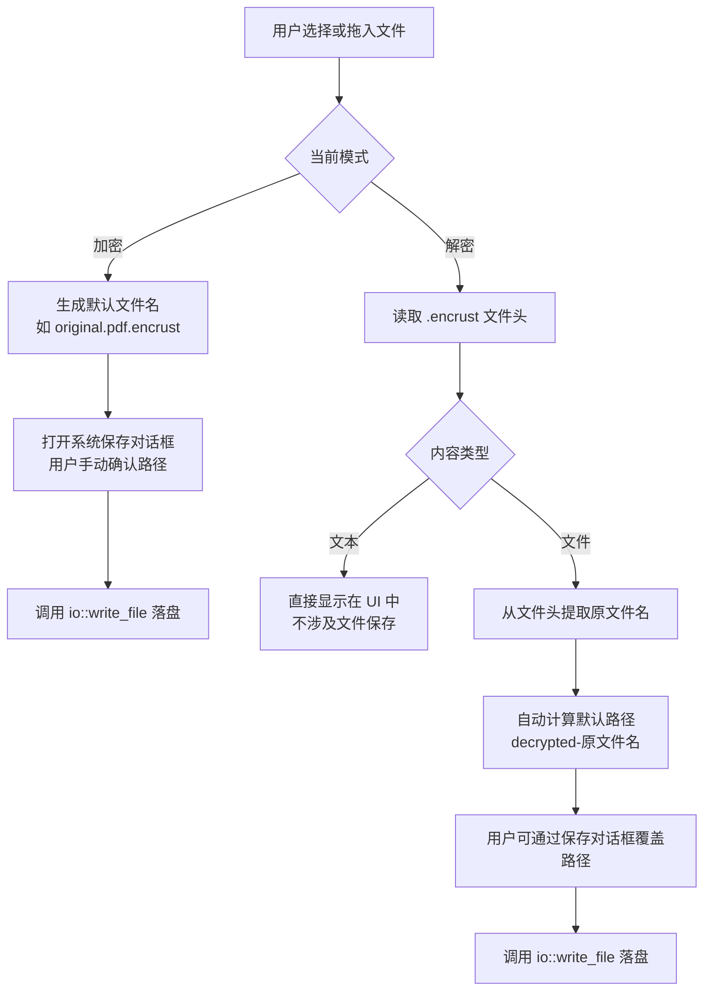
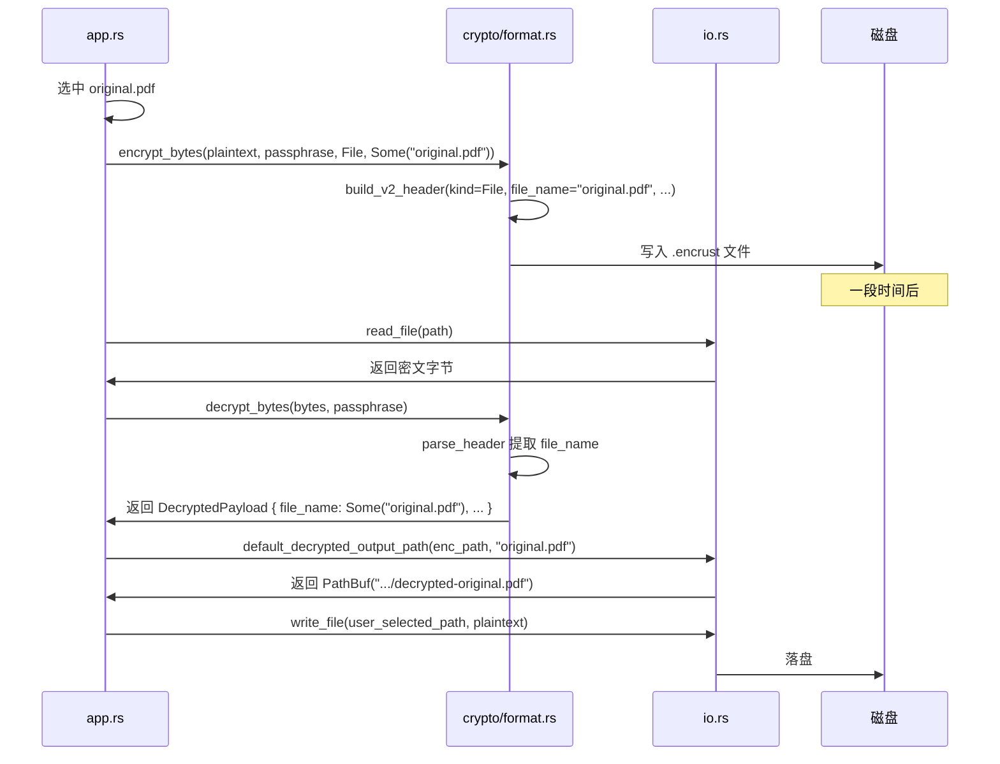
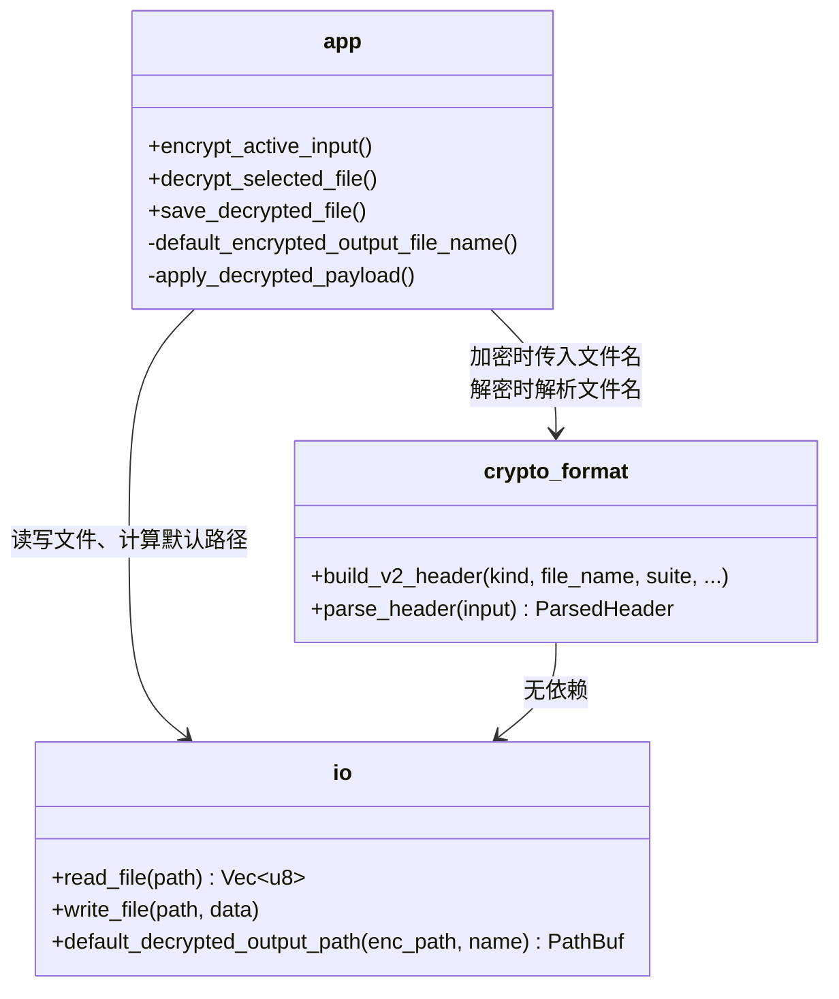

Encrust 的所有磁盘读写都收敛到一个极薄的 IO 抽象层，而输出路径的生成规则则根据「加密」与「解密」两种场景采用了截然不同的策略：加密时强制用户手动指定保存位置，避免在后台静默写入；解密时则利用文件头中记录的原文件名自动生成默认路径，减少用户操作步骤，同时通过 `decrypted-` 前缀防止覆盖用户电脑上可能仍然存在的原始文件。本文将拆解这一设计的层次结构、路径决策逻辑以及背后的安全考量。

Sources: [io.rs](src/io.rs#L1-L34), [app.rs](src/app.rs#L1-L10)

## IO 抽象层：最小化封装

项目把与操作系统文件系统的直接交互隔离在 `io` 模块中，仅暴露三个接口。这种刻意保持精简的做法有两个目的：一是让上层（UI 与加密编排逻辑）不必直接引入 `std::fs` 细节；二是把「如何读写字节」与「路径怎么定」这两个关注点彻底解耦。

| 函数 | 职责 | 返回值 |
|---|---|---|
| `read_file(path)` | 将文件完整读入内存 | `io::Result<Vec<u8>>` |
| `write_file(path, data)` | 将字节序列原子写入指定路径 | `io::Result<()>` |
| `default_decrypted_output_path(encrypted_path, original_file_name)` | 为解密文件生成默认保存路径 | `PathBuf` |

`read_file` 和 `write_file` 目前只是 `std::fs::read` 和 `std::fs::write` 的透明包装，但封装层为未来预留了缓冲策略、进度回调或权限校验的扩展空间，而无需改动调用方代码。`default_decrypted_output_path` 则属于「路径策略」而非「原始 IO」，之所以放在同一模块，是因为它仅做纯路径计算、不涉及任何 UI 或加密细节。

Sources: [io.rs](src/io.rs#L6-L13), [io.rs](src/io.rs#L22-L33)

## 输出路径策略总览

Encrust 在加密和解密两条链路中对「谁来决定保存位置」做出了不对称设计。下面的概念关系图展示了从用户操作到最终落盘的整体决策流：

这种不对称并非随意为之。加密是「生产密文」的过程，如果默认直接覆盖原文件或在固定位置保存，可能破坏用户原始数据或造成文件管理混乱；解密是「恢复原文件」的过程，文件头中已经携带了权威的原文件名信息，因此系统可以礼貌地提供一个合理的默认位置，同时把最终确认权留给用户。

Sources: [app.rs](src/app.rs#L358-L369), [app.rs](src/app.rs#L371-L387)

## 加密输出路径：强制手动选择

在加密流程中，UI 不会自动决定保存目录。无论用户是通过文件选择器还是拖拽区提供输入，`encrypted_output_path` 字段都必须由用户通过系统保存对话框显式指定后才能点击「加密并保存」按钮。

默认文件名仅作为对话框的预填充建议，由 `default_encrypted_output_file_name` 生成：

- **文件加密模式**：若选中 `original.pdf`，则建议文件名为 `original.pdf.encrust`；若无法获取文件名，则回退到 `encrypted.encrust`。
- **文本加密模式**：固定建议 `encrypted-text.encrust`。

这一规则体现在 UI 代码中：每次用户重新选择输入文件时，`encrypted_output_path` 会被重置为 `None`，强制用户再次确认输出位置。

Sources: [app.rs](src/app.rs#L679-L723), [app.rs](src/app.rs#L1023-L1034)

## 解密输出路径：自动建议与防覆盖

解密流程的路径策略更为复杂，因为它需要同时处理「文本」和「文件」两种内容类型。

### 文本内容

如果文件头标记的内容类型是 `ContentKind::Text`，解密后的字节会被直接按 UTF-8 转换为字符串显示在 UI 文本框中，不涉及任何文件保存路径决策。用户通过「复制文本」按钮获取内容。

Sources: [app.rs](src/app.rs#L756-L796), [types.rs](src/crypto/types.rs#L7-L10)

### 文件内容

如果内容类型是 `ContentKind::File`，系统会执行两步路径策略：

1. **自动计算默认路径**：调用 `io::default_decrypted_output_path`，以被解密的 `.encrust` 文件所在目录为父目录，文件名为 `decrypted-{原文件名}`；如果文件头没有记录原文件名，则回退到 `decrypted-output`。
2. **允许用户覆盖**：UI 会预先把默认路径填入选项，但用户仍可通过「另存为」按钮打开系统对话框修改保存位置。

`decrypted-` 前缀是核心安全细节。它的作用是：当用户在同一目录下加密又解密时，默认不会覆盖原始明文文件。例如 `report.pdf` 加密为 `report.pdf.encrust` 后，解密默认输出为 `decrypted-report.pdf`，而不是直接写回 `report.pdf`。

Sources: [io.rs](src/io.rs#L15-L33), [app.rs](src/app.rs#L797-L856), [app.rs](src/app.rs#L1069-L1118)

## 文件名在加密格式中的传递

解密路径策略之所以知道「原文件名」，是因为加密时会把文件名写入 `.encrust` 文件头。这一信息流动跨越了加密格式、IO 模块和 UI 三个层次：

在 `format.rs` 的 v2 文件头格式中，原文件名被编码为一个长度前缀的 UTF-8 字节串，紧跟在内容类型字段之后。解密时，`parse_header` 将其还原到 `ParsedHeader.file_name`，最终通过 `DecryptedPayload` 返回给 UI。

Sources: [format.rs](src/crypto/format.rs#L48-L95), [decrypt.rs](src/crypto/decrypt.rs#L12-L34), [types.rs](src/crypto/types.rs#L26-L30)

## 模块协作与调用关系

从架构视角看，IO 模块处于整个依赖图的底层叶子节点：它不依赖 `crypto` 也不依赖 `app`，只使用标准库。上层则按需调用：

这种单向依赖保证了加密格式和 IO 策略可以独立演进。例如，如果未来需要把文件写入临时目录再原子移动到目标位置，只需修改 `io::write_file` 的实现；如果需要在文件头中增加更多元数据，只需修改 `crypto/format.rs`，两者互不影响。

Sources: [main.rs](src/main.rs#L5-L8), [io.rs](src/io.rs#L1-L4)

## 设计取舍与安全考量

| 策略 | 加密流程 | 解密流程 |
|---|---|---|
| **谁决定路径** | 用户必须通过系统对话框手动选择 | 系统自动建议，用户可覆盖 |
| **默认文件名来源** | 由 UI 根据输入文件名即时拼接 `.encrust` | 由文件头中记录的原文件名还原 |
| **防覆盖机制** | 不覆盖原文件（改为新扩展名） | 加 `decrypted-` 前缀 |
| **文本特殊处理** | 仍需选择保存路径 | 直接显示在 UI，不生成文件 |

这些取舍体现了产品层面对「破坏性操作」的保守态度。加密是生成新文件的操作，不应该替用户假设存放位置；解密是恢复旧文件的操作，可以利用已有的元数据提供便捷体验，但仍把最终写入确认权交给用户，避免在不可预期的地方产生文件。

Sources: [io.rs](src/io.rs#L15-L21), [app.rs](src/app.rs#L697-L702), [app.rs](src/app.rs#L810-L814)

## 延伸阅读

理解文件 IO 抽象后，可以从以下几个方向继续深入：

- 想了解加密文件头如何编码文件名与版本信息，请参阅 [自描述文件格式与版本兼容策略](12-zi-miao-shu-wen-jian-ge-shi-yu-ban-ben-jian-rong-ce-lue)。
- 想了解解密后字节如何被区分为「文本」或「文件」并决定 UI 表现，请参阅 [核心数据模型与类型定义](11-he-xin-shu-ju-ju-mo-xing-yu-lei-xing-ding-yi)。
- 想了解 UI 如何集成系统文件对话框与拖拽交互，请参阅 [文件拖拽交互与系统对话框集成](9-wen-jian-tuo-zhuai-jiao-hu-yu-xi-tong-dui-hua-kuang-ji-cheng)。