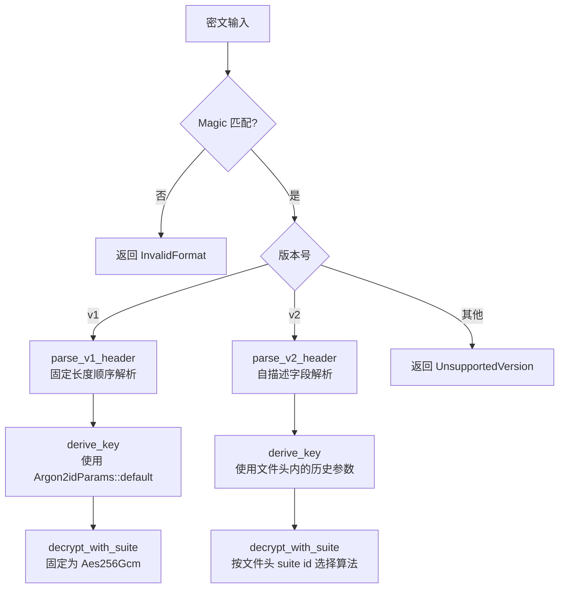

加密工具的核心承诺不仅在于"现在能加密"，更在于"过去加密的文件在软件升级后仍然能解密"。这意味着单元测试不能仅验证当前代码路径的正确性，还必须持续证明旧格式文件的读取能力未被意外破坏。Encrust 的测试体系围绕这一长期承诺构建：所有测试均在内存中完成、通过公开 API 执行，覆盖输入校验、结构断言、行为验证、安全边界与向后兼容五个维度。与此同时，文件格式从 v1 的固定结构演进为 v2 的自描述结构，使得解密逻辑始终优先信任文件头内的历史元数据，而非代码当前的默认值。

Sources: [tests.rs](src/crypto/tests.rs#L1-L15), [crypto.rs](src/crypto.rs#L35-L36)

## 测试架构与组织方式

Encrust 的单元测试集中在 `src/crypto/tests.rs` 中，由 `src/crypto.rs` 通过 `#[cfg(test)] mod tests;` 条件编译引入。这种组织方式将测试代码与业务实现物理分离，同时保持对模块内部成员的访问能力。值得注意的是，所有测试均通过公开 API（如 `encrypt_bytes`、`decrypt_bytes`、`inspect_encrypted_file`）执行，不直接调用 `format` 或 `suite` 模块的内部函数。这模拟了 UI 层与 IO 层对加密模块的真实使用方式，确保测试通过即代表对外契约成立。

测试不依赖任何外部文件或环境变量，所有输入数据（明文、密码、文件名）均以字面量或随机生成的字节数组形式存在于测试代码内部。这种纯内存测试风格使得 `cargo test` 可在任意 CI 环境中秒级完成，无需处理跨平台路径或文件系统权限问题。

Sources: [crypto.rs](src/crypto.rs#L35-L36), [tests.rs](src/crypto/tests.rs#L16-L21)

## 测试覆盖维度

测试矩阵按照"边界—结构—行为—安全—兼容"的分层逻辑展开。下表列出了当前全部测试用例及其对应的验证目标。

| 测试函数 | 覆盖维度 | 验证目标 |
|---|---|---|
| `rejects_short_passphrase` | 输入边界 | 不足 8 个 Unicode 字符的密码被拒绝，返回 `PassphraseTooShort` |
| `output_starts_with_expected_header_fields` | 结构校验 | 输出以 `MAGIC` 开头，文件头内版本、套件、内容类型与输入一致 |
| `default_encryption_writes_v2_header` | 结构校验 | 默认加密输出为 v2 格式，版本号字段等于 `CURRENT_VERSION` |
| `same_plaintext_encrypts_to_different_outputs` | 行为验证 | 相同明文与密码两次加密结果不同，证明 salt 与 nonce 具备随机性 |
| `encrypts_binary_and_utf8_data` | 行为验证 | 二进制载荷与 UTF-8 文本均可成功加密，覆盖 `File` 与 `Text` 两种 `ContentKind` |
| `decrypts_text_payload` | 闭环绕回 | 文本加密后完整解密，明文与 `ContentKind::Text` 均正确还原 |
| `decrypts_file_payload_with_original_name` | 闭环绕回 | 文件类型加密后完整解密，原始文件名与字节内容均正确还原 |
| `decrypt_rejects_wrong_passphrase` | 安全断言 | 错误密码触发 `CryptoError::Decryption`，不暴露内部细节 |
| `encrypts_with_selected_suite` | 多套件验证 | 三种 AEAD 套件（AES-256-GCM、XChaCha20-Poly1305、SM4-GCM）均可正确加解密 |
| `decrypts_legacy_v1_payloads` | 向后兼容 | 由测试代码生成的 v1 格式文件仍能被当前解密逻辑正确读取 |
| `available_suites_include_aes_default` | API 约定 | `EncryptionSuite::available_for_encryption()` 返回顺序与内容符合预期 |

从表中可以看出，加密路径的验证密度高于解密路径，因为加密输出格式由当前代码唯一控制，而解密路径的兼容范围需要额外覆盖历史版本。`same_plaintext_encrypts_to_different_outputs` 是安全性测试的关键：如果 salt 或 nonce 出现重复，该断言将以确定性方式失败，从而防止因随机数源缺陷导致的密钥流重用。

Sources: [tests.rs](src/crypto/tests.rs#L16-L204)

## 向后兼容的工程化设计

Encrust 的文件格式经历了从 v1 到 v2 的演进。v1 是早期固定格式，假设算法永远为 AES-256-GCM、KDF 永远为 Argon2id 默认参数、salt 与 nonce 长度固定；v2 则将这些假设全部显式写入文件头，形成"自描述"结构。下表对比了两者的核心差异。

| 特性 | v1 (`LEGACY_VERSION_V1`) | v2 (`CURRENT_VERSION`) |
|---|---|---|
| 算法标识 | 固定为 AES-256-GCM | 文件头内嵌 `suite id`，支持多算法 |
| KDF 参数 | 隐式使用代码中的当前默认值 | 显式编码 14 字节参数块写入文件头 |
| salt / nonce 长度 | 固定 16 / 12 字节 | 文件头记录实际长度，并在解析时与套件要求校验 |
| 头部长度 | 按固定字段顺序计算 | 文件头自带 `header_len` 字段，明确分隔元数据与密文 |
| 写入策略 | 生产代码已移除，仅测试保留 | 当前唯一写入格式 |
| 读取策略 | 保留专用解析器 | 保留专用解析器 |

兼容性的核心入口是 `parse_header`：它先校验 `MAGIC`，再按版本号将输入分发给 `parse_v1_header` 或 `parse_v2_header`。对于未知版本，直接返回 `UnsupportedVersion`，避免用错误逻辑强行解析。v2 解析器在读取完所有字段后，会额外校验 `cursor == header_len`，确保文件头长度自洽，从而提前拒绝截断或注入攻击。



v2 的自描述设计遵循一条铁律：**解密只信任文件头里的历史元数据，绝不使用代码当前的默认值或 UI 传入的算法选择**。这意味着即使未来将默认加密套件从 AES-256-GCM 切换为其他算法，旧文件仍会因文件头中记录了 `suite id = 1` 而被正确路由到 AES-256-GCM 解密路径。同理，`Argon2idParams` 的快照机制保证了未来即使提高默认 KDF 成本，旧文件也能按当年的低参数完成密钥派生。

Sources: [format.rs](src/crypto/format.rs#L97-L108), [decrypt.rs](src/crypto/decrypt.rs#L12-L34), [kdf.rs](src/crypto/kdf.rs#L12-L62)

## 用测试固化兼容承诺

向后兼容不能仅靠代码设计来保证，必须通过自动化测试持续验证。Encrust 的生产加密代码已经只写入 v2，但 `tests.rs` 中保留了一套完整的 v1 写入器——`encrypt_bytes_v1_for_test` 与 `build_v1_header_for_test`。这两个函数在结构上与曾经的生产代码一致，能够生成符合 v1 规范的完整加密文件。

`decrypts_legacy_v1_payloads` 测试正是利用这套写入器：它先用 v1 格式加密一段已知明文，再调用当前的 `decrypt_bytes` 进行解密，最终断言明文、`ContentKind` 与原始输入完全一致。这个测试在每次 `cargo test` 时都会执行，一旦未来的重构意外修改了 v1 解析逻辑（例如调整字段顺序、改变长度校验或移除 KDF 默认参数），该测试将立即失败。

此外，算法编号的稳定性由 `EncryptionSuite::id()` 与 `from_id()` 共同维护。每个已发布的套件对应一个永不复用的 u8 编号：AES-256-GCM 为 1、XChaCha20-Poly1305 为 2、SM4-GCM 为 3。文档与测试共同约束——未来即使调整 UI 展示顺序或新增算法，已发布的 id 也不能被重新分配，否则旧文件将被错误路由。

Sources: [tests.rs](src/crypto/tests.rs#L174-L189), [tests.rs](src/crypto/tests.rs#L206-L258), [suite.rs](src/crypto/suite.rs#L43-L60)

## 运行测试与维护建议

在项目根目录执行以下命令即可运行全部单元测试：

```bash
cargo test
```

由于测试不依赖外部资源，你可以在本地开发、CI 流水线或交叉编译环境中无差别地执行。如果修改了加密相关代码，建议特别关注以下两类潜在风险：

1. **格式解析变更**：任何对 `parse_v1_header` 或 `parse_v2_header` 的修改都必须保证 `decrypts_legacy_v1_payloads` 仍然通过。如果确实需要废弃某个版本，应明确提升 `CURRENT_VERSION` 并保留旧解析器，而不是直接删除。
2. **算法编号扩展**：新增 `EncryptionSuite` 变体时，必须使用未曾使用过的 `id`，并在 `available_for_encryption`、`id`、`from_id` 与 `nonce_len` 中同步维护。SM4-GCM 的实现已提供了范例——尽管 Argon2id 统一派生 32 字节密钥，SM4 作为 128-bit 分组密码仅取前 16 字节，但这一截断规则由 `suite id = 3` 和 v2 文件头共同固定，未来不得悄然改变。

测试代码本身也应被视为长期维护资产。`encrypt_bytes_v1_for_test` 不是临时脚手架，而是向后兼容契约的自动化证据；即使 v1 文件在未来十年内不再出现，该测试仍然必须保留并持续通过。

Sources: [tests.rs](src/crypto/tests.rs#L206-L214), [suite.rs](src/crypto/suite.rs#L111-L128)

## 延伸阅读

如果你希望深入理解加密模块的整体架构，建议按以下顺序继续阅读：

- [加密模块架构与公开 API 设计](10-jia-mi-mo-kuai-jia-gou-yu-gong-kai-api-she-ji) — 了解 `encrypt_bytes` 与 `decrypt_bytes` 的设计边界与职责划分。
- [自描述文件格式与版本兼容策略](12-zi-miao-shu-wen-jian-ge-shi-yu-ban-ben-jian-rong-ce-lue) — 深入 v2 文件头的二进制布局与扩展预留。
- [多 AEAD 套件抽象与实现](13-duo-aead-tao-jian-chou-xiang-yu-shi-xian) — 理解 `EncryptionSuite` 的枚举抽象与底层 AEAD 调用。
- [Argon2id 密钥派生与参数快照](14-argon2id-mi-yao-pai-sheng-yu-can-shu-kuai-zhao) — 掌握 KDF 参数如何编码进文件头并实现跨版本还原。
- [类型化错误处理与安全设计原则](17-lei-xing-hua-cuo-wu-chu-li-yu-an-quan-she-ji-yuan-ze) — 了解错误类型如何平衡用户可读性与攻击面控制。