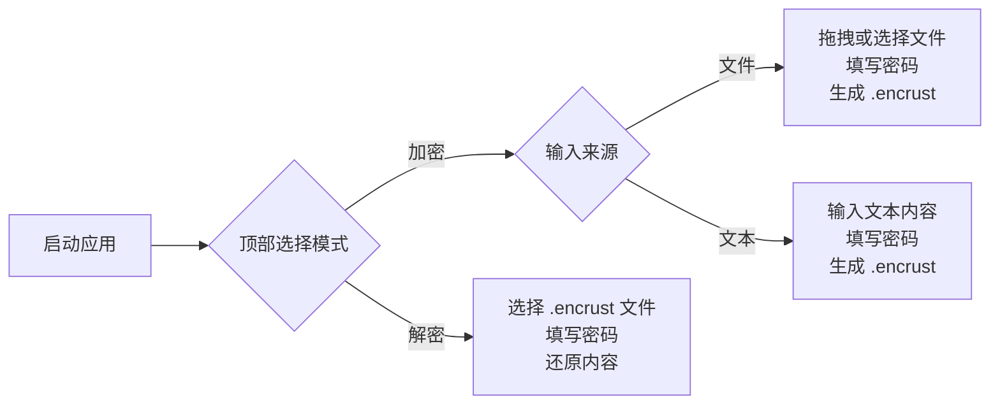
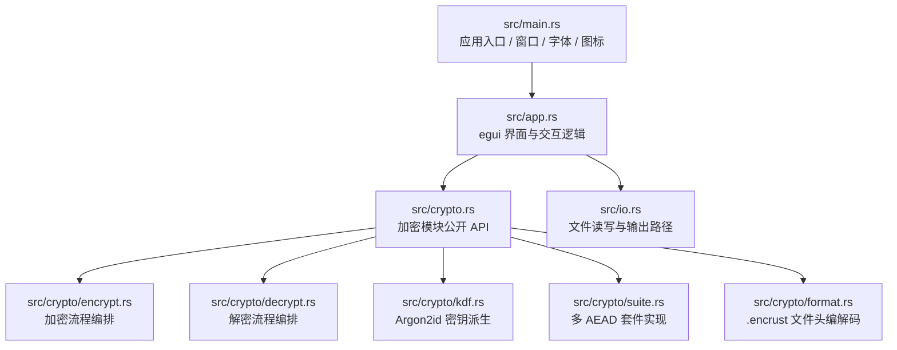

本文档面向初次接触 Encrust 的开发者，目标是在最短时间内完成环境准备、源码运行、核心功能体验以及测试验证。阅读完本页后，你将能在本地启动应用，完成一次文件或文本的加密与解密完整流程，并了解如何构建各平台分发包。本文不会深入讲解密码学实现或界面布局细节，这些主题将在后续专项页面中展开。

Sources: [Cargo.toml](Cargo.toml#L1-L6) [README.md](README.md#L1-L4)

## 环境准备

Encrust 基于 Rust 2024 Edition 开发，因此需要 nightly 工具链才能编译。此外，项目依赖 eframe 提供跨平台桌面窗口，并在启动时按平台常见路径搜索 CJK 字体以实现中文渲染。请确保你的环境满足以下条件：

| 依赖项 | 最低版本/说明 | 验证命令 |
|--------|--------------|----------|
| Rust | nightly（支持 Edition 2024） | `rustc --version` |
| Git | 近期版本即可 | `git --version` |
| CJK 字体 | macOS/Linux 需存在系统自带中文字体 | 参见 `src/main.rs` 字体候选列表 |

克隆仓库到本地并进入项目目录：

```bash
git clone <仓库地址>
cd encrust
```

Sources: [Cargo.toml](Cargo.toml#L4) [README.md](README.md#L20) [src/main.rs](src/main.rs#L54-L68)

## 运行开发版本

在项目根目录执行以下命令，Cargo 将自动解析依赖、编译项目并启动应用：

```bash
cargo run
```

首次编译需要下载 eframe、aes-gcm、argon2、chacha20poly1305 等 crate，耗时约数分钟。编译成功后，会弹出一个固定尺寸为 900×680 像素、标题为 "Encrust" 的桌面窗口，且窗口不可调整大小。`main.rs` 中的 `main` 函数负责配置视口参数、加载应用图标、初始化 CJK 字体回退，并最终将控制权交给 `app::EncrustApp`。

Sources: [src/main.rs](src/main.rs#L9-L32) [Cargo.toml](Cargo.toml#L17-L28)

## 首次使用向导

应用界面采用顶部导航切换模式，左侧为配置输入区，右侧为内容展示区。核心操作分为「加密」与「解密」两大模式，其中加密又支持「文件」与「文本」两种输入来源。



### 加密文件

1. 确认顶部处于「加密」模式，左侧选择「文件」。
2. 将文件拖拽到窗口内，或点击按钮通过系统文件选择器（由 `rfd` 提供）选取文件。
3. 在密码输入框填写密钥短语，长度至少 8 个字符。
4. （可选）切换加密套件：AES-256-GCM（默认）、XChaCha20-Poly1305 或 SM4-GCM。
5. 点击加密按钮，成功后将在输入文件同级目录生成 `.encrust` 加密文件。

### 加密文本

1. 左侧切换为「文本」输入方式。
2. 在文本框输入待加密内容。
3. 填写密钥短语并选择加密套件。
4. 点击加密，结果保存为 `.encrust` 文件，文件头会标记内容类型为文本，方便解密时直接展示。

### 解密

1. 顶部切换到「解密」模式。
2. 拖拽或选择 `.encrust` 文件。
3. 输入正确的密钥短语并点击解密。
4. 若原始内容为文本，应用将直接展示解密结果并支持快捷复制；若为文件，则可点击「另存为」通过系统对话框选择保存路径。

Sources: [src/app.rs](src/app.rs#L54-L64) [README.md](README.md#L7-L15)

## 运行测试

Encrust 在 `src/crypto/tests.rs` 中维护了单元测试，覆盖多种 AEAD 套件的加解密一致性、错误密码处理以及 v1/v2 文件格式的向后兼容。执行以下命令即可运行全部测试：

```bash
cargo test
```

测试通过意味着核心密码学流程在当前环境下能够正确执行，也是验证本地开发环境完整性的快速手段。

Sources: [src/crypto/tests.rs](src/crypto/tests.rs#L1-L258) [README.md](README.md#L26-L30)

## 构建发布版本

当你完成本地验证并希望生成分发包时，项目根目录的 `scripts/` 目录提供了三个平台的一键打包脚本。所有脚本均基于 `cargo build --release` 构建优化后的可执行文件，再按平台惯例进行打包。

| 平台 | 脚本路径 | 输出格式 | 前置要求 |
|------|----------|----------|----------|
| macOS | `scripts/build-macos.sh` | `.app` + `.dmg` Universal Binary | `cargo-bundle`、`lipo`、`hdiutil`、`codesign` |
| Linux | `scripts/build-linux.sh` | `.AppImage` | `appimagetool`（脚本支持自动下载） |
| Windows | `scripts/build-windows.ps1` | `.zip` | PowerShell |

使用示例：

```bash
# macOS
./scripts/build-macos.sh

# Linux
./scripts/build-linux.sh

# Windows (PowerShell)
.\scripts\build-windows.ps1
```

macOS 脚本会自动构建 x86_64 与 aarch64 两个架构，并通过 `lipo` 合并为通用二进制（Universal Binary），最终打包成 DMG；Linux 脚本生成 AppImage；Windows 脚本则将可执行文件与图标打包为 ZIP。这些脚本的详细实现原理将在「跨平台构建与分发」系列中进一步说明。

Sources: [scripts/build-macos.sh](scripts/build-macos.sh#L1-L131) [scripts/build-linux.sh](scripts/build-linux.sh#L1-L85) [scripts/build-windows.ps1](scripts/build-windows.ps1#L1-L43) [README.md](README.md#L32-L52)

## 项目目录速览

快速了解源码组织有助于定位问题与后续阅读。以下是核心文件与目录的职责概览：



| 路径 | 核心职责 |
|------|----------|
| `src/main.rs` | 配置 900×680 固定视口、加载图标、设置 CJK 字体回退、启动 `EncrustApp` |
| `src/app.rs` | 维护加密/解密界面状态、处理文件拖拽、调用系统对话框、渲染吐司通知 |
| `src/crypto.rs` | 对外暴露加密、解密、类型定义与错误类型的统一入口 |
| `src/crypto/` | 包含 format、kdf、suite、encrypt、decrypt、error、types、tests 等子模块 |
| `src/io.rs` | 封装文件读取与输出路径生成，隔离 UI 与底层 IO |
| `scripts/` | macOS、Linux、Windows 三平台的发布构建与打包脚本 |

Sources: [README.md](README.md#L54-L71) [src/main.rs](src/main.rs#L5-L7)

## 下一步

完成快速启动后，建议按以下顺序继续探索，逐步深入 Encrust 的设计与实现：

1. 先通过 [功能导览与使用场景](3-gong-neng-dao-lan-yu-shi-yong-chang-jing) 了解更完整的交互能力与典型使用场景。
2. 阅读 [构建与测试命令参考](4-gou-jian-yu-ce-shi-ming-ling-can-kao) 掌握更细粒度的 Cargo 命令与脚本参数。
3. 若对桌面应用架构感兴趣，可进入「深入理解 → 桌面应用架构」章节，从 [窗口生命周期与入口配置](5-chuang-kou-sheng-ming-zhou-qi-yu-ru-kou-pei-zhi) 开始，依次了解 egui 布局、CJK 字体、主题系统与文件拖拽的实现细节。
4. 若关注密码学实现，则从 [加密模块架构与公开 API 设计](10-jia-mi-mo-kuai-jia-gou-yu-gong-kai-api-she-ji) 切入，系统学习 `.encrust` 文件格式、AEAD 套件抽象、Argon2id 密钥派生与错误处理策略。