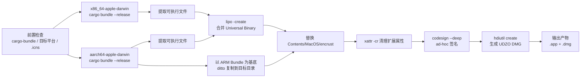

本文档说明 Encrust 在 macOS 平台的分发构建流程，涵盖 **Apple Silicon (arm64)** 与 **Intel (x86_64)** 双架构通用二进制（Universal Binary）的生成、`.app` Bundle 的组装、ad-hoc 代码签名，以及最终可拖拽安装的 `.dmg` 镜像制作。阅读本页前，建议先了解项目整体构建命令参考，以便将 macOS 流程置于跨平台构建版图之中。

## 构建流程概览

macOS 打包并非单次编译，而是一个**分架构编译 → 二进制合并 → Bundle 重组 → 签名 → 镜像打包**的多阶段流水线。核心思路是：利用 `cargo-bundle` 分别为两个目标平台生成完整的 `.app` 目录，再以 ARM 版本的 Bundle 为基底，将其中的可执行文件替换为由 `lipo` 合并的通用二进制，从而同时支持 Intel Mac 与 Apple Silicon Mac。



上述流程的所有阶段均由 `scripts/build-macos.sh` 脚本自动化编排，开发者只需执行一条命令即可走完完整流水线。Sources: [build-macos.sh](scripts/build-macos.sh#L1-L3)

## 前置条件与工具链

在开始打包前，脚本会自动检查并补全以下依赖。下表列出各工具/资源在流程中的职责：

| 工具/资源 | 来源 | 职责说明 |
|---|---|---|
| `cargo-bundle` | `cargo install` | 读取 `Cargo.toml` 中的 `[package.metadata.bundle]`，生成含 `Info.plist` 与图标资源的 `.app` Bundle。Sources: [build-macos.sh](scripts/build-macos.sh#L24-L27) |
| `x86_64-apple-darwin` | `rustup target add` | Intel Mac 编译目标，Rust 标准库与链接器支持。Sources: [build-macos.sh](scripts/build-macos.sh#L52) |
| `aarch64-apple-darwin` | `rustup target add` | Apple Silicon 编译目标，脚本会在缺失时自动安装。Sources: [build-macos.sh](scripts/build-macos.sh#L53) |
| `appicon.icns` | `assets/appicon/appicon.icns` | macOS 专用图标资源，脚本会在启动前校验其存在，否则直接退出。Sources: [build-macos.sh](scripts/build-macos.sh#L47-L50) |

**图标管理策略** 值得特别注意：项目不将图标硬编码到源码中，而是在 `Cargo.toml` 的 `[package.metadata.bundle]` 节统一声明。`cargo-bundle` 在生成 Bundle 时会自动将其写入 `Contents/Resources/` 并配置到 `Info.plist`，从而保证 **Finder 图标、Dock 图标与运行时图标三者一致**，避免常见的图标不同步问题。Sources: [Cargo.toml](Cargo.toml#L5-L8), [build-macos.sh](scripts/build-macos.sh#L14-L21)

## 双架构独立编译与 Bundle 生成

脚本通过两次独立的 `cargo bundle --release --format osx --target <triple>` 调用，分别在 `target/x86_64-apple-darwin` 与 `target/aarch64-apple-darwin` 下产出两个完整的 `.app` 目录。每一次调用都会执行完整的编译、链接与 Bundle 资源复制，最终生成的目录结构包含 `Contents/MacOS/encrust`、`Contents/Info.plist` 以及图标资源。

这里选择 **以 Bundle 为单位** 而非仅编译可执行文件，是因为 `cargo-bundle` 同时负责生成 `Info.plist` 中的版本号、Bundle Identifier（`com.encrust.app`）以及应用分类（`public.app-category.utilities`）等元数据，手工维护这些文件既繁琐又容易与 `Cargo.toml` 的定义脱节。Sources: [build-macos.sh](scripts/build-macos.sh#L40-L45), [Cargo.toml](Cargo.toml#L6-L10)

## Universal Binary 合并机制

当两个架构的 Bundle 就绪后，脚本进入二进制合并阶段。流程如下：首先使用 `ditto` 将 **ARM 版本的 `.app` 完整复制**到 `target/release/Encrust.app` 作为通用 Bundle 的骨架；随后调用 `lipo -create` 将 x86 与 arm64 两个可执行文件合并为单个 **Fat Binary**（又称 Universal Binary），并输出到 `Contents/MacOS/encrust` 以覆盖 ARM 版本的原始单架构二进制。

选择 ARM Bundle 作为基底的原因在于：Apple Silicon 是当前 macOS 的主流架构，以 arm64 Bundle 为基底可以最大程度保留其默认的权限与元数据属性；而 `lipo` 仅替换 `MacOS/` 下的可执行文件，不影响 `Info.plist`、资源文件和目录层级。合并完成后，脚本会调用 `lipo -info` 与 `file` 命令输出验证信息，确认产物同时包含 `x86_64` 与 `arm64` 架构切片。Sources: [build-macos.sh](scripts/build-macos.sh#L58-L75), [build-macos.sh](scripts/build-macos.sh#L94-L95)

## 代码签名与扩展属性清理

在 macOS 上，任何未签名的原生应用都会触发 Gatekeeper 拦截，而 **通用的 ad-hoc 签名**（`codesign --sign -`）虽然不提供 Apple ID 身份背书，却能为可执行文件生成有效的代码签名哈希，使其在本地或受信任网络分发时能够正常启动。脚本在签名前执行了一步关键的前置操作：`xattr -cr` 递归清理整个 Bundle 的扩展属性。

这一步之所以必要，是因为项目使用的 `.icns` 图标可能由 Image2icon 等第三方工具生成，带有 `com.apple.FinderInfo`、`com.apple.quarantine` 或 Resource Fork 等扩展属性。这些残留属性会导致 `codesign` 直接拒绝签名并报错。因此，**先清理、后签名**的顺序不可颠倒。签名完成后，脚本还会通过 `codesign -dv` 输出签名摘要，供开发者快速验证。Sources: [build-macos.sh](scripts/build-macos.sh#L76-L91)

## DMG 打包与安装体验

代码签名验证通过后，脚本进入最终分发阶段：创建 `.dmg` 磁盘镜像。macOS 用户习惯通过拖拽方式安装应用，因此脚本在临时目录中准备了符合 macOS 安装惯例的布局：

1. 使用 `mktemp -d` 创建临时目录；
2. 通过 `ditto` 将最终 `.app` 复制到该目录；
3. 创建指向 `/Applications` 的符号链接 `Applications`，方便用户直接拖拽；
4. 调用 `hdiutil create -format UDZO` 将临时目录压缩打包为只读 DMG。

`UDZO`（UDIF zlib 压缩）是 macOS 分发场景下的标准格式，兼顾了压缩率与挂载速度。临时目录在脚本退出时会通过 `trap cleanup_dmg_source EXIT` 自动清理，避免磁盘残留。最终的 DMG 文件名包含版本号与 `macOS-universal` 标识，例如 `Encrust-0.1.0-macOS-universal.dmg`，便于版本管理与用户识别。Sources: [build-macos.sh](scripts/build-macos.sh#L97-L127)

## 输出产物与验证清单

脚本执行完毕后，`target/release/` 目录下会生成以下关键产物：

| 产物 | 路径示例 | 说明 |
|---|---|---|
| 通用二进制 Bundle | `target/release/Encrust.app` | 可直接运行或手动分发的 `.app` 目录 |
| DMG 安装镜像 | `target/release/Encrust-<version>-macOS-universal.dmg` | 含 `/Applications` 快捷方式的标准安装包 |

若需手动验证产物，可执行以下命令：

```bash
# 查看 Universal Binary 包含的架构
lipo -info target/release/Encrust.app/Contents/MacOS/encrust

# 查看代码签名信息
codesign -dv target/release/Encrust.app

# 检查文件类型与架构切片
file target/release/Encrust.app/Contents/MacOS/encrust
```

## 与其他平台构建的关系

macOS 的 Universal Binary 策略与 Linux、Windows 的构建思路形成互补。Linux 侧采用 AppImage 单文件分发方案，Windows 侧则生成独立的 `.exe` 可执行文件。若需对比不同平台的打包哲学与具体实现，可继续阅读后续文档：

- [Linux AppImage 打包](21-linux-appimage-da-bao)
- [Windows 可执行文件构建](22-windows-ke-zhi-xing-wen-jian-gou-jian)