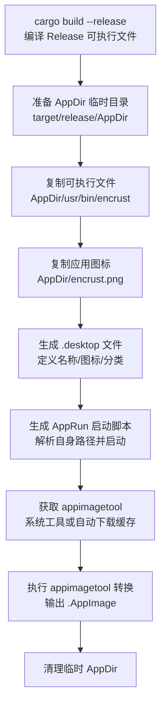

Encrust 在 Linux 平台采用 **AppImage** 作为分发格式，其核心价值在于"一次打包，随处运行"——用户下载单个文件并赋予执行权限后即可启动应用，无需 root 权限安装，也无需处理复杂的依赖库冲突。与 macOS 的 `.app` + DMG 组合或 Windows 的安装程序不同，AppImage 将应用本身、桌面入口元数据和启动逻辑封装在一个自挂载的压缩文件系统镜像中，在保持宿主系统隔离性的同时兼顾了启动效率。本文将完整拆解 `build-linux.sh` 的打包流程，说明 AppDir 规范、运行时依赖策略以及常见问题的排查方法。

## 打包流程概览

整个 Linux 打包流程始于 Release 模式编译，终于单个 `.AppImage` 文件的生成。脚本采用**显式构造 AppDir + 外部 appimagetool 转换**的经典两步法：第一步在 `target/release/AppDir` 中手动搭建符合 Freedesktop 规范的目录结构，第二步调用 `appimagetool` 将该目录打包为可执行镜像。这种方案不依赖 `cargo-bundle` 等 Rust 生态专用工具，因此在跨发行版兼容性上更具优势。



Sources: [build-linux.sh](scripts/build-linux.sh#L16-L78)

## AppDir 目录结构与规范

AppDir 是 AppImage 的"构建源目录"，其内部布局直接决定了最终镜像的运行时行为。`build-linux.sh` 在脚本中显式创建了一个最小但完整的 AppDir，包含四个核心组成部分：**入口脚本**、**桌面入口文件**、**应用图标**和**可执行文件**。这种扁平化结构避免了不必要的路径嵌套，同时也满足 `appimagetool` 的最低验证要求。

```
AppDir/                          # 临时构建根目录
├── AppRun                       # 入口脚本，AppImage 挂载后首先执行
├── encrust.desktop              # Freedesktop 桌面入口定义
├── encrust.png                  # 应用图标（fallback 至默认）
└── usr/
    └── bin/
        └── encrust              # Release 模式编译的可执行文件
```

`.desktop` 文件由脚本通过 heredoc 动态生成，其中 `Exec` 字段的值必须与可执行文件 basename 保持一致，`Icon` 字段则与复制到 AppDir 根目录的图标文件同名（不含扩展名）。Categories 被设为 `Utility;Security;`，这会使应用出现在主流 Linux 桌面环境的"工具"或"安全"分类菜单中。如果图标文件缺失，脚本会输出警告并继续使用默认图标打包，确保构建流程不会因为资源缺失而中断。

Sources: [build-linux.sh](scripts/build-linux.sh#L18-L43)

## AppRun 启动脚本的设计

`AppRun` 是 AppImage 挂载后的真正入口点，它承担着**定位自身**和**准备环境变量**的双重职责。`build-linux.sh` 生成的 `AppRun` 采用 POSIX sh 编写，通过 `readlink -f "$0"` 解析出自身的绝对路径，再利用 Shell 参数扩展 `${SELF%/*}` 截取所在目录（即挂载点），最后将 `${HERE}/usr/bin` 注入 `PATH` 并 `exec` 替换为实际的可执行文件。这种设计的精妙之处在于：无论用户将 AppImage 放在哪个路径下执行，应用都能正确找到其内部捆绑的资源，而不受当前工作目录的影响。

```bash
#!/bin/sh
SELF=$(readlink -f "$0")
HERE=${SELF%/*}
export PATH="${HERE}/usr/bin:${PATH}"
exec "${HERE}/usr/bin/encrust" "$@"
```

脚本在生成后立即通过 `chmod +x` 赋予执行权限，确保 `appimagetool` 在打包时不会遇到权限验证错误。`"$@"` 的使用使得所有命令行参数都能被原样传递给 `encrust` 可执行文件，虽然当前 Encrust 作为 GUI 应用不依赖参数启动，但这为后续可能的 CLI 集成保留了扩展空间。

Sources: [build-linux.sh](scripts/build-linux.sh#L44-L53)

## appimagetool 的获取与缓存策略

`appimagetool` 是 AppImage 官方提供的打包工具，负责将 AppDir 转换为具备自挂载能力的 SquashFS 镜像。`build-linux.sh` 实现了一套**渐进式获取策略**：优先检测系统 PATH 中是否已存在 `appimagetool`，若存在则直接使用，避免重复下载；若不存在，则将官方 continuous 版本的 `appimagetool-x86_64.AppImage` 下载到 `target/release/appimagetool` 作为缓存，并在后续构建中复用。

| 策略阶段 | 条件判断 | 行为 |
|---------|---------|------|
| 系统工具 | `command -v appimagetool` 成功 | 直接使用系统全局安装的版本 |
| 缓存复用 | 缓存文件已存在于 `target/release/` | 跳过下载，直接使用本地缓存 |
| 首次下载 | 以上均不满足 | 从 GitHub Releases 下载并设置可执行权限 |

缓存路径选在 `target/release/` 而非 `/tmp` 或用户主目录，是因为该目录本就是构建产物存放区，与项目生命周期一致，且不会被系统临时清理策略意外删除。最终生成的 AppImage 文件命名遵循 `Encrust-${VERSION}-x86_64.AppImage` 的规范，其中版本号通过 `cargo pkgid | sed 's/.*#//'` 从 `Cargo.toml` 动态提取，确保文件名与源码版本严格对应。

Sources: [build-linux.sh](scripts/build-linux.sh#L55-L77)

## 运行时依赖：CJK 字体回退机制

与 macOS 和 Windows 不同，Linux 桌面环境缺乏统一的系统字体栈，而 Encrust 的界面使用 egui 渲染并包含大量中文标签，因此字体回退是 Linux 分发的关键工程问题。`main.rs` 中的 `configure_fonts` 函数在启动时会按优先级扫描宿主系统的 CJK 字体文件，找到第一份可用字体即将其插入到 `Proportional` 和 `Monospace` 字族的最前面。

| 扫描优先级 | 字体路径 | 常见发行版覆盖 |
|-----------|---------|--------------|
| 1 | `/usr/share/fonts/opentype/noto/NotoSansCJK-Regular.ttc` | Debian/Ubuntu（安装 fonts-noto-cjk 后） |
| 2 | `/usr/share/fonts/truetype/noto/NotoSansCJK-Regular.ttc` | 部分 Fedora/Arch 变体 |
| 3 | `/usr/share/fonts/truetype/wqy/wqy-microhei.ttc` | 文泉驿微黑，多数中文发行版预装 |

需要特别注意的是，这些字体**并未被打包进 AppImage 内部**，而是依赖宿主系统的字体文件存在。这是有意为之的设计：CJK 字体文件体积通常在 10MB 以上，若捆绑会显著增加 AppImage 体积；同时 Linux 字体授权条款复杂，静态捆绑可能引发合规问题。因此，若用户在极简容器或缺失中文字体的系统上运行，界面中文将回退到 egui 默认字体并显示为空白方框，此时需要手动安装 Noto CJK 或文泉驿字体包。

Sources: [main.rs](src/main.rs#L54-L93)

## 构建产物与输出路径

成功执行 `./scripts/build-linux.sh` 后，终端会输出生成的 AppImage 绝对路径。默认情况下，构建产物存放在 `target/release/` 目录下，与 Cargo 的编译输出位于同一层级，便于 CI 流水线或本地分发时的统一收集。以版本 `0.1.0` 为例，最终产物结构如下：

```
target/release/
├── encrust                    # 原始可执行文件
├── encrust.d                  # 调试符号（如果启用）
├── AppDir/                    # 临时目录（脚本结束时已清理）
├── appimagetool               # 缓存的打包工具（如自动下载）
└── Encrust-0.1.0-x86_64.AppImage  # 最终分发文件
```

当前脚本仅针对 `x86_64` 架构进行构建，不涉及交叉编译。若需在 ARM64 或其他架构上生成 AppImage，需要准备对应架构的 Rust 目标链以及对应架构的 `appimagetool` 二进制文件，这属于进阶构建工程，建议在 GitHub Actions 等多平台 CI 环境中实现。

Sources: [build-linux.sh](scripts/build-linux.sh#L71-L84)

## 故障排查指南

| 现象 | 根因分析 | 解决方案 |
|------|---------|---------|
| 执行脚本时提示 `appimagetool: command not found` 且下载卡住 | 网络无法访问 GitHub Releases，或 `wget` 未安装 | 检查网络连通性；或手动下载 `appimagetool-x86_64.AppImage` 并重命名为 `target/release/appimagetool` |
| 生成的 AppImage 双击无反应，终端执行报 `Permission denied` | 文件缺少可执行权限 | 运行 `chmod +x Encrust-*.AppImage` 后重试 |
| 界面中文全部显示为方框或问号 | 宿主系统缺少 Noto CJK / 文泉驿字体 | 安装 `fonts-noto-cjk`（Debian/Ubuntu）或 `wqy-microhei`（通用）包 |
| AppImage 启动后图标显示为默认齿轮 | `.desktop` 中的 `Icon` 字段与 AppDir 内图标文件名不匹配 | 确认 `assets/appicon.png` 存在且脚本成功复制到 AppDir；检查桌面环境图标缓存 |
| 脚本在 `cargo build` 阶段失败 | 未使用 Rust nightly 或缺少系统依赖 | 确保已安装 nightly toolchain 并执行 `rustup default nightly` |

Sources: [build-linux.sh](scripts/build-linux.sh#L1-L85), [main.rs](src/main.rs#L54-L93)

## 与其他平台构建的关联

Linux AppImage 打包是 Encrust 跨平台分发体系的一环。与 [macOS 通用二进制与 DMG 打包](20-macos-tong-yong-er-jin-zhi-yu-dmg-da-bao) 相比，Linux 方案不依赖 cargo-bundle 等 Rust 专用生态工具，而是直接操作 Freedesktop 规范目录结构，这在可移植性和发行版兼容性上更具优势，但同时也需要手动处理字体等运行时外部依赖。与 [Windows 可执行文件构建](22-windows-ke-zhi-xing-wen-jian-gou-jian) 相比，AppImage 的"绿色单文件"理念与 Windows 便携式应用类似，但 AppImage 无需解压即可直接运行，且天然携带了类 Unix 权限模型。

若你正在搭建跨平台 CI 流水线，建议将三个平台的构建脚本作为独立 Job 并行执行，并将各自产物以统一的版本号命名后上传至 Release Assets，这样可以最大化复用现有脚本逻辑，同时保持各平台分发格式的原生体验。