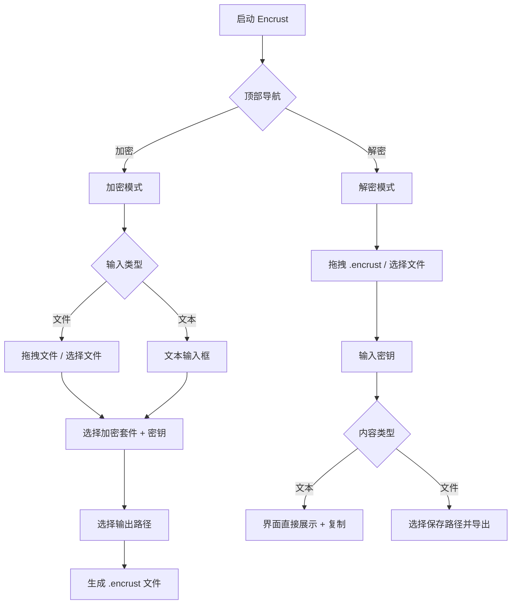

Encrust 是一个面向日常安全需求的跨平台桌面加密工具，它将现代密码学算法封装在直观的图形界面中，让没有安全工程背景的开发者也能快速完成文件与文本的加解密操作。本文将带你一览 Encrust 的全部功能，并针对常见工作场景给出具体的使用建议，帮助你判断在哪些情况下选择 Encrust 是最合适的。

Sources: [Cargo.toml](Cargo.toml#L1-L28), [README.md](README.md#L1-L10)

---

## 功能全景

Encrust 的核心能力围绕**加密**与**解密**两大模式展开，每种模式又根据输入类型细分出不同的交互路径。整个界面采用三栏布局：顶部导航栏切换加密/解密，左侧边栏集中放置配置项，主内容区承载具体的输入与结果展示。



上面的流程图展示了从启动应用到完成一次加解密的完整决策路径。无论选择哪条分支，所有操作都在同一个固定尺寸窗口内完成，无需切换页面或弹出新窗口。

Sources: [app.rs](src/app.rs#L1-L214), [main.rs](src/main.rs#L1-L94)

---

## 加密功能详解

### 文件加密

文件加密支持两种文件来源：**拖拽文件到窗口** 或 **点击按钮唤起系统文件选择器**。选择文件后，界面会自动切换到文件加密视图，并在拖拽区域显示已选文件的路径，同时允许点击右侧的清除图标重新选择。

加密前需要配置三项关键参数：

| 配置项 | 说明 | 默认值 |
|--------|------|--------|
| 输入类型 | 文件 / 文本 | 文件 |
| 加密方式 | AES-256-GCM / XChaCha20-Poly1305 / SM4-GCM | AES-256-GCM（推荐） |
| 密钥短语 | 至少 8 个字符，支持中文和 emoji | 空 |

输出路径需要手动指定，Encrust 会默认将建议文件名设为 `原文件名.encrust`，用户可通过系统保存对话框调整最终位置。点击"加密并保存"后，程序会立即生成 `.encrust` 文件并在左下角弹出成功提示。

Sources: [app.rs](src/app.rs#L521-L738), [suite.rs](src/crypto/suite.rs#L1-L186)

### 文本加密

切换到文本加密视图后，主内容区会展示一个多行文本输入框，用户可以在此粘贴或输入需要保护的敏感内容。文本加密的配置项与文件加密完全一致，区别仅在于输出文件中会额外标记 `ContentKind::Text`，以便解密时直接显示文本而非提示保存。

文本加密的典型用途包括：加密配置文件中的数据库密码、保护 API 密钥备份、安全传递临时凭证等。由于文本加密后的结果同样是 `.encrust` 文件，你可以像发送普通文件一样通过邮件或即时通讯工具分享，而无需担心传输通道的安全性。

Sources: [app.rs](src/app.rs#L623-L650), [types.rs](src/crypto/types.rs#L1-L31)

---

## 解密功能详解

解密模式的设计遵循**"零配置"**原则：用户只需要提供 `.encrust` 文件和正确的密钥短语，Encrust 会自动读取文件头中的元数据，识别加密版本（v1 或 v2）、加密套件以及内容类型，无需手动选择算法。

### 文本解密

如果加密时标记的是文本类型，解密成功后主内容区会展示一个只读的文本结果区域，并附带"复制文本"按钮。点击复制后，程序会自动清空当前解密状态并提示"已复制解密后的文本"，方便用户快速将内容粘贴到目标位置而不在磁盘留下临时文件。

### 文件解密

如果加密时标记的是文件类型，解密成功后界面会显示原文件名（若文件头中记录了该信息），并提供一个"另存为..."按钮。默认保存路径遵循 `decrypted-原文件名` 的命名规则，与加密文件位于同一目录，避免直接覆盖可能仍然存在的原始文件。

Sources: [app.rs](src/app.rs#L371-L481), [decrypt.rs](src/crypto/decrypt.rs#L1-L48), [io.rs](src/io.rs#L1-L34)

---

## 交互与体验特性

### 拖拽交互

Encrust 在整个窗口范围内监听文件拖拽事件。当鼠标拖着文件进入窗口时，对应的拖拽区域会高亮显示（边框变粗、背景变色、图标和文案切换），释放后文件即被选中。这一设计让批量选择文件的过程变得极为流畅，尤其适合从桌面或文件管理器中直接拖入的场景。

Sources: [app.rs](src/app.rs#L217-L241)

### 暗色与浅色主题

Encrust 完全适配系统的暗色/浅色模式切换。界面使用语义化的颜色系统：主色调采用靛蓝色（浅色 `#4F46E5`、深色 `#6366F1`），成功态采用绿色，错误态采用红色。所有颜色值都经过两组独立定义，确保在不同模式下保持良好的可读性和视觉层次。

Sources: [app.rs](src/app.rs#L1191-L1255)

### 反馈与容错

所有用户操作都有即时反馈：

- **密钥长度校验**：输入密钥时实时检查字符数（按 Unicode 字符计数，中文不会被误判），不足 8 位时显示红色提示文案。
- **操作按钮状态**：加密/解密按钮在未满足条件（未选文件、未输入密钥、未选路径）时自动置灰禁用，避免误操作。
- **Toast 通知**：成功或失败时窗口左下角会弹出 2 秒自动消失的提示条，成功为绿色背景，失败为红色背景。
- **安全模糊**：解密失败时统一提示"密钥错误或文件被篡改"，不会告诉攻击者是密码错了还是文件被修改了。

Sources: [app.rs](src/app.rs#L652-L677), [error.rs](src/crypto/error.rs#L1-L28)

---

## 典型使用场景

| 场景 | 推荐操作 | 原因 |
|------|----------|------|
| 需要加密单个日志文件发送给同事 | 文件加密 → 拖拽文件 → AES-256-GCM | 操作最快，AES-256-GCM 兼容性最好 |
| 需要安全备份数据库连接字符串 | 文本加密 → 粘贴文本 → 任意套件 | 无需产生中间文件，解密后直接复制 |
| 需要在国密合规环境中交换文件 | 文件加密 → 选择 SM4-GCM | 满足国密算法要求，v2 格式自动标记 |
| 收到旧版本 Encrust 加密的文件 | 直接拖拽解密 | 自动识别 v1/v2 格式和套件，无需手动选择 |
| 需要跨平台分享加密文档 | 加密后发送 `.encrust` 文件 | 单文件自描述格式，接收方用任意平台 Encrust 均可解密 |

Sources: [README.md](README.md#L11-L25), [suite.rs](src/crypto/suite.rs#L25-L50)

---

## 项目结构速览

理解代码组织有助于你在需要定制或排查问题时快速定位：

```
src/
├── main.rs      # 应用入口、窗口设置、CJK 字体加载
├── app.rs       # egui UI 逻辑（加密/解密界面、文件拖拽、对话框）
├── crypto.rs    # 加密模块公开入口
└── crypto/      # 加密子模块
    ├── format   # .encrust 文件头 v1/v2 编解码
    ├── kdf      # Argon2id 密钥派生
    ├── suite    # 多 AEAD 套件实现
    ├── encrypt  # 加密流程
    ├── decrypt  # 解密流程
    ├── error    # 错误类型
    ├── types    # 核心数据结构
    └── tests    # 单元测试
└── io.rs        # 文件读写与输出路径生成
```

Sources: [README.md](README.md#L50-L70)

---

## 继续阅读

如果你已经了解 Encrust 能做什么，接下来可以按照以下路径深入：

- 想立刻运行项目？请参考 [快速启动与运行](2-kuai-su-qi-dong-yu-yun-xing)。
- 需要查看完整的构建命令和测试方法？请阅读 [构建与测试命令参考](4-gou-jian-yu-ce-shi-ming-ling-can-kao)。
- 对界面背后的 egui 状态管理感兴趣？请深入 [egui 界面布局与状态管理](6-egui-jie-mian-bu-ju-yu-zhuang-tai-guan-li)。
- 想了解加密算法的具体实现与密钥派生细节？请前往 [加密模块架构与公开 API 设计](10-jia-mi-mo-kuai-jia-gou-yu-gong-kai-api-she-ji)。