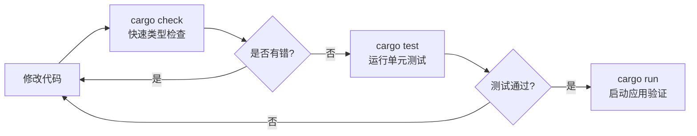
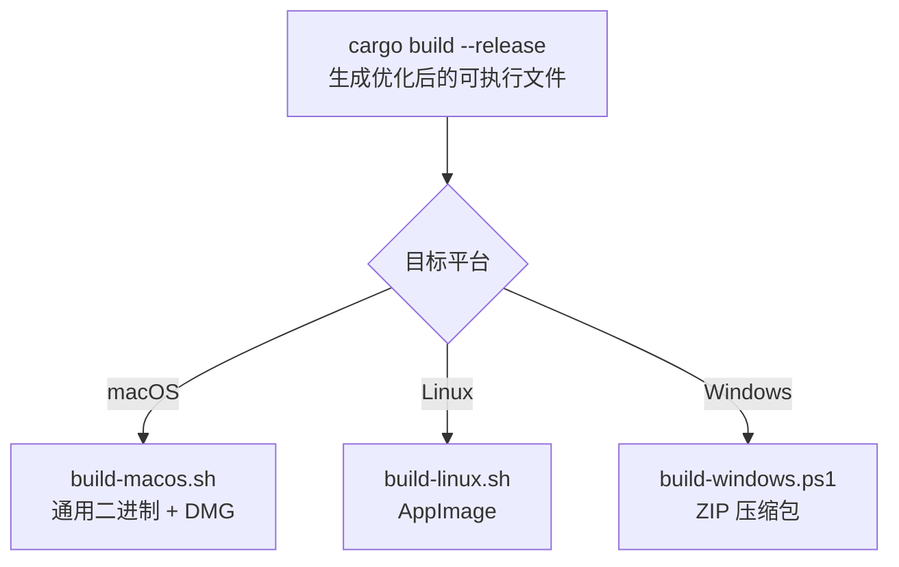

Encrust 使用 Rust 标准工具链进行构建与测试，无需额外配置复杂的构建系统。本文面向初学者，梳理从环境检查到跨平台分发的完整命令参考，帮助你快速验证代码改动并产出可执行文件。

Sources: [Cargo.toml](Cargo.toml#L1-L28), [README.md](README.md#L18-L30)

## 环境准备

在开始之前，请确认本地已安装 Rust 工具链。Encrust 使用 **Edition 2024**，需要较新的编译器版本。

```bash
# 检查 Rust 版本
rustc --version
cargo --version
```

若尚未安装 Rust，可通过 [rustup](https://rustup.rs) 一键安装。安装完成后，`cargo` 作为 Rust 的构建系统和包管理器，将负责下载依赖、编译代码、运行测试和生成可执行文件。

Sources: [Cargo.toml](Cargo.toml#L4)

## 日常开发命令

日常开发中最常用的三条命令如下：

| 命令 | 作用 | 适用场景 |
|------|------|----------|
| `cargo check` | 快速检查代码是否能通过编译，不生成可执行文件 | 编写代码时频繁验证语法和类型 |
| `cargo run` | 编译并运行当前项目的默认二进制（桌面应用） | 调试 UI 或验证功能流程 |
| `cargo test` | 编译并运行所有单元测试 | 提交代码前验证逻辑正确性 |

运行 `cargo run` 后，Encrust 桌面窗口将启动，你可以直接体验拖拽加密、文本加密等完整功能。由于 Debug 模式下未开启编译优化，启动速度和运行性能会低于正式发布版本。

Sources: [README.md](README.md#L22-L24)

### 开发工作流示意



Sources: [src/crypto/tests.rs](src/crypto/tests.rs#L1-L259)

## 测试命令详解

Encrust 的单元测试集中在加密模块，用于保障核心安全逻辑的正确性。测试覆盖密钥短语校验、加解密流程、多套件兼容性以及向后兼容等关键场景。

### 运行全部测试

```bash
cargo test
```

执行后，Cargo 会自动编译测试代码并输出每个测试用例的结果。测试代码位于 `src/crypto/tests.rs`，包含以下验证点：

- **拒绝短密码**：密钥短语不足 8 字符时，必须返回 `CryptoError::PassphraseTooShort`
- **头部字段校验**：加密输出必须以 `ENCRUST` 魔数开头，且格式版本为当前 v2
- **随机性保证**：相同明文和相同密码两次加密的结果必须不同（因为 salt 和 nonce 随机生成）
- **数据类型覆盖**：同时验证二进制数据和 UTF-8 文本的加密能力
- **文本解密**：加密后的文本能被完整还原
- **文件解密**：加密后的文件能被还原，并保留原始文件名
- **错误密码拒绝**：使用错误密码解密必须失败，且不暴露具体原因
- **多 AEAD 套件**：AES-256-GCM、XChaCha20-Poly1305、SM4-GCM 三种套件均能正确加解密
- **v1 向后兼容**：能正确解密旧版 v1 格式生成的文件

### 常用测试选项

| 命令 | 效果 |
|------|------|
| `cargo test` | 运行所有测试 |
| `cargo test --no-run` | 仅编译测试，不执行（用于快速检查编译） |
| `cargo test --release` | 在 Release 模式下编译并运行测试 |
| `cargo test decrypts_text_payload` | 仅运行名称匹配的单个测试 |
| `cargo test -- --nocapture` | 显示测试中被捕获的标准输出 |

Sources: [src/crypto/tests.rs](src/crypto/tests.rs#L16-L204)

## 发布构建与跨平台打包

日常调试使用 `cargo run` 即可，但向用户分发时需要执行**发布构建**。Encrust 在 `scripts/` 目录下为三个主流平台提供了自动化打包脚本，将 `cargo build --release` 与平台特定的打包工具串联起来。



Sources: [scripts/build-macos.sh](scripts/build-macos.sh#L1-L131), [scripts/build-linux.sh](scripts/build-linux.sh#L1-L85), [scripts/build-windows.ps1](scripts/build-windows.ps1#L1-L43)

### macOS 打包

```bash
./scripts/build-macos.sh
```

该脚本执行以下步骤：

1. 检查并安装 `cargo-bundle` 工具
2. 检查并添加 `x86_64-apple-darwin` 和 `aarch64-apple-darwin` 编译目标
3. 分别构建 Intel 和 Apple Silicon 版本的 `.app` Bundle
4. 使用 `lipo` 合并为 **Universal Binary**（通用二进制）
5. 清理扩展属性并进行临时代码签名
6. 使用 `hdiutil` 创建 DMG 安装镜像

最终产物位于 `target/release/Encrust-版本号-macOS-universal.dmg`，同时保留 `target/release/Encrust.app` 供直接使用。

Sources: [scripts/build-macos.sh](scripts/build-macos.sh#L23-L82)

### Linux 打包

```bash
./scripts/build-linux.sh
```

该脚本执行以下步骤：

1. 执行 `cargo build --release` 生成本地可执行文件
2. 准备 AppDir 目录结构（包含 `.desktop` 入口和 `AppRun` 启动脚本）
3. 复制应用图标和可执行文件到 AppDir
4. 自动获取或下载 `appimagetool`
5. 打包生成 AppImage 文件

最终产物位于 `target/release/Encrust-版本号-x86_64.AppImage`，用户下载后可直接运行，无需额外安装依赖。

Sources: [scripts/build-linux.sh](scripts/build-linux.sh#L16-L77)

### Windows 打包

在 PowerShell 中执行：

```powershell
.\scripts\build-windows.ps1
```

该脚本执行以下步骤：

1. 执行 `cargo build --release`
2. 创建临时分发目录，复制可执行文件和图标
3. 使用 `Compress-Archive` 打包为 ZIP 文件
4. 清理临时目录

最终产物位于 `target/release/Encrust-版本号-windows.zip`，解压后即可运行。

Sources: [scripts/build-windows.ps1](scripts/build-windows.ps1#L14-L36)

## 构建产物速查表

| 平台 | 构建命令 | 最终产物路径 | 格式说明 |
|------|----------|--------------|----------|
| 全平台（开发） | `cargo run` | `target/debug/encrust` | Debug 模式，未优化 |
| 全平台（发布） | `cargo build --release` | `target/release/encrust` | 单架构可执行文件 |
| macOS | `./scripts/build-macos.sh` | `target/release/Encrust-*.dmg` | 含通用二进制的安装镜像 |
| Linux | `./scripts/build-linux.sh` | `target/release/Encrust-*.AppImage` | 免安装可执行包 |
| Windows | `.\scripts\build-windows.ps1` | `target/release/Encrust-*.zip` | 压缩分发包 |

Sources: [scripts/build-macos.sh](scripts/build-macos.sh#L10-L11), [scripts/build-linux.sh](scripts/build-linux.sh#L71), [scripts/build-windows.ps1](scripts/build-windows.ps1#L5-L6)

## 下一步

熟悉构建与测试流程后，你可以：

- 阅读 [加密模块架构与公开 API 设计](10-jia-mi-mo-kuai-jia-gou-yu-gong-kai-api-she-ji)，理解加密模块的代码组织结构
- 阅读 [单元测试策略与向后兼容保障](19-dan-yuan-ce-shi-ce-lue-yu-xiang-hou-jian-rong-bao-zhang)，深入了解测试用例的设计意图
- 阅读 [macOS 通用二进制与 DMG 打包](20-macos-tong-yong-er-jin-zhi-yu-dmg-da-bao)、[Linux AppImage 打包](21-linux-appimage-da-bao) 或 [Windows 可执行文件构建](22-windows-ke-zhi-xing-wen-jian-gou-jian)，详细了解各平台打包脚本的实现原理