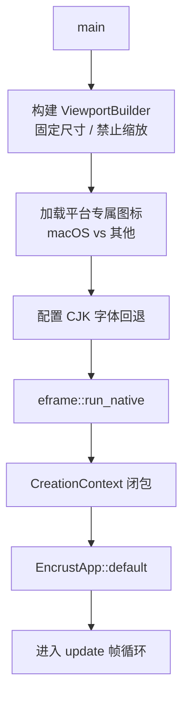
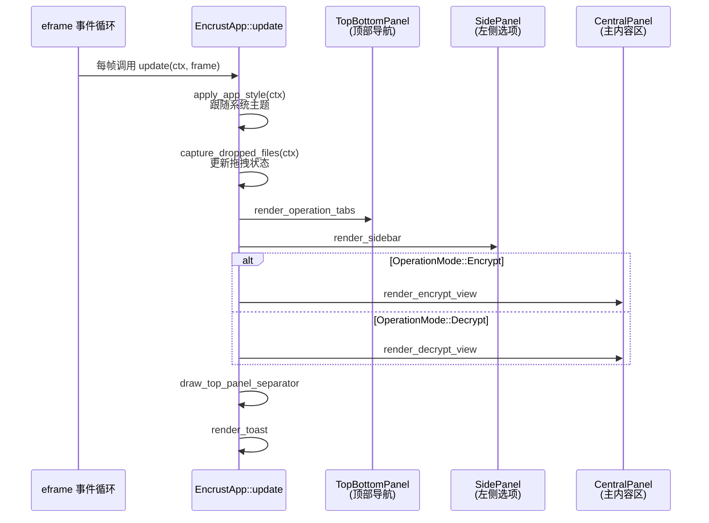

Encrust 采用 **eframe**（egui 的官方桌面运行时）作为跨平台窗口框架。本文档聚焦两个核心主题：一是应用如何从 `main` 函数启动并配置初始窗口属性，二是 `EncrustApp` 如何在每一帧中完成输入处理、状态更新与界面渲染。理解这两条脉络，是后续阅读界面布局、主题系统和文件交互实现的前提。

## 入口配置总览

整个桌面端的启动链路非常紧凑：`main.rs` 负责构建视口参数、加载平台图标、注入 CJK 字体回退，最后将控制权交给 `eframe::run_native`。在 `run_native` 的 `CreationContext` 闭包中，`EncrustApp::default()` 被实例化，应用正式进入帧循环。

这个设计体现了明确的关注点分离：入口文件只处理“平台相关的一次性配置”，而所有业务状态与 UI 逻辑全部下沉到 `app.rs` 中的 `EncrustApp` 结构体。这种分层让 `main.rs` 保持精简，同时也方便后续为不同平台扩展差异化的启动参数。

Sources: [main.rs](src/main.rs#L9-L32)

## Viewport 与窗口属性

Encrust 当前按**固定尺寸的工具窗口**进行设计，因此在 `ViewportBuilder` 中显式锁定了内外尺寸并禁用用户缩放。这一决策的出发点在于：侧边栏、内容卡片和顶部导航的相对位置经过精确计算，若允许任意缩放，会引入未经设计的响应式状态。

| 属性 | 配置值 | 设计意图 |
|---|---|---|
| `inner_size` | `[900.0, 680.0]` | 默认窗口内容区大小 |
| `min_inner_size` | `[900.0, 680.0]` | 限制最小尺寸 |
| `max_inner_size` | `[900.0, 680.0]` | 限制最大尺寸 |
| `resizable` | `false` | 禁用用户手动缩放 |
| `icon` | 平台差异化加载 | macOS 使用 `icon_32x32@2x.png`，其余使用 `appicon.png` |

`NativeOptions` 将上述 `ViewportBuilder` 作为唯一自定义项传入，其余字段均取默认值。如果需要未来支持记忆化窗口尺寸或允许用户调整大小，改动的入口点就集中在 `ViewportBuilder` 这一段。

Sources: [main.rs](src/main.rs#L10-L22)

## 应用实例初始化

`eframe::run_native` 的第三个参数是一个闭包，签名接收 `&CreationContext` 并返回 `Box<dyn App>`。Encrust 在这个闭包中完成两件必须在 GPU 上下文和 egui 环境就绪后才能做的事：

1. **字体配置**：调用 `configure_fonts`，按平台常见路径扫描 CJK 字体，将第一份可用字体以 `"cjk-fallback"` 的名称插入到 `FontFamily::Proportional` 和 `Monospace` 的最前面，并施加 `y_offset_factor: 0.18` 的视觉微调，解决 CJK 字体在按钮和输入框中偏上的问题。
2. **应用实例化**：通过 `EncrustApp::default()` 创建初始状态。

`Default` 实现决定了应用冷启动时的界面状态：默认处于**加密模式**（`OperationMode::Encrypt`）、输入类型为**文件**（`EncryptInputMode::File`）、默认选中**AES-256-GCM** 套件，其余路径和文本字段均为空，`toast` 和 `drag_hovered` 为未激活状态。由于当前未实现窗口状态持久化，每次启动都会回到这一干净初始态。

Sources: [main.rs](src/main.rs#L24-L31), [app.rs](src/app.rs#L95-L114)

## 帧生命周期与渲染管线

`EncrustApp` 对 `eframe::App` trait 的实现目前只重写了 `update` 方法。eframe 会在主事件循环的每一帧调用它，因此 `update` 内部既要处理“输入事件”（如文件拖拽），也要负责“整屏绘制”。可以把一帧的执行顺序理解为下面五个阶段：

**阶段一：主题同步**。`apply_app_style` 在每一帧开头都会执行 `ctx.set_theme(egui::ThemePreference::System)`，这意味着应用没有内部主题开关，而是无条件跟随操作系统当前的明暗偏好。随后它会根据 `ctx.style().visuals.dark_mode` 提取一套语义化色值（`ThemeColors`），并注入到 egui 的 `Visuals` 中，覆盖面板底色、控件边框、圆角、文本选择色等。这套机制保证了用户在系统设置里切换主题后，Encrust 能立即响应，无需重启。

**阶段二：输入捕获**。`capture_dropped_files` 从 `ctx.input` 中读取本帧的 `hovered_files` 和 `dropped_files`，更新 `drag_hovered` 标志，并在检测到实际投放时根据当前操作模式将文件路径写入 `selected_file` 或 `encrypted_input_path`。由于 egui 采用“即时模式”（Immediate Mode），拖拽状态不会自动持久化，必须在每一帧主动轮询。

**阶段三：面板渲染**。`update` 方法内依次构建了三个互斥的 egui 面板容器：
- `TopBottomPanel::top("menu_bar")`：承载 Logo、应用标题和加密/解密标签页。
- `SidePanel::left("settings")`：承载选项卡片，包括输入类型、加密方式、密钥输入等。
- `CentralPanel::default()`：承载主内容区，根据 `operation_mode` 分发到加密视图或解密视图。

三个面板的 `resizable` 均被显式设为 `false`，与 `ViewportBuilder` 的固定尺寸策略保持一致。

**阶段四：装饰线与 Toast**。由于 `TopBottomPanel` 原生分隔线不一定能与 `SidePanel` 的竖线在视觉上完美衔接，`draw_top_panel_separator` 会在前景层手动绘制一条贯穿全宽的 1px 横线。最后 `render_toast` 检查当前是否有未过期的 `Toast`，并在屏幕底部居中绘制成功或错误提示。

Sources: [app.rs](src/app.rs#L116-L213), [app.rs](src/app.rs#L217-L241), [app.rs](src/app.rs#L1141-L1191)

## 状态在帧内的生存周期

`EncrustApp` 的所有字段都在 `update` 的单次调用范围内被读取和修改，不存在独立于帧的“后台状态机”。以下是几类典型状态在帧内的表现：

| 状态类型 | 字段示例 | 生命周期特征 |
|---|---|---|
| 用户输入 | `passphrase`, `text_input` | 每帧从 egui 控件同步，随用户键入即时变化 |
| 文件引用 | `selected_file`, `encrypted_output_path` | 由按钮回调或拖拽事件一次性写入，可被清除按钮重置 |
| 瞬时反馈 | `drag_hovered` | 仅在当前帧有文件悬停于窗口时为 `true`，下一帧自动恢复 |
| 定时提示 | `toast` | 携带 `created_at: Instant`，`render_toast` 中判断是否超时（4 秒）后自动置空 |
| 模式切换 | `operation_mode` | 点击顶部 tab 时原子性切换，同时清空旧模式的 `toast` |

这种设计模式是 egui 即时式架构的自然产物：状态保存在普通的 Rust 结构体字段中，每一帧根据最新状态重新绘制全屏 UI。对开发者而言，这意味着不需要管理复杂的订阅或变更检测逻辑；对安全性而言，这也意味着不存在隐式的状态缓存导致敏感信息（如密钥）意外残留。

Sources: [app.rs](src/app.rs#L72-L93), [app.rs](src/app.rs#L351-L356), [app.rs](src/app.rs#L858-L915)

## 跨平台图标加载策略

`load_icon` 在编译期通过 `include_bytes!` 将图标资源嵌入二进制，避免运行时因资源路径问题导致加载失败。针对 macOS 的视网膜屏，该函数选用 `icon.iconset/icon_32x32@2x.png`（64×64 实际像素），而非通用的 `appicon.png`，以保障 Dock 栏和任务切换器中的显示清晰度。非 macOS 平台则统一回退到根目录的 `appicon.png`。加载后的图像被转换为 RGBA8 并包装成 `IconData`，最终由 `ViewportBuilder::with_icon` 注入。

Sources: [main.rs](src/main.rs#L34-L52)

## 桌面打包元数据

除了运行时行为，`Cargo.toml` 中的 `[package.metadata.bundle]` 段为 macOS 提供了应用级元数据，供 `cargo-bundle` 或 `tauri-bundler` 生成 `.app` 时使用：

| 字段 | 值 | 用途 |
|---|---|---|
| `name` | `Encrust` | 应用程序显示名 |
| `identifier` | `com.encrust.app` | Bundle Identifier |
| `icon` | `assets/appicon/appicon.icns` | macOS 应用图标 |
| `category` | `public.app-category.utilities` | App Store 分类 |
| `short_description` | 跨平台桌面加密工具 | 安装包简介 |

需要注意的是，这里的 `icon` 仅影响打包后的 `.app` 显示图标；运行时窗口标题栏和 Dock 的图标仍然由 `main.rs` 中的 `load_icon` 提供。Linux 与 Windows 的打包配置未在 `Cargo.toml` 中直接体现，而是交由 `scripts/build-linux.sh` 和 `scripts/build-windows.ps1` 处理。

Sources: [Cargo.toml](Cargo.toml#L7-L15)

## 延伸阅读

理解入口配置后，建议按以下顺序继续深入桌面应用架构的其余部分：

- **[egui 界面布局与状态管理](6-egui-jie-mian-bu-ju-yu-zhuang-tai-guan-li)**：详细拆解 `SidePanel`、`CentralPanel` 内部的卡片、按钮和输入框实现，以及 `EncrustApp` 如何通过模式切换复用同一套状态空间。
- **[跨平台 CJK 字体回退与图标加载](7-kua-ping-tai-cjk-zi-ti-hui-tui-yu-tu-biao-jia-zai)**：深入 `configure_fonts` 的候选字体策略和 `y_offset_factor` 的微调逻辑。
- **[暗色/浅色主题与视觉系统](8-an-se-qian-se-zhu-ti-yu-shi-jue-xi-tong)**：展开 `theme_colors` 的语义化配色映射和 `apply_app_style` 对 egui `Visuals` 的全量覆盖。
- **[文件拖拽交互与系统对话框集成](9-wen-jian-tuo-zhuai-jiao-hu-yu-xi-tong-dui-hua-kuang-ji-cheng)**：聚焦 `capture_dropped_files` 与 `rfd::FileDialog` 的协同工作方式。