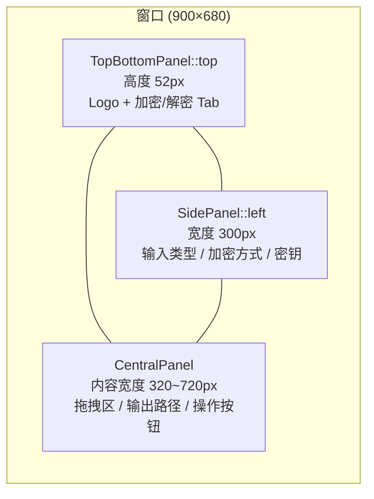
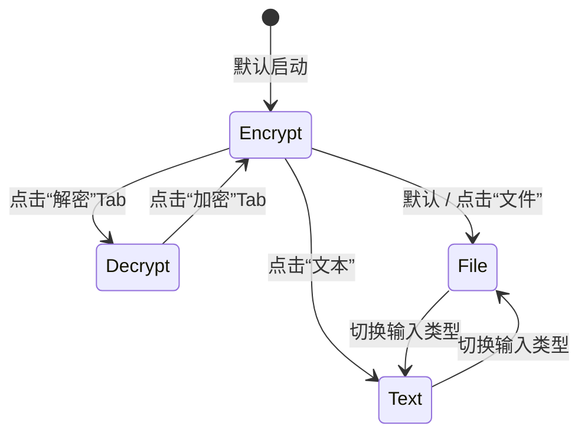

Encrust 的桌面界面基于 `eframe` + `egui` 构建，采用**即时模式（immediate mode）**渲染管线。与保留式 UI 框架不同，egui 每一帧都会根据当前应用状态完整重绘界面，这要求状态模型与视图渲染之间具备高度的一致性。本章将拆解 Encrust 如何通过**单结构体集中状态**、**三栏面板空间约束**和**语义化组件常量**三者配合，在保持代码可读性的同时，实现加密/解密双模式下的零抖动布局。

## 应用状态架构：单结构体驱动模式

Encrust 的全部界面状态收敛于一个 `EncrustApp` 结构体。该结构体实现了 `eframe::App`  trait，其 `update` 方法每帧被框架调用一次，负责读取当前状态并输出对应的 UI 指令。这种设计把“状态持有”与“视图描述”绑定在同一实体上，避免了传统 MVC 中状态同步失效的问题。

`EncrustApp` 的字段可按职责划分为四类：**模式控制**、**加密输入**、**解密输出**与**反馈状态**。模式控制字段决定当前渲染哪一套视图；输入字段承载用户提供的明文、文件路径与口令；输出字段缓存解密后的文本或文件字节；反馈状态则管理 Toast 通知与拖拽高亮。所有字段均在 `Default` 实现中给出初始值，应用在 `main.rs` 的创建闭包中通过 `Box::new(app::EncrustApp::default())` 完成初始化。

| 字段类别 | 字段名 | 类型 | 职责说明 |
|---|---|---|---|
| 模式控制 | `operation_mode` | `OperationMode` | 全局视图根切换：`Encrypt` / `Decrypt` |
| 模式控制 | `encrypt_input_mode` | `EncryptInputMode` | 加密子视图切换：`File` / `Text` |
| 加密输入 | `selected_file` | `Option<PathBuf>` | 待加密的原始文件路径 |
| 加密输入 | `text_input` | `String` | 待加密的纯文本内容 |
| 加密输入 | `passphrase` | `String` | 用户输入的加密口令 |
| 加密输入 | `selected_suite` | `EncryptionSuite` | 选中的 AEAD 套件 |
| 加密输入 | `encrypted_output_path` | `Option<PathBuf>` | 加密结果保存路径 |
| 解密输出 | `encrypted_input_path` | `Option<PathBuf>` | 待解密的 `.encrust` 文件路径 |
| 解密输出 | `decrypted_text` | `String` | 解密后的文本内容 |
| 解密输出 | `decrypted_file_bytes` | `Option<Vec<u8>>` | 解密后的文件原始字节 |
| 解密输出 | `decrypted_file_name` | `Option<String>` | 解密后恢复的原文件名 |
| 解密输出 | `decrypted_output_path` | `Option<PathBuf>` | 解密文件另存为路径 |
| 反馈状态 | `toast` | `Option<Toast>` | 成功/失败提示及其创建时间 |
| 反馈状态 | `drag_hovered` | `bool` | 当前是否有文件被拖拽悬浮于窗口上方 |

由于所有状态都集中在同一结构体中，模式切换时可以通过单个方法原子化地清理相关派生状态。例如 `set_operation_mode` 在切表时清除旧模式的 Toast，`set_encrypted_input_path` 在加载新加密文件时一次性清空前一次解密产生的文本、字节、文件名和保存路径，避免脏数据残留。

Sources: [app.rs](src/app.rs#L78-L114), [app.rs](src/app.rs#L351-L356), [app.rs](src/app.rs#L1060-L1067)

## 三栏空间布局：面板层级与尺寸约束

Encrust 的窗口在 `main.rs` 中被固定为 `900×680` 像素且不可缩放。这一决策并非随意限制，而是为了确保**左侧边栏、主内容卡片和顶部导航**三者的相对位置处于精确设计状态，避免 egui 的响应式布局在不同窗口尺寸下产生未经验证的视觉表现。

`update` 方法内的布局顺序严格遵循 **从上至下、从左至右** 的空间层级。首先放置 `TopBottomPanel::top("menu_bar")`，高度锁定为 `TOP_BAR_HEIGHT`（52px），内部采用 `left_to_right` 布局放置 Logo 与操作 Tab。随后放置 `SidePanel::left("settings")`，宽度锁定为 `SIDEBAR_WIDTH`（300px），并显式移除默认外框 stroke，仅保留 egui 原生自带的 1px 竖向分隔线，防止画出第二条重叠竖线。最后放置 `CentralPanel::default()` 作为主内容区，外层包裹 `ScrollArea::vertical()`，保证内容超出视口时可垂直滚动。

主内容区的宽度计算值得注意：代码从可用宽度中扣除两侧 `horizontal_padding`（20px）后，通过 `.max(320.0).min(720.0)` 限制在 320~720px 区间。这意味着当窗口达到设计上限 900px 时，主内容呈现舒适的阅读宽度；即便未来窗口尺寸下限被意外突破，内容区也不会被压缩到不可用的程度。

Sources: [main.rs](src/main.rs#L10-L16), [app.rs](src/app.rs#L116-L213)

## 视图状态切换：枚举驱动的条件渲染

界面在加密与解密两种根本不同的工作流之间切换，Encrust 使用两层枚举实现精确的条件渲染。

第一层是 `OperationMode`，包含 `Encrypt` 与 `Decrypt` 两个变体。`update` 方法中的 `CentralPanel` 内部直接 `match self.operation_mode`，分别调用 `render_encrypt_view` 或 `render_decrypt_view`。第二层是 `EncryptInputMode`，仅在 `OperationMode::Encrypt` 下生效，进一步区分 `File` 与 `Text` 输入方式，决定渲染文件拖拽区还是多行文本输入框。

枚举驱动的最大优势在于**穷举约束**：Rust 编译器要求每个 `match` 分支都必须被处理，新增模式时编译错误会强制开发者补全对应的 UI 渲染逻辑，避免遗漏。此外，状态切换伴随严格的副作用清理——`set_operation_mode` 会在切表时置空 `toast`；`render_encrypt_input_tabs` 在切换 `encrypt_input_mode` 时会清空 `encrypted_output_path`，防止旧输出路径与新输入类型不匹配。

Sources: [app.rs](src/app.rs#L54-L64), [app.rs](src/app.rs#L180-L208), [app.rs](src/app.rs#L351-L356)

## 组件级防抖动：固定尺寸与布局常量

在即时模式 UI 中，控件的默认尺寸往往由内容撑开。这对中英文混合界面极不友好：同一个按钮在中文文案下比英文宽，在禁用态下又可能因颜色变化产生视觉跳动。Encrust 的解决方案是在文件头部集中定义**布局常量**，并在组件 helper 中强制固定尺寸。

| 常量名 | 值 | 用途 |
|---|---|---|
| `TOP_BAR_HEIGHT` | `52.0` | 顶部导航栏固定高度 |
| `PRIMARY_BUTTON_SIZE` | `[140.0, 42.0]` | 加密/解密主操作按钮 |
| `SECONDARY_BUTTON_SIZE` | `[130.0, 34.0]` | 选择文件等次级按钮 |
| `SAVE_AS_BUTTON_SIZE` | `[90.0, 34.0]` | “另存为...”按钮 |
| `SIDEBAR_WIDTH` | `300.0` | 左侧边栏总宽度 |
| `SIDEBAR_CARD_WIDTH` | `252.0` | 侧边栏卡片内容宽度（已扣除内边距） |
| `SIDEBAR_PADDING` | `24.0` | 侧边栏外留白 |
| `SIDEBAR_CONTENT_LEFT_INSET` | `16.0` | 抵消 SidePanel 原生 8px 内边距后的实际左缩进 |

这些常量不仅服务于布局计算，也构成了视觉系统的**设计令牌（design tokens）**。例如 `SIDEBAR_CONTENT_LEFT_INSET = SIDEBAR_PADDING - SIDEBAR_FRAME_INNER_X`（24 - 8 = 16）这一表达式，确保了卡片左边缘与窗口左边缘的实际距离正好是 24px，而不是被 egui 默认内边距干扰后的 32px。所有 helper 函数——如 `primary_button`、`secondary_button`、`sidebar_card`、`selected_path_row`——都从这些常量中取值，保证跨模块的度量一致性。

Sources: [app.rs](src/app.rs#L32-L52), [app.rs](src/app.rs#L1281-L1398)

## 语义化配色与每帧样式注入

Encrust 不直接在各渲染函数中硬编码 RGB 值，而是通过 `ThemeColors` 结构体建立一层语义抽象。该结构体定义了 `app_bg`、`surface`、`primary`、`text_main` 等 14 个语义字段，再由 `theme_colors` 函数根据 `ctx.style().visuals.dark_mode` 映射到具体色值。

`apply_app_style` 在 `update` 的第一行被调用，意味着**每帧都会重新注入样式**。这看似浪费，实则必要：egui 允许系统在运行时切换深浅色模式，每帧重新读取系统偏好并应用主题，可以确保 Encrust 的 `panel_fill`、`window_fill`、`widgets.*` 状态色与 `ThemeColors` 始终保持同步。具体而言，`style.visuals.widgets.inactive / hovered / active` 的填充色、边框色和前景色被分别绑定到 `surface_alt`、`border_hover` 和 `text_main`，使内置控件（如 `TextEdit`、`ComboBox`）与自绘组件（如 Tab 下划线、拖拽框）共享同一套调色板。

值得注意的是，虽然 Encrust 支持跟随系统的深浅色自动切换，但它并未在应用状态中维护独立的首选项字段。`apply_app_style` 直接使用 `egui::ThemePreference::System`，这意味着当前不存在用户手动锁定主题的状态路径。如果未来需要增加主题设置，只需将 `ThemePreference` 提升到 `EncrustApp` 的字段中即可。

Sources: [app.rs](src/app.rs#L1197-L1255), [app.rs](src/app.rs#L1141-L1191)

关于字体加载与跨平台 CJK 回退策略的详细实现，请参阅 [跨平台 CJK 字体回退与图标加载](7-kua-ping-tai-cjk-zi-ti-hui-tui-yu-tu-biao-jia-zai)；主题色值的完整对照与视觉系统设计理念，请参阅 [暗色/浅色主题与视觉系统](8-an-se-qian-se-zhu-ti-yu-shi-jue-xi-tong)。

## Toast 通知的状态生命周期

Toast 是 Encrust 唯一的全局覆盖层反馈机制，其状态生命周期由 `Toast` 结构体和 `Notice` 枚举共同管理。`Notice` 区分 `Success(String)` 与 `Error(String)` 两种语义；`Toast` 额外记录 `created_at: Instant`，用于实现 4 秒自动消失。

`render_toast` 使用 `egui::Area` 以 `CENTER_TOP` 锚点悬浮在界面最上层，并通过 `interactable(false)` 避免阻挡下层操作。渲染时计算 `progress = 1.0 - elapsed / 4.0`，在 Toast 底部绘制一条随时间收缩的进度条，为用户提供直观的超时暗示。为了避免 UI 冻结，方法末尾调用 `ctx.request_repaint_after(Duration::from_millis(250))`，确保即使没有用户输入，框架也会在 250ms 后再次调用 `update`，从而平滑推进进度条动画并在超时后清除 Toast。

Toast 的显隐完全由状态驱动：`show_toast` 方法向 `self.toast` 写入新值；`render_toast` 在检测到超时时将 `self.toast` 置为 `None`。这种模式体现了即时模式 UI 的核心哲学——**没有独立的“显示/隐藏”命令，只有状态变更和基于状态的重新渲染**。

Sources: [app.rs](src/app.rs#L66-L76), [app.rs](src/app.rs#L858-L921)

## 拖拽交互的状态反馈回路

文件拖拽的视觉反馈通过 `drag_hovered` 布尔字段与 `capture_dropped_files` 方法实现闭环。在 `update` 中，该方法通过 `ctx.input` 读取当前帧的 `hovered_files` 与 `dropped_files`：只要 `hovered_files` 非空，就将 `drag_hovered` 设为 `true`，反之设为 `false`。这一状态随后被加密/解密的拖拽区读取，用于切换填充色、边框粗细和提示文案。

当用户实际释放文件时，`dropped_files` 被解析为 `PathBuf`，并根据当前 `operation_mode` 写入对应的状态字段（加密模式下写入 `selected_file`，解密模式下写入 `encrypted_input_path`）。与此同时，`drag_hovered` 被重置为 `false`，Toast 被清除，确保视觉状态与数据状态保持一致。

拖拽区还有一个细节：一旦文件被选中，区域高度会从 150~160px 收缩到 20~32px，仅保留单行路径展示。这种**动态高度**由 `has_selected_file` / `has_encrypted_input` 条件控制，既在空状态时提供足够的可拖拽目标面积，又在选中后释放垂直空间给输出路径卡片和操作按钮。

Sources: [app.rs](src/app.rs#L92-L93), [app.rs](src/app.rs#L217-L241), [app.rs](src/app.rs#L539-L541), [app.rs](src/app.rs#L389-L391)

关于文件对话框集成与跨平台拖拽行为的完整说明，请参阅 [文件拖拽交互与系统对话框集成](9-wen-jian-tuo-zhuai-jiao-hu-yu-xi-tong-dui-hua-kuang-ji-cheng)。

## 总结与延伸阅读

Encrust 的 egui 实践展示了如何在即时模式框架中通过**集中状态**、**面板约束**和**语义常量**三者协同，构建出稳定、可维护的桌面界面。单结构体状态消除了同步心智负担；枚举驱动的 `match` 渲染保证了分支完整性；固定尺寸与布局常量则消除了 CJK 环境下的布局抖动。

理解界面布局后，推荐的阅读顺序如下：

1. [跨平台 CJK 字体回退与图标加载](7-kua-ping-tai-cjk-zi-ti-hui-tui-yu-tu-biao-jia-zai) — 了解 `main.rs` 中 `configure_fonts` 如何为 egui 注入中文字体回退，保证界面文本在 macOS/Linux 上的正确渲染。
2. [暗色/浅色主题与视觉系统](8-an-se-qian-se-zhu-ti-yu-shi-jue-xi-tong) — 深入 `ThemeColors` 的色值对照、语义命名逻辑以及 `apply_app_style` 的每帧注入机制。
3. [文件拖拽交互与系统对话框集成](9-wen-jian-tuo-zhuai-jiao-hu-yu-xi-tong-dui-hua-kuang-ji-cheng) — 探究 `rfd::FileDialog` 与 egui 拖拽事件的整合细节，以及跨平台文件选择的行为差异。