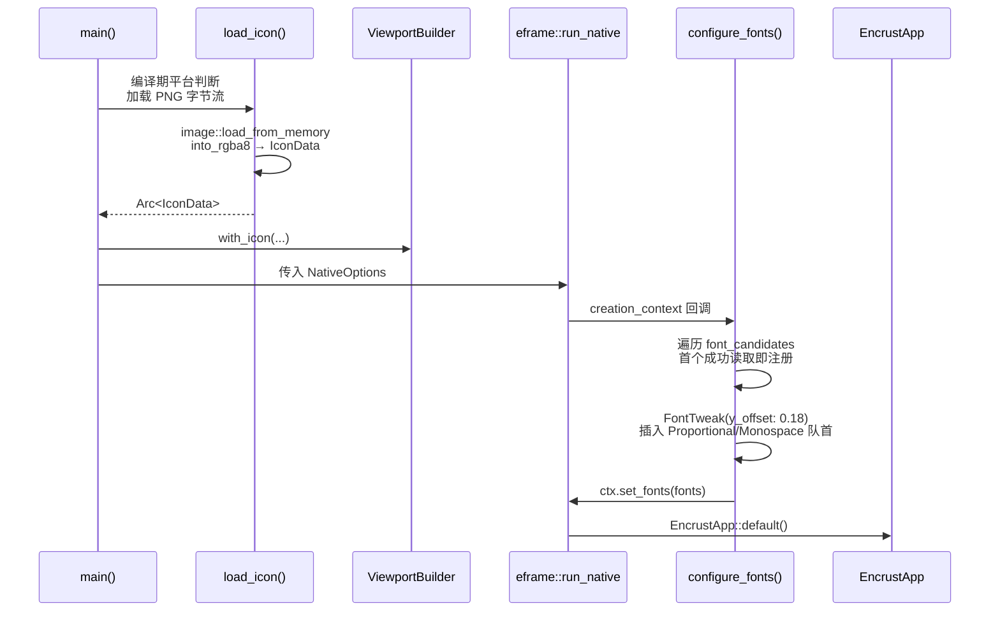

Encrust 在启动阶段需要解决两个跨平台视觉问题：一是为系统窗口标题栏与任务栏提供原生应用图标，二是确保中文、日文、韩文（CJK）字符及 emoji 在 egui 默认字体覆盖不足时仍能正确渲染。项目采用编译期平台判断加载不同格式的图标资产，并通过"候选字体探测+优先插入"策略构建回退字体链。界面内部则直接使用 Unicode emoji 作为轻量级状态图标，避免引入额外图标字体或图像资源。Sources: [main.rs](src/main.rs#L9-L52) [app.rs](src/app.rs#L137-L138)

## 窗口图标加载策略

窗口图标加载发生在 `main()` 入口处。`load_icon()` 函数通过条件编译区分平台：macOS 使用 `assets/appicon/icon.iconset/icon_32x32@2x.png`（有效 64px，适配 Retina 屏幕），其余平台统一使用 `assets/appicon.png`。`image` crate 将编译期嵌入的 PNG 字节流解码为 RGBA8，再按 `IconData { rgba, width, height }` 的格式封装，最终以 `Arc` 共享给 `ViewportBuilder::with_icon()`。需要区分的是，`Cargo.toml` 中 `[package.metadata.bundle]` 配置的 `appicon.icns` 仅用于 macOS 应用打包阶段，运行时图标仍由上述 PNG 路径提供。Sources: [main.rs](src/main.rs#L34-L52) [Cargo.toml](Cargo.toml#L7-L10)

## CJK 字体回退机制

### 候选路径与平台覆盖

CJK 字体回退在 `eframe::run_native` 的创建回调中执行，早于 `EncrustApp` 实例化。`configure_fonts` 以 `FontDefinitions::default()` 为基线，因为 egui 内置字体对 CJK 字形的支持不稳定。函数按平台常见系统字体路径枚举候选，首个通过 `std::fs::read` 成功读取的文件即被注册为 `"cjk-fallback"`。macOS 侧覆盖 Hiragino Sans GB、Arial Unicode、STHeiti Medium/Light 与 Songti；Linux 侧覆盖 NotoSansCJK（OpenType/TrueType 双路径）与文泉驿微米黑。Sources: [main.rs](src/main.rs#L54-L68)

### 视觉微调与字族优先级

由于 CJK 字体通常具有较大的 ascent，直接渲染会导致文字在按钮与输入框中视觉上偏上。项目通过 `FontTweak::y_offset_factor(0.18)` 将字形整体向下微调，使其更接近垂直居中。随后该字体以最高优先级插入 `Proportional` 与 `Monospace` 两个字族队列的头部，确保所有中文标签、提示文案及等宽代码区域的渲染均优先走系统 CJK 字体，而非回退到覆盖不全的默认字体。Sources: [main.rs](src/main.rs#L70-L93)

## 界面内联图标设计

界面内部未引入第三方图标库，而是将 Unicode emoji 直接嵌入 `egui::RichText` 作为语义化状态图标。顶部导航栏使用 `🔐` 作为应用标识；解密模式拖拽区常态显示 `🔒`、悬停时切换为 `↓` 以指示可释放；加密模式拖拽区则使用 `📁` 与 `↓` 的组合。这些 emoji 的渲染同样受益于 CJK 回退字体链，因为多数 CJK 字体文件同时包含 emoji 字形覆盖。与之形成对比，路径清除按钮采用自绘圆形加字母 `x` 的纯矢量方案（`clear_icon_button`），避免小尺寸下 emoji 解析度不足的问题。Sources: [app.rs](src/app.rs#L137-L138) [app.rs](src/app.rs#L430-L431) [app.rs](src/app.rs#L577-L578) [app.rs](src/app.rs#L1316-L1349)

## 初始化时序与依赖关系

字体与图标的初始化遵循严格的先后次序：图标在 `main()` 早期即完成加载并注入视口配置；字体则在 `eframe` 创建上下文时配置，远早于首帧渲染。

配置完成后，所有使用 `egui::FontId::proportional(...)` 的绘制调用都会自动继承该回退链。例如顶部操作标签（`加密`/`解密`）与拖拽提示文案（`拖拽文件到此处`）均依赖这一机制保证中文可读性。`crypto.rs` 中的密码短语校验也特意采用 `passphrase.chars().count()` 按 Unicode 字符计数，而非按 UTF-8 字节长度检查，从而确保中文与 emoji 等多字节字符不会被误判为超长输入。Sources: [app.rs](src/app.rs#L316-L321) [app.rs](src/app.rs#L439-L444) [app.rs](src/app.rs#L587-L592) [crypto.rs](src/crypto.rs#L23-L33)

## 平台差异对照

| 平台 | 运行时图标资产 | CJK 候选字体路径 | 覆盖状态 |
|------|--------------|----------------|---------|
| macOS | `icon_32x32@2x.png`（64px） | Hiragino Sans GB, Arial Unicode, STHeiti, Songti | 完整 |
| Linux | `appicon.png` | NotoSansCJK-Regular, wqy-microhei | 完整 |
| Windows | `appicon.png` | 无专用候选路径 | 依赖系统默认字体 |

当前实现未为 Windows 配置独立字体探测路径，该场景下 CJK 渲染质量取决于系统已安装字体与 egui 默认字体的交集。如需扩展 Windows 支持，可在 `font_candidates` 中追加 `C:\Windows\Fonts\msyh.ttc` 或 `C:\Windows\Fonts\simhei.ttf` 等常见路径。Sources: [main.rs](src/main.rs#L34-L68)

## 阅读延伸

理解字体与图标的初始化时序后，建议继续阅读 [窗口生命周期与入口配置](5-chuang-kou-sheng-ming-zhou-qi-yu-ru-kou-pei-zhi) 以掌握 `main()` 与 `eframe` 的完整交互流程；若需深入了解界面层如何利用这些字体资源进行排版，可前往 [egui 界面布局与状态管理](6-egui-jie-mian-bu-ju-yu-zhuang-tai-guan-li)；视觉样式的动态切换则记录在 [暗色/浅色主题与视觉系统](8-an-se-qian-se-zhu-ti-yu-shi-jue-xi-tong)。