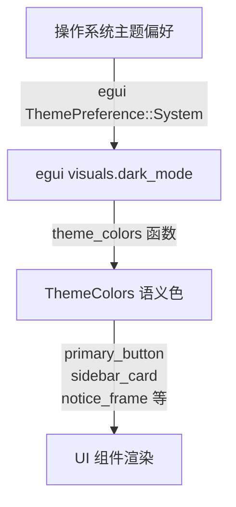

Encrust 的视觉系统围绕 egui 的 `ThemePreference::System` 构建，通过一层语义色抽象将系统明暗模式转换为应用内一致的配色方案。整个系统不包含用户级主题开关，而是完全跟随操作系统偏好；所有视觉数值（尺寸、圆角、间距、RGB 色值）集中在 `src/app.rs` 顶部的常量声明区，渲染函数通过 `theme_colors()` 统一获取当前主题下的语义色，避免在业务组件中硬编码颜色值。这种设计保证了浅色与深色模式下的组件行为完全一致，仅底层色值发生映射切换。

Sources: [app.rs](src/app.rs#L11-L52)

## 架构概览：三层映射模型

视觉系统从系统层面到像素层面分为三个层次。**第一层**是 egui 运行时通过 `ctx.set_theme(ThemePreference::System)` 读取操作系统当前偏好；**第二层**是 Encrust 自定义的 `ThemeColors` 语义色结构，把 egui 的 `visuals.dark_mode` 布尔值映射为 13 个具有业务含义的颜色字段；**第三层**是各个 UI 组件 helper（按钮、卡片、输入框、Toast 等），它们只依赖 `ThemeColors` 中的语义字段，完全不感知当前处于深色还是浅色模式。三层之间的单向依赖关系如下：

这种架构的好处在于：一旦需要新增一套主题（例如高对比度模式），只需在 `theme_colors` 中增加分支并返回一组新的 `ThemeColors`，上层的数十个组件渲染函数无需任何修改。

Sources: [app.rs](src/app.rs#L1141-L1255)

## 语义配色系统与色值对照

`ThemeColors` 定义了 13 个语义化字段，覆盖背景层级、边框状态、主品牌色、文字层级以及成功/错误反馈色。所有字段名都是"用途语义"而非"颜色名称"，例如 `app_bg` 表示应用最底层背景，`surface_alt` 表示控件悬浮/激活态的替代表面色。

| 语义字段 | 浅色模式值 | 深色模式值 | 用途说明 |
|---|---|---|---|
| `app_bg` | `rgb(248, 249, 252)` | `rgb(28, 28, 30)` | 窗口最底层背景，覆盖 TopPanel、SidePanel、CentralPanel |
| `surface` | `rgb(255, 255, 255)` | `rgb(44, 44, 46)` | 卡片、拖拽框、文本编辑器的底色 |
| `surface_alt` | `rgb(241, 243, 247)` | `rgb(58, 58, 60)` | 按钮未激活态、输入框背景、路径展示框底色 |
| `border` | `rgb(222, 226, 233)` | `rgb(72, 72, 74)` | 常规 1px 边框 |
| `border_hover` | `rgb(190, 195, 205)` | `rgb(100, 100, 102)` | 鼠标悬浮时边框加深刻度 |
| `primary` | `rgb(79, 70, 229)` | `rgb(99, 102, 241)` | 主按钮填充、Tab 选中态、焦点框 |
| `primary_soft` | `rgb(238, 240, 255)` | `rgb(40, 40, 55)` | 按钮激活态背景、选中标签底色、拖拽悬浮填充 |
| `text_main` | `rgb(31, 35, 40)` | `rgb(235, 235, 235)` | 主要正文、标题、输入文字 |
| `text_muted` | `rgb(107, 112, 123)` | `rgb(152, 152, 157)` | 辅助说明、提示文字、未选中 Tab |
| `text_on_primary` | `rgb(255, 255, 255)` | `rgb(255, 255, 255)` | 主按钮上的文字（两种模式保持一致） |
| `success` / `success_bg` | 翠绿 / 极浅绿 | 亮绿 / 深绿 | Toast 成功状态的文字与背景 |
| `error` / `error_bg` | 红色 / 极浅红 | 亮红 / 深红 | Toast 错误状态、密码校验提示、清除按钮 |

深色模式下的主色（indigo）比浅色模式稍亮，这是因为深色背景需要更高的明度才能保持相同的视觉重量。成功与错误色同样遵循这一原则：浅色模式使用高饱和的原始色配合极浅的背景，深色模式则降低原始色饱和度并加深背景，避免在暗色环境下产生刺眼的对比。

Sources: [app.rs](src/app.rs#L17-L29), [app.rs](src/app.rs#L1197-L1255)

## 全局样式注入机制

每帧 `update` 开始时都会调用 `apply_app_style(ctx)`，这意味着主题切换是实时响应的——用户如果在系统设置中切换明暗模式，Encrust 会在下一帧立即完成全部配色替换，无需重启应用。该函数完成四项工作：

第一，设置 `ctx.set_theme(ThemePreference::System)`，确保 egui 内部的 `visuals.dark_mode` 始终与系统同步；第二，调整全局 `spacing` 密度，定义 `item_spacing` 为 `[12, 10]`、`button_padding` 为 `[16, 8]`，为后续组件提供一致的呼吸感；第三，覆盖 `panel_fill`、`window_fill`、`extreme_bg_color` 等 egui 内置变量，使三大面板（顶部导航、左侧边栏、中央内容区）共享同一底层背景色；第四，按状态层级（`noninteractive` / `inactive` / `hovered` / `active`）逐一覆盖 `widgets.*` 的填充、边框和前景色，并统一圆角为 8px。文本选择、光标和焦点框也在这里绑定到 `primary` 主色，保证键盘操作与视觉焦点的一致性。

Sources: [app.rs](src/app.rs#L116-L191), [app.rs](src/app.rs#L1141-L1191)

## 组件视觉规范

为了避免"每个渲染函数各自为政"，Encrust 将重复出现的视觉模式封装为纯函数 helper。这些 helper 全部接收 `ThemeColors` 参数，返回配置好的 egui 控件或自绘图形。

### 按钮体系

应用内存在三种按钮层级。主操作按钮（`primary_button`）用于执行加密、解密、保存等不可逆动作，采用主色填充、无边框、固定尺寸 `[140, 42]`，确保禁用态与可点击态之间不会发生布局跳动。次级按钮（`secondary_button`）用于选择文件等辅助动作，采用 `surface_alt` 底色配合 1px `border` 边框，尺寸略小。保存按钮（`save_as_button`）虽然视觉风格与次级按钮相同，但拥有独立的固定宽度 `[90, 34]`，因为在加密输出和解密输出两个卡片中复用，需要避免不同文案导致宽度不一致。

### 卡片与容器

左侧边栏的所有配置块都通过 `sidebar_card` 渲染。该 helper 统一使用 `surface` 填充、`border` 1.5px 边框、10px 圆角，并固定内容宽度为 `SIDEBAR_CARD_WIDTH`，使加密模式下的"输入类型""加密方式""密钥"三个卡片与解密模式下的"输入""密钥"卡片在切换时保持完全一致的轮廓和位置，减少视觉颠簸。主内容区的拖拽区域、文本输入框、输出路径卡片同样使用 10px 圆角，但与侧边栏卡片不同的是，它们直接由业务渲染函数内联构造，以便根据状态动态调整边框粗细和填充色。

### 状态与反馈

`notice_frame` 为 Toast 通知和状态提示提供统一的外框：8px 圆角、16×12 的内边距，调用方只需传入成功或错误的填充色与边框色。`selected_path_row` 负责在文件被选中后渲染一行紧凑的状态反馈：左侧是带 `primary_soft` 底色和 `primary` 边框的"已选择"标签，中间是截断显示的路径，右侧是自绘的圆形清除按钮。`clear_icon_button` 采用自绘而非 egui 原生 Button，直径仅为 14px，悬浮时圆形填充从 `error_bg` 过渡到 `error`，保证在窄行内不占用额外高度。

Sources: [app.rs](src/app.rs#L1281-L1399), [app.rs](src/app.rs#L1456-L1478)

## 交互状态与动效

视觉系统不仅定义了静态配色，还通过条件分支实现了多个交互状态的即时反馈。

### 拖拽区域反馈

文件拖拽区域在 `drag_hovered` 为 `false` 时显示 `surface` 填充与 1.5px `border` 边框，图标和提示文字使用 `text_muted` 灰色；当文件被拖入窗口时，边框加粗至 2px 并切换为 `primary`，填充色变为 `primary_soft`，图标由"📁"变为"↓"，提示文字同步变为"释放以选择文件"。这种多属性的联动变化给用户提供了明确的"拖拽目标已激活"信号。如果用户已经选择了一个文件，拖拽区域会收缩为单行高度（`20px`），腾出纵向空间给下方的输出路径卡片。

Sources: [app.rs](src/app.rs#L521-L621)

### 顶部 Tab 自绘系统

加密/解密切换 Tab 没有使用 egui 原生的 `Button` 或 `SelectableLabel`，而是通过 `ui.allocate_exact_size` 分配固定尺寸后自绘文字和下划线。这样做是为了精确控制下划线的长度、粗细和位置：选中态下划线为 3px 粗、18px 缩进的 `primary` 色，悬浮态变为 1px 粗的 `border_hover`，未选中态则隐藏。文字颜色在选中或悬浮时使用 `primary`，否则使用 `text_muted`。自绘方式虽然增加了代码量，但避免了 egui 默认控件在主题切换时产生的不可控内边距和阴影。

Sources: [app.rs](src/app.rs#L300-L349)

### Toast 倒计时动效

操作成功或失败时，`render_toast` 会在屏幕顶部居中弹出一个悬浮通知。通知框底部有一条 2.5px 高的进度条，宽度按剩余时间比例从 100% 线性缩减到 0%，总时长 4 秒。进度条颜色与状态文字颜色一致（成功为绿色，错误为红色），通过 `ctx.request_repaint_after(Duration::from_millis(250))` 以约 4fps 的速率触发重绘，既保证了肉眼可见的倒计时动画，又不会过度消耗 CPU。

Sources: [app.rs](src/app.rs#L858-L914)

## 设计原则与扩展路径

当前视觉系统遵循三条核心原则。**集中管理**：所有 RGB 值和尺寸常量放在文件最顶部，修改主题时无需在几百行渲染代码中搜索。**语义隔离**：组件层只认识 `ThemeColors` 字段名，不认识具体色值，也不认识深色/浅色模式。**固定尺寸优先**：主按钮、侧边栏、卡片宽度全部硬编码，避免 egui 的自动布局在不同语言或不同状态下产生微妙跳动。

如果未来需要增加"跟随系统/始终浅色/始终深色"三级切换，扩展路径非常清晰：在 `EncrustApp` 状态中添加一个 `theme_preference` 字段，将 `apply_app_style` 中的 `ctx.set_theme(ThemePreference::System)` 替换为应用自身的状态值即可。`theme_colors` 函数本身不需要任何改动，因为它只读取 `ctx.style().visuals.dark_mode`，而这个值已经由 `set_theme` 正确设置。

Sources: [app.rs](src/app.rs#L78-L93), [app.rs](src/app.rs#L1141-L1145)

## 阅读指引

本章聚焦在视觉层与主题系统的实现机制。若你希望了解 Encrust 如何组织整体界面布局以及状态如何在各面板间流转，可继续阅读 [egui 界面布局与状态管理](6-egui-jie-mian-bu-ju-yu-zhuang-tai-guan-li)。若你关心跨平台字体加载和图标资源的管理方式，请参考 [跨平台 CJK 字体回退与图标加载](7-kua-ping-tai-cjk-zi-ti-hui-tui-yu-tu-biao-jia-zai)。下一页将介绍文件拖拽交互与系统对话框集成：[文件拖拽交互与系统对话框集成](9-wen-jian-tuo-zhuai-jiao-hu-yu-xi-tong-dui-hua-kuang-ji-cheng)。