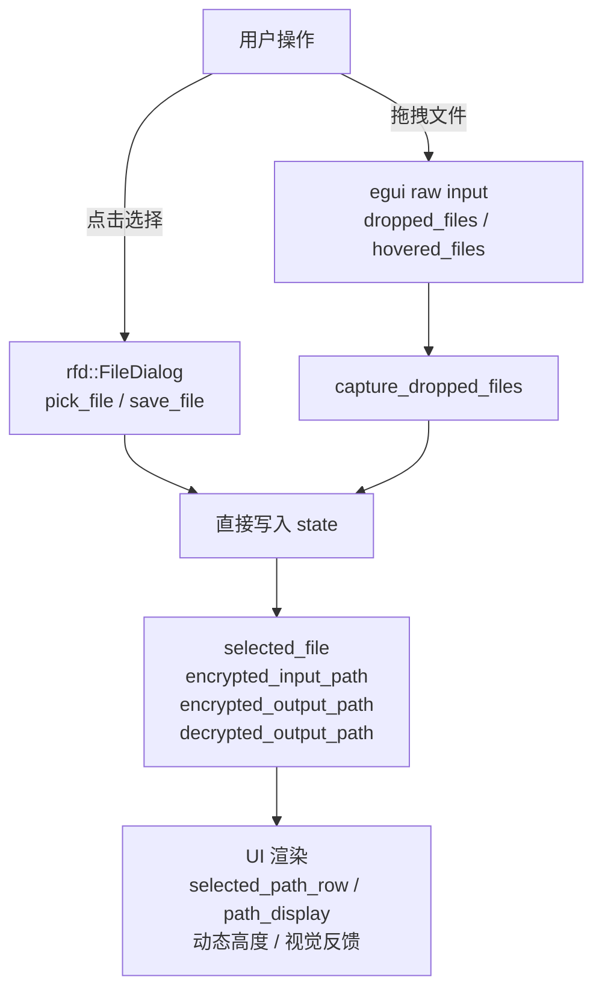
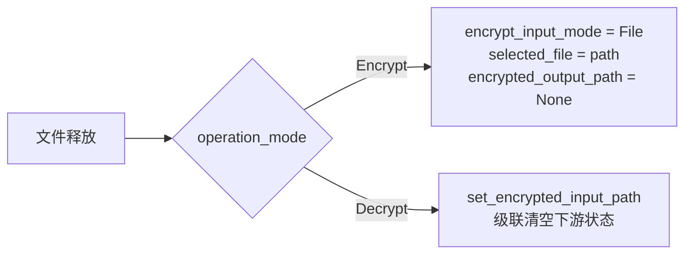
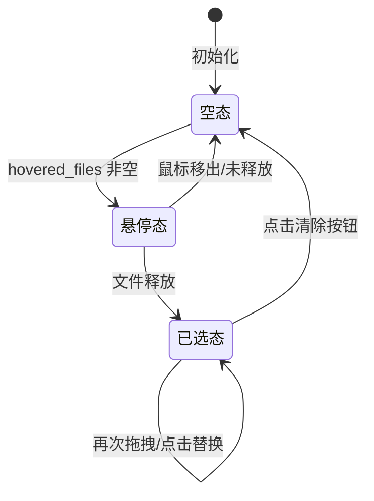

Encrust 的桌面界面围绕两种核心输入方式构建：**文件拖拽**与**系统对话框**。前者利用操作系统原生的拖放协议实现即时文件载入，后者通过 `rfd` 调用平台原生文件选择器确保用户熟悉的路径浏览体验。两者共享同一套状态管理层，并在视觉层统一为“可拖拽区域 + 路径回显 + 清除操作”的三段式交互模式。本章将剖析这一输入架构的设计原理、状态流转机制以及跨平台对话框的抽象策略。

## 整体架构概览

应用层在每一帧的 `update` 循环中优先捕获拖拽事件，随后根据当前所处的加密/解密模式将文件路径路由到对应的状态字段。用户既可以通过拖拽直接将文件放入窗口，也可以点击区域触发 `rfd::FileDialog` 手动选择。两种输入通道最终都会将 `PathBuf` 写入相同的状态变量，并由下游的渲染函数统一呈现为路径标签行或输出路径卡片。

整个系统可拆解为四层：**原生事件层**（egui/rfd 与 OS 的交互）、**状态路由层**（`capture_dropped_files` 与模式判断）、**业务状态层**（四个 `Option<PathBuf>` 字段）、**视觉表现层**（拖拽框、路径行、清除按钮）。所有路径相关的 UI 辅助函数都集中在文件末尾的组件工具区，避免与业务逻辑耦合。

Sources: [app.rs](src/app.rs#L116-L119), [Cargo.toml](Cargo.toml#L22)

## 文件拖拽交互的设计原理

### 原生事件捕获机制

egui 在每一帧通过 `Context::input` 暴露 `raw.dropped_files` 和 `raw.hovered_files`。Encrust 在 `update` 的最开头调用 `capture_dropped_files`，一次性读取这两组数据并更新状态。`hovered_files` 非空时设置 `drag_hovered = true`，驱动拖拽框进入高亮视觉态；`dropped_files` 中存在有效路径时，则根据当前 `operation_mode` 将路径写入 `selected_file`（加密）或 `encrypted_input_path`（解密），同时清空相关的下游状态（如输出路径、解密结果）和提示信息。

Sources: [app.rs](src/app.rs#L217-L241)

### 视觉反馈状态机

拖拽区域并非静态控件，而是具备三种视觉状态的可交互容器：

| 状态 | 触发条件 | 边框 | 填充 | 图标 | 提示文案 |
|------|---------|------|------|------|---------|
| 默认 | 无文件、无悬停 | 1.5px `border` | `surface` | 📁 / 🔒 | “拖拽文件到此处” |
| 悬停 | `hovered_files` 非空 | 2.0px `primary` | `primary_soft` | ↓ | “释放以选择文件” |
| 已选 | 状态字段 `Some` | 1.5px `border` | `surface` | 隐藏 | 单行路径行 |

这种状态机完全由数据驱动：边框粗细、颜色、填充色、图标和文案都在渲染函数内通过 `if self.drag_hovered` 和 `if has_selected_file` 实时计算，不依赖任何动画系统。

Sources: [app.rs](src/app.rs#L391-L466), [app.rs](src/app.rs#L539-L621)

### 模式感知路由

同一拖拽动作在不同业务模式下具有不同语义。`capture_dropped_files` 在接收到文件路径后，不会无条件写入单一字段，而是先匹配 `operation_mode`：

- **加密模式**：强制将输入模式切换为 `File`（即使当前在 Text 输入页），并将路径写入 `selected_file`，同时清空 `encrypted_output_path` 以提示用户重新确认保存位置。
- **解密模式**：调用 `set_encrypted_input_path`，该方法会级联清空解密结果、文件名、输出路径和 toast，确保旧解密状态不会与新文件混淆。

Sources: [app.rs](src/app.rs#L227-L239), [app.rs](src/app.rs#L1060-L1067)

## 系统对话框的集成策略

Encrust 使用 `rfd`（Rusty File Dialog）作为跨平台抽象层，它会在 macOS 上调用 `NSOpenPanel`/`NSSavePanel`，在 Windows 上调用 `IFileDialog`，在 Linux 上则回退到 GTK 或 zenity。由于 `rfd` 的 API 是同步阻塞的，对话框弹出期间 egui 的主循环会暂停，这符合桌面工具“模态选择”的用户预期。

### 三类对话框的职责划分

| 对话框类型 | 使用场景 | API 调用方式 | 特殊配置 |
|-----------|---------|-------------|---------|
| 打开文件（加密） | 选择待加密的原始文件 | `FileDialog::new().pick_file()` | 无过滤器，允许任意文件 |
| 打开文件（解密） | 选择 `.encrust` 加密文件 | `FileDialog::new().add_filter(...).pick_file()` | 按扩展名 `encrust` 过滤 |
| 保存文件 | 指定加密/解密后的输出路径 | `FileDialog::new().set_file_name(...).save_file()` | 预填充默认文件名 |

解密对话框配置了显式过滤器 `add_filter("Encrust 加密文件", &["encrust"])`，帮助用户在浏览时快速定位有效输入；加密输入对话框则不设限制，因为原始明文可以是任意格式。

Sources: [app.rs](src/app.rs#L454-L461), [app.rs](src/app.rs#L601-L607), [app.rs](src/app.rs#L714-L721), [app.rs](src/app.rs#L830-L839)

### 默认文件名的生成逻辑

保存对话框通过 `set_file_name` 向用户提供智能默认值。加密模式下，若输入为文件，默认名为 `{原文件名}.encrust`；若输入为文本，默认名为 `encrypted-text.encrust`。解密模式下，默认名则取自加密文件头中记录的原始文件名，或回退到 `decrypted-output`。这些逻辑封装在 `default_encrypted_output_file_name` 与 `io::default_decrypted_output_path` 中，确保用户只需点击“保存”即可完成常见场景。

Sources: [app.rs](src/app.rs#L1023-L1034), [app.rs](src/app.rs#L1102-L1106)

## 双通道输入模型：拖拽与点击的统一设计

每个文件输入区域都同时支持“拖拽释放”和“点击触发对话框”两种操作，但二者最终收敛到同一状态变量。这种设计避免了为不同输入方式维护两套并行状态，也让 UI 回显逻辑得以复用。

### 交互收敛点

以加密文件输入区为例：无论用户将文件拖入窗口，还是点击“或点击选择文件”按钮，甚至是先选文件后再次点击区域替换文件，最终都执行 `self.selected_file = Some(path)`，并同步清空 `encrypted_output_path` 和 `toast`。渲染函数只观察 `selected_file` 是否存在，而不关心路径是如何进入状态的。

Sources: [app.rs](src/app.rs#L569-L620)

### 视觉状态的动态切换

拖拽区域的高度会根据是否已选文件发生显著变化：加密输入区在空态时高度为 `150.0`，选中后压缩至 `20.0`；解密输入区则从 `160.0` 收缩到 `32.0`。这种“弹性高度”设计为下方的输出路径卡片和动作按钮释放了垂直空间，避免小尺寸窗口内控件拥挤。内边距也会同步调整：空态使用 `Margin::same(16)` 营造宽松的大面积落地区，选中后改为 `Margin::symmetric(16, 8)` 以适配紧凑的单行路径行。

Sources: [app.rs](src/app.rs#L389-L414), [app.rs](src/app.rs#L539-L564)

## 路径状态的可视化管理

当文件路径进入状态后，界面需要在有限宽度内清晰展示路径信息，并提供撤销选择的能力。Encrust 为此设计了两类路径展示组件和一种自绘清除按钮。

### selected_path_row：带操作的紧凑路径行

用于加密/解密输入区，呈现为“已选择”标签 + 类型说明 + 截断路径 + 清除按钮的水平行。路径文本启用 `truncate()`，当文件名过长时以省略号截断，保证右侧的圆形清除按钮始终可见。清除按钮是一个完全自绘的圆形控件：默认态以 `error_bg` 填充并显示 `error` 色“x”，悬停时反转为 `error` 填充 + 白色文字，尺寸固定为 `14×14`，避免标准按钮的最小高度破坏行内对齐。

Sources: [app.rs](src/app.rs#L1351-L1399), [app.rs](src/app.rs#L1316-L1349)

### path_display：只读信息行

用于输出路径展示（如“保存到：未选择保存路径”）。与 `selected_path_row` 不同，它不包含清除按钮，因为输出路径的变更通过“另存为...”按钮直接覆盖，而非清除。视觉上采用 `surface_alt` 填充和 `border` 描边，与输入区的 `primary_soft` 形成语义区分，暗示这是一个目标路径而非已选源文件。

Sources: [app.rs](src/app.rs#L1427-L1454)

## 关键设计决策与边界处理

**单文件限制**：`capture_dropped_files` 使用 `find_map` 只取第一个具备 `path` 的文件。多文件拖拽时其余文件被静默忽略。这一决策源于加密/解密操作天然以“单个任务”为粒度，批量处理会显著复杂化状态管理和错误反馈。

**线程阻塞与模态行为**：`rfd` 的对话框在调用线程上同步执行。对于 Encrust 这类单线程即时工具而言，这种阻塞是可接受的——用户在未选择文件前本就不应操作主界面。若未来需要支持后台批量任务，则需将对话框与文件 IO 迁移至独立线程。

**状态级联清理**：每次更换输入文件时，应用会主动清空所有下游派生状态。例如 `set_encrypted_input_path` 同时重置 `decrypted_text`、`decrypted_file_bytes`、`decrypted_file_name`、`decrypted_output_path` 和 `toast`。这种“输入变更即结果失效”的保守策略，避免了用户看到旧文件解密结果与新文件路径并存的歧义界面。

Sources: [app.rs](src/app.rs#L227-L228), [app.rs](src/app.rs#L1060-L1067)

## 阅读建议

理解输入层与状态层的协作后，建议继续深入以下主题：

- 加密与解密的具体业务编排逻辑，参见 [加密与解密流程编排](15-jia-mi-yu-jie-mi-liu-cheng-bian-pai)
- 业务状态模型与类型定义，参见 [核心数据模型与类型定义](11-he-xin-shu-ju-mo-xing-yu-lei-xing-ding-yi)
- 文件读写与默认输出路径策略，参见 [文件 IO 抽象与输出路径策略](18-wen-jian-io-chou-xiang-yu-shu-chu-lu-jing-ce-lue)
- 界面整体布局与 egui 状态管理，参见 [egui 界面布局与状态管理](6-egui-jie-mian-bu-ju-yu-zhuang-tai-guan-li)